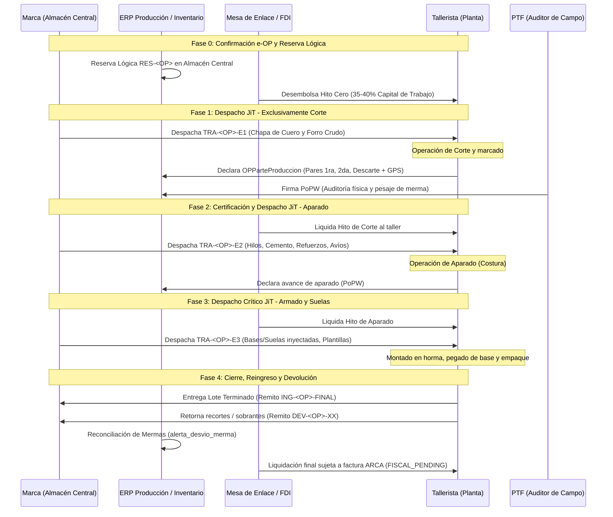
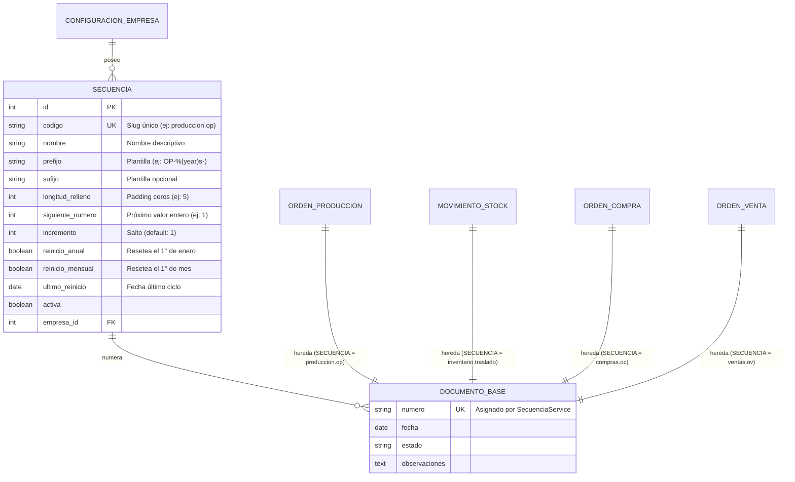
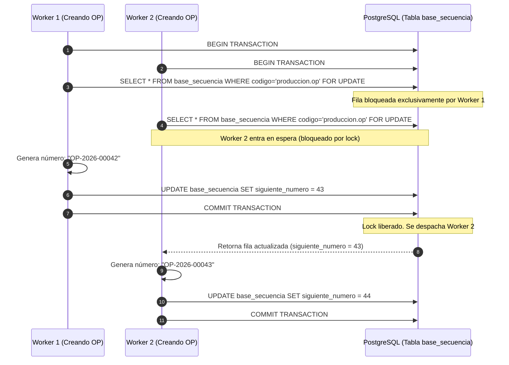
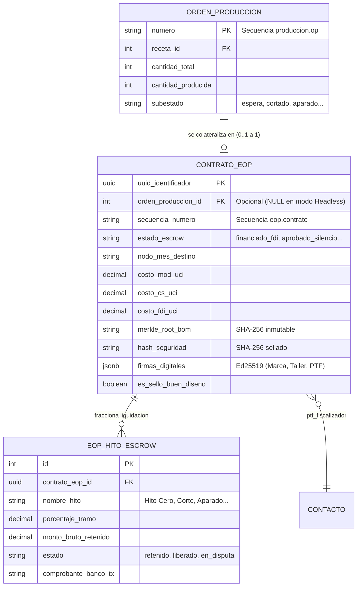

# Plan de Implementación — Indinopy ERP/MES
**Versión:** 0.2.0 | **Fecha:** Septiembre 2026  
**Autor:** Gabriel Sarthou  

---

## Índice

1. [Visión del Proyecto](#1-visión-del-proyecto)
2. [Arquitectura del Sistema](#2-arquitectura-del-sistema)
3. [Estado Actual del Código](#3-estado-actual-del-código)
4. [Primitivas Criptográficas](#4-primitivas-criptográficas)
5. [Red Federada y Flujo de e-OP](#5-red-federada-y-flujo-de-e-op)
6. [Flujo del PTF (Promotor Territorial de Formalización)](#6-flujo-del-ptf-promotor-territorial-de-formalización)
7. [Integración WooCommerce Multitienda](#7-integración-woocommerce-multitienda)
8. [Modelo de Entrega de Insumos Just-in-Time (JiT)](#8-modelo-de-entrega-de-insumos-just-in-time-jit)
9. [Motor de Secuencias Alfanuméricas (Módulo Base)](#9-motor-de-secuencias-alfanuméricas-módulo-base)
10. [Roadmap de Implementación](#10-roadmap-de-implementación)
11. [Deuda Técnica Identificada](#11-deuda-técnica-identificada)
12. [Referencias](#12-referencias)

---

## 1. Visión del Proyecto

Indinopy es un **ERP/MES para PyMEs de la industria del calzado y la indumentaria argentina**, construido sobre el protocolo de **Órdenes de Producción Electrónicas (e-OP)** que funcionan como **activos fiduciarios negociables**.

### Principios Fundamentales

- **La e-OP es inmutable.** Una vez confirmada y sellada con su hash criptográfico, sus términos económicos no pueden modificarse unilateralmente.
- **La Custodia / Escrow es la garantía.** Los fondos de capital de trabajo y liquidaciones adelantados por el FDI quedan asegurados en una cuenta de custodia digital hasta que se certifica y libera el hito correspondiente.
- **La confianza es matemática, no institucional.** El sistema no confía en la palabra de ningún actor. Confía en firmas Ed25519 verificables y hashes SHA-256 deterministas.
- **El Silencio es Positivo.** Si en 48 horas ningún miembro de la MES vetó una e-OP, el sistema la aprueba automáticamente sin intervención humana (Timelock).

### Actores del Sistema

| Actor | Rol | Nodo |
|---|---|---|
| **Comitente (Marca)** | Genera la e-OP, aporta garantía de anclaje y cancela el crédito a 30-60 días | ERP propio (Indinopy) |
| **Tallerista** | Ejecuta la producción, firma aceptación | ERP propio (Indinopy) |
| **PTF** (Promotor Territorial de Formalización) | Auditor de campo, firma la liberación del Escrow | App móvil + Nodo MES |
| **Mesa de Enlace Sectorial (MES)** | Gobernanza, homologa PTFs, administra Timelock | Nodo central compartido |
| **Fiduciaria (FDI)** | Administra el fondo de liquidez y anticipa fondos por hitos | Integración externa |

---

## 2. Arquitectura del Sistema

### Stack Tecnológico

```
Backend:        Django 6.1 (MVT + REST API)
Base de Datos:  PostgreSQL + PostGIS (coordenadas GPS)
ORM History:    django-simple-history (auditoría inmutable)
Criptografía:   hashlib (SHA-256) + PyNaCl (Ed25519)
Geoespacial:    django.contrib.gis (PointField, MultiPolygonField)
Facturación:    afip-py (WSFE/WSFEX)
E-Commerce:     WooCommerce REST API v3 (Webhooks + Polling)
Async / Tareas: Celery + Redis (Timelock 48h y encolamiento de Webhooks masivos)
```

### Patrones de Despliegue de Infraestructura y Enrutamiento

1. **SaaS (Servidor Comunitario / Multi-Tenant):** Despliegue recomendado en un VPS de entrada (2 vCPUs, 4GB RAM) alojado por la Cámara o el CIFO de un municipio. 
   - **Enrutamiento DNS Jerárquico:** El nodo MES local gestiona la subzona delegada `{municipio}-mes.indinopy.ar`. Las fábricas acceden a su propio inquilino a través del Nivel 3: `{marca}.{municipio}-mes.indinopy.ar`.
   - **Manejo de Carga:** Al operar con WooCommerce, utiliza **Redis y Celery** para absorber picos de tráfico (Efecto HotSale) sin saturar el servidor web.
2. **On-Premise (PC en el Taller):** Instalación en una PC estándar de la fábrica. Dado que los routers de fábrica bloquean conexiones entrantes, se conecta a la Red Federada y a WooCommerce mediante **Polling** (el Nodo consulta novedades cada 5 minutos de forma silenciosa) o **Túneles Inversos** (ej. Cloudflare Tunnels) para recibir webhooks en tiempo real sin abrir puertos.

### Patrón Arquitectónico: Capa de Servicios (Service Layer)

```
HTTP Request
     ↓
 [View / CBV]         ← Solo recibe, valida y redirige. Sin lógica de negocio.
     ↓
[Service Layer]       ← Toda la lógica transaccional. Usa transaction.atomic().
     ↓
  [Models]            ← Solo estructura de datos y validaciones de campo.
     ↓
[Signals]             ← Solo eventos secundarios (logs, notificaciones). Sin lógica financiera.
```

**Regla de oro:** Nunca cambiar el estado de una e-OP haciendo `op.estado = 'confirmado'; op.save()`.  
Siempre usar `ProduccionService.confirmar_op(op)`.

### Módulos y Responsabilidades

| App | Responsabilidad | Service |
|---|---|---|
| `base` | Mixins criptográficos, ConfiguracionEmpresa | — |
| `contactos` | Directorio de Clientes, Proveedores, Talleristas | — |
| `inventario` | Stock en tiempo real (Quants, doble entrada) | `StockService` |
| `produccion` | e-OP, BOM, Recetas, Etapas MES | `ProduccionService` |
| `tesoreria` | Escrow Digital, Cajas, Comprobantes | `EscrowService`, `TesoreriaService` |
| `compras` | Órdenes de Compra, Recepciones | `ComprasService` |
| `ventas` | Órdenes de Venta, WooCommerce | `VentasService` |
| `contabilidad` | Facturas AFIP, Conciliación | `FacturadorAFIP` |
| `mes` | Gobernanza MES, RegistroEOP, PTF, Timelock | [pendiente] |

---

## 3. Estado Actual del Código

### ✅ Implementado

#### Modelos Core
- `OrdenProduccion` con `DocumentoFirmableMixin` (UUID, hash, firmas JSON)
- `calcular_merkle_root_bom()` — Árbol de Merkle del BOM
- `generar_payload_canonico()` — Serialización determinista para hashing
- `sellar_hash_seguridad()` — Fijación irreversible del hash al confirmar
- `verificar_integridad_hash()` — Detección de manipulaciones post-sellado
- `StockQuant` — Foto en tiempo real del stock (partida doble)
- `MovimientoStock` + `LineaMovimientoStock` — Motor de doble entrada
- `ContratoEscrow` + `HitoEscrow` — Contrato de custodia digital
- `PerfilCriptografico` — Identidad Ed25519 de cada usuario del sistema
- `Contacto` con `ubicacion_catastral` (GPS), `es_taller_homologado`, `ucp_score`, `clave_publica_ed25519`
- `RegistroEOP` — Copia canónica en el nodo MES con Timelock

#### Gobernanza y Criptografía (Módulo MES)
- `ComisionCredito`, `PerfilPTF`, `ResolucionOP`, `TribunalArbitraje` — Modelos de gobernanza.
- `PTFService` — Motor criptográfico de validación Ed25519 (`PyNaCl`), verificación de firmas en campo y certificados canónicos.
- `PTFService` — Control espacial Point-in-Polygon (PostGIS) de zonas de cobertura.
- `PTFService` — Lógica de aprobación exprés, veto de e-OPs y Silencio Positivo (Timelock 48h).

#### Capa de Servicios
- `StockService.reservar_linea()` / `realizar_linea()` / `cancelar_linea()`
- `ProduccionService.confirmar_op()` / `finalizar_op()` / `cancelar_op()`
- `EscrowService.fondear_escrow()` / `liberar_hito()`
- `ComprasService.confirmar_oc()` / `cancelar_oc()`
- `VentasService.procesar_orden_woocommerce()` / `procesar_producto_woocommerce()`

#### Vistas (CBVs)
- Pattern ListViews + DetailViews en todos los módulos
- Pattern Action Views (POST-only) para todas las transacciones críticas
- Enrutamiento completo en `core/urls.py`

#### Integración WooCommerce
- `TiendaWooCommerce` — Modelo multitienda con credenciales por instancia
- `WooCommerceWebhookView` — Endpoint con validación HMAC-SHA256
- `WooCommerceAPIClient` — Cliente REST activo para polling fallback
- Mapeo completo de `line_items`, `fee_lines`, `shipping_lines`, `coupon_lines`, `meta_data`

#### Facturación AFIP
- `FacturadorAFIP` — Adapter para afip-py (WSFE)
- Soporte para IVA discriminado por línea
- Lee entorno (homologación/producción) desde `ConfiguracionEmpresa`

---

## 4. Primitivas Criptográficas

### SHA-256 (Hash de Integridad)
Cada e-OP genera un **payload canónico determinista** (JSON ordenado por claves) y lo hashea con SHA-256. Este hash se sella en el campo `hash_seguridad` al confirmar la orden. Cualquier modificación posterior produce un hash diferente, evidenciando la manipulación.

### Árbol de Merkle (Integridad del BOM)
Los insumos del BOM se hashean individualmente y se combinan en pares hasta obtener el `merkle_root_bom`. Esto permite auditar que un insumo específico no fue alterado sin necesidad de revelar toda la receta.

### Ed25519 (Firmas Digitales Multifirma)
El campo `firmas_digitales` (JSONField) almacena las firmas de cada rol:
```json
{
  "comitente": {
    "actor_id": 12,
    "firma_hex": "a3f9c8d2...",
    "timestamp": "2026-09-09T18:30:15Z"
  },
  "ptf": {
    "actor_id": 7,
    "firma_hex": "7b12e4a9...",
    "timestamp": "2026-09-09T20:45:00Z"
  }
}
```
`django-simple-history` toma un snapshot inmutable del documento en cada firma, creando una cadena de evidencia auditable.

> **Pendiente crítico:** La verificación matemática Ed25519 (`PyNaCl`) no está implementada. Actualmente se verifica la presencia de `firma_hex` pero no su validez criptográfica.

---

## 5. Red Federada y Flujo de e-OP

### Modelo de Confianza: PKI Federada

La MES actúa como **Autoridad Certificante (CA)** de la red. Cada nodo recibe la clave pública de la MES al registrarse. Con ella puede verificar cualquier certificado emitido por la MES **sin conexión en tiempo real**.

```
MES (CA Root)
├── Certificado Nodo Comitente A  [firmado con MES_privada]
├── Certificado Nodo Tallerista B [firmado con MES_privada]
├── Certificado PTF Carlos        [firmado con MES_privada]
└── Certificado PTF Ana           [firmado con MES_privada]
```

### Flujo Completo de una e-OP

```
[NODO COMITENTE]
  1. Crea e-OP en borrador
  2. ProduccionService.confirmar_op():
     - Calcula BOM + Merkle Root
     - Sella hash SHA-256
     - Genera ContratoEscrow
     - Comitente firma con su Ed25519 privada
  3. POST → Nodo MES: payload canónico + firma_comitente

[NODO MES]
  4. Verifica firma_comitente (Ed25519 vs clave pública del Comitente)
  5. Crea RegistroEOP → estado: "en_revision"
  6. Inicia Timelock de 48h (worker Celery)
  7. POST → Nodo Tallerista: payload canónico de la e-OP
  8. PUSH → App PTF de la zona: notificación de auditoría pendiente

[NODO TALLERISTA]
  9. Recibe e-OP entrante
  10. Verifica: hash_recibido == SHA-256(payload_recibido)
  11. Acepta y firma con su Ed25519 privada
  12. POST → Nodo MES: firma_tallerista

[PTF EN CAMPO]
  13. Va físicamente al taller
  14. App móvil:
      - GPS confirma radio del taller catastral (PostGIS)
      - Biometría desbloquea clave Ed25519 del Secure Enclave
      - Firma: hash(e-OP + GPS + timestamp)
  15. POST → Nodo MES: { firma_ptf, certificado_ptf, gps, timestamp }

[NODO MES — Resolución]
  16. Verifica firma_ptf con clave pública del certificado PTF
  17. Verifica certificado PTF no revocado (CRL)
  18. Verifica GPS en zona de cobertura del PTF
  19. Verifica timestamp dentro del Timelock
  20. RegistroEOP → estado: "aprobado_expres"
  21. POST → Fiduciaria: liberar fondos del Escrow
  22. POST → Nodo Comitente + Tallerista: confirmación de pago

[CASO SILENCIO POSITIVO]
  Celery Beat ejecuta cada hora:
  - Busca RegistroEOP con timelock_vencimiento <= now()
  - Si no hay vetos ni ResolucionOP → aprobado_silencio
  - Dispara liberación automática del Escrow
```

### El Sistema Dual (OP Privada vs e-OP Federada)

Para no burocratizar el uso diario de las PyMEs, Indinopy cuenta con un **Sistema Dual** controlado por la bandera `es_eop_federada`:
- **OP Privada (Simple):** No requiere MES, PTF, Timelock ni Escrow. Las etapas se avanzan internamente por sistema generando una simple *Cuenta por Pagar* para el taller, que el Tesorero de la marca cancela manualmente mediante transferencias tradicionales. Permite el uso de Cajas No Fiscales y Comprobantes X para la gestión del flujo real no formalizado.
- **e-OP Federada (FIMCA):** Engancha el Smart Contract, bloquea los fondos en el Fideicomiso y transfiere automáticamente a través del Banco Provincia o entidad fiduciaria mediante el sistema de clearing cuando se valida la firma de la etapa.

### Formalización Automática: Alta de Oficio en la Primera e-OP

El software elimina la barrera burocrática del tallerista informal o trabajador de oficio que carece de CUIT o Clave Fiscal:

#### 1. Inyección en el Payload Canónico de la e-OP
Cuando la marca emite o el tallerista confirma su primera e-OP, si el tallerista asignado a una etapa (o el Taller Gestor) no cuenta con inscripción fiscal activa en el padrón de la MES, el ERP emisor inyecta los datos de onboarding directamente en el payload canónico que viaja al Nodo MES:

```json
{
  "protocolo_version": "2.0",
  "uuid_identificador": "e8b7c934-8fa4-4e1a-ad35-c02cd6ac65d1",
  "comitente": {
    "cuit": "30-71589412-8",
    "cbu_comercial": "0140098701509900412891"
  },
  "taller_gestor": {
    "denominacion": "Taller San Cayetano (Consorcio Lanús)",
    "cuit_gestor": "20-18493021-3",
    "estado_societario": "transicion_sas",
    "cuenta_clearing_cvu": "0000003100094182901412"
  },
  "etapas_asignadas": [
    {
      "orden": 1,
      "servicio": "Corte",
      "tallerista": {
        "cuit": "30-68912345-2",
        "tipo": "taller_homologado",
        "cuenta_clearing_cvu": "0140023401100984210019"
      }
    },
    {
      "orden": 2,
      "servicio": "Aparado",
      "tallerista": {
        "dni": "28451902",
        "tipo": "prestador_oficio",
        "requiere_alta_oficio": true,
        "datos_alta_oficio": {
          "nombre_completo": "Carlos Alberto Benegas",
          "biometria_token_renaper": "0x7a91...bc01",
          "cvu_cuenta_dni": "0000003100094182901412",
          "domicilio_catastral": "Pasaje Ucrania 1420, Lanús Oeste",
          "actividad_codigo": "152011"
        }
      }
    }
  ]
}
```

#### 2. Capa de Servicios: `AltaOficioService` (`apps.federacion.services`)
Al recibir el payload canónico, el Nodo MES ejecuta el pipeline transaccional de formalización:
1. **Validación Biométrica RENAPER:** Valida la identidad y prueba de vida del titular contra el servicio nacional del RENAPER usando el token biométrico capturado en la app/portal.
2. **Alta Automática en ARCA (ex-AFIP):** Invoca el webservice de Monotributo Productivo de Oficio. El tallerista queda formalizado sin cuota fija mensual que lo endeude cuando no tiene trabajo; en su lugar, se activa la micro-retención del 1.5% en clearing.
3. **Apertura de Cuenta de Clearing Técnica Inembargable (BAPRO):** Vía Open Banking del Banco Provincia, se genera o vincula la cuenta de clearing (Cuenta DNI / CVU) con el flag legal de inembargabilidad absoluta de primer orden amparado en CCCN 1356.
4. **Emisión de Par de Claves Ed25519:** La MES firma digitalmente el certificado público del tallerista y lo incorpora al padrón activo de la federación.

### Especificación del Contrato API: Sobre de Red y Payload Canónico Completo

Cuando el ERP de la Marca (Nodo Comitente) confirma una e-OP y la transmite a la MES (`POST /federacion/eop/entrante/`), la comunicación consta de dos capas estrictas:

#### 1. Sobre de Transporte Criptográfico (`EntradaEOPSerializer`)
Es el payload HTTP que recibe y valida el API Gateway de la MES para autenticación, no repudio y anti-tampering:

```json
{
  "uuid_identificador": "e8b7c934-8fa4-4e1a-ad35-c02cd6ac65d1",
  "hash_seguridad": "a4f81c7b8e923d456102fae83912bc09148d200126d482910384729104829104",
  "comitente_cuit": "30715894128",
  "tallerista_cuit": "20184930213",
  "monto_total_uci": "3950.0000",
  "clave_publica_comitente": "7d9b01f92c3a4e5b6c7d8e9f0a1b2c3d4e5f6a7b8c9d0e1f2a3b4c5d6e7f8a9b",
  "firma_comitente": "3a8f10bc49281e...[firma Ed25519 en hex de 128 caracteres]...",
  "payload_canonico": { ... }
}
```

#### 2. Payload Canónico Determinista (`payload_canonico`)
Es el contrato fiduciario inmutable que se firma digitalmente con Ed25519 y cuyo hash SHA-256 se sella en la red:

```json
{
  "protocolo_version": "2.0",
  "uuid": "e8b7c934-8fa4-4e1a-ad35-c02cd6ac65d1",
  "numero_op": "OP-2026-00842",
  "fecha_emision": "2026-09-09T09:30:00Z",
  "partes": {
    "comitente": {
      "cuit": "30-71589412-8",
      "razon_social": "Borcegos Cruz del Sur S.R.L.",
      "cbu_comercial": "0140098701509900412891",
      "plazo_cancelacion_fdi_dias": 60
    },
    "taller_gestor": {
      "cuit_o_dni": "20-18493021-3",
      "denominacion": "Taller San Cayetano (Consorcio Lanús)",
      "estado_societario": "transicion_sas",
      "cuenta_clearing_cabecera": "0000003100094182901412"
    }
  },
  "condiciones_economicas": {
    "moneda_indexacion": "UCI",
    "monto_total_uci": 3950.00,
    "desglose_vector_c": {
      "costo_mod": 2825.00,
      "costo_cs": 565.00,
      "reserva_fdi": 79.00,
      "monotributo_retencion": 59.25,
      "margen_taller": 421.75
    },
    "es_sello_buen_diseno": true,
    "timelock_horas": 48
  },
  "cronograma_escrow_hitos": [
    {
      "id_hito": "H0",
      "nombre": "Adelanto Operativo / Hito Cero",
      "porcentaje_tramo": 40.0,
      "condicion_disparo": "Aprobacion_MES_o_Silencio_48h",
      "destinatario": "taller_gestor"
    },
    {
      "id_hito": "H1",
      "nombre": "Corte Completo y Verificado",
      "porcentaje_tramo": 20.0,
      "condicion_disparo": "PoPW_Parte_Corte_Mas_Aval_PTF",
      "destinatario": "etapa_corte"
    },
    {
      "id_hito": "H2",
      "nombre": "Aparado Terminado",
      "porcentaje_tramo": 25.0,
      "condicion_disparo": "PoPW_Remito_Traslado_Aparado",
      "destinatario": "taller_gestor"
    },
    {
      "id_hito": "H3",
      "nombre": "Liquidación Cierre de Lote",
      "porcentaje_tramo": 15.0,
      "condicion_disparo": "Recepcion_Conforme_Sin_Veto_48h",
      "destinatario": "taller_gestor"
    }
  ],
  "etapas_productivas": [
    {
      "orden": 1,
      "servicio": "Corte de Cuero y Forro",
      "tallerista_asignado": {
        "cuit": "30-68912345-2",
        "nombre": "Cortaduría El Ombú",
        "cuenta_clearing_cvu": "0140023401100984210019",
        "tipo": "taller_homologado"
      }
    },
    {
      "orden": 2,
      "servicio": "Aparado Reforzado",
      "tallerista_asignado": {
        "cuit": "20-18493021-3",
        "nombre": "Taller San Cayetano",
        "cuenta_clearing_cvu": "0000003100094182901412",
        "tipo": "taller_gestor"
      },
      "alta_oficio": null
    }
  ],
  "especificacion_tecnica": {
    "articulo": "Art. 410-TX - Borcego Aconcagua Pro",
    "cantidad_pares": 500,
    "curva_talles": [
      {"talle": 38, "cantidad": 20},
      {"talle": 39, "cantidad": 40},
      {"talle": 40, "cantidad": 80},
      {"talle": 41, "cantidad": 120},
      {"talle": 42, "cantidad": 140},
      {"talle": 43, "cantidad": 70},
      {"talle": 44, "cantidad": 30}
    ],
    "merkle_root_bom": "0x7f83b1657ff1fc53b92dc18148a1d65dfc2d4b1fa3d677284addd200126d"
  }
}
```

#### 3. Política de Costos Congelados (Snapshots Inmutables vs Properties Dinámicas)
Para asegurar la estabilidad del crédito fiduciario y la trazabilidad industrial frente a la inflación:

1. **El Riesgo de las Properties Dinámicas:** Si los costos de la orden se calcularan exclusivamente mediante `@property` leyendo `ProductoTemplate.costo`, cualquier actualización posterior de precios en el catálogo alteraría retroactivamente el balance histórico de una OP ya confirmada o finalizada.
2. **Momento del Congelamiento (Trigger de Confirmación):**
   - Al pasar la orden de `borrador` a `confirmado` (o emitirse la e-OP), el sistema calcula el Vector C y los costos unitarios y los **persiste como snapshots inmutables** en campos `models.DecimalField` en la base de datos (`costo_mod`, `costo_cs`, `costo_bom`, etc.).
   - A partir de ese milisegundo, los valores quedan congelados y no vuelven a recalcularse dinámicamente.
3. **Indexación en UCI:** Para mitigar la pérdida de poder adquisitivo del tallerista y la descapitalización del FDI durante el plazo de ejecución (30 a 60 días), los costos congelados se expresan en **Unidades de Cuenta Industrial (UCI)**, referenciadas a la canasta sectorial INDEC/IPIM.
4. **Sellado Criptográfico:** Los valores congelados del Vector C forman parte del input determinista del payload canónico. Al calcular el `hash_seguridad` (SHA-256) y firmarlo con Ed25519, cualquier intento de alterar un costo congelado invalida la firma criptográfica en el Nodo MES y en el Portal Fiduciario del Banco.
5. **Desacople Arquitectónico:**
   - En `apps.produccion`: Se congela el costo fabril histórico (`costo_total_insumos_teorico` y los costos de servicios por etapa) para la valorización contable de inventario por partida doble.
   - En `apps.eop`: Se congela el Vector C fiduciario en UCIs para la garantía del Escrow y la liquidación del clearing ante el FDI.

### Portal Fiduciario (Dashboard de Clearing en la MES)

La liberación de fondos del Escrow no ocurre mágicamente; requiere que la entidad fiduciaria (FDI) y el Banco (agente de clearing) ejecuten la transferencia. La arquitectura lo resuelve construyendo un sub-módulo interno en el nodo de la MES:

1. **El Dashboard Fiduciario:** En `/mes/fiduciaria/` (o vía API), los oficiales de cuenta de la administradora del Fideicomiso acceden con el rol `FIDUCIARIO`.
2. **Bandeja de Entrada (Inbox) y Tablero de Fondeo:** Visualizan las e-OPs aprobadas por la Comisión de Crédito (o por Silencio Positivo) junto con el saldo disponible en la cuenta custodia del FDI.
3. **Generación de Lotes (El "Botón de Pago"):** Cuando autorizan, generan un "Lote de Liquidación" exportando un archivo batch estandarizado (`.txt` Interbanking/BAPRO Empresas) o disparando un Webhook corporativo hacia la API B2B del Banco.
4. **Endpoint de Retorno (Callback):** Tras el clearing exitoso del banco, Indinopy recibe la confirmación, dispara la Factura Electrónica de AFIP por el milisegundo exacto y cancela la posición de IVA diferido.

### Endpoints de Federación del Nodo MES (Pendiente de Desarrollar)

```python
# Registro de nodos en la red
POST /federacion/nodos/registrar/
GET  /federacion/nodos/lista/

# Registro de PTFs homologados
GET  /federacion/ptf/registro/               ← Lista pública de PTFs activos
GET  /federacion/ptf/{cuit}/certificado/     ← Certificado individual
POST /federacion/ptf/revocar/                ← Solo MES (autenticado)

# e-OPs y Escrow
POST /federacion/eop/entrante/               ← Recibe e-OP de nodo Comitente
POST /federacion/eop/{uuid}/firma/           ← Recibe firma de Tallerista o PTF
GET  /federacion/eop/{uuid}/estado/          ← Consulta estado Timelock

# Fideicomiso / Banco
GET  /federacion/banco/clearing/pendientes/  ← Lotes de pago a ejecutar
POST /federacion/banco/clearing/confirmar/   ← Webhook del BAPRO tras pagar
```

### Oráculo de Precios y Nomenclador Sectorial (Vector C)

Para garantizar que el cálculo de la mano de obra y las cargas sociales (Vector C de la e-OP) se actualice automáticamente sin acoplar la MES a los inventarios privados de cada marca, se utilizará un patrón de **Nomenclador Sectorial (Mapping)**:

1. **Catálogo Abstracto (Nodo MES):** El nodo central mantiene un modelo `TarifaConvenio` utilizando un código universal (ej: `MES-SRV-APARADO-BOTA`). Define los costos base de mano de obra y los porcentajes de cargas sociales, sin dependencias con `ProductoTemplate`.
2. **Mapeo Local (Nodo Marca):** En el ERP de cada marca (`apps.inventario`), el servicio interno (ej: "Costura de mi Borcego") tiene un campo `codigo_homologado_mes` donde el usuario enlaza su servicio privado con la nomenclatura de la MES.
3. **Sincronización (Federación):** La MES dispara webhooks firmados criptográficamente cada vez que hay una actualización paritaria. Los nodos de las marcas reciben el JSON, validan la firma de la MES y actualizan su caché local de tarifas.
4. **Snapshot Inmutable (Producción):** Al crear una e-OP, el motor busca el `codigo_homologado_mes`, extrae la tarifa vigente del caché y guarda los montos calculados en `costo_mod` y `costo_cs` de la e-OP. Si las tarifas cambian al día siguiente, el contrato inteligente de la OP ya firmada permanece inalterable.

---

## 6. Flujo del PTF (Promotor Territorial de Formalización)

### ¿Quién lo homologa?
La **ComisionCredito** del Distrito correspondiente. Es el cuerpo colegiado de 7 sillas (INTI, Sindicato, Talleristas Mono, Talleristas SAS, Marcas, Municipio, FDI) que vota la habilitación.

### Flujo de Registro de un PTF

```
1. PTF se postula ante la ComisionCredito de su municipio
2. Comisión vota habilitación (mayoría de las 7 sillas)
3. Si aprueba:
   a. PTF genera par de claves Ed25519 en su smartphone
      (clave privada NUNCA sale del Secure Enclave)
   b. PTF envía SOLO su clave pública a la MES
   c. MES crea PerfilPTF con zona de cobertura (MultiPolygonField)
   d. MES emite Certificado PTF firmado con MES_clave_privada
   e. MES distribuye el certificado a todos los nodos registrados
4. PTF instala app móvil y carga su certificado
5. Desde ese momento, sus firmas son verificables matemáticamente
   por cualquier nodo de la red, sin consultar a la MES en tiempo real
```

### Modelo `PerfilPTF` (Pendiente de Implementar)

```python
# En apps/mes/models.py
class PerfilPTF(TimeStampedModel):
    usuario = models.OneToOneField(User, on_delete=models.CASCADE)
    comision = models.ForeignKey(ComisionCredito, on_delete=models.RESTRICT)
    zona_cobertura = models.MultiPolygonField(srid=4326)  # PostGIS
    clave_publica_ed25519 = models.CharField(max_length=64)
    certificado_mes_json = models.JSONField()  # Certificado firmado por MES
    fecha_emision_credencial = models.DateField()
    fecha_vencimiento_credencial = models.DateField()
    activo = models.BooleanField(default=True)
    auditorias_realizadas = models.IntegerField(default=0)
    ucp_score_ptf = models.IntegerField(default=0)
```

---

## 7. Integración WooCommerce Multitienda

### 7.1. Arquitectura

Cada tienda WooCommerce es un `TiendaWooCommerce` vinculado a la `ConfiguracionEmpresa`. Las credenciales son por tienda (no globales).

### 7.2. Flujo de Sincronización (Híbrido)

```
WEBHOOKS (Tiempo Real — Push)
  WooCommerce → POST /ventas/webhooks/woocommerce/{tienda_id}/
  ↓ Valida HMAC-SHA256 (X-WC-Webhook-Signature)
  ↓ Rutea por tópico (order.*, product.*, coupon.*)
  ↓ Delega a VentasService [ACK inmediato < 2 segundos]

POLLING API (Fallback — Pull)
  Celery Beat → cada 15 minutos
  WooCommerceAPIClient.sincronizar_ordenes_recientes()
  ↓ GET /wp-json/wc/v3/orders?after={ultima_sync}
  ↓ Compara date_modified_gmt para evitar sobreescrituras
  ↓ Delega al mismo VentasService (código DRY)
```

### 7.3. Mapeo de Campos Críticos para Argentina

| Campo WooCommerce | Campo ERP | Nota |
|---|---|---|
| `billing.billing_dni` / `meta_data._billing_dni` / `_billing_cuit` | `Contacto.cuil` | Clave unívoca primaria de cliente (AFIP) |
| `meta_data._billing_condicion_iva` | `Contacto.condicion_iva` | Para Factura A/B/C |
| `meta_data._Mercado_Pago_Payment_IDs` / `transaction_id` | `OrdenVenta.transaccion_id` | Conciliación de cobranzas MP |
| `fee_lines[]` | `LineaRecargoOrden` | Recargos MP / Descuentos por transferencia |
| `shipping_lines[0].method_id` | `OrdenVenta.metodo_envio_id` | Para remito de logística |
| `coupon_lines[]` | `OrdenVenta.cupones_aplicados` | JSONField de cupones aplicados |

### 7.4. Secuencia Estricta de Procesamiento de Órdenes (Pipeline de Ingesta)

El servicio `VentasService.procesar_orden_woocommerce(tienda_id, payload)` ejecuta de manera transaccional (`@transaction.atomic`) el siguiente pipeline ordenado:

1. **`get_or_create` de Cliente (`Contacto`) con Clave en DNI/CUIL:**
   * **Extracción de Identidad Fiscal:** Extrae `billing_dni` directamente de `payload["billing"]` o, en su defecto, busca `_billing_dni` / `_billing_cuit` dentro de `payload["meta_data"]`.
   * **Búsqueda por DNI/CUIL:** Se busca primeramente `Contacto.objects.filter(cuil=cuit).first()`.
   * **Fallback por Email:** Si no hay DNI/CUIL disponible, se busca por `Contacto.objects.filter(email=email).first()`.
   * **Creación:** Si no existe, se crea el contacto con `tipo="CLIENTE"`, `cuil=cuit`, `nombre`, `email`, `telefono` y `direccion` provistos en el bloque `billing`.

2. **Creación o Actualización de `OrdenVenta` (Cabecera):**
   * Vincula la `tienda` y el `wc_order_id` (upsert idempotente vía `update_or_create`).
   * Asigna número interno concatenado (`{tienda.codigo_prefijo}-{wc_order_number}`).
   * Determina estado de la orden en el ERP:
     * `processing` o `completed` ➔ `estado = "confirmado"`.
     * `cancelled`, `failed` o `refunded` ➔ `estado = "cancelado"`.
     * Otros estados (`pending`, `on-hold`) ➔ `estado = "borrador"`.
   * Persiste importes totales (`monto_total`, `total_descuentos`, `total_envio`, `total_impuestos`), método de pago y el ID de transacción de Mercado Pago.

3. **Obtención de Productos y Generación de `LineaOrdenVenta`:**
   * Itera sobre `payload["line_items"]`.
   * **Validación por SKU:** Busca en el catálogo `Producto.objects.filter(sku=item["sku"]).first()`. Si el SKU no existe, la línea se excluye y se registra advertencia de conciliación de catálogo.
   * Inserta cada `LineaOrdenVenta` con `cantidad`, `precio_unitario`, calculando subtotal y total de línea.

4. **Registro de Logística y Envío (`shipping_lines`):**
   * Extrae la línea principal de envío (`shipping_lines[0]`), mapeando `metodo_envio_titulo` y `metodo_envio_id` (ej: retiro en sucursal, envío a domicilio).

5. **Registro de Cupones de Descuento (`coupon_lines`):**
   * Itera sobre `payload["coupon_lines"]` y registra los cupones utilizados en `OrdenVenta.cupones_aplicados` (`code` y `discount`).

6. **Ingesta de Recargos y Descuentos de Pasarela (`fee_lines`):**
   * Itera sobre `payload["fee_lines"]` y crea registros en `LineaRecargoOrden(orden, nombre, monto, impuesto)`.
   * Actualiza el acumulador global `OrdenVenta.total_recargos_fees` con la suma neta de los fees.

7. **Disparo de Remito de Salida y Reserva de Stock:**
   * Si la orden resulta con estado `"confirmado"` y es creada por primera vez (`created=True`):
     * Invoca `VentasService.generar_remito_salida(orden)`.
     * Genera un `MovimientoStock` de tipo `entrega` (`REM-OV-{orden.id}`) desde el almacén de la tienda hacia la ubicación del cliente.
     * Reserva el stock correspondiente en el inventario mediante `StockService.reservar_linea(lms)`.

### 7.5. Semántica y Tratamiento de `fee_lines` en el Sistema

Las `fee_lines` corresponden a conceptos monetarios que **no son productos de inventario** ni corresponden a la **tarifa base de flete** (`shipping_lines`):

* **Recargos Financieros o de Servicio (Monto Positivo):**
  * *Ejemplos:* Recargos por financiación de Mercado Pago en cuotas, costo de empaque especial, seguro extendido.
  * *Impacto ERP:* Se computan como un ingreso accesorio o recupero de costo operativo, aumentando el importe total de la orden.
* **Descuentos Comerciales por Medio de Pago (Monto Negativo):**
  * *Ejemplos:* Descuento del 20% por abonar con Transferencia Bancaria o Efectivo.
  * *Impacto ERP:* Actúan como una bonificación o deducción global sobre la orden de venta.
* **Impacto Contable y Fiscal (AFIP):**
  * Al momento de facturar la orden (`apps.contabilidad`), las `fee_lines` positivas se imputan como cargos adicionales afectos a la alícuota correspondiente o no gravados según su naturaleza, mientras que las negativas reducen la base imponible neta de la Factura de Venta.

---

## 8. Modelo de Entrega de Insumos Just-in-Time (JiT)

### 8.1. Fundamentación y Vector de Riesgo (Mitigación del *Exit Scam*)
* **Referencia canónica:** [`docs/paper_protocolo_eop_gobernanza_industrial.md` (§4.2: *Blindaje contra vectores de fraude en planta — Despacho Escalonado de Insumos*)](docs/paper_protocolo_eop_gobernanza_industrial.md#L240-L242).
* **Diagnóstico de asimetría:** Si la marca comitente transfiere el 100% de la materia prima al inicio junto al desembolso del 35-40% del Hito Cero, un tallerista defector podría incurrir en un *Exit Scam* (apropiación ilegítima del lote completo de cuero, suelas y avíos, sumado al capital de trabajo anticipado) antes de la primera inspección física.
* **Mecanismo de mitigación:** El protocolo institucionaliza el **Despacho Escalonado Just-in-Time (JiT)**. En lugar de una entrega masiva inicial, los insumos se fragmentan por fases productivas. La exposición patrimonial neta acumulada ($E_{\text{net}}$) en cualquier momento del ciclo queda estrictamente acotada al valor residual de la fase en curso ($E_{\text{net}} \le V_{\text{fase}}$).

### 8.2. Blindaje Jurídico y Régimen de Custodia
* **Normativa aplicable:** Contrato de Locación de Obra (Arts. 1251 y ss. CCCN) y Depósito Regular en Custodia (Arts. 1356 y ss. CCCN), complementado por el régimen de Maquila Industrial (Reforma Ley 25.113).
* **Cláusula de Inembargabilidad:** Las materias primas y piezas semielaboradas remitidas al taller continúan siendo propiedad inembargable y exclusiva de la marca comitente. El tallerista actúa jurídicamente como depositario, custodio y transformador del material.
* **Inyección documental automática:** En [`OPEtapaTracking.generar_remito_traslado_taller()`](file:///C:/Users/tiago/programacion/indinopy/apps/produccion/models.py#L988-L1033), el sistema inyecta de forma obligatoria en el campo `observaciones` del remito de traslado (`TRA-...`) la leyenda legal de salvaguarda ante allanamientos, ejecuciones fiscales o quiebras del taller.

### 8.3. Mapeo Arquitectónico y Modelos de Datos (`inventario` vs `produccion`)

El modelo JiT descansa sobre la coordinación estrecha de dos aplicaciones core:

```
[apps.produccion]                                       [apps.inventario]
  Receta / RecetaEtapa                                    Ubicacion (tipo='interna')
    ├── Orden de Ejecución (1: Corte, 2: Aparado...)        └── Almacén Principal Marca
    └── % Hito de Pago asociado                           Ubicacion (tipo='fason')
  RecetaInsumo                                              └── Taller Externo Custodio
    ├── Insumo SKU / Variantes Destino                    MovimientoStock (tipo='traslado')
    └── Merma Técnica Admisible (INTI ≤10%)                 ├── TRA-<OP>-E1 (Corte)
  OPEtapaTracking                                           ├── TRA-<OP>-E2 (Aparado)
    ├── Tallerista asignado                                 └── Cláusula CCCN 1251/1356
    ├── Remito Traslado (Despacho JiT)                    StockQuant (Foto física por taller)
    └── Remito Retorno (Semielaborado)                    MovimientoStock.dividir_backorder()
  OPParteProduccion (PoPW)                                  └── Control de saldos remanentes
    ├── Geolocalización GPS + Biometría RENAPER           MovimientoStock (tipo='traslado')
    └── OPParteProduccionLinea (1ra, 2da, Descarte)         └── DEV-<OP>-XX (Sobrantes)
```

1. **Topología de Doble Entrada ([`apps.inventario`](apps/inventario/models.py)):**
   - `Ubicacion(tipo="interna")`: Depósito central de materias primas de la marca.
   - `Ubicacion(tipo="fason", contacto=tallerista)`: Almacén satélite del tallerista. Al trasladar material, este no se descuenta como consumo ni venta; permanece en el activo de la empresa pero en custodia externa.
   - `StockQuant`: Brinda visibilidad en tiempo real de cuántos metros de cuero o pares de bases tiene físicamente cada tallerista en su planta.
   - `MovimientoStock.dividir_backorder()`: Si un despacho de insumos no puede ser completado en un solo flete, gestiona el saldo remanente automáticamente como un backorder sin romper la trazabilidad.

2. **Desglose Secuencial y Mermas ([`apps.produccion`](apps/produccion/models.py)):**
   - `RecetaEtapa`: Define el orden tecnológico (1: Corte → 2: Rebajado → 3: Aparado → 4: Armado/Pegado → 5: Terminado/Empaque) y el porcentaje de pago liberable.
   - `RecetaInsumo`: Fija el consumo unitario y la merma técnica tolerable (ej. 8-10% en cuero flor/descarne, 5% en forro textil homologado por INTI).
   - `OPInsumoRequerido.alerta_desvio_merma`: Auditoría algorítmica. Si el taller reporta un consumo real que supera el límite admisible (teórico + merma INTI), se dispara una alerta y se congela el avance automático hasta revisión del PTF.
   - `generar_devolucion_sobrantes()`: Emite remitos `DEV-<OP>-XX` para reintegrar al almacén central el sobrante de materias primas tras finalizar una etapa.

### 8.4. Flujo Transaccional Paso a Paso



1. **Confirmación y Reserva Lógica:** Al confirmarse la e-OP (`ProduccionService.confirmar_op()`), se genera el movimiento de reserva `RES-<OP>`, comprometiendo el stock teórico en el Almacén Central sin despacharlo en bloque.
2. **Hito Cero y Despacho de Fase 1 (Corte):** Con el Hito Cero acreditado en la cuenta del tallerista, el pañolero de la marca emite el remito `TRA-<OP>-E1` despachando **únicamente** la chapa de cuero requerida para el corte.
3. **Certificación PoPW del Corte:** El tallerista reporta el lote cortado mediante `OPParteProduccionLinea` discriminando primera calidad, segunda y descarte. El PTF constata el corte in situ (o se valida por geocercado satelital PostGIS si la coordenada dista <150m del domicilio catastral registrado).
4. **Despacho Escalonado de Fase 2 (Aparado):** Verificado el corte, el FDI liquida el hito de corte y la marca remite los insumos de aparado (adhesivos, forros, avíos).
5. **Despacho Protegido de Suelas (Armado):** Las suelas y bases inyectadas —el componente de mayor valor unitario y con mayor riesgo de reducción en el mercado secundario— **nunca se envían al inicio**. Se despachan únicamente cuando las capelladas aparadas están convalidadas físicamente.
6. **Reconciliación de Mermas y Devolución:** Al concluir la fabricación, el remito `DEV-<OP>-XX` reingresa sobrantes al almacén central; el sistema calcula `costo_total_insumos_real` y audita que la merma no haya superado el 10% tolerado por el INTI.

---

## 9. Motor de Secuencias Alfanuméricas (Módulo Base)

### 9.1. Diagnóstico y Objetivo Arquitectónico
En un ERP/MES industrial, la numeración de los documentos operativos (`OrdenProduccion`, `MovimientoStock`, `OrdenCompra`, `OrdenVenta`, `DocumentoDeuda`) no puede depender de concatenaciones ad-hoc (ej: `OP-MRP-{uuid[:6]}` o contadores volátiles en memoria). 

Para garantizar:
1. **Correlatividad ininterrumpida y trazabilidad fiscal/operativa:** Los números deben ser correlativos, auditables y sin huecos arbitrarios.
2. **Seguridad ante concurrencia (Anti-Race Condition):** Dos procesos simultáneos (ej: dos webhooks paralelos de WooCommerce o dos operarios emitiendo OPs) jamás deben generar el mismo número de documento.
3. **Parametrización flexible:** Cada tipo de documento debe poder configurar su prefijo dinámico (con tokens de fecha como año y mes), sufijo, longitud de relleno (`padding`) con ceros y política de reinicio periódico.

La arquitectura adopta un **Motor de Secuencias Centralizado** dentro de `apps.base`, desacoplado de las aplicaciones funcionales y consumido universalmente por la clase abstracta `DocumentoBase`.

### 9.2. Diagrama de Arquitectura y Modelo de Datos (ERD)



### 9.3. Control de Concurrencia y Bloqueo Pesimista (Sequence Lock)

Para prevenir colisiones por condición de carrera en entornos multi-worker (Gunicorn + Celery), el método de obtención del número adquiere un bloqueo pesimista a nivel de fila (`SELECT ... FOR UPDATE`) sobre el registro de la secuencia en PostgreSQL dentro de una transacción atómica:



### 9.4. Especificación Técnica de Implementación

#### Modelo `Secuencia` (`apps/base/models.py`)
```python
class Secuencia(TimeStampedModel):
    """
    Motor centralizado de secuencias alfanuméricas consecutivas para documentos.
    Gestiona numeración con prefijos de fecha, padding configurable y reinicio periódico.
    """

    empresa = models.ForeignKey(
        "base.ConfiguracionEmpresa",
        on_delete=models.CASCADE,
        related_name="secuencias",
        null=True,
        blank=True,
        verbose_name=_("Empresa"),
    )
    codigo = models.CharField(
        max_length=50,
        unique=True,
        verbose_name=_("Código único"),
        help_text=_(
            "Slug identificador unívoco (ej: 'produccion.op', 'inventario.traslado')"
        ),
    )
    nombre = models.CharField(max_length=100, verbose_name=_("Nombre descriptivo"))
    prefijo = models.CharField(
        max_length=50,
        blank=True,
        default="",
        verbose_name=_("Prefijo"),
        help_text=_("Variables dinámicas admitidas: %(year)s, %(month)02d, %(day)02d"),
    )
    sufijo = models.CharField(
        max_length=50, blank=True, default="", verbose_name=_("Sufijo")
    )
    longitud_relleno = models.PositiveIntegerField(
        default=5,
        verbose_name=_("Longitud de relleno (Padding)"),
        help_text=_(
            "Cantidad de dígitos numéricos con ceros a la izquierda (ej: 5 -> 00001)"
        ),
    )
    siguiente_numero = models.PositiveIntegerField(
        default=1, verbose_name=_("Siguiente número a emitir")
    )
    incremento = models.PositiveIntegerField(
        default=1, verbose_name=_("Paso de incremento")
    )
    reinicio_anual = models.BooleanField(
        default=False,
        verbose_name=_("Reiniciar anualmente"),
        help_text=_("Si se marca, el contador vuelve a 1 cada 1° de enero"),
    )
    reinicio_mensual = models.BooleanField(
        default=False,
        verbose_name=_("Reiniciar mensualmente"),
        help_text=_("Si se marca, el contador vuelve a 1 cada inicio de mes"),
    )
    ultimo_reinicio = models.DateField(
        null=True, blank=True, verbose_name=_("Fecha de último reinicio")
    )
    activa = models.BooleanField(default=True, verbose_name=_("Activa"))

    class Meta:
        verbose_name = _("Secuencia de documento")
        verbose_name_plural = _("Secuencias de documentos")
        ordering = ["codigo"]

    def __str__(self):
        return f"{self.nombre} ({self.codigo})"
```

#### Servicio `SecuenciaService` (`apps/base/services.py`)
```python
class SecuenciaService:
    @staticmethod
    @transaction.atomic
    def obtener_siguiente_numero(codigo, fecha=None):
        """
        Obtiene el siguiente número formateado para la secuencia especificada,
        adquiriendo un bloqueo pesimista a nivel de fila (select_for_update)
        para garantizar aislamiento absoluto y prevenir colisiones concurrentes.
        """
        fecha_ref = fecha or timezone.now().date()

        # Bloqueo exclusivo de fila en base de datos
        secuencia = (
            Secuencia.objects.select_for_update()
            .filter(codigo=codigo, activa=True)
            .first()
        )
        if not secuencia:
            raise ValueError(
                f"No existe una secuencia activa configurada para el código '{codigo}'."
            )

        # Evaluar reglas de reinicio temporal (anual o mensual)
        if secuencia.ultimo_reinicio:
            if (
                secuencia.reinicio_anual
                and secuencia.ultimo_reinicio.year != fecha_ref.year
            ):
                secuencia.siguiente_numero = 1
                secuencia.ultimo_reinicio = fecha_ref
            elif secuencia.reinicio_mensual and (
                secuencia.ultimo_reinicio.year != fecha_ref.year
                or secuencia.ultimo_reinicio.month != fecha_ref.month
            ):
                secuencia.siguiente_numero = 1
                secuencia.ultimo_reinicio = fecha_ref
        else:
            secuencia.ultimo_reinicio = fecha_ref

        numero_actual = secuencia.siguiente_numero
        secuencia.siguiente_numero += secuencia.incremento
        secuencia.save(update_fields=["siguiente_numero", "ultimo_reinicio"])

        # Formateo dinámico de tokens de fecha y ceros a la izquierda
        contexto_fecha = {
            "year": fecha_ref.strftime("%Y"),
            "y": fecha_ref.strftime("%y"),
            "month": fecha_ref.month,
            "day": fecha_ref.day,
        }
        prefijo_formateado = (
            secuencia.prefijo % contexto_fecha
            if "%" in secuencia.prefijo
            else secuencia.prefijo
        )
        sufijo_formateado = (
            secuencia.sufijo % contexto_fecha
            if "%" in secuencia.sufijo
            else secuencia.sufijo
        )
        numero_str = str(numero_actual).zfill(secuencia.longitud_relleno)

        return f"{prefijo_formateado}{numero_str}{sufijo_formateado}"
```

#### Integración en `DocumentoBase` (`apps/base/models.py`)
```python
class DocumentoBase(TimeStampedModel):
    # Atributo de clase a sobreescribir en cada modelo derivado
    SECUENCIA_CODIGO = None

    numero = models.CharField(max_length=50, unique=True, verbose_name="Número")
    # ... demás campos ...

    def save(self, *args, **kwargs):
        if not self.numero and self.SECUENCIA_CODIGO:
            from apps.base.services import SecuenciaService

            self.numero = SecuenciaService.obtener_siguiente_numero(
                self.SECUENCIA_CODIGO, fecha=self.fecha
            )
        super().save(*args, **kwargs)
```

### 9.5. Matriz de Secuencias Predeterminadas del Sistema

| Código de Secuencia | Modelo Destino | Plantilla Prefijo | Padding | Ejemplo Resultante |
|---|---|---|:---:|---|
| `produccion.op` | `OrdenProduccion` | `OP-%(year)s-` | 5 | `OP-2026-00001` |
| `inventario.traslado` | `MovimientoStock` (traslado) | `TRA-%(year)s-` | 5 | `TRA-2026-00042` |
| `inventario.retorno` | `MovimientoStock` (retorno) | `RET-%(year)s-` | 5 | `RET-2026-00015` |
| `inventario.recepcion` | `MovimientoStock` (ingreso) | `REC-%(year)s-` | 5 | `REC-2026-00089` |
| `inventario.entrega` | `MovimientoStock` (egreso) | `ENT-%(year)s-` | 5 | `ENT-2026-00102` |
| `inventario.reserva` | `MovimientoStock` (reserva) | `RES-%(year)s-` | 5 | `RES-2026-00021` |
| `inventario.devolucion` | `MovimientoStock` (scrap/sobrante) | `DEV-%(year)s-` | 5 | `DEV-2026-00007` |
| `compras.oc` | `OrdenCompra` | `OC-%(year)s-` | 5 | `OC-2026-00003` |
| `ventas.ov` | `OrdenVenta` | `OV-%(year)s-` | 5 | `OV-2026-00054` |
| `contabilidad.liquidacion` | `DocumentoDeuda` (fason) | `LIQ-%(year)s-` | 6 | `LIQ-2026-000001` |

---

## 10. Roadmap de Implementación (Pendientes)

### Fase A — Frontend, UX y Portales (En curso)
- [ ] Template base (`base.html`) con sistema de diseño portado de los mockups HTML.
- [ ] Formularios dinámicos de alta de e-OP en Django.
- [ ] Dashboard de producción (OPs activas, stock, alertas).
- [ ] Panel de Escrow y Hitos para el Comitente.
- [ ] Panel del Tallerista (OPs asignadas, partes de producción).
- [ ] Portal web del PTF (`/mes/ptf/portal/`) con WebCrypto API para firmas en navegador.

### Fase B — Red Federada (Módulo MES)
- [ ] **Oráculo de Precios Federado**: Modelo `TarifaConvenio` con nomenclatura universal (ej: `MES-SRV-APARADO`) desacoplada.
- [ ] Sincronización descentralizada de matriz de costos hacia nodos de Marcas (Webhooks).
- [ ] Mapeo local de `ProductoTemplate.codigo_homologado_mes` en `apps.inventario` (Puente de cálculo).
- [ ] Endpoints de federación del Nodo MES (Receptor de e-OPs entrantes).
- [ ] Emisión, distribución y Lista de Revocación (CRL) de certificados PTF.
- [ ] Worker Celery para Timelock de 48h (Silencio Positivo) en red.
- [ ] Verificación GPS en `OPParteProduccion` (PoPW).
- [ ] **Portal Fiduciario**: Desarrollo del Dashboard de Clearing (`/mes/fiduciaria/`) con generador de lotes BAPRO y endpoint de callbacks (conciliación automática y disparo de factura AFIP).

### Fase C — Integración Headless (API Gateway e-OP)
- [ ] Implementar flag `MODO_HEADLESS` en `ConfiguracionEmpresa` / `settings.py`
- [ ] Desacople de `ProduccionService`: Saltear `StockService` si es headless (inventario gestionado por SAP)
- [ ] Relajar restricción de `Receta` (BOM local) en `OrdenProduccion` usando `JSONField` (BOM dinámico externo)
- [ ] Endpoints DRF en `apps/produccion/` para recibir OPs crudas (`POST /api/v1/interna/e-op/`)
- [ ] Webhooks de retorno al ERP Legacy para informar liberación de hitos del Escrow

### Fase D — Gobernanza Institucional (COMPLETADA)
- [x] Completar `ComisionCredito` con las 7 sillas correctas
- [x] Flujo de votación polimórfico (Habilitación PTFs y Crédito)
- [x] Bolsa de Trabajo Productivo
- [x] Tribunal de Arbitraje (72h)
- [x] Alertas de Colusión (`AlertaColusion` con Celery)
- [x] Portal de Denuncias de la Comunidad Organizada (Addenda II)

### Fase E — Integración Fiscal Completa
- [ ] Implementación completa WSFE (Factura A, B, C)
- [ ] WSFEX (Facturas de Exportación)
- [ ] Factura de Crédito Electrónica (FCE / MiPyME)
- [ ] Liquidaciones de Fasón (Monotributo Productivo)
- [ ] Integración ARCA (ex-AFIP) para seguimiento tributario

### Fase F — App Móvil PTF (Fuera del scope Django)
- [ ] App Flutter/React Native
- [ ] Generación de par de claves en Secure Enclave del dispositivo
- [ ] Firma Ed25519 con desbloqueo biométrico (FaceID / Huella)
- [ ] Geolocalización y firma en campo
- [ ] Sincronización offline con el Nodo MES

### Fase G — Desacople Modular de e-OPs Federadas (Nuevo Módulo `apps.eop`)

#### 1. Diagnóstico y Fundamentación Arquitectónica (Domain-Driven Design)
Actualmente, el modelo `OrdenProduccion` en `apps.produccion` presenta un acoplamiento entre dos dominios de negocio completamente disjuntos:
1. **Manufactura Física de Planta (MRP):** Recetas de corte, consumo de cuero, adhesivos, tiempos de confección, cálculo de mermas técnicas del INTI, partes diarios de costura y remitos de traslado entre talleres.
2. **Título de Crédito Fiduciario y Red (Protocolo e-OP / FIMCA):** Activo colateralizable negociable, cálculo del Vector C indexado en UCIs, sellado de hashes SHA-256, firmas Ed25519, timelocks de 48h de la MES, oráculos territoriales (PTF, geocercas PostGIS, biometría RENAPER) y desgravación impositiva ARCA.

Este acoplamiento introduce 15 campos residuales en órdenes internas simples y obliga a bifurcar la capa de servicios con lógica condicional (`if op.es_eop_federada:`).

La **Fase G** establece el desacople estructural extrayendo toda la maquinaria fiduciaria hacia una nueva aplicación satélite: **`apps.eop`**.

#### 2. Diagrama de Arquitectura Satélite



#### 3. Especificación del Modelo `ContratoEOP` (`apps/eop/models.py`)

```python
# apps/eop/models.py
from django.db import models
from django.utils.translation import gettext_lazy as _
from apps.base.models import DocumentoBase, DocumentoFirmableMixin

class ContratoEOP(DocumentoFirmableMixin, DocumentoBase):
    """
    Título de Crédito Ejecutivo y Contrato Fiduciario de la Red Federada FIMCA.
    Opera como activo negociable colateralizable ante el FDI y la MES.
    """
    SECUENCIA_CODIGO = "eop.contrato"

    # Enlace débil/opcional a la manufactura local (NULL si la marca opera vía SAP/Tango)
    orden_produccion_local = models.OneToOneField(
        "produccion.OrdenProduccion",
        on_delete=models.SET_NULL,
        null=True,
        blank=True,
        related_name="contrato_eop",
        verbose_name=_("Orden de Producción Física Local"),
        help_text=_("Asociación a la orden de planta en Indinopy. Si es NULL, la orden proviene de un ERP externo (Headless)."),
    )

    # Identidad y Ruteo en la Red Federada (Snapshot capturado de ConfiguracionEmpresa)
    nodo_mes = models.CharField(
        max_length=100,
        verbose_name=_("Nodo MES de Destino"),
        help_text=_("Snapshot inmutable capturado automáticamente de ConfiguracionEmpresa.nodo_mes_identificador al emitir"),
    )
    ptf_asignado = models.ForeignKey(
        "contactos.Contacto",
        on_delete=models.RESTRICT,
        null=True,
        blank=True,
        related_name="eops_fiscalizadas",
        verbose_name=_("PTF Asignado"),
    )
    estado_escrow = models.CharField(
        max_length=30,
        choices=[
            ("solicitado", _("Solicitud de Fondeo Enviada")),
            ("financiado_fdi", _("Financiado por FDI (Comitente en Deuda)")),
            ("aprobado_silencio", _("Aprobado por Silencio Positivo (48h)")),
            ("vetado_mes", _("Vetado por la MES")),
            ("hito_cero_liberado", _("Hito Cero Acreditado en Cuenta Taller")),
            ("en_disputa", _("En Disputa Arbitral (72h)")),
            ("liquidado_total", _("Liquidación Final Completada")),
        ],
        default="solicitado",
        verbose_name=_("Estado de Escrow / Custodia"),
    )
    fecha_fondeo_escrow = models.DateTimeField(
        null=True, blank=True, verbose_name=_("Fecha de Fondeo / Inicio Timelock")
    )

    # Vector C: Costos Homologados (en UCI o indexado)
    costo_mod = models.DecimalField(max_digits=15, decimal_places=2, default=0.0, verbose_name=_("MOD"))
    costo_cs = models.DecimalField(max_digits=15, decimal_places=2, default=0.0, verbose_name=_("Cargas Sociales"))
    costo_bom = models.DecimalField(max_digits=15, decimal_places=2, default=0.0, verbose_name=_("Insumos"))
    costo_fdi = models.DecimalField(max_digits=15, decimal_places=2, default=0.0, verbose_name=_("Reserva FDI (2%)"))
    costo_tax = models.DecimalField(max_digits=15, decimal_places=2, default=0.0, verbose_name=_("Monotributo / Tax"))
    costo_mg = models.DecimalField(max_digits=15, decimal_places=2, default=0.0, verbose_name=_("Margen"))

    # Sello de Calidad
    es_sello_buen_diseno = models.BooleanField(default=False)

    # Árbol de Merkle del BOM inmutable (Snapshot estático)
    merkle_root_bom = models.CharField(max_length=64, blank=True, null=True)

    class Meta(DocumentoBase.Meta):
        verbose_name = _("Contrato e-OP Federado")
        verbose_name_plural = _("Contratos e-OP Federados")
```

#### 4. Desacople de la Capa de Servicios y Manejo por Señales (Signals)

```
       [ apps.produccion ]                        [ apps.eop ]
               │                                       │
  Taller registra avance físico                        │
  OPParteProduccion.save()                             │
               │                                       │
               ├─── Dispara Django Signal ────────────►│
               │    (parte_produccion_declarado)       │
               │                                       │ Construye PoPW:
               │                                       │ • Valida GPS vs Catastro
               │                                       │ • Hash Biométrico RENAPER
               │                                       │ • Firma Ed25519
               │                                       │ • Transmite al Nodo MES
               │                                       │
               │◄── Actualiza estado de hito ──────────┤
```

* **`ProduccionService`:** Se enfoca puramente en stock, movimientos de inventario por partida doble y avance de etapas físicas. No contiene referencias a PyNaCl, RENAPER ni cuentas del FDI.
* **`EOPService` (`apps/eop/services.py`):** Encapsula el ciclo de vida fiduciario: creación del contrato, emisión del payload JSON determinista, ruteo HTTP a la MES y despacho de webhooks al BAPRO para la liquidación.
* **Modo Headless Nativo (SAP / Tango):** Una marca con ERP corporativo emite e-OPs enviando un payload REST directo a `apps.eop`. El contrato se crea con `orden_produccion_local = None`, permitiéndole participar del régimen FIMCA sin duplicar sus maestros de producción ni almacenes en Indinopy.

#### 5. Modelo de Etapas Desacopladas, Split Payment y Deslinde de Responsabilidad

En la manufactura real del calzado, el flujo técnico y financiero exige un deslinde nítido de responsabilidades:

1. **La Marca solo responde ante el Fondo (FDI):**
   - La marca comitente no gestiona micropagos individuales, ni interactúa con la red de prestadores eventuales, ni asume fricciones de subcontratación.
   - Su único compromiso financiero es cancelar el financiamiento asistido directamente ante el **Fondo (FDI)** en el plazo comercial pactado (30 a 60 días fecha de entrega).
2. **Responsabilidad de Liberación del Dinero (Fondo o Taller Gestor):**
   - La dispersión efectiva hacia los prestadores de cada proceso no es responsabilidad de la marca:
     - **Vía FDI:** Cuando la etapa tiene un tallerista independiente homologado asignado de forma rígida, el FDI transfiere directamente desde su bóveda fiduciaria BAPRO al CBU/CVU de dicho taller.
     - **Vía Taller Gestor:** Si el Taller Gestor subcontrata o terceriza etapas (ej. aparado a domicilio o rebajado artesanal), el FDI le acredita el tramo al Gestor y este asume la dispersión secundaria y la responsabilidad técnica solidaria.
3. **Un Tallerista Rígido por Etapa con Fallback:**
   - Cada etapa del MRP (`RecetaEtapa` / `OPEtapaTracking`) cuenta con un único ejecutor asignado (`tallerista_asignado`).
   - Si no se especifica un tallerista externo individual, la liquidación de la etapa se transfiere por defecto al **Taller Gestor Coordinador** (consorcio en transición a SAS).
4. **Desestimación de Campo 'Cláusula de Inembargabilidad':**
   - Se prescinde de cualquier campo booleano de inembargabilidad en los modelos. El depósito en custodia opera por imperio de los Arts. 1251 y 1356 del CCCN; la inembargabilidad registral especial es una iniciativa de reforma legislativa que no forma parte del esquema de datos del software.

#### 6. Portal del Tallerista (PWA / Mobile-First)

El tallerista de oficio trabaja en el banco de descarne, la mesa de corte o la máquina de coser; no opera desde una PC de escritorio ni maneja un ERP denso. El **Portal del Tallerista** se diseña como una aplicación web progresiva (PWA) optimizada para smartphones:

1. **Acceso Seguro Sin Contraseñas Complejas:**
   - Autenticación biométrica nativa (WebAuthn / Passkeys vía huella dactilar o FaceID del teléfono) o código OTP por WhatsApp/SMS.
   - Par de claves Ed25519 alojado de forma segura en el almacenamiento local del dispositivo.
2. **Bandeja de e-OPs y Etapas Entrantes:**
   - Notificación en tiempo real cuando una marca le asigna una etapa (ej. *"Tenés 500 pares para Aparar de Borcegos Cruz del Sur"*).
   - Aceptación formal con un toque de pantalla mediante firma digital Ed25519.
3. **Ficha Técnica Ciega (Documento de Taller):**
   - Muestra modelo, fotos de armado, curva de talles normalizada INTI, instrucciones técnicas y mermas toleradas.
   - **Ciego de Precios Comerciales:** No expone precios de venta al público (PVP) ni márgenes comerciales de la marca, protegiendo la confidencialidad de la cadena.
4. **Carga Ultrarrápida de Partes de Producción (PoPW):**
   - Formulario de 2 campos al final de la jornada: *Pares Producidos* (Primera calidad vs Segunda/Descarte).
   - La app adjunta automáticamente la geolocalización GPS (para convalidar el radio catastral del taller) y genera el hash de avance.
5. **Billetera de Hitos y Saldo Escrow (Cuenta DNI / BAPRO):**
   - Visualización pedagógica del dinero de mano de obra en custodia del FDI:
     - **Saldo Retenido:** Fondos bloqueados en la bóveda que se cobrarán al finalizar.
     - **Reloj Timelock 48h:** Cuenta regresiva en tiempo real (*"Liberación en 18h por Silencio Positivo"* o *"Aprobado por PTF"*).
     - **Saldo Acreditado:** Historial de transferencias inmediatas recibidas en su Cuenta DNI / CVU con comprobante fiscal descargable.
6. **Módulo 'Camino a SAS' (Para Talleres Gestores):**
   - Estado del trámite de personería jurídica simplificada (SAS / Consorcio de Cooperación).
   - Registro de talleres satélite y prestadores domiciliarios vinculados.

#### 7. Checklist de Implementación de la Fase G
- [ ] Crear la aplicación `apps/eop/` con configuración en `apps.py` e incorporar en `INSTALLED_APPS`.
- [ ] Definir modelos `ContratoEOP` y `EOPHitoEscrow` en `apps/eop/models.py`.
- [ ] Desarrollar servicio de dominio `EOPService` en `apps/eop/services.py`.
- [ ] Escribir migración de datos (`DataMigration`) para transferir las órdenes con `es_eop_federada=True` existentes en `apps.produccion` hacia registros independientes de `ContratoEOP`.
- [ ] Configurar señales desacopladas en `apps/eop/signals.py` para escuchar avances físicos de `OPParteProduccion`.
- [ ] Rutar los endpoints de federación (`/federacion/eop/...`) para interactuar con `ContratoEOP`.
- [ ] Implementar frontend del **Portal del Tallerista** (PWA móvil con WebAuthn y WebCrypto Ed25519).
- [ ] Deprecar campos fiduciarios de `OrdenProduccion` en `apps/produccion/models.py` convirtiéndolos en properties delegadas (`@property def contrato_eop`).

---

## 11. Deuda Técnica Identificada

### Alta Prioridad
| Item | Archivo | Descripción |
|---|---|---|
| Refactor Payload Canónico (e-OP) | `produccion/models.py` | `generar_payload_canonico()` debe incluir CUITs, monto total UCI y el cronograma dinámico de etapas para acoplarse con la MES. |
| Actualizar Serializador Federado | `federacion/serializers.py` | `EntradaEOPSerializer` debe aceptar el array de hitos/etapas y sus porcentajes (`cronograma_pagos`) para armar el Escrow dinámico. |
| Escrow Dinámico en Recepción e-OP | `federacion/views.py` | `RecepcionEOPView.post` debe leer el array de etapas del payload (si existe) y generar los `HitoEscrow` proporcionalmente en lugar de hardcodear 2 hitos. |
| Disparo de Webhook e-OP | `produccion/services.py:178` | Reemplazar el `TODO` por la emisión HTTP real (POST vía `requests` o Celery) del payload canónico hacia la URL de la MES. |
| Verificación Ed25519 real | `tesoreria/services.py` | Hoy solo verifica que `firma_hex` existe, no que sea válida matemáticamente |
| Cancelación de stock en OV eliminada | `ventas/services.py:175` | `eliminar_orden_woocommerce` no llama a `StockService.cancelar_linea()` |
| `ConfirmarOVActionView` sin servicio | `ventas/views.py:33` | No llama a `VentasService.generar_remito_salida()` |
| Celery para Webhooks WooCommerce | `ventas/webhooks.py:46` | En producción el webhook sincrónico puede tardar >2s y ser desactivado |

### Media Prioridad
| Item | Descripción |
|---|---|
| Eliminar importaciones diferidas | En `federacion/views.py`, subir el `from django.http import HttpResponseForbidden` al tope del archivo para respetar la guía de estilo, sacándolo del interior de los métodos `dispatch`. |
| Roles PTF en `MiembroComision` | Faltan los nodos: Talleristas Mono, Talleristas SAS, Municipio |
| Filtro por rol en OPListView | Cualquier usuario logueado ve todas las e-OPs |
| `Producto` sin `precio_venta` verificado | El campo en `ventas/services.py` puede no existir con ese nombre |
| `Contacto` sin campo `email` verificado | Usado en WooCommerce pero puede no estar en el modelo |

### Baja Prioridad (Mejoras)
- Paginación en todos los endpoints de la API de federación
- Rate limiting en el endpoint de Webhook
- Compresión de payloads canónicos para OPs con muchas variaciones
- Caché Redis para el registro de PTFs (evitar DB hits en cada verificación)

---

## 12. Referencias

- Protocolo e-OP y Mitigación de Fraude en Planta: `docs/paper_protocolo_eop_gobernanza_industrial.md` (§4.2)
- Dossier FIMCA Base y Sistema de Adelantos: `docs/dossier_fimca_base.md` (Sección II)
- Glosario de Conceptos Unificados del Proyecto: `docs/glosario_conceptos_proyecto.md`
- Flujos Documentales y Circuitos de e-OP: `docs/flujos_documentales_indino.md`
- Documentación técnica del protocolo: `docs/explicacion_tecnica_proyecto.md`
- Arquitectura MES y Gobernanza: `docs/arquitectura_mes_gobernanza.md`
- WooCommerce REST API v3: https://woocommerce.github.io/woocommerce-rest-api-docs/

---

*Este documento es un plan vivo. Se actualiza a medida que avanza la implementación.*
