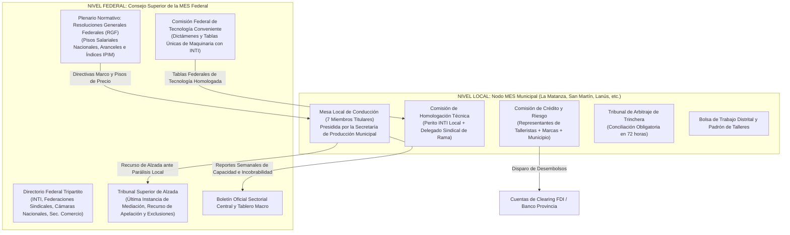
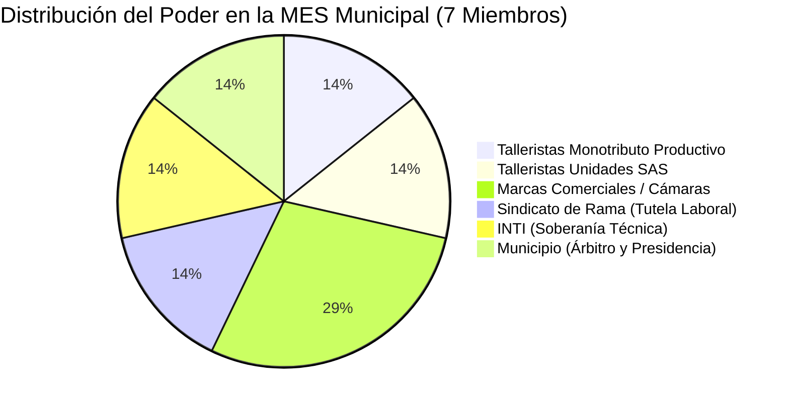
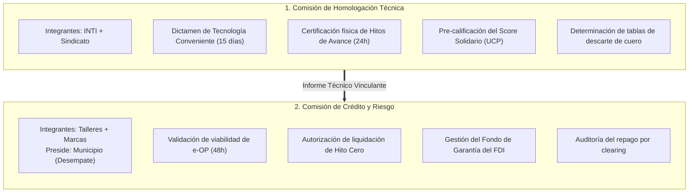
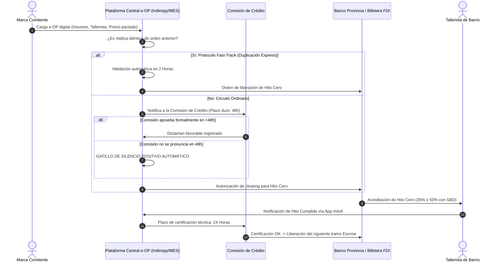
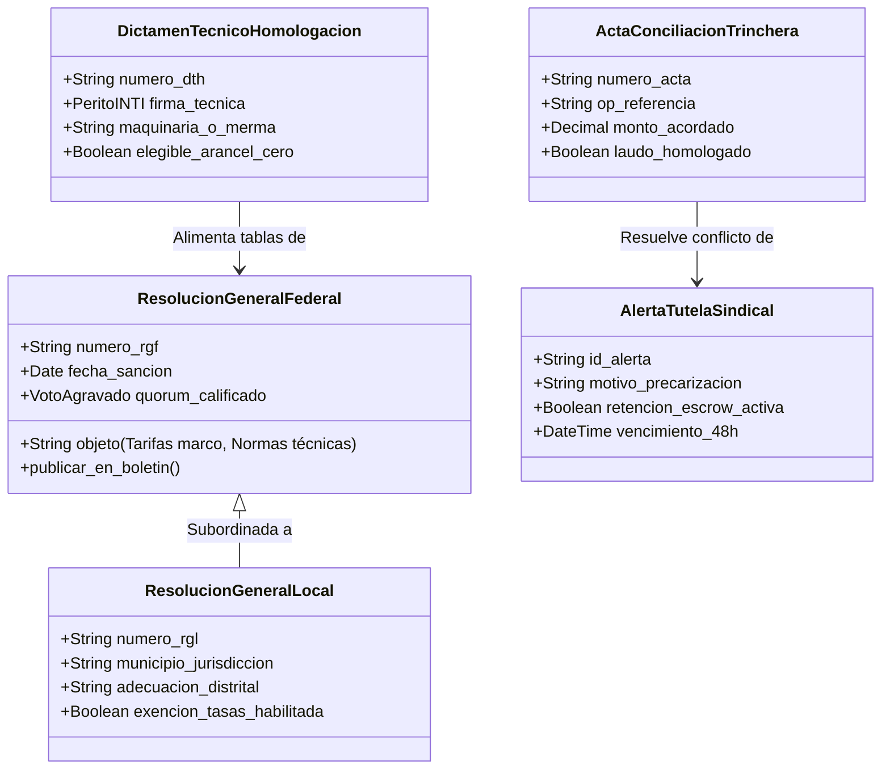
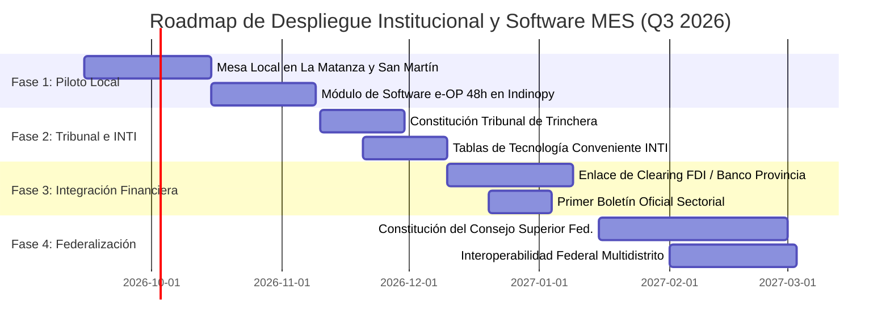

# Arquitectura Institucional y Tecnológica de la Mesa de Enlace Sectorial (MES)
## Proyecto Programático de Gobernanza Industrial, Comunidad Organizada y Soberanía Productiva

> **Documento rector:** Proyecto Programático de Política Industrial y Arquitectura de Sistemas  
> **Marco doctrinario:** [Dossier RIGI Conurbano 2026](dossier_rigi_conurbano_2026.html)  
> **Plataforma destino:** **Indinopy** (Módulo `apps/mes` / `apps/gobernanza`)  
> **Fecha:** Septiembre de 2026  
> **Estado:** Especificación Programática, Institucional y Técnica  

---

## 1. Bases Doctrinarias y Fundamentos Programáticos
La reconstrucción de la industria manufacturera no se logra mediante la imposición de decretos burocráticos ni mediante el abandono del mercado desregulado. El proyecto programático de la MES se sustenta en tres principios rectores:

1. **La Comunidad Organizada frente a la Atomización:** La cadena de valor del calzado, el cuero y la indumentaria no puede operar como un campo de batalla de intereses individuales donde la gran marca comercial impone precios de miseria y el tallerista familiar sobrevive en la informalidad. Quienes diseñan, quienes producen, quienes financian y quienes fiscalizan se integran en una **institución paritaria de conducción estratégica**.
2. **El Estado como Facilitador y Árbitro, no como Patrón Policial:** La burocracia estatal suele llegar al taller solo para fiscalizar, clausurar o cobrar tasas. En la MES, el Estado asume roles técnicos específicos: el **INTI** garantiza la soberanía tecnológica neutral y el **Municipio** actúa como garante del arraigo territorial y árbitro imparcial ante conflictos de trinchera.
3. **Subordinación del Capital a la Producción Real:** La banca usurera y los algoritmos de scoring patrimonial quedan desplazados. El corazón del sistema financiero es el **Fideicomiso de Desarrollo Industrial (FDI)**, donde la Orden de Producción digital ("e-OP") es el activo colateral y la MES es el tribunal técnico que valida la liberación de fondos contra hitos físicos de trabajo.

---
## 2. Topología Federal Multinivel
La gobernanza se estructura en una jerarquía descentralizada de dos velocidades: el **Consejo Superior Federal** (macroestrategia y tablas marco) y los **Nodos Municipales** (operación diaria de trinchera en cada distrito productivo).



### 2.1. Competencias Exclusivas de la MES Federal
- Dictar las **Tablas Federales de Tecnología Conveniente** con asistencia técnica vinculante del INTI (ningún municipio puede inventar criterios de maquinaria por su cuenta).
- Establecer y actualizar trimestralmente los **Pisos Mínimos de Mano de Obra por Proceso** (corte, rebajado, aparado, armado) indexados al IPIM del INDEC y paritarias de rama.
- Administrar el sistema de puntaje digital de **Unidades de Crédito Productivo (UCP) / Score Solidario** para acceso prioritario al Mercado Libre de Cambios (MLC) y cupos de importación.
- Actuar como **Tribunal de Alzada** definitivo ante rebeldía institucional o parálisis política de un nodo local.

### 2.2. Competencias Exclusivas de la MES Municipal (Distrital)
- Validación, registro y convalidación de las **Órdenes de Producción Digitales (e-OP)** locales.
- Autorización de desembolsos del FDI (Hito Cero e Hitos de Avance) mediante la Comisión de Crédito.
- Emisión automática de la **Habilitación Simplificada de Oficio** y exención de tasas municipales en 48 horas.
- Conducción de la **Bolsa de Trabajo Distrital** (monitoreo de capacidad instalada y cuellos de botella).
- Resolución de controversias mediante el **Tribunal de Arbitraje de Trinchera**.

---
## 3. Composición de la Mesa Local y Equilibrio de Fuerzas
Para neutralizar cualquier intento de cooptación por parte del gran capital comercial o de la burocracia de turno, el gobierno del Nodo Municipal se asienta sobre **7 sillas con representación equilibrada**:



### 3.1. Detalle de las 7 Sillas
1. **Silla 1 — Talleristas de Base (Monotributo Productivo):** Representante titular electo por voto directo del sub-padrón de trabajadores manuales individuales (aparadores, cortadores, costureros a destajo). Defiende la tarifa por par y la agilidad de los cobros en cuenta.
2. **Silla 2 — Unidades Productivas Consolidadas (Puente SAS):** Representante titular electo por los talleres estructurados bajo figuras asociativas o SAS con dotación de hasta 30 trabajadores registrados. Defiende la amortización de capital, la provisión de insumos y los costos de convenio.
3. **Sillas 3 y 4 — Marcas Comitentes y Comercializadores:** Dos representantes titulares designados por la cámara empresaria sectorial adherida al régimen. Aportan el volumen de demanda comercial y la reserva de capital obligatoria (2%) al FDI.
4. **Silla 5 — Soberanía Técnica (INTI):** Un perito industrial de designación institucional directa. Aporta el criterio técnico objetivo, homologa maquinarias y audita tolerancias de mermas.
5. **Silla 6 — Tutela de la Dignidad Laboral (Sindicato):** Representante designado por el gremio de rama con personería gremial vigente (SETIA y afines). Ejerce la auditoría ex-post en territorio y certifica las condiciones de trabajo digno.
6. **Silla 7 — Árbitro Jurisdiccional (Secretaría de Producción Municipal):** Funcionario designado por el Municipio adherente. **Preside la Mesa y la Comisión de Crédito**, ejerciendo el voto de desempate en caso de paridad para garantizar la paz social y el empleo territorial.

### 3.2. Mecánica de Votación y Régimen de Mayorías
- **Quórum Legal para Sesionar:** 5 miembros presentes.
- **Decisiones Ordinarias:** Mayoría simple (4 votos favorables).
- **Materias Reservadas (Mayoría Agravada de 5 votos):**
- Modificación de pisos de precios por minuto/hora de confección.
- Elevación al Consejo Federal de la sanción de exclusión de una marca del RIGI.
- Reasignación de partidas presupuestarias del Fondo de Fomento del FDI.
- **Cláusula de Protección de las Bases (Voto Concurrente):** En toda votación de materias reservadas se exige de forma obligatoria el **voto afirmativo concurrente de al menos uno (1) de los representantes del Nodo Productivo (Silla 1 o Silla 2)**. Queda prohibida por ley cualquier resolución sobre tarifas o presupuesto que pretenda imponerse contra la voluntad unánime de los talleristas.

---
## 4. Comisiones Especializadas y Separación de Poderes
A fin de garantizar que el control de calidad no se mezcle con la conveniencia financiera, la MES opera mediante dos comisiones con mandatos separados e incompatibles:



### Incompatibilidad Absoluta:
Ningún miembro de la Comisión de Crédito puede votar o intervenir en una orden de producción o solicitud de financiamiento en la que tenga interés comercial directo, vínculo de parentesco hasta el cuarto grado o relación societaria previa con la empresa comitente o el taller postulante.

### 4.1. Régimen de "Tecnología Conveniente" y Arancel Cero Aduanero
La Comisión de Homologación Técnica ejerce el filtro soberano para la importación de maquinaria con arancel cero (Art. 22 Ley de Salvataje):
- **Principio de No Competencia:** El beneficio solo aplica a bienes de capital sin producción nacional equivalente.
- **Los 3 Criterios Objetivos de Exclusión (INTI):** Solo se homologa el arancel cero si el fabricante nacional: (1) no entrega en <= 90 días corridos; (2) ofrece garantía técnica inferior a 12 meses; o (3) su precio supera en más de un 30% el valor CIF importado.
- **Silencio Positivo Aduanero:** Si el perito del INTI no emite dictamen en 15 días hábiles, se emite de pleno derecho la autorización aduanera.
- **Encadenamiento Forzoso Metalúrgico:** Los proveedores extranjeros deben transferir planos y licenciar el mantenimiento a pymes metalúrgicas locales y centros CIFO.
- **Inmovilización Patrimonial por 5 Años:** Queda prohibida la reventa de las máquinas importadas por un lustro.

### 4.2. Gobernanza de la Red CIFO y Administración del Banco Comunitario de Maquinarias
La MES articula el capital humano y los bienes de capital del territorio:
- **Red CIFO (Financiada con el 3% inembargable del FDI):** Co-gestionada por el Gremio, Cámaras de Diseño y el Municipio/INTI. Brinda acceso popular irrestricto sin secundario previo, becas de formación técnica y reparte el 50% de la renta neta de los lotes escuela a los alumnos. Sus egresados ingresan con Prioridad 1 a la Bolsa de Trabajo.
- **Área de Asesoría Contable y Administrativa Comunitaria:** Cada CIFO dispone de una consultoría técnica gratuita para talleres en transición. Gestiona altas de SAS en 48h, facturación de e-OP por API de ARCA, administración del IVA diferido, armado de carpetas para el cómputo del 35% de costos no documentados y liquidación de sueldos de convenio con subsidio patronal del 27% del FDI.
- **Banco Comunitario de Maquinarias:** Releva maquinaria parada y otorga la condonación total de pasivos preexistentes de ARCA a quienes la cedan en comodato por 36 meses.
- **Asignación con Opción a Transferencia Definitiva:** Se entregan en comodato a egresados de los CIFO y talleres que completen con éxito 3 e-OP.
- **Muletto Técnico en 24 Horas:** Ante rotura fortuita de máquinas que paralice la producción, el Banco provee una máquina de auxilio en 24h y el FDI liquida compensación por lucro cesante.

### 4.3. Supervisión Ética de la IA Algorética
El Consejo Superior de la MES ejerce la conducción de los algoritmos de la plataforma según la doctrina de la Encíclica *Magnifica Humanitas* y el magisterio social de Francisco:
- **Precios Éticos Paritarios:** El sistema bloquea de oficio e-OP que pretendan perforar los pisos salariales de convenio.
- **Detección de Talleres Espejo:** Auditoría continua de IPs y georreferenciación satelital para detectar fragmentaciones artificiales patronales que busquen eludir el convenio.
- **Asistente por Voz del PTF:** Interfaz en lenguaje natural para que el promotor territorial disuelva la brecha digital en el taller.
- **Supremacía Humana Indeleble:** Ninguna IA puede aplicar sanciones ni exclusiones; la facultad punitiva o regulatoria reside exclusivamente en los miembros humanos de la MES.

---
## 5. Protocolos Operativos y Plazos Duros con Silencio Administrativo Positivo
El enemigo número uno del tallerista es la lentitud burocrática. Para que el sistema funcione en la trinchera, cada procedimiento tiene un **plazo máximo perentorio en horas**, tras el cual se activa el **Silencio Administrativo Positivo** por sistema informático centralizado:



### Tabla de Plazos Perentorios:

| Trámite | Plazo Límite | Efecto del Vencimiento sin Pronunciamiento |
| :--- | :---: | :--- |
| **Validación de e-OP Ordinaria** | **48 horas hábiles** | **Silencio Positivo:** El sistema central da por aprobada e interoperable la e-OP, liberando el desembolso de arranque sin que bloqueos políticos puedan frenar el trabajo. |
| **e-OP Espejo (Fast-Track)** | **2 horas** | Aprobación algorítmica inmediata supeditada solo al cruce de stock y capacidad ociosa en la Bolsa de Trabajo. |
| **Certificación de Hito Productivo** | **24 horas hábiles** | Liberación automática de la cuota correspondiente del Escrow digital hacia la cuenta de clearing del tallerista. |
| **Dictamen de Tecnología Conveniente** | **15 días hábiles** | Concesión automática de pleno derecho del beneficio de arancel cero aduanero por Silencio Positivo. |
| **Audiencia de Arbitraje de Conflictos** | **10 días hábiles** | Elevación obligatoria y directa de la causa al Consejo Superior de la MES Federal para resolución inmediata. |

---
## 6. Procedimientos Especiales de Tutela y Arbitraje
### 6.1. El Veto Ex-Post Sindical y la Alerta de Escrow
Para no burocratizar el arranque de la producción, el sindicato no frena la orden antes de su inicio. Su poder tutelar se ejerce mediante la **Auditoría Posterior en Territorio**:
1. **Detección:** Si el delegado gremial constata precios por debajo del convenio o condiciones insalubres, interpone una **Acción de Tutela de Urgencia** ante el sistema.
2. **Efecto Inmediato (Alerta de Escrow):** Se congela preventivamente la liberación del último 20% del pago en la cuenta fiduciaria del FDI por un plazo máximo de 48 horas. **Bajo ningún concepto se interrumpe el trabajo físico del taller ni se anula su derecho al cobro de lo realizado**.
3. **Fianza de Continuidad:** Para evitar que la mercadería quede trabada y la marca pierda la temporada comercial, la empresa puede depositar una fianza en garantía líquida por el monto salarial en litigio, permitiendo el retiro inmediato de los lotes terminados mientras el Tribunal de Arbitraje sustancia el fondo de la cuestión.

### 6.2. El Tribunal de Arbitraje de Trinchera
Órgano local de mediación de conflictos rápidos integrado por:
* **Presidencia:** El perito del INTI (neutralidad técnica).
* **Vocales:** 2 representantes del sector privado desinsaculados por sorteo trimestral del padrón de la Bolsa (un tallerista y una marca ajenos al conflicto).
* **Plazo de Laudo:** 72 horas para dictar resolución de conciliación obligatoria.

### 6.3. Canal de Denuncias y "Perimetral Administrativa"
Ante pedidos de coimas o extorsiones por parte de inspectores fiscales o municipales:
* La radicación de la denuncia en la MES otorga al taller una **Inmunidad Fiscal Temporaria de 180 días** (ninguna delegación de ARCA puede cursar inspecciones presenciales).
* Se emite una **Orden de Restricción Administrativa de Emergencia**: se notifica a la justicia penal, se bloquea el usuario informático del inspector denunciado y se le prohíbe el ingreso al cuadrante productivo del taller denunciante ("perimetral administrativa").
* Si una seccional fiscal acumula más de 3 denuncias firmes en un año, se suspenden los plus salariales por recaudación ("cuenta de jerarquización") de toda esa delegación hasta su saneamiento interno.

### 6.4. El Dictamen de Transición Asistida y el Puente SAS
Para erradicar el "purgatorio fiscal" y el préstamo de identidades (CUITs ajenos):
1. **Relevamiento Activo del PTF:** El Promotor Territorial constata en territorio la capacidad real del taller, maquinaria y dotación de oficio.
2. **Elevación del Dictamen:** El PTF eleva ante la Comisión de Crédito y Riesgo de la MES el *Dictamen de Transición Asistida*, proponiendo el salto a la figura de Sociedad por Acciones Simplificada (SAS).
3. **Efectos Jurídicos Cautelares Inmediatos:** La homologación institucional de la MES gatilla por sistema:
   - **Alta de Oficio de la SAS** en la Ventanilla Única Municipal con vinculación a la Cuenta de IVA Sectorial Diferida (el IVA solo se devenga contra clearing efectivo del FDI).
   - **Suspensión Preventiva de Ejecuciones por 180 Días:** Orden obligatoria a ARCA de frenar cualquier pedido de quiebra, traba de cuentas o embargo fundado en deudas tributarias de la etapa informal previa.
   - **Crédito Fiscal Presunto del 25%:** Cómputo de costos presuntos de producción para amortiguar el escalamiento hacia la plena formalidad.
   - **Derivación Obligatoria al Área Contable del CIFO:** El tallerista es asignado a la asesoría técnica y contable del CIFO local, que asume de oficio el tutelaje administrativo gratuito durante los 180 días y el seguimiento de sus primeras 3 e-OP.
   - **Secreto Tuitivo:** Prohibición absoluta de utilizar los datos relevados para iniciar fiscalizaciones retroactivas o juicios de apremio.

---
## 7. La Fábrica Normativa: Instrumentos y Publicidad
Los actos de gobierno de la MES se materializan a través de instrumentos jurídicos tipificados que componen la doctrina y jurisprudencia de la cadena:



### 7.1. El Boletín Oficial Sectorial (Estructura Semanal)
La MES publicará semanalmente su órgano de difusión público y digital, estructurado en 5 secciones obligatorias:
* **Sección I — Tarifas y Paritarias de Confección:** Cuadros oficiales de precios mínimos por minuto y por par para cada sub-proceso (corte, aparado, rebajado, armado, inyección), pesificados e indexados al IPIM.
* **Sección II — Registro Público de Homologaciones:** Dictámenes técnicos del INTI sobre maquinarias aprobadas con arancel cero y argumentos de no disponibilidad local, generando jurisprudencia técnica transparente.
* **Sección III — Padrón de Capacidades y Bolsa de Trabajo:** Directorio distrital de talleres activos, curvas de ocupación semanal y alertas de oficios con vacancia o riesgo de extinción.
* **Sección IV — Reporte Fiduciario del FDI:** Balance transparente de la cartera de adelantos, ratio de rotación del fondo, volumen de e-OPs activas y tasa real de incobrabilidad.
* **Sección V — Registro Disciplinario y Alertas:** Notificaciones de marcas en mora, apercibimientos digitales y exclusiones definitivas del RIGI.

---
## 8. Blueprint de Ingeniería de Software (Módulo `apps/mes` en Django)
A continuación se detalla la arquitectura de modelos para incorporar la MES a la base de código de **Indinopy**:

```python
from decimal import Decimal
from django.db import models
from django.contrib.auth.models import User
from apps.base.models import TimeStampedModel, DocumentoBase

# ==========================================
# 1. TOPOLOGÍA INSTITUCIONAL Y PADRÓN
# ==========================================

class JurisdiccionMES(TimeStampedModel):
    """Nodos territoriales: Federal (Nacional) o Municipal (Distritos)."""
    TIPO_CHOICES = [
        ("federal", "Consejo Superior Federal"),
        ("municipal", "Nodo MES Municipal"),
    ]
    nombre = models.CharField(max_length=150, unique=True)
    tipo = models.CharField(max_length=20, choices=TIPO_CHOICES, default="municipal")
    provincia = models.CharField(max_length=100, default="Buenos Aires")
    municipio = models.CharField(max_length=100, blank=True, null=True)
    codigo_partido = models.CharField(max_length=20, blank=True, null=True)
    activa = models.BooleanField(default=True)

    def __str__(self):
        return f"{self.nombre} [{self.get_tipo_display()}]"


class MiembroMesa(TimeStampedModel):
    """Integrantes con banca formal en el plenario de la MES."""
    NODO_CHOICES = [
        ("taller_mono", "Silla 1: Tallerista Monotributo Productivo"),
        ("taller_sas", "Silla 2: Tallerista Unidad Consolidada (SAS)"),
        ("marca_1", "Silla 3: Marca Comitente Titular 1"),
        ("marca_2", "Silla 4: Marca Comitente Titular 2"),
        ("inti", "Silla 5: Soberanía Técnica (INTI)"),
        ("sindicato", "Silla 6: Tutela Laboral (Sindicato)"),
        ("municipio", "Silla 7: Árbitro Jurisdiccional (Secretaría Producción)"),
    ]
    jurisdiccion = models.ForeignKey(JurisdiccionMES, on_delete=models.CASCADE, related_name="miembros")
    usuario = models.ForeignKey(User, on_delete=models.RESTRICT)
    contacto = models.ForeignKey("contactos.Contacto", on_delete=models.SET_NULL, null=True, blank=True)
    nodo = models.CharField(max_length=30, choices=NODO_CHOICES)
    es_titular = models.BooleanField(default=True)
    es_presidente = models.BooleanField(default=False)
    fecha_inicio_mandato = models.DateField()
    fecha_fin_mandato = models.DateField()
    activo = models.BooleanField(default=True)

    class Meta:
        unique_together = ("jurisdiccion", "nodo", "es_titular")

    def __str__(self):
        return f"{self.get_nodo_display()}: {self.usuario.get_full_name()} ({self.jurisdiccion.nombre})"


# ==========================================
# 2. PROCESOS DELIBERATIVOS Y VOTACIONES
# ==========================================

class SesionPlenaria(TimeStampedModel):
    """Asambleas periódicas donde se debate normativa y aprueba el giro institucional."""
    jurisdiccion = models.ForeignKey(JurisdiccionMES, on_delete=models.CASCADE, related_name="sesiones")
    numero_acta = models.CharField(max_length=50, unique=True)
    fecha = models.DateTimeField()
    orden_del_dia = models.TextField()
    asistentes = models.ManyToManyField(MiembroMesa, related_name="asistencias")
    quorum_verificado = models.BooleanField(default=False)
    acta_firmada_digitalmente = models.FileField(upload_to="mes/actas/", blank=True, null=True)

    def __str__(self):
        return f"Acta {self.numero_acta} - {self.jurisdiccion.nombre} ({self.fecha.strftime('%d/%m/%Y')})"


class ProyectoResolucion(TimeStampedModel):
    """Iniciativas normativas sometidas a votación en el plenario."""
    TIPO_MATERIA = [
        ("ordinaria", "Materia Ordinaria (Mayoría Simple)"),
        ("reservada", "Materia Reservada (Mayoría Agravada 5 votos + Concurrencia Taller)"),
    ]
    ESTADO = [
        ("borrador", "En Redacción"),
        ("en_debate", "Sometido a Plenario"),
        ("aprobado", "Aprobado / Promulgado"),
        ("rechazado", "Rechazado"),
        ("vetado", "Vetado por Alzada Federal"),
    ]
    jurisdiccion = models.ForeignKey(JurisdiccionMES, on_delete=models.CASCADE)
    sesion = models.ForeignKey(SesionPlenaria, on_delete=models.SET_NULL, null=True, blank=True)
    numero = models.CharField(max_length=50, unique=True)
    titulo = models.CharField(max_length=255)
    tipo_materia = models.CharField(max_length=20, choices=TIPO_MATERIA, default="ordinaria")
    considerandos = models.TextField()
    articulado = models.TextField()
    estado = models.CharField(max_length=20, choices=ESTADO, default="borrador")

    # Resultado de votación
    votos_positivos = models.PositiveSmallIntegerField(default=0)
    votos_negativos = models.PositiveSmallIntegerField(default=0)
    voto_productivo_concurrente = models.BooleanField(default=False)

    def __str__(self):
        return f"{self.numero}: {self.titulo} [{self.get_estado_display()}]"


# ==========================================
# 3. CONTROL OPERATIVO, PLAZOS Y ARBITRAJE
# ==========================================

class ValidacionOrdenProduccion(TimeStampedModel):
    """Bitácora de validación de 48 horas para la e-OP con disparador de Silencio Positivo."""
    op = models.OneToOneField("produccion.OrdenProduccion", on_delete=models.CASCADE, related_name="validacion_mes")
    jurisdiccion = models.ForeignKey(JurisdiccionMES, on_delete=models.RESTRICT)
    es_fast_track = models.BooleanField(default=False)
    fecha_ingreso = models.DateTimeField(auto_now_add=True)
    fecha_limite_48h = models.DateTimeField()
    aprobada_por_silencio_positivo = models.BooleanField(default=False)
    aprobada_formalmente = models.BooleanField(default=False)
    observaciones = models.TextField(blank=True, null=True)

    def verificar_silencio_positivo(self):
        """Tarea Celery periódica ejecuta este método para liberar fondos si expiró el plazo."""
        from django.utils import timezone
        if not self.aprobada_formalmente and not self.aprobada_por_silencio_positivo:
            if timezone.now() >= self.fecha_limite_48h:
                self.aprobada_por_silencio_positivo = True
                self.op.estado = "confirmado"
                self.op.save()
                self.save()
                return True
        return False


class DisputaArbitrajeTrinchera(TimeStampedModel):
    """Gestión de controversias de calidad o precios ante el Tribunal Local."""
    ESTADO = [
        ("ingresada", "Denuncia Radicada"),
        ("audiencia_fijada", "En Período de Audiencia (72h)"),
        ("laudo_notificado", "Laudo Homologado"),
        ("recurso_alzada", "Apelado a MES Federal"),
        ("ejecutado", "Fondos de Fianza Liquidados"),
    ]
    jurisdiccion = models.ForeignKey(JurisdiccionMES, on_delete=models.CASCADE)
    op = models.ForeignKey("produccion.OrdenProduccion", on_delete=models.RESTRICT)
    parte_reclamante = models.ForeignKey("contactos.Contacto", on_delete=models.RESTRICT, related_name="reclamos_mes_iniciados")
    parte_demandada = models.ForeignKey("contactos.Contacto", on_delete=models.RESTRICT, related_name="reclamos_mes_recibidos")
    monto_en_disputa = models.DecimalField(max_digits=15, decimal_places=2)
    fianza_depositada = models.DecimalField(max_digits=15, decimal_places=2, default=Decimal("0.00"))
    motivo_reclamo = models.TextField()
    laudo_resolucion = models.TextField(blank=True, null=True)
    estado = models.CharField(max_length=25, choices=ESTADO, default="ingresada")
    fecha_limite_laudo = models.DateTimeField()


# ==========================================
# 4. BOLETÍN OFICIAL SECTORIAL
# ==========================================

class EdicionBoletinSectorial(TimeStampedModel):
    """Publicación periódica oficial con resoluciones, tarifas y balances."""
    jurisdiccion = models.ForeignKey(JurisdiccionMES, on_delete=models.CASCADE)
    numero_edicion = models.PositiveIntegerField()
    fecha_publicacion = models.DateField()
    pdf_compilado = models.FileField(upload_to="mes/boletines/")
    publicada = models.BooleanField(default=False)

    class Meta:
        unique_together = ("jurisdiccion", "numero_edicion")

    def __str__(self):
        return f"Boletín N° {self.numero_edicion} - {self.jurisdiccion.nombre} ({self.fecha_publicacion})"
```

---
## 9. Hoja de Ruta Programática de Despliegue
La implementación de la MES se articula en 4 fases progresivas de maduración política y tecnológica:



1. **Fase 1 — Piloto Territorial de Trinchera:**
   Firma del acuerdo intersectorial en los municipios con mayor densidad de calzado (San Martín y La Matanza). Puesta en producción del software Indinopy con la máquina de validación de 48 horas y silencio positivo para las primeras 20 marcas comitentes.
2. **Fase 2 — Integración Técnica y Arbitraje:**
   Incorporación formal de la delegación local del INTI y gremio de rama. Funcionamiento del Tribunal de Arbitraje y publicación de las primeras tablas de mermas y tecnología.
3. **Fase 3 — Integración Financiera con el FDI:**
   Conexión mediante API de las órdenes de pago validadas con las cuentas de clearing del Banco Provincia, automatizando la liquidación del Hito Cero en milisegundos. Publicación de la Edición N° 1 del Boletín Oficial Sectorial.
4. **Fase 4 — Escalamiento al Consejo Superior Federal:**
   Promulgación formal de la Ley de Salvataje Nacional y el RIGI del Conurbano en el Congreso Nacional, habilitando la personería de derecho público del Consejo Federal y la interoperabilidad en todo el país.
