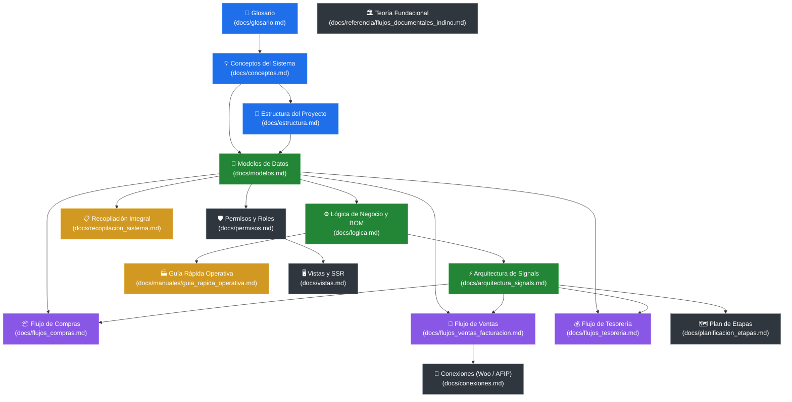

# Centro de Documentación y Mapa de Navegación — Indinopy

Bienvenido al centro de documentación técnica y operativa de **Indinopy**, el sistema ERP/MES industrial diseñado para la gestión integral de manufactura (calzado, indumentaria, marroquinería), almacenes con inventario por partida doble, control de talleres externos (fasón), compras, tesorería y ventas omnicanal.

Este documento sirve como **puerta de entrada interactiva y mapa de relaciones**, permitiendo navegar por todo el conocimiento del sistema de forma coherente según el rol del lector (desarrolladores principiantes, arquitectos de software o administradores de planta).

---

## 🗺️ Mapa de Relaciones entre Documentos

El siguiente diagrama muestra cómo se conectan los documentos entre sí. Puedes seguir las flechas para una lectura guiada:

---

## 🧭 Rutas de Lectura Recomendadas

Elige la ruta que mejor se adapte a tu objetivo actual:

### 🔰 Ruta 1: Onboarding y Principiantes (¿Cómo funciona Indino?)
*Si recién te sumas al proyecto o no estás familiarizado con la terminología industrial:*
1. [**Glosario del Sistema**](glosario.md): Términos clave explicados con analogías sencillas (SKU, Quants, BOM, Fasón, Curva de talles, Partida doble).
2. [**Conceptos Generales**](conceptos.md): Propósito de la empresa, filosofía Server-Side Rendering (SSR) y división en apps.
3. [**Estructura del Proyecto**](estructura.md): Árbol de carpetas y ubicación de cada componente.
4. [**Guía Rápida Operativa**](manuales/guia_rapida_operativa.md): Simulación paso a paso de un lote real desde el corte hasta la entrega y cobro.

### ⚙️ Ruta 2: Arquitectura de Software y Backend (¿Cómo está programado?)
*Si vas a escribir modelos, consultas, servicios o señales:*
1. [**Estructura del Proyecto**](estructura.md): Las 8 aplicaciones Django y convenciones.
2. [**Modelos de Datos**](modelos.md): Catálogo exhaustivo de campos, claves foráneas, auditoría histórica y clases abstractas (`apps/base`).
3. [**Lógica de Negocio y BOM**](logica.md): Fórmulas de cálculo dinámico de insumos por variante y ciclos de vida de documentos.
4. [**Arquitectura de Señales**](arquitectura_signals.md): Receptores de eventos atómicos (`transaction.atomic`) para Quants y sincronización inter-modular.
5. [**Recopilación del Sistema**](recopilacion_sistema.md): Blueprint integral con diagramas de secuencia e interacciones de base de datos.

### 🏭 Ruta 3: Flujos de Negocio por Departamento
*Si necesitas profundizar en un circuito operativo específico:*
- 📦 **Compras y Abastecimiento**: [**Flujos de Compras**](flujos_compras.md) — Detección de necesidad por BOM, órdenes de compra, remitos entrantes y control de recepción.
- 🛒 **Ventas y Facturación**: [**Flujos de Ventas**](flujos_ventas_facturacion.md) — Pedidos minoristas B2C vs. mayoristas Make to Order con seña, cuentas corrientes y AFIP.
- 💰 **Tesorería y Finanzas**: [**Flujos de Tesorería**](flujos_tesoreria.md) — Manejo de cajas duales (oficial/planta), cobros, valores en cartera y liquidación de fasón.

### 🛡️ Ruta 4: Seguridad, Presentación e Integraciones
*Si trabajas en vistas, permisos o APIs externas:*
1. [**Gestión de Permisos y Roles**](permisos.md): Control de acceso estricto (ocultamiento de costos clasificados a talleristas y fabricantes).
2. [**Vistas y Presentación (SSR)**](vistas.md): CBVs, plantillas imprimibles (OP dual), badges de estado y gestor de adjuntos.
3. [**Conexiones e Integraciones**](conexiones.md): Sincronización pasiva/activa con WooCommerce y facturación electrónica con AFIP WSFE.

---

## 📚 Índice Maestro de Documentos

A continuación se detalla cada archivo de la carpeta `docs/`, su función en el ecosistema, qué leer antes y adónde continuar:

| Archivo | Qué resuelve / Describe | Lectura Previa Sugerida | Siguiente Paso Recomendado |
| :--- | :--- | :--- | :--- |
| [`docs/glosario.md`](glosario.md) | Diccionario amigable con analogías cotidianas para nivelar conocimiento industrial y técnico. | *Ninguna (Punto de partida)* | [`docs/conceptos.md`](conceptos.md) |
| [`docs/conceptos.md`](conceptos.md) | Visión de negocio, stack técnico (Django SSR, Postgres, Celery) y arquitectura modular. | [`docs/glosario.md`](glosario.md) | [`docs/estructura.md`](estructura.md) |
| [`docs/estructura.md`](estructura.md) | Árbol de carpetas del proyecto, responsabilidades de cada app y almacenamiento de media. | [`docs/conceptos.md`](conceptos.md) | [`docs/modelos.md`](modelos.md) |
| [`docs/modelos.md`](modelos.md) | Especificación exhaustiva de tablas y campos del ORM: Base, Documentos, Contactos, Inventario, Producción. | [`docs/estructura.md`](estructura.md) | [`docs/logica.md`](logica.md) |
| [`docs/logica.md`](logica.md) | Reglas de negocio: BOM dinámico con selección de variantes, reservas de stock y liquidación por etapa. | [`docs/modelos.md`](modelos.md) | [`docs/arquitectura_signals.md`](arquitectura_signals.md) |
| [`docs/arquitectura_signals.md`](arquitectura_signals.md) | Mapa de eventos automáticos de Django: sembrado de unidades, cálculo de insumos y reserva de quants. | [`docs/logica.md`](logica.md) | [`docs/flujos_compras.md`](flujos_compras.md) |
| [`docs/flujos_compras.md`](flujos_compras.md) | Circuito de abastecimiento: detección de faltantes por BOM, orden de compra y remito entrante. | [`docs/modelos.md`](modelos.md) | [`docs/flujos_ventas_facturacion.md`](flujos_ventas_facturacion.md) |
| [`docs/flujos_ventas_facturacion.md`](flujos_ventas_facturacion.md) | Circuito comercial: ventas B2C contado vs B2B con seña (Make to Order), remitos y cuentas corrientes. | [`docs/logica.md`](logica.md) | [`docs/flujos_tesoreria.md`](flujos_tesoreria.md) |
| [`docs/flujos_tesoreria.md`](flujos_tesoreria.md) | Cajas oficiales/internas, cobranzas de señas, órdenes de pago a proveedores y liquidaciones a talleristas. | [`docs/flujos_ventas_facturacion.md`](flujos_ventas_facturacion.md) | [`docs/manuales/guia_rapida_operativa.md`](manuales/guia_rapida_operativa.md) |
| [`docs/manuales/guia_rapida_operativa.md`](manuales/guia_rapida_operativa.md) | Walkthrough práctico paso a paso de una orden de producción completa de 100 pares de borcegos. | [`docs/glosario.md`](glosario.md) | [`docs/recopilacion_sistema.md`](recopilacion_sistema.md) |
| [`docs/recopilacion_sistema.md`](recopilacion_sistema.md) | Compendio global de especificaciones, diagramas Mermaid de secuencias y reglas de arquitectura. | [`docs/modelos.md`](modelos.md) | [`docs/planificacion_etapas.md`](planificacion_etapas.md) |
| [`docs/planificacion_etapas.md`](planificacion_etapas.md) | Fases de desarrollo iterativo, estado de entrega (Etapas 1 y 2 completadas) y próximos hitos. | [`docs/estructura.md`](estructura.md) | [`docs/permisos.md`](permisos.md) |
| [`docs/vistas.md`](vistas.md) | Renderizado SSR: CBVs, impresión de orden dual (Original/Duplicado ciego) y visualización de adjuntos. | [`docs/permisos.md`](permisos.md) | [`docs/conexiones.md`](conexiones.md) |
| [`docs/conexiones.md`](conexiones.md) | Webhooks entrantes de WooCommerce, tareas asíncronas con Celery para stock y web service AFIP. | [`docs/flujos_ventas_facturacion.md`](flujos_ventas_facturacion.md) | [`docs/migracion_sarello.md`](migracion_sarello.md) |
| [`docs/permisos.md`](permisos.md) | Configuración de usuarios, grupos y permisos personalizados (`view_costos_op`) en Django Auth. | [`docs/modelos.md`](modelos.md) | [`docs/vistas.md`](vistas.md) |
| [`docs/migracion_sarello.md`](migracion_sarello.md) | Registro de adopción de componentes maduros del ERP contable Sarello hacia Indinopy. | [`docs/estructura.md`](estructura.md) | [`docs/referencia/flujos_documentales_indino.md`](referencia/flujos_documentales_indino.md) |
| [`docs/referencia/flujos_documentales_indino.md`](referencia/flujos_documentales_indino.md) | Documento original de teoría administrativa y flujos de calzado guardado como respaldo fundacional. | *Lectura complementaria histórica* | — |

---

## 💡 Convenciones Transversales Clave

Al navegar y desarrollar sobre cualquier aplicación de Indinopy, recuerda estos 5 principios rectores:

1. **Herencia de Auditoría**: Toda entidad persistente hereda de `TimeStampedModel` (`apps/base/models.py`), otorgando trazabilidad total de versiones mediante `simple_history`.
2. **Ciclo de Vida Documental**: Todo documento operativo hereda de `DocumentoBase` (`apps/base/models.py`) con estados estandarizados: `borrador` ➔ `confirmado` ➔ `finalizado` (o `cancelado` / `anulado`).
3. **Adjuntos Universales**: Cualquier documento permite adjuntar remitos escaneados, PDFs técnicos o fotos mediante `documento.adjuntos.all()`, implementado en `apps/documentos/models.py`.
4. **Inventario por Partida Doble**: No existen contadores arbitrarios de stock. La mercadería se mueve entre ubicaciones origen y destino en `StockQuant` (`apps/inventario/models.py`).
5. **Precisión Financiera**: Todo importe monetario se expresa estrictamente como `DecimalField(max_digits=15, decimal_places=2)`.
