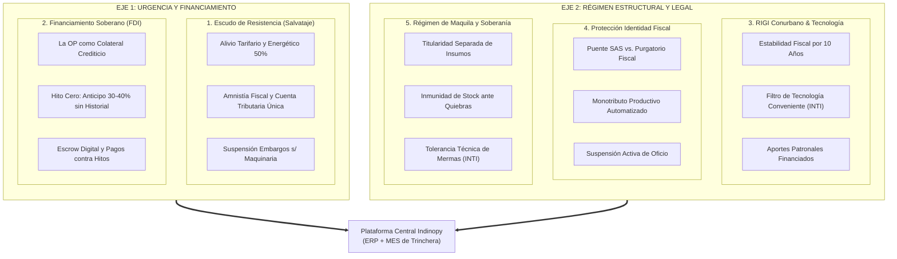
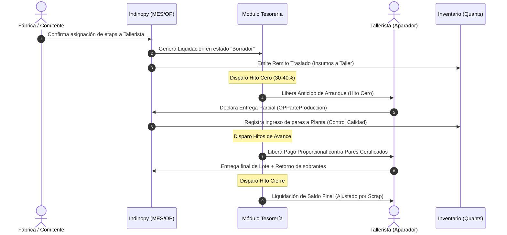
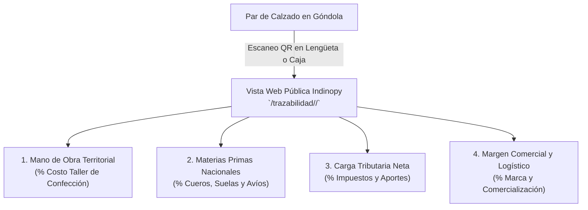
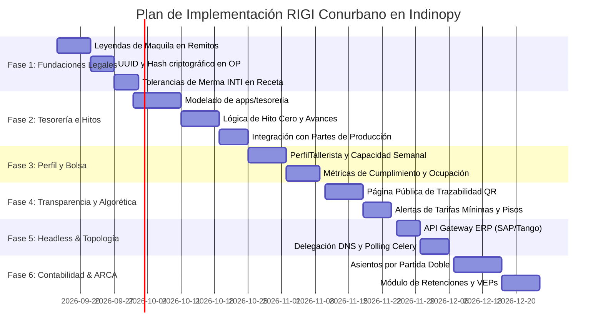

<span class="doc-header-badge">⚙️ Especificación Técnica</span>
# Análisis del Dossier "RIGI Conurbano 2026" e Integración Arquitectónica en Indinopy

> **Referencia base:** [Dossier RIGI Conurbano 2026](dossier_rigi_conurbano_2026.html)  
> **Sistema destino:** **Indinopy** — ERP & MES Industrial para Manufactura de Calzado, Cuero e Indumentaria  
> **Fecha:** Septiembre de 2026  
> **Estado:** Especificación Técnica y Plan de Implementación  

---

## ¿De qué estamos hablando? (Resumen Ejecutivo de Contexto)

1. **El Problema Real:** En Argentina, la manufactura de calzado e indumentaria opera con un alto grado de tercerización en talleres periféricos familiares (aparadores, costureros, armadores a destajo). Históricamente, estos talleres viven en la informalidad o en el "purgatorio fiscal" (cobran en efectivo o usan CUITs prestados de familiares para no ahogarse en impuestos y ejecuciones bancarias). Al no haber facturas, la empresa formal (Indino) no puede deducir sus costos reales de mano de obra en Ganancias ni computar el crédito fiscal de IVA, tributando sobre utilidades ficticias.
2. **El Documento Fuente (`Dossier RIGI Conurbano 2026.md`):** Es un proyecto de Ley de Salvataje Nacional y Régimen de Incentivo (RIGI del Conurbano) para micro y pequeñas fábricas (hasta 30 operarios). Plantea que en lugar de ahogar al taller con inspecciones o dejarlo a merced de la usura bancaria tradicional, se cree un **ecosistema de soberanía productiva**:
3. **Mesa de Enlace Sectorial (MES):** Órgano tripartito (Estado/INTI, Sindicatos, Cámaras, Talleristas) que gobierna la cadena.
4. **Fideicomiso de Desarrollo Industrial (FDI):** Fondo de ahorro comunitario que reemplaza a los bancos comerciales.
5. **La Orden de Producción como Título de Crédito (e-OP):** El banco o billetera no pide balances pasados al tallerista; financia el trabajo en curso tomando la OP registrada como garantía real de producción.
6. **Hito Cero & Escrow Digital:** Anticipo automático de arranque (30% al 40%) al entregar los insumos al tallerista, y pagos posteriores liberados en custodia (*Escrow*) contra la certificación de hitos físicos cumplidos.
7. **Régimen de Maquila y Façón (Propuesta de Reforma Ley 25.113 vs. CCCN Actual):** Actualmente en Argentina la **Ley 25.113 rige con exclusividad para el sector agroindustrial** (productores agropecuarios entregando materia prima con pago en especie y no sujeción tributaria). En el sector del calzado y la indumentaria rige la figura del **façón** (servicio de confección remunerado en dinero), la cual carece de ley propia y se apoya en la *Locación de Obra* (Arts. 1251 y ss. del CCCN) y *Depósito* (Arts. 1356 y ss. CCCN), lo que genera vulnerabilidad laboral (Art. 30 LCT) y riesgo de embargo sobre los insumos ante problemas del tallerista. El Dossier RIGI propone **reformar la Ley 25.113 para extender la figura a la "Maquila Industrial"**. Indinopy debe blindar documentalmente la propiedad inembargable de los insumos bajo el CCCN actual y dejar la arquitectura preparada para la eventual ampliación de la Ley 25.113.
8. **Monotributo Productivo Automatizado:** Alta simplificada con la primera e-OP, retención de 1-2% por cobro efectivo, y "Suspensión Activa de Oficio" (carga fiscal cero pesos si no hay órdenes activas, sin acumular deudas cíclicas).
9. **Sello QR de Trazabilidad Socioproductiva:** Código escaneable en el calzado para que el consumidor final vea el desglose ético real: cuánto va al tallerista, cuánto a materiales, cuánto a impuestos y cuánto a la marca.
10. **El Rol de Indinopy:** Indinopy es el ERP/MES de calzado de este repositorio. Ya cuenta con inventario por partida doble estilo Odoo (`apps/inventario`), fichas técnicas dinámicas BOM (`apps/produccion`), y seguimiento de etapas a fasón (`OPEtapaTracking`). **Este documento detalla exactamente qué clases, campos y migraciones deben agregarse en Django** para implementar los puntos del Dossier.

---

## 1. Introducción y Encuadre Doctrinario-Técnico

El **Dossier de Reconstrucción Industrial "RIGI del Conurbano 2026"** y el proyecto de **Ley de Salvataje para la Cadena de Valor del Calzado** sintetizan la realidad de un entramado productivo bajo severo estrés macroeconómico. Frente a la apertura importadora, la caída del consumo interno y la asfixia por costos fijos y presión fiscal, el documento propone una salida basada en la **Comunidad Organizada**: articular al Estado, los sindicatos, las marcas comitentes, los diseñadores y los talleristas periféricos bajo una gobernanza común (la **Mesa de Enlace Sectorial - MES**) y un fondo financiero desintermediado (el **Fideicomiso de Desarrollo Industrial - FDI**).

**Indinopy** no es un ERP administrativo abstracto; fue concebido para resolver la operación real, física y dual de las fábricas de calzado en Argentina. Su motor de inventario por partida doble, su desglose de fichas técnicas dinámicas (BOM) y su módulo de tracking de etapas a fasón lo posicionan como la **plataforma tecnológica natural** para digitalizar, transparentar e implementar los principios del RIGI del Conurbano.

El presente documento analiza cada eje del Dossier y define las especificaciones de ingeniería de software requeridas para transformar las directivas de política industrial en **modelos de datos, servicios, validaciones y flujos operativos concretos** dentro de Indinopy.

---

## 2. Los 5 Pilares del Dossier: Diagnóstico e Impacto en Sistemas



### 2.1. El Nudo de la Informalidad y el "Purgatorio Fiscal"

- **Diagnóstico:** El aparador o costurero cobra en efectivo porque el salto al régimen general o las cuotas fijas de monotributo devengan deudas impositivas incluso en períodos de parálisis fabril. Al no facturar, la pyme o diseñador formal pierde la deducción de mano de obra en el Impuesto a las Ganancias (30% a 50% del costo) y no puede computar crédito fiscal de IVA, tributando sobre utilidades ficticias.
- **Respuesta en el Sistema:** Indinopy debe admitir la convivencia entre proveedores formales y en proceso de regularización, calcular la **Brecha Fiscal de Costos** y preparar las estructuras para la deducción presunta transitoria (hasta 35%) prevista en el proyecto de ley.

### 2.2. La Orden de Producción como Activo Financiero y Colateral

- **Diagnóstico:** Los bancos comerciales rechazan a los talleristas por falta de balances o garantías propietarias. La solución del FDI es tomar la **Orden de Producción (e-OP)** como colateral ejecutable por flujo.
- **Respuesta en el Sistema:** La OP de Indinopy debe transicionar de una entidad interna a un **instrumento legal y financiero interoperable**, con hash criptográfico, hitos de avance verificables y liquidación desacoplada en custodia (*Escrow*).

### 2.3. Contrato de Maquila e Inembargabilidad de Activos (Situación Legal y Estrategia)

- **El Marco Legal Vigente (Ley 25.113 - Ámbito Agropecuario):**
  - La **Ley 25.113 de Maquila rige actualmente de forma exclusiva para insumos y productos agroindustriales** (caña de azúcar, vitivinicultura, leche, granos, carne, etc.). Su estructura está diseñada para que un productor agropecuario entregue materia prima y cobre en especie (con una parte del producto elaborado), estableciendo por ley que el productor mantiene la propiedad en todo momento, que el traspaso no constituye hecho imponible y que el stock no puede ser embargado ante quiebra del industrial.
- **El Vacío Legal en la Manufactura (Calzado e Indumentaria - El "Façón"):**
  - La tercerización de etapas fabriles en calzado (corte, rebajado, aparado, armado) se conoce operativamente como **façón**, pero **carece de una ley específica propia**.
  - En la práctica jurídica argentina actual, se encuadra genéricamente en el Código Civil y Comercial de la Nación (CCCN) como **Locación de Obra con provisión de materiales por el comitente (Arts. 1251 y 1262 inc. b CCCN)** y **Depósito Regular en Custodia (Arts. 1356 y ss. CCCN)**.
  - A diferencia de la maquila agropecuaria, el façón se remunera en dinero (tarifa por par/servicio) y está plenamente gravado por IVA e Ingresos Brutos. Esto expone a las empresas a dos contingencias críticas:
    1. *Solidaridad Laboral (Art. 30 LCT):* Riesgo de que la justicia laboral presuma relación de dependencia o fraude laboral si el tallerista es informal.
    2. *Embargos Judiciales sobre Materia Prima:* Si el tallerista es embargado por deudas particulares o fiscales, los oficiales de justicia suelen secuestrar el cuero, suelas y cortes hallados en el taller bajo la presunción de que pertenecen a quien tiene la tenencia física.
- **La Propuesta del Dossier RIGI:**
  - Plantea la **reforma de la Ley 25.113** para extender su alcance a la manufactura no agropecuaria ("Maquila Industrial"), otorgándole rango de ley a la inembargabilidad de los insumos y desarticulando la presunción de dependencia laboral cuando medie una e-OP registrada ante la MES.
- **Respuesta en el Sistema (Cómo opera Indinopy hoy):**
  - Mientras dicha reforma legislativa sea un proyecto, Indinopy debe blindar a la empresa bajo las herramientas más sólidas del CCCN actual:
    - Toda orden y remito de traslado emitido por Indinopy (`TRA-...`) debe instrumentar documentalmente la **Locación de Obra (Art. 1251 CCCN)** junto con el **Depósito en Custodia (Art. 1356 CCCN)**, dejando constancia de que la propiedad de los insumos permanece inalterable en el comitente.
    - El modelo de datos de `OrdenProduccion` queda parametrizado para admitir el régimen de façón bajo CCCN actual y la eventual adopción de la figura de Maquila Industrial ampliada.

### 2.4. Contexto Político 2024-2026: Pragmatismo, Lobby Corporativo y Universidades

- **Diagnóstico del Modelo (2024-2026):** El proyecto se inserta en un escenario de profunda recesión del mercado interno, caracterizado por un sesgo gubernamental anti-industrial (apertura importadora, tarifazos) y la negativa rotunda del oficialismo libertario a tratar proyectos de desendeudamiento para familias y PyMEs. Bajo la premisa de que la asfixia es un "contrato entre privados" y para no alterar el equilibrio fiscal, el Estado central retira todas las herramientas de fomento y crédito productivo, agravando las trabas burocráticas y tributarias municipales y provinciales.
- **La Respuesta Doctrinaria (OLP y Pragmatismo de Trinchera):** Frente al bloqueo legislativo e institucional, Indinopy asume el pragmatismo de la doctrina de las **Organizaciones Libres del Pueblo (OLP)**. En lugar de esperar que el Estado central baje la tasa de interés o decrete rescates, el ecosistema transfiere la gobernanza a la *Mesa de Enlace Sectorial* (Municipios, Sindicatos, Talleristas) y desintermedia el crédito creando su propio instrumento de confianza: la e-OP. Es la comunidad organizada supliendo el vacío del Estado y defendiendo sus fuerzas productivas.
- **El Rol de las Universidades Públicas:** Ante la desregulación extrema, el Dossier exhorta a las Universidades Públicas Nacionales (UNSAM, UNLaM, UNDAV, etc.) a asumir el rol de homologadores técnicos. Ellas deben auditar los algoritmos de precios justos, la criptografía de la red y el scoring de la Bolsa de Trabajo, aportando legitimidad y transparencia científica al régimen.
- **Hipótesis de Resistencia y Lobby (Big Tech y Fintech):** Un protocolo ERP/MES abierto, descentralizado y gratuito que permite legalizar la economía informal y desintermediar el crédito sin comisiones usureras, representa una amenaza directa a los monopolios del software de gestión (ej. SAP, Tango/Bejerman) y corporaciones Fintech (ej. Mercado Pago, Ualá, bancos tradicionales). 
  - *Lobby Regulatorio:* Es previsible que estos actores presionen a ARCA/AFIP y al Banco Central para declarar al protocolo "inseguro" e intentar proscribirlo, exigiendo que solo plataformas pagas y homologadas (cerradas) puedan interactuar con el fisco.
  - *Boicot de Interoperabilidad:* Las fintechs podrían cortar APIs o negar el procesamiento de transacciones que provengan de la red federada para cercar financieramente al ecosistema.
  - *Cooptación:* Las corporaciones lanzarán versiones "gratuitas" limitadas con subsidios cruzados para intentar extinguir la adopción temprana de Indinopy.

---

## 3. Matriz de Correspondencia: Dossier RIGI vs. Módulos Indinopy

| Eje del Dossier RIGI | Concepto Operativo | Aplicación / Módulo Indinopy | Estado Actual | Requerimiento de Desarrollo |
| :--- | :--- | :--- | :--- | :--- |
| **Sección II / Anexo II** | Orden de Producción como activo (e-OP) | `apps.produccion` | Implementado como OP fabril interna | Incorporar hash único, UUID, metadata legal de façón/maquila y esquema multitaller. |
| **Sección II.B / Anexo II.C** | Hito Cero (Anticipo) y Escrow Digital | `apps.tesoreria` | Modelos pendientes de diseño | Crear modelos `HitoPago`, `LiquidacionServicioFason` y lógica de anticipos por hito. |
| **Sección VIII.B** | Bolsa Sectorial y Perfil de Capacidades | `apps.contactos` | Contacto unificado con CUIT/IVA | Extender modelo para registrar capacidad semanal (pares/sem), especialidades y scoring. |
| **Sección V / Plazos Aduana** | Tolerancia de Mermas (INTI) e Importación | `apps.produccion` / `apps.inventario` | Mermas calculadas solo post-cierre | Parámetros de tolerancia porcentual en `RecetaInsumo` y tracking de permanencia aduanera. |
| **Sección VIII.M** | Sello QR de Trazabilidad Socioproductiva | `apps.ventas` / `apps.produccion` | Sin vista pública | Endpoint público `/trazabilidad/<lote>/` con desglose ético de costos y visualización QR. |
| **Sección VIII.K** | IA Algorética y Pisos de Precios Justos | `produccion.services` | No implementado | Tabla de precios de referencia de mano de obra y alertas de subpago a talleristas. |
| **Integración PyME** | Arquitectura Headless (SAP/Tango) | `apps.produccion` | Implementado | Endpoint API con `bom_headless` para inyectar e-OPs sin usar inventario local. |
| **Topología Red** | Despliegue SaaS vs On-Premise y DNS | `Infraestructura` | Especificado | Enrutamiento jerárquico `{marca}.{nodo-mes}.indinopy.ar`. |
| **Tributación** | Impuestos, Retenciones y DDJJ (ARCA) | `apps.contabilidad` | En Planificación | Modelado de Partida Doble, `FacturaImpuesto` y `CertificadoRetencion`. |

---

## 4. Especificación Técnica y Modelado de Datos

A continuación se detalla la ingeniería de software a implementar en cada módulo.

### 4.1. Módulo Producción: La "e-OP" y el Régimen de Maquila

#### 4.1.1. Atributos Legales y Criptográficos en `OrdenProduccion`

En `apps/produccion/models.py`, enriquecer el modelo `OrdenProduccion`:

```python
import uuid

class OrdenProduccion(DocumentoBase):
    # Campos existentes heredados...

    # --- Extensión RIGI / Maquila ---
    uuid_identificador = models.UUIDField(
        default=uuid.uuid4, 
        editable=False, 
        unique=True,
        verbose_name=_("Identificador Único e-OP")
    )
    regimen_juridico = models.CharField(
        max_length=40,
        choices=[
            ("fason_locacion_obra", _("Façón / Locación de Obra (Arts. 1251 CCCN - Insumos Propios)")),
            ("maquila_industrial", _("Maquila Industrial (Proyecto Reforma Ley 25.113)")),
            ("produccion_propia", _("Producción Integrada en Planta")),
        ],
        default="fason_locacion_obra",
        verbose_name=_("Régimen Jurídico")
    )
    clausula_inembargabilidad = models.BooleanField(
        default=True,
        verbose_name=_("Amparado bajo Inembargabilidad de Stock"),
        help_text=_("Declara las materias primas y semielaborados como activos intangibles de afectación productiva territorial.")
    )
    es_sello_buen_diseno = models.BooleanField(
        default=False,
        verbose_name=_("Distinción Sello Buen Diseño (SBD)"),
        help_text=_("Habilita anticipo preferencial de Hito Cero hasta el 50%.")
    )
```

#### 4.1.2. Protocolo de Resguardo Jurídico en Remitos de Traslado

En los remitos generados mediante `OPEtapaTracking.generar_remito_traslado_taller()`:
* Se debe inyectar automáticamente en el pie del documento impreso y digital el texto legal según el marco del CCCN vigente y preparado para la Maquila Industrial:

> *"Los insumos y materias primas detallados se remiten exclusivamente para su transformación bajo contrato de Locación de Obra (Arts. 1251 y ss. CCCN) y Depósito Regular en Custodia (Arts. 1356 y ss. CCCN) [o Régimen de Maquila Industrial bajo eventual reforma de la Ley 25.113]. Las materias primas e insumos son propiedad inembargable y exclusiva del comitente emisor. El receptor actúa únicamente como custodio y transformador del material, sin adquirir titularidad ni derecho de disposición sobre el stock."*

#### 4.1.3. Esquema de e-OP Multitaller (Consorcio Productivo)

Para lotes de gran escala que requieran fraccionar tareas:
* Cada etapa en `OPEtapaTracking` opera de forma **desacoplada**.
* El cumplimiento de la etapa de corte (Taller A) gatilla su propia liquidación y genera de inmediato el remito de traslado del semielaborado hacia el aparador (Taller B), sin bloquear los fondos ni la gestión del Taller A si el Taller B presenta demoras.

---

### 4.2. Módulo Tesorería: Hitos Productivos y Escrow Digital

Actualmente `apps/tesoreria/models.py` requiere estructuración. Se implementa la arquitectura de liquidación por hitos.



#### 4.2.1. Modelos a Implementar en `apps/tesoreria/models.py`

```python
from decimal import Decimal
from django.db import models
from django.utils.translation import gettext_lazy as _
from apps.base.models import TimeStampedModel, DocumentoBase

class CuentaTesoreria(TimeStampedModel):
    """Cajas físicas, cuentas bancarias de clearing o billeteras virtuales."""
    TIPO_CUENTA = [
        ("banco", _("Cuenta Bancaria / Clearing Oficial")),
        ("billetera", _("Billetera Digital / CVU")),
        ("caja_planta", _("Caja Operativa de Planta")),
        ("fdi_escrow", _("Subcuenta de Custodia FDI / Escrow")),
    ]
    nombre = models.CharField(max_length=100)
    tipo = models.CharField(max_length=20, choices=TIPO_CUENTA, default="banco")
    cbu_cvu = models.CharField(max_length=22, blank=True, null=True)
    alias = models.CharField(max_length=100, blank=True, null=True)
    saldo = models.DecimalField(max_digits=15, decimal_places=2, default=Decimal("0.00"))
    activa = models.BooleanField(default=True)

    def __str__(self):
        return f"{self.nombre} ({self.get_tipo_display()})"


class LiquidacionFason(DocumentoBase):
    """Documento paraguas de liquidación de mano de obra para un tallerista en una OP."""
    etapa_tracking = models.OneToOneField(
        "produccion.OPEtapaTracking",
        on_delete=models.CASCADE,
        related_name="liquidacion",
        verbose_name=_("Etapa de Producción")
    )
    tallerista = models.ForeignKey(
        "contactos.Contacto",
        on_delete=models.RESTRICT,
        related_name="liquidaciones_fason"
    )
    monto_total_pactado = models.DecimalField(max_digits=15, decimal_places=2)
    porcentaje_hito_cero = models.DecimalField(
        max_digits=5, decimal_places=2, default=Decimal("35.00"),
        help_text=_("Porcentaje de anticipo inicial (ej: 35% o 50% con SBD)")
    )
    saldo_pendiente = models.DecimalField(max_digits=15, decimal_places=2)

    def __str__(self):
        return f"LIQ-{self.numero} - {self.tallerista.nombre} ($ {self.monto_total_pactado})"


class HitoLiquidacion(TimeStampedModel):
    """Tramos individuales de pago liberados contra eventos físicos."""
    TIPO_HITO = [
        ("hito_cero", _("Hito Cero: Anticipo de Arranque")),
        ("avance_parcial", _("Hito de Avance: Entrega Parcial")),
        ("cierre_final", _("Hito Final: Conformidad de Lote")),
    ]
    ESTADO_HITO = [
        ("retenido", _("En Custodia / Pendiente de Certificación")),
        ("autorizado", _("Autorizado para Pago")),
        ("liquidado", _("Pagado / Transferido")),
        ("cancelado", _("Cancelado")),
    ]
    liquidacion = models.ForeignKey(
        LiquidacionFason, on_delete=models.CASCADE, related_name="hitos"
    )
    tipo = models.CharField(max_length=20, choices=TIPO_HITO)
    monto = models.DecimalField(max_digits=15, decimal_places=2)
    estado = models.CharField(max_length=20, choices=ESTADO_HITO, default="retenido")
    parte_produccion = models.ForeignKey(
        "produccion.OPParteProduccion",
        on_delete=models.SET_NULL,
        null=True,
        blank=True,
        help_text=_("Parte físico que certifica el cumplimiento del hito")
    )
    fecha_liberacion = models.DateTimeField(blank=True, null=True)
    comprobante_transferencia = models.CharField(max_length=100, blank=True, null=True)
```

---

### 4.3. Módulo Contactos: Perfil Productivo y Bolsa Sectorial

Enriquecer `apps/contactos/models.py` para transformar la libreta de direcciones en un **directorio de capacidades productivas auditables**.

#### 4.3.1. Extensión del Modelo `Contacto` o Modelo Satélite `PerfilTallerista`

```python
class PerfilTallerista(TimeStampedModel):
    """Metadatos industriales y socioproductivos para prestadores de fasón."""
    contacto = models.OneToOneField(
        "contactos.Contacto", 
        on_delete=models.CASCADE, 
        related_name="perfil_taller"
    )
    # Clasificación jurídica del RIGI
    figura_tributaria = models.CharField(
        max_length=30,
        choices=[
            ("monotributo_productivo", _("Monotributo Productivo Automatizado")),
            ("puente_sas", _("Sociedad por Acciones Simplificada (SAS)")),
            ("responsable_inscripto", _("Responsable Inscripto Humano")),
            ("cooperativa", _("Cooperativa de Trabajo")),
        ],
        default="monotributo_productivo"
    )
    estado_fiscal_dinamico = models.CharField(
        max_length=20,
        choices=[
            ("activo", _("Activo en Producción")),
            ("suspension_activa", _("Suspensión Activa de Oficio (Carga Cero)")),
            ("irregular", _("Requiere Tutoría PTF")),
        ],
        default="activo"
    )

    # Capacidad operativa auditada
    capacidad_semanal_pares = models.PositiveIntegerField(
        verbose_name=_("Capacidad Nominal (Pares/Semana)"),
        help_text=_("Capacidad física reportada para evitar cuellos de botella")
    )
    especialidades = models.ManyToManyField(
        "inventario.ProductoTemplate",
        limit_choices_to={"tipo_producto": "servicio"},
        related_name="talleres_especializados",
        verbose_name=_("Servicios que realiza (Corte, Aparado, etc.)")
    )

    # Métricas de confiabilidad comunitaria
    score_cumplimiento = models.DecimalField(
        max_digits=4, decimal_places=2, default=Decimal("5.00"),
        verbose_name=_("Calificación Comunitaria (1 a 5)")
    )
    total_ops_cumplidas = models.PositiveIntegerField(default=0)
    dias_promedio_desvio = models.DecimalField(
        max_digits=5, decimal_places=1, default=Decimal("0.0"),
        verbose_name=_("Desvío de Entrega (Días Promedio)")
    )

    # Tutoría y Territorio
    municipio = models.CharField(max_length=100, blank=True)
    promotor_territorial_asignado = models.CharField(
        max_length=150, blank=True, null=True,
        verbose_name=_("Promotor Territorial (PTF) de Enlace")
    )

    @property
    def carga_activa_pares(self):
        """Calcula la cantidad de pares actualmente en proceso en el taller."""
        from apps.produccion.models import OPEtapaTracking
        return OPEtapaTracking.objects.filter(
            tallerista_asignado=self.contacto,
            estado__in=["en_curso", "pendiente"]
        ).aggregate(
            total=models.Sum("op__cantidad_total")
        )["total"] or 0

    @property
    def porcentaje_ocupacion(self):
        if self.capacidad_semanal_pares > 0:
            return round((Decimal(self.carga_activa_pares) / Decimal(self.capacidad_semanal_pares)) * Decimal("100.0"), 1)
        return Decimal("0.0")
```

---

### 4.4. Módulo Inventario: Mermas INTI y Control Aduanero

#### 4.4.1. Tolerancia de Mermas en Ficha Técnica (`RecetaInsumo`)

En `apps/produccion/models.py`:
* Incorporar el campo:
  ```python
  porcentaje_merma_tolerada = models.DecimalField(
      max_digits=5, decimal_places=2, default=Decimal("10.00"),
      verbose_name=_("Merma técnica tolerable (%)"),
      help_text=_("Estándar INTI de descarte tolerable en corte y matricería (hasta 10% sin sanción).")
  )
  ```
* **Lógica de Validación:** Al registrar mermas reales en `OPInsumoRequerido.cantidad_consumida_real` o scrap en `OPParteProduccionLinea.cantidad_descarte`:
  * Si la merma real supera la `cantidad_teorica * (1 + porcentaje_merma_tolerada / 100)`, el sistema emite una **Alerta de Desvío de Materia Prima**, notificando al supervisor de planta para auditar si hubo falla en la moldería, corte defectuoso o pérdida de insumo en el taller.

#### 4.4.2. Control de Permanencia para Importación Temporaria

En `apps/inventario/models.py`, en el modelo `Lote`:
* Incorporar campos para materias primas importadas bajo régimen temporario:
  ```python
  es_importacion_temporaria = models.BooleanField(default=False)
  despacho_aduanero = models.CharField(max_length=50, blank=True, null=True)
  fecha_ingreso_pais = models.DateField(blank=True, null=True)
  fecha_vencimiento_permanencia = models.DateField(
      blank=True, null=True,
      help_text=_("Plazo duro de 360 días corridos para su transformación y re-expedición.")
  )
  ```
* Se programará una tarea periódica en Celery (`verificar_vencimientos_temporarios`) que notifique a Compras y Producción con 60 y 30 días de antelación si un lote de cuero o avíos importados corre riesgo de vencimiento aduanero.

---

### 4.5. Módulo Ventas y Consumo: Sello QR de Trazabilidad Socioproductiva

El Dossier (Sección VIII.M) establece que la dignidad de la cadena no se defiende mediante controles de precios en góndola, sino informando con **transparencia radical** al consumidor sobre quién se queda con el dinero.



#### 4.5.1. Cálculo de la Matriz de Transparencia

En la clase `OrdenProduccion`, se agrega un método que calcula la descomposición porcentual sobre el precio sugerido de venta:

$$ \% \text{Mano de Obra} = \frac{\text{Costo Total Fasón}}{\text{Precio Venta Total}} \times 100 $$
$$ \% \text{Materiales} = \frac{\text{Costo Total Insumos}}{\text{Precio Venta Total}} \times 100 $$
$$ \% \text{Impuestos} = \frac{\text{Carga Impositiva Estimada}}{\text{Precio Venta Total}} \times 100 $$
$$ \% \text{Marca y Comercialización} = 100\% - (\% \text{MO} + \% \text{Mat} + \% \text{Imp}) $$

#### 4.5.2. Interfaz Pública de Consulta

Se creará una vista pública optimizada para dispositivos móviles (HTML limpio, sin login requerido):
* Muestra el modelo del calzado, fecha de fabricación y municipio donde fue producido.
* Gráfico de barras visual con la participación del trabajo territorial.
* Certificaciones de calidad y sello de la Mesa de Enlace Sectorial.

---

### 4.6. Módulo de Reglas de Negocio: Auditoría Algorética y Pisos Éticos

En `apps/produccion/services.py`, se incorporan los algoritmos de validación preventiva:

1. **Alerta de Subpago / Dumping Laboral:**
   - Al presupuestar una etapa de aparado o corte en `OPEtapaTracking`, el sistema consulta la tabla de tarifas mínimas de convenio.
   - Si `costo_servicio_total / cantidad_piezas < tarifa_minima_vigente`:
     * Se marca la etapa con la advertencia: `Tarifa inferior al piso ético de convenio ($X). Riesgo de conflicto o precarización laboral.`
2. **Alerta de Capacidad y Cuello de Botella:**
   - Si al asignar una nueva OP a un tallerista, su `porcentaje_ocupacion` supera el 100% de su capacidad semanal para la fecha de entrega comprometida, el sistema sugiere reasignar o fragmentar el lote en un taller secundario registrado en la Bolsa.

### 4.7. Topología de Red y Arquitectura Headless (ERP Gateway)

Para garantizar la adopción masiva en PyMEs que ya poseen sistemas legacy (SAP, Tango, Odoo), Indinopy integra:
1. **Gateway Criptográfico (API Headless):** Se habilitó el endpoint `POST /api/v1/headless/e-op/` en `apps.produccion`. Permite inyectar un JSON con la orden y un `bom_headless` (BOM externo), salteando la reserva de inventario local pero ejecutando el sellado de Merkle y el bloqueo de Escrow.
2. **Delegación DNS Jerárquica:** El despliegue SaaS institucional se rutea vía `indinopy.ar` -> `{municipio}-mes.indinopy.ar` -> `{marca}.{municipio}-mes.indinopy.ar`.
3. **Despliegue On-Premise con Polling:** Para fábricas con restricciones de NAT/Firewall, se utiliza un Celery worker que consulta asincrónicamente a la MES (Pulling), evitando exponer puertos locales.

### 4.8. Módulo de Contabilidad y Cumplimiento ARCA (Ex-AFIP)

La aplicación `apps.contabilidad` se reestructuró para operar bajo **Partida Doble Estricta** (Libro Diario, Mayor) integrando la mecánica tributaria argentina:
*   **Percepciones vs. Retenciones:** Separación temporal exacta. Las Percepciones (IVA, IIBB) se atan a la `Factura` (`FacturaImpuesto`), mientras que las Retenciones (Ganancias, SUSS) se disparan en el `Pago` (`CertificadoRetencion`).
*   **Liquidaciones y SICORE/SIFERE:** Entidad `LiquidacionImpuesto` para agrupar saldos mensuales y generar la deuda exigible (VEP) hacia el fisco.
*   **Automatización sin Signals:** Toda generación de asientos desde facturas o e-OPs se delega al `ContabilidadService` mediante enlaces genéricos (`GenericForeignKey`).

---

## 5. Plan de Implementación por Fases (Roadmap)



### Fase 1: Fundaciones Legales y Operativas (Inmediata)

- **Objetivo:** Blindar la mercadería en tránsito y auditar descartes físicos.
- **Entregables:**
  - Modificación de templates de remitos de traslado con cláusulas de Locación de Obra (Arts. 1251 CCCN) y Depósito en Custodia (Arts. 1356 CCCN), con soporte para Maquila Industrial.
  - Incorporación de `porcentaje_merma_tolerada` en `RecetaInsumo`.
  - Generación de UUID único para cada OP.

### Fase 2: Motor de Tesorería e Hitos (Prioridad Alta)

- **Objetivo:** Desintermediar el pago al tallerista y habilitar el financiamiento por flujo.
- **Entregables:**
  - Creación de migraciones y modelos en `apps/tesoreria`.
  - Automatización del Hito Cero (orden de anticipo del 35% al emitir el remito de corte).
  - Enlace entre `OPParteProduccion` y la autorización de hitos intermedios.

### Fase 3: Bolsa de Capacidades y Optimización de Talleres (Medio Plazo)

- **Objetivo:** Monitorear la capacidad real del territorio y evitar la sobrecarga.
- **Entregables:**
  - Creación del modelo `PerfilTallerista` en `apps.contactos`.
  - Dashboard de ocupación semanal (Pares asignados vs. Pares nominales).
  - Reporte de puntualidad y calidad por taller.

### Fase 4: Transparencia al Consumidor y Reglas Algoréticas (Diferenciador)

- **Objetivo:** Conectar el calzado físico con la trazabilidad ética.
- **Entregables:**
  - Endpoint y template responsive para escaneo de QR (`/trazabilidad/<lote>/`).
  - Tabla de referencia de precios éticos y validación en carga de liquidaciones.

### Fase 5: Integración Legacy y Topología Federada (Infraestructura)

- **Objetivo:** Lograr que PyMEs con SAP/Odoo adopten la red sin abandonar sus ERPs.
- **Entregables:**
  - API Headless para inyección de e-OP externas (`bom_headless`).
  - Celery workers para Polling en despliegues On-Premise.
  - DNS Ruteador (`indinopy.ar`) para nodos SaaS multi-tenant.

### Fase 6: Contabilidad Tributaria y Bimonetaria

- **Objetivo:** Automatizar la partida doble y el cumplimiento normativo con ARCA.
- **Entregables:**
  - Modelos core `Cuenta`, `Asiento` y `Apunte`.
  - Capa de `ContabilidadService` para automatizar asientos desde Facturas.
  - Modelos de `FacturaImpuesto`, `CertificadoRetencion` y `LiquidacionImpuesto` (SICORE/DDJJ).

---

## 6. Conclusión y Valor Estratégico

La incorporación de estos módulos transforma a **Indinopy** de un sistema ERP/MES tradicional en un **instrumento de política industrial aplicada**. 

Al dotar a la Orden de Producción de valor contractual y crediticio, automatizar los anticipos de arranque (Hito Cero), proteger los insumos mediante el régimen de Maquila y transparentar los costos ante el consumidor, Indinopy demuestra que la tecnología de software libre no debe estar al servicio de la especulación o la exclusión, sino de la **organización comunitaria del trabajo y la defensa de la industria nacional**.
