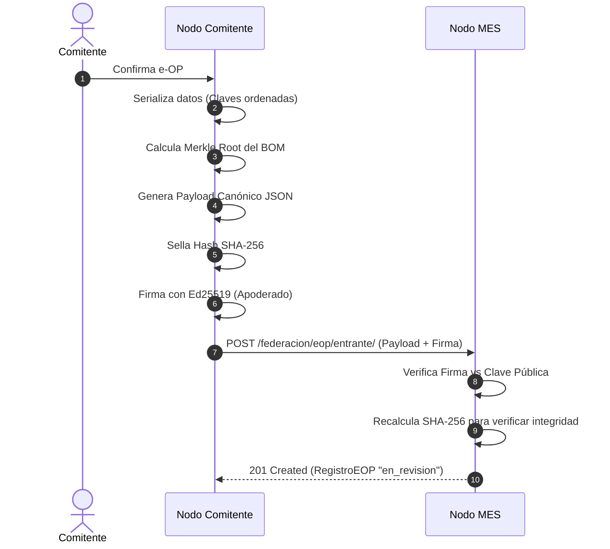
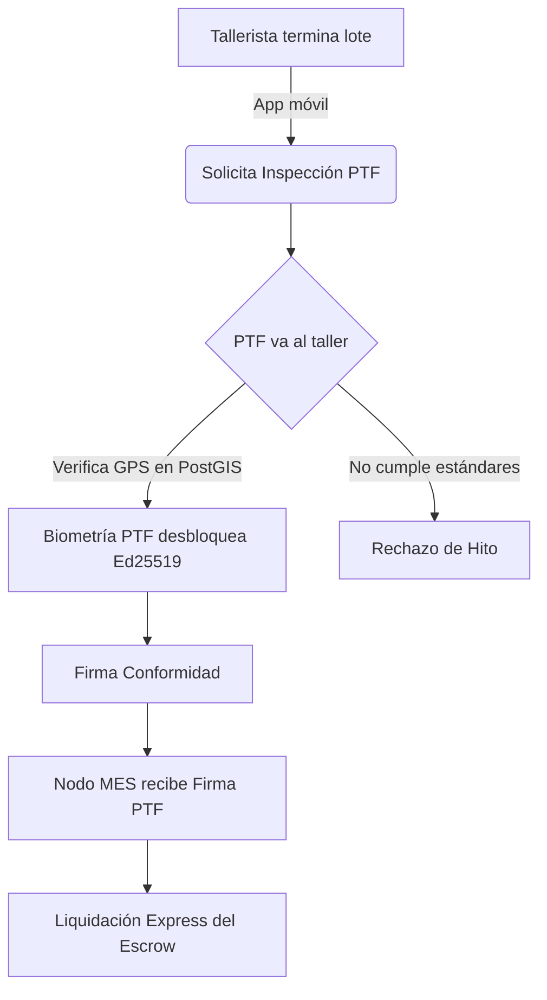
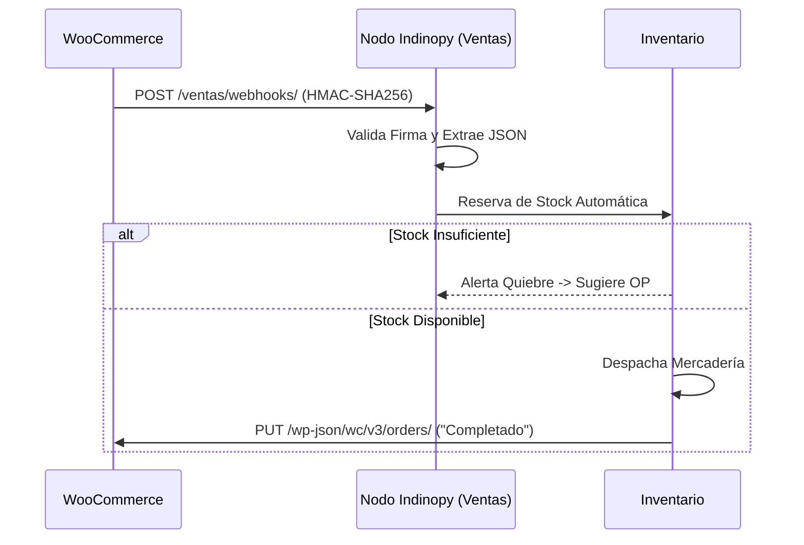
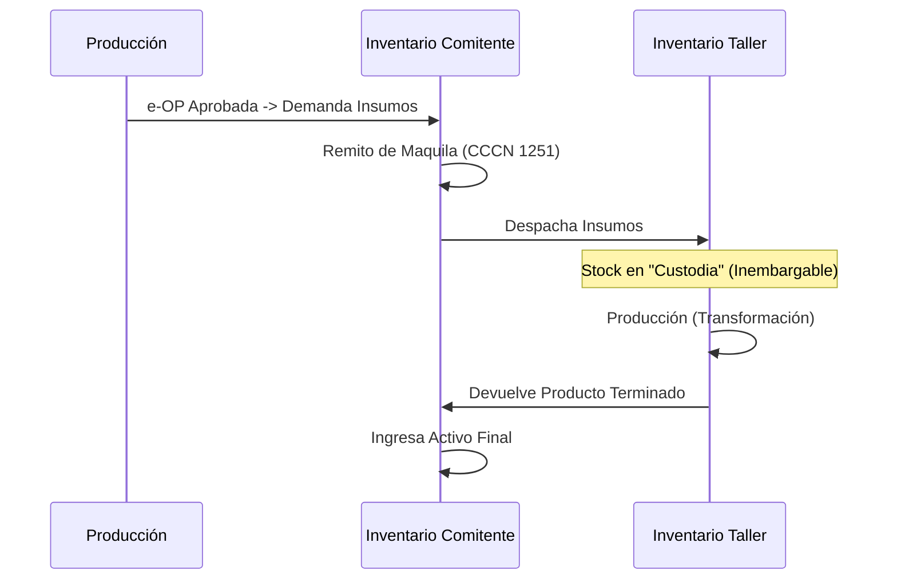

# Arquitectura Funcional — Indinopy ERP/MES

**Estado:** Documento de Especificación Consolidado

Este documento consolida la arquitectura funcional de **Indinopy**, integrando los principios operativos, la topología de red, la criptografía de confianza y los actores del sistema. Su objetivo es entender cómo las reglas del negocio industrial (Protocolo FIMCA, gobernanza MES) se traducen en componentes de software estructurados.

---

## Documentos Relacionados
- 📖 [Explicación Técnica del Proyecto](explicacion_tecnica_proyecto.html)
- 🔐 [Matriz de Roles y Permisos](roles.html)
- ⚙️ [Análisis de Implementación FIMCA](analisis_fimca_implementacion.html)
- 🏛️ [Arquitectura MES y Gobernanza](arquitectura_mes_gobernanza.html)

---

## 1. Visión Funcional: ¿Qué problema resuelve el software?

Indinopy no es solo un ERP administrativo, sino una plataforma de **gobernanza comunitaria y financiera** para la manufactura de calzado e indumentaria. Su arquitectura está diseñada para resolver tres problemas estructurales:
1. **Falta de crédito:** Transforma la Orden de Producción (e-OP) en un activo financiero (título de crédito) auditable y ejecutable.
2. **Burocracia y Extorsión:** Reemplaza la confianza institucional por **confianza matemática** (criptografía y Smart Contracts).
3. **Purgatorio Fiscal:** Conecta APIs de forma invisible para automatizar el alta tributaria (Monotributo Productivo) y retener impuestos solo al momento de la liquidación bancaria, evitando la acumulación de pasivos.

---

## 2. Mapa de Actores y Roles del Sistema

La arquitectura segrega los permisos de forma estricta según el actor que interactúa en la **Red Federada**:

### Actores Externos (Nodos en la Red)
*   **Comitente (Marca):** Nodo emisor. Diseña el producto, genera la e-OP y envía la materia prima. Tras finalizar la producción, cancela el crédito al FDI en un plazo de 30 a 60 días.
*   **Tallerista (Fasón/Maquila):** Nodo receptor. Ejecuta la producción. Firma criptográficamente el inicio (aceptación) y los fines de lote (hitos).
*   **PTF (Promotor Territorial):** Auditor físico en el terreno. Posee una App Móvil con enclave seguro. Firma validando que las condiciones laborales y productivas son éticas.
*   **MES (Mesa de Enlace Sectorial):** El Nodo Root/CA (Autoridad Certificante). Homologa tarifas, gobierna las reglas y ejecuta los *Timelocks* de 48h.
*   **Fiduciaria (FDI / Banco):** Fondo de desarrollo que **anticipa y financia** el dinero al tallerista (Hito Cero e hitos de avance) tomando la e-OP como garantía. Luego recauda el pago del Comitente a plazo.

### Gobernanza de la MES (Mesa de Enlace Sectorial)
La arquitectura institucional neutraliza la atomización del sector mediante un equilibrio de poderes en el Nodo Local estructurado en **7 sillas representativas**:
*   **Silla 1 (Talleristas de Base):** Representante del sub-padrón de Monotributo Productivo.
*   **Silla 2 (Talleres Consolidados):** Representante de unidades productivas estructuradas (SAS).
*   **Sillas 3 y 4 (Marcas Comitentes):** Representantes del capital comercial y volumen de demanda.
*   **Silla 5 (INTI):** Soberanía Técnica. Audita mermas y homologa tecnología conveniente.
*   **Silla 6 (Sindicato):** Tutela Laboral. Ejerce la auditoría ex-post en territorio.
*   **Silla 7 (Municipio):** Árbitro Jurisdiccional. Preside la Mesa y la Comisión de Crédito, ejerciendo el voto de desempate.

A nivel operativo, la MES delega la ejecución en dos comisiones con funciones incompatibles entre sí: la **Comisión de Homologación Técnica** (INTI + Sindicato) y la **Comisión de Crédito y Riesgo** (Talleres + Marcas + Municipio).

---

## 3. Primitivas Criptográficas y Seguridad Legal

El sistema no confía en un campo `estado = 'aprobado'`. Utiliza primitivas para asegurar la inmutabilidad:

1. **SHA-256 (Payload Canónico):** Toda e-OP genera un JSON determinista que se hashea. Si alguien altera un precio a posteriori, el hash cambia y la OP se invalida.
2. **Árboles de Merkle (BOM):** La receta técnica (insumos) se hashea en un Merkle Tree, permitiendo auditar mermas sin revelar secretos industriales completos.
3. **Ed25519 (Firmas Digitales):** Cada actor tiene una clave en el Secure Enclave de su dispositivo. Firman el hash de la e-OP para aprobar avances.
4. **Resguardo Legal Automático:** La arquitectura inyecta en los remitos de traslado las cláusulas de Locación de Obra (Art. 1251 CCCN) y Depósito en Custodia (Art. 1356 CCCN) (y eventualmente Maquila Industrial), blindando la **inembargabilidad de los insumos** ante quiebras.

### Generación de Payload Canónico y Recepción en el Nodo MES


*Figura 1: Secuencia criptográfica determinista. Garantiza que la e-OP sea inmutable desde su concepción. Cualquier alteración de un precio o cantidad post-firma romperá la integridad del Hash SHA-256 en la MES.*

---

## 4. Topología de Red y Despliegue (DNS Federado)

Para resolver la barrera técnica en fábricas, Indinopy opera bajo un modelo jerárquico DNS (`.ar`):

```
indinopy.ar (Protocolo / Root)
 └── {municipio}-mes.indinopy.ar (Nodo MES local / Autoridad Certificante)
      ├── {marca_a}.{municipio}... (Tenant ERP Marca A)
      └── {taller_b}.{municipio}... (Tenant ERP Taller B)
```

**Patrones de Comunicación:**
*   **SaaS Multi-tenant:** Las fábricas sin infraestructura utilizan subdominios alojados por la cámara local. Escalable y preparado para picos (Celery + Redis).
*   **On-Premise + Polling:** Para fábricas con sus propios servidores físicos detrás de firewalls. Utilizan procesos asincrónicos (Pulling/Polling vía Celery) para preguntar al nodo MES por novedades sin abrir puertos locales.
*   **API Headless (Gateway):** Empresas grandes con SAP/Tango pueden apagar los módulos internos de Indinopy y usarlo solo como un Gateway Criptográfico (`POST /api/v1/headless/e-op/`) para inyectar OPs externas y aprovechar el financiamiento FDI y los beneficios del Protocolo FIMCA.
*   **Portal de Talleristas (Fallback de Adopción):** Si un tallerista no tiene implementado el sistema o no desea operar un nodo propio, la gestión de la e-OP (aceptación, firma y reporte de avance) se realiza de forma centralizada a través de un portal web seguro alojado dentro del nodo ERP de la Marca Comitente.

---

## 5. Flujos Core de Negocio (Core Business Flows)

### A. El Sistema Dual: OP Privada vs e-OP Federada
Para no burocratizar innecesariamente a los actores que no requieren de los beneficios del FIMCA, Indinopy opera bajo un **Sistema Dual**:
1. **OP Privada (Simple):** Orden directa entre Marca y Taller. No bloquea fondos en Escrow ni pasa por la MES. Se resuelve en el ámbito privado.
2. **e-OP Federada:** Activa el ecosistema institucional (Escrow, Timelock 48h, Auditoría PTF, beneficios fiscales del Puente SAS).

### B. Ciclo de Vida de una e-OP Federada: Hito Cero y Financiamiento FDI

```mermaid
sequenceDiagram
    autonumber
    participant Marca as Nodo Marca
    participant MES as Nodo MES (Celery)
    participant Taller as Nodo Tallerista
    participant FDI as Fideicomiso (FDI)
    participant Banco as Banco (Agente Clearing)
    
    Marca->>MES: e-OP Firmada (Solicita Crédito)
    MES->>FDI: Evalúa y Aprueba Colateral (e-OP)
    
    rect rgb(50, 20, 20)
        Note right of Marca: TIMELOCK Y SILENCIO POSITIVO (Homologación)
        MES->>MES: Inicia Celery Beat (Timelock 48h)
        opt Veto de la MES (Auditoría)
            MES->>MES: Detecta anomalía/subpago
            MES->>Marca: e-OP Rechazada
        end
        Note over MES: Si pasan 48h sin veto...
        MES->>MES: Auto-aprueba e-OP (Silencio Administrativo)
    end

    MES->>Taller: PUSH Notificación e-OP Entrante
    Taller->>MES: Firma Aceptación (Alta ARCA de oficio si aplica)
    
    rect rgb(20, 50, 20)
        Note right of Marca: HITO CERO (Financiado por FDI)
        Marca->>Taller: Despacha Insumos (Remito Maquila)
        Marca->>MES: Confirma Entrega Materiales
        FDI->>Banco: Instrucción de Anticipo (30-40%)
        Banco-->>Taller: Transfiere a Cuenta Taller (Principal / Prestador)
    end
    
    rect rgb(20, 50, 50)
        Note right of Marca: HITOS DE AVANCE (Fast Track PTF)
        Taller->>MES: Finaliza Lote (Solicita Inspección)
        MES->>Taller: Despacha Promotor Territorial (PTF)
        Taller->>MES: PTF Firma Conformidad en Campo (GPS/Biometría)
        FDI->>Banco: Instrucción de Liquidación (Clearing)
        Banco-->>Taller: Transfiere Hito de Avance
    end
    
    rect rgb(20, 40, 60)
        Note right of Marca: REINTEGRO Y CANCELACIÓN (30-60 Días)
        Marca->>FDI: Pago de e-OP (Cancelación de Crédito)
        FDI->>Banco: Instrucción de Cierre de Posición
        Banco->>MES: Confirma Liquidación Final
    end
```


*Figura 2: Ciclo de financiamiento productivo. El FDI asume el riesgo crediticio tomando la e-OP como colateral y ordenando al Banco (agente de clearing) el pago del Hito Cero a la cuenta inembargable del tallerista.*

### B. Fast Track de Aprobación en Campo (El rol del PTF)

En lugar de esperar auditorías centralizadas lentas, el sistema usa **Fast Track** mediante la figura del Promotor Territorial, que actúa como **puente humano y tutor técnico** en el territorio:


*Figura 3: Auditoría PoPW (Proof of Productive Work) descentralizada. El puente humano (PTF) valida las condiciones en el taller y su firma criptográfica destraba el flujo financiero instantáneamente.*

### C. El Puente de Formalización (Integración ARCA/AFIP)
El trabajador periférico entra al sistema de forma invisible:
*   Al aceptar su primera e-OP (vía App), el sistema llama a **RENAPER (Biometría)** y a **ARCA** para darle el *Alta de Oficio* en el Monotributo Productivo.
*   En paralelo, abre una **cuenta inembargable BAPRO** de <i>Clearing</i>.
*   **Suspensión Activa:** Si el taller no recibe e-OPs por 15 días, el sistema notifica la inactividad, frenando el devengo de impuestos fijos.

### D. Trazabilidad Pública y Transparencia
Toda e-OP genera un endpoint público (`/trazabilidad/<uuid>`). Al escanear el QR del calzado en góndola, el consumidor visualiza un gráfico determinista con el desglose del costo: *% Mano de Obra, % Insumos, % Impuestos y % Marca*.

### E. Circuito de Ventas (Integración WooCommerce)
El ERP no reemplaza al e-commerce, lo integra garantizando que la demanda traccione la producción.


*Figura 4: Orquestación B2C-B2B. Los webhooks cifrados permiten que la demanda en góndola (WooCommerce) traccione y alerte automáticamente al ERP sobre la necesidad de generar nuevas e-OPs.*

### F. Circuito de Inventario (Traslados de Maquila)
La materia prima viaja al taller sin transferir su dominio comercial, protegiendo a ambas partes de embargos.


*Figura 5: Trazabilidad de activos y blindaje legal. El stock enviado al taller se rige bajo contrato de Locación de Obra/Maquila, protegiendo a los insumos físicos de cualquier medida cautelar o embargo sobre el tallerista.*

---

## 6. Arquitectura de Software Interna (Django Service Layer)

A nivel de código (MVT avanzado), el sistema protege sus transacciones forzando un **Service Layer Pattern**:
*   `views.py`: Exclusivo para ruteo HTTP, validación de permisos y serialización. Cero lógica de negocio.
*   `models.py`: Exclusivo para estructura de base de datos relacional/espacial (PostGIS) y validaciones de campo.
*   `services.py`: **Core Transaccional.** Todo cambio de estado (ej: `ProduccionService.confirmar_op()`) se envuelve en `transaction.atomic()`, dispara los cálculos de Merkle, genera el documento contable, sella el hash, emite los *Signals* y programa las tareas asincrónicas en Celery.
