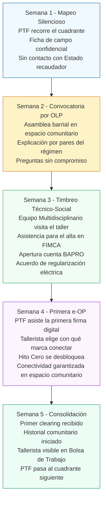

# Addenda III: Infraestructura de Base y Convocatoria del Informal Invisible

*Protocolo de Acceso a Servicios Esenciales, Conectividad Digital y Mapeo Territorial del Universo Productivo Informal*

> **Nota de uso:** Esta Addenda III responde a una brecha de implementación identificada en el proceso de presentación legislativa del Proyecto FIMCA: el dossier base y sus addendas describen con precisión cómo funciona el sistema una vez que el tallerista está dentro, pero no resuelven explícitamente el momento previo: cómo encontrarlo, cómo convocarlo y cómo garantizarle el acceso a la infraestructura mínima necesaria para operar en el régimen cuando esa infraestructura aún no existe o es precaria. Esta addenda tiene un nivel operativo territorial: está pensada como hoja de ruta para asesores legislativos, secretarías de producción municipales y equipos de Promotores Territoriales.

---

## SECCIÓN IX: De las Brechas de Base y el Protocolo de Incorporación Territorial

### Introducción: El Informal que el Sistema No Ve

El Proyecto FIMCA fue diseñado, en sus capas financieras y fiscales, sobre un supuesto implícito: que el tallerista que ingresa al régimen tiene un domicilio con suministro eléctrico legal, acceso a internet o teléfono inteligente, y alguna forma de conexión previa con el entramado productivo formal.

Ese supuesto es falso para una proporción significativa del universo que el régimen busca incorporar.

El aparador de barrio profundo del Conurbano Bonaerense puede operar con una conexión eléctrica irregular tomada del vecino, sin gas de red, con una máquina de coser que funciona cuando la tensión lo permite y con un teléfono celular prepago de entrada que no corre aplicaciones. No tiene acceso al sistema bancario, no usa internet para trabajar, y el único registro de su existencia productiva es el boca a boca entre las marcas del sector.

Ese trabajador es invisible no porque elija serlo, sino porque el sistema nunca construyó la rampa de acceso que lo hubiera incluido.

Esta Addenda diagnostica tres brechas de base y propone un protocolo integrado de intervención para resolverlas antes de que el mecanismo formal del régimen pueda activarse.

---

### A. Diagnóstico de las Tres Brechas de Base

#### Brecha 1: Infraestructura Energética Precaria o Irregular

El taller de barrio en zonas de vulnerabilidad social frecuentemente opera bajo alguna de las siguientes condiciones:

* **Conexión eléctrica clandestina ("enganche"):** el suministro se toma de la red sin medidor propio, con alto riesgo de corte, multa y exposición a accidentes eléctricos. La demanda de una máquina de aparado industrial o una desbastadora puede generar una sobrecarga que deja sin luz al taller y a los vecinos.
* **Tensión inestable:** aun con medidor propio, la infraestructura de distribución en zonas de alta densidad residencial presenta caídas de tensión frecuentes que dañan motores, generan tiempos muertos y elevan el costo de mantenimiento.
* **Sin gas de red:** el calefaccionamiento, la plancha de vapor industrial y ciertos procesos de pegado y secado de adhesivos requieren calor. Sin gas de red, el tallerista usa garrafa de 10 kg cuyo costo por BTU es hasta cuatro veces superior al del gas de red, destruyendo su margen operativo.

Un tallerista con suministro eléctrico irregular no puede registrarse en el régimen sin exponerse a una regularización que puede derivar en una deuda de retroalimentación con la distribuidora. Sin esa regularización, la plataforma digital no puede verificar el domicilio productivo real.

#### Brecha 2: Conectividad Digital Inexistente o Insuficiente

El sistema Indinopy ERP/MES y la plataforma de la MES requieren conectividad para:

* Registrar la e-OP y firmarla digitalmente.
* Declarar el parte de producción (PoPW) con geolocalización y validación biométrica RENAPER.
* Recibir notificaciones de desembolso de hitos.
* Acceder a la billetera virtual o cuenta de clearing.

Un porcentaje significativo de los talleres de base opera en barrios con cobertura 4G intermitente o inexistente, y sin acceso a WiFi domiciliario. El teléfono prepago de bajo costo puede no tener compatibilidad con las APIs de RENAPER ni con la biometría facial.

El buzón físico como canal alternativo (ya contemplado en la Addenda II, Sección VIII.F.2) resuelve la denuncia de irregularidades, pero no resuelve el registro de e-OPs ni la certificación de hitos productivos.

#### Brecha 3: El Informal Invisible — Ausencia de Mapa Productivo Territorial

Antes de que el sistema pueda llegar al tallerista, alguien tiene que saber dónde está.

Las fuentes de datos del Estado (padrón de ARCA, habilitaciones municipales, ANSES, Central de Deudores) son, por definición, ciegas al informal: quien no figura en el sistema no existe para el sistema. El sindicato tiene listas parciales. Las cámaras empresariales conocen a sus proveedores directos pero no al subcontratista de segundo nivel.

El resultado es que no existe ningún mapa productivo del universo informal del calzado, la indumentaria y el cuero en el Conurbano Bonaerense. Lanzar el régimen sin ese mapa equivale a repartir formularios de adhesión y esperar que el informal los encuentre.

---

### B. Protocolo de Intervención Integrada en el Territorio

La respuesta a las tres brechas no puede ser secuencial (primero la luz, después el internet, después el registro). Debe ser **simultánea y articulada en el territorio productivo**.

Se establece un despliegue de intervención conjunta que reúne en un mismo cuadrante, y en el mismo período de tiempo, las cuatro acciones necesarias: el mapeo, la regularización energética, la conectividad y el registro productivo.

> **Principio rector:** El tallerista no se mueve hacia el Estado. El Estado se mueve hacia el taller. Toda la arquitectura territorial está diseñada para que el trabajador no tenga que desplazarse, tramitar ni esperar. El sistema va al barrio.

---

### C. Composición y Roles de la Intervención Territorial

El despliegue territorial se articula mediante cuatro actores con roles diferenciados y coordinados:

#### 1. El Promotor Territorial de Formalización (PTF) — *El Primer Contacto*

Ya definido en la Addenda II (Sección VIII.E), el PTF es la figura central. En el marco de esta intervención, su rol se amplía con tres funciones de primera entrada:

* **Relevamiento domiciliario previo:** antes de la campaña de formalización, el PTF —asignado a cada cuadrante por el nodo comunitario de la MES local, que es quien conoce el territorio y distribuye las zonas de intervención— recorre el cuadrante con una ficha de campo simple (dirección, oficio, capacidad estimada de producción mensual, condición de suministro eléctrico, tenencia del celular y cobertura de señal). Esta ficha no tiene carácter fiscal ni tributario: es un instrumento de planificación territorial con secreto profesional absoluto.
* **Generación del Mapa Productivo Local:** el PTF carga los datos de campo en la plataforma, generando el primer mapa georeferenciado del universo productivo informal de cada cuadrante. Este mapa es de uso exclusivo de la MES local y el municipio para planificar las intervenciones de infraestructura.
* **Primer contacto y acompañamiento:** el PTF es quien explica el régimen en el idioma del taller, con la legitimidad de haber pasado por el mismo proceso.

#### 2. La Secretaría de Producción Municipal — *El Articulador Institucional*

El municipio es el actor con mayor presencia territorial real y con capacidad de convocatoria legítima sin la carga histórica del Estado recaudador. Su rol en el despliegue es:

* **Despliegue del Equipo de Asesoría Integral y Productiva Móvil:** en lugar de exigir que el tallerista vaya a una oficina pública, la Secretaría de Producción despliega esta unidad móvil multidisciplinaria en los puntos de mayor concentración de talleres identificados por el mapa del PTF.
* **Articulación con EDESUR/EDENOR y distribuidoras provinciales:** el municipio gestiona el convenio de regularización masiva de conexiones eléctricas informales con las distribuidoras. Bajo este convenio, el tallerista que ingresa al régimen FIMCA accede a la regularización de su conexión eléctrica con plan de pago de la deuda retroactiva en cuotas mensuales de monto fijo no superior al 2% de su ingreso neto promedio por e-OP, descontadas automáticamente del clearing del FDI. La distribuidora acepta porque la garantía de cobro es el propio FDI.
* **Gestión de acceso a la red de gas y subsidios de transición:** el objetivo estructural de la intervención es lograr la regularización y conexión de los talleres a la red formal de gas natural. Mientras se gestionan y ejecutan estas obras de infraestructura, el municipio articula con la Secretaría de Energía la ampliación del cupo del Programa Hogar (Decreto 470/2015) para los talleres domiciliarios adheridos a FIMCA, garantizando el insumo energético de transición.

#### 3. Las Organizaciones Libres del Pueblo (OLP) — *El Puente de Confianza*

Ya contempladas en la Addenda II (Sección VIII.C), las organizaciones barriales, sociales, religiosas y cooperativas son el componente de confianza irreemplazable. 

> *Nota conceptual:* En el marco del proyecto, se denomina OLP a las organizaciones intermedias y de base del territorio (juntas vecinales, sociedades de fomento, clubes de barrio, cooperativas y movimientos sociales). Son los actores que aportan la legitimidad y la confianza que las instituciones formales no pueden generar por sí mismas ante el sector informal.

En el despliegue territorial, su rol específico es:

* **Provisión del espacio físico:** el salón comunitario, la cooperadora escolar o el centro vecinal son los puntos de encuentro donde el tallerista va sin sentir que está entrando a una oficina del Estado.
* **Convocatoria boca a boca:** la OLP tiene el mapa social del barrio que ningún relevamiento estatal puede replicar. Saben quién cose, quién corta, quién trabaja para qué marca. Su convocatoria activa llega donde no llega ningún flyer.
* **Custodia de los buzones físicos de registro:** en zonas sin conectividad, la OLP puede actuar como punto de recepción de fichas de registro físicas que el PTF carga después en la plataforma.

#### 4. Conectividad y Servicios Básicos — *La Infraestructura Tecnológica Habilitante*

Para resolver la brecha de conectividad e infraestructura básica sin depender de planes móviles individuales, el régimen establece:

* **Responsabilidad Municipal y Financiación Provincial:** El municipio tiene el mandato de garantizar el acceso a los servicios básicos en los cuadrantes productivos. A su vez, el Estado provincial habilitará fondos específicos que se transferirán a los municipios para ejecutar las obras de infraestructura tecnológica necesarias en dichos territorios.
* **Nodos WiFi comunitarios mediante ISP locales:** A través de compromisos y acuerdos con Proveedores de Servicios de Internet (ISP) locales y regionales, se garantiza la instalación de puntos de acceso WiFi gratuitos en los espacios comunitarios, puntos de Asesoría Móvil, CIFO y sedes sindicales. Esto asegura la conectividad in situ para el registro de e-OPs y certificación de hitos.
* **Modo offline con sincronización diferida:** la plataforma Indinopy incorporará un modo de operación offline que permite declarar partes de producción sin conexión y sincroniza automáticamente cuando el dispositivo del tallerista entra en una zona de cobertura (por ejemplo, al acercarse al nodo comunitario). La firma digital del parte queda almacenada localmente con timestamp criptográfico hasta la sincronización.

#### 5. El Equipo Multidisciplinario de Timbreo Técnico-Social

La intervención no espera a que el tallerista se acerque a una carpa; va a buscarlo. Para esto se conforma un equipo de despliegue territorial integrado por los actores más idóneos para resolver los problemas en el acto:
* **El PTF (Promotor Territorial):** Como par de la industria, es quien abre la puerta, genera la empatía inicial y explica los beneficios productivos de FIMCA.
* **Trabajador/Asistente Social (Municipio/Provincia):** Evalúa el contexto socioeconómico del grupo familiar y facilita el acceso a programas complementarios (como el Programa Hogar).
* **Representante Técnico (Distribuidora Eléctrica / Matriculado Municipal):** Evalúa el riesgo físico inmediato (cables sobrecargados, riesgo de incendio) y aprueba la regularización técnica en el momento.
* **Referente Vecinal / Junta Vecinal (OLP):** Acompaña el recorrido aportando la confianza del barrio.
* **Asesor Legal (Clínicas Jurídicas y Universidades Públicas):** Abogados ad honorem de ONGs o estudiantes avanzados de derecho que abordan el miedo histórico sobre "los papeles de la casa". Resuelven consultas jurídicas simples en el momento, y ante problemas de fondo (sucesiones trabadas, falta de escritura, regularización dominial), le arman al tallerista la carpeta legal para su presentación formal, asegurando un esquema de asesoría con seguimiento.

---

### D. Secuencia Operativa: El Ciclo de Cinco Semanas

El despliegue opera en un ciclo de cinco semanas por cuadrante territorial:

> **Figura A3.1.** *Ciclo operativo de la Intervención Territorial.* La intervención no depende de una oficina fija, sino de un despliegue móvil que rota por cuadrantes. Cada ciclo de cinco semanas incorpora un nuevo grupo de talleristas al régimen, cubriendo gradualmente el universo productivo informal del municipio.

---

### E. Mecanismos de Convocatoria sin Asimetría de Poder

El mecanismo original de nominación por marca —donde la empresa genera un QR con el CUIL del trabajador informal con quien ya opera en negro— fue descartado por razones de fondo: invierte el poder de forma peligrosa. La marca sabe exactamente quién trabaja para ella clandestinamente, identifica a ese trabajador ante el sistema, y el informal queda expuesto a que ese dato circule de formas que no controla. En el peor caso, se convierte en presión encubierta: *formalizate o no te doy más trabajo*. El informal tiene sobradas razones históricas para desconfiar de ese tipo de mecanismo.

Los tres mecanismos siguientes producen el mismo resultado —conectar a la marca con el tallerista dentro del régimen— sin crear esa vulnerabilidad.

#### Mecanismo 1 — Referidos entre Pares (el más efectivo)

El tallerista ya incorporado al régimen puede generar desde la plataforma un código de invitación personal para un colega de confianza. La relación es horizontal: entre iguales del mismo oficio, con la confianza que ya existe en el barrio. El que invita tiene interés propio: por cada colega que complete su primera e-OP a través de su referido, suma puntos UCP en su score solidario (Addenda II, Sección VIII.D), lo que mejora su posición en la Bolsa de Trabajo y su acceso a crédito productivo.

El nodo comunitario de la MES activa este mecanismo enviando los primeros códigos de referido a los talleristas más antiguos del cuadrante, quienes funcionan como anclas de confianza para los que aún están afuera.

#### Mecanismo 2 — Declaración de Capacidad por la Marca sin Identificación de Personas

La marca comitente que quiere acceder al Crédito Fiscal Presunto del 25% declara en la plataforma un *compromiso de capacidad a formalizar*: indica la especialidad buscada (aparado, corte, costura), el volumen mensual estimado en pares, y el municipio o zona de operación. No nomina ningún individuo ni entrega ningún dato personal de sus proveedores informales actuales.

A partir de esa declaración, el nodo comunitario de la MES local recibe la demanda y coordina con el PTF del cuadrante la búsqueda de esa capacidad entre los talleristas relevados en el Mapa Productivo Local. El tallerista que decide adherirse elige si conectar su primera e-OP a esa marca o a otra disponible en la Bolsa. La marca no sabe quién se formalizó ni cuándo: solo recibe la e-OP firmada cuando el tallerista ya tomó la decisión por sí mismo.

#### Mecanismo 3 — Primer Cliente Garantizado por el FDI

Para el informal que no tiene ninguna relación activa con una marca del régimen, el FDI garantiza que si se formaliza tendrá al menos una e-OP activa en los primeros 30 días desde el alta, asignada automáticamente desde el pool de demanda de marcas con capacidad libre en la Bolsa de Trabajo.

Este mecanismo invierte completamente la lógica: el tallerista no va al sistema porque una marca lo trajo o lo presionó. Va porque el sistema le garantiza trabajo antes de que firme nada. El incentivo es propositivo. La decisión es autónoma.

### F. Regularización Eléctrica: Seguridad Vecinal y Pizarrón Limpio

La regularización de la energía eléctrica no se aborda como un trámite administrativo punitivo, sino como una política de seguridad comunitaria. En los barrios populares, el tallerista informal rara vez figura en los registros de la distribuidora. Suelen estar conectados de manera precaria a la red troncal o a la línea de un vecino. La verdadera víctima de esta conexión clandestina es la comunidad: caídas de tensión que queman electrodomésticos de otras familias, transformadores sobrecargados y riesgo letal de incendios.

Para resolver esto, FIMCA rechaza la idea de cobrarle al tallerista deudas retroactivas descontando de su trabajo, lo cual destruiría cualquier incentivo a formalizarse. El proceso funciona así:

| Dimensión | Cómo funciona en el territorio |
|---|---|
| **El Convencimiento Cara a Cara** | Durante el timbreo, el equipo multidisciplinario inspecciona la conexión. El trabajo del técnico y el PTF es **convencer** al tallerista de que una conexión legal con tarifa productiva es más segura para su familia, evita conflictos con los vecinos, y termina siendo más barata que reponer motores quemados por bajas de tensión. |
| **Pizarrón Limpio (Sin deuda retroactiva)** | El tallerista firma su ingreso como un cliente nuevo. La distribuidora acepta no reclamar deuda retroactiva porque transforma una pérdida permanente (el robo de energía y sus costos operativos de persecución) en un cliente formal a futuro. **El sistema no le descuenta ni un peso del trabajo al tallerista por consumos del pasado.** |
| **Pacificación y Seguridad Vecinal** | Al instalar el medidor formal tras la visita del equipo, se independiza el consumo intensivo productivo de la red precaria del barrio. Esto protege la infraestructura de los vecinos y elimina el principal foco de tensión en la cuadra. |
| **Tarifa Productiva y Mejora Interna** | Hacia el futuro, el tallerista paga su consumo mensual formalizado bajo la Tarifa Plana Industrial FIMCA. Si el equipo técnico detecta riesgo de incendio en el cableado interno del taller, el sistema puede ofrecer un micro-crédito 100% opcional exclusivamente para que compre el disyuntor o los materiales de seguridad necesarios. |

---

### G. Acceso al Gas: Regularización de Red y Transición mediante Programa Hogar

El objetivo de fondo de la intervención territorial es la **regularización de las conexiones domiciliarias y la extensión de la red de gas natural** hacia los talleres, integrándolos a la infraestructura formal urbana. Sin embargo, para no frenar la producción mientras se ejecutan obras, se establecen dos puentes transitorios basados en normativa vigente:

**Transición inmediata — Ampliación del Programa Hogar:**
No se requiere una ley nueva. Mediante una resolución de la Secretaría de Energía, se reconoce a los talleres domiciliarios adheridos a FIMCA como unidades de consumo productivo intensivo. Al cruzar el padrón FIMCA con ANSES, se les asigna automáticamente una ampliación del cupo mensual de garrafas subsidiadas bajo el Programa Hogar vigente (Decreto 470/2015), cubriendo así la demanda térmica productiva (secado, planchado, calefacción).

**Transición intermedia — Redes Comunitarias de GLP:**
En cuadrantes donde la red troncal demorará en llegar, se promueve la instalación de tanques comunitarios de Gas Licuado de Petróleo (GLP) con red interna subsidiados por el FDI y gestionados por la MES local. Esto replica modelos ya probados en el Conurbano con financiamiento del INTI, preparando la infraestructura interna del barrio para la futura conexión a la red formal.

---

### H. Hábitat Productivo: Propuesta Condicionada de Crédito para la Casa-Taller

**El problema estructural:**
En la economía informal del Conurbano, es imposible separar la infraestructura doméstica de la productiva; la casa *es* la fábrica. Una gotera en el techo de chapa no solo es un problema habitacional, es un riesgo directo que arruina las telas y los insumos de la marca. La falta de revoque o mala ventilación genera polvillo que daña los motores de las máquinas y la salud del trabajador. La falta de espacio impide sumar una cortadora nueva. Sin embargo, el sistema financiero tradicional jamás otorgaría un crédito de refacción a un trabajador informal que no tiene recibo de sueldo, planos aprobados ni escritura de la propiedad.

**Una expansión condicionada a la arquitectura macro (FDI):**
Una vez consolidados los requisitos macro del proyecto (la conformación de la MES, el fondeo del Fideicomiso de Desarrollo Industrial y la estabilización del flujo de e-OPs), la utilidad de los créditos productivos **podría expandirse** hacia una línea de adecuación del hábitat o "Mejora de Entorno Productivo". 

**Bases de viabilidad de la propuesta:**
Esta línea no requeriría crear un programa estatal nuevo ni modificar leyes bancarias, ya que se apoyaría en tres bases vigentes:
* **Base Jurídica (Ley 24.441):** El FDI operaría como un Fideicomiso de Administración, no como un banco comercial sujeto a la Ley de Entidades Financieras del BCRA. Esto le daría libertad para definir sus propios criterios de riesgo, pudiendo prestar dinero sin exigir escritura, planos aprobados o recibo de sueldo tradicional.
* **Base Financiera (Control de Flujos):** El riesgo de default sería estructuralmente nulo porque el prestamista (FDI) sería el mismo administrador que liquida los pagos de las e-OPs. La garantía del crédito sería el descuento de los flujos de trabajo futuro, reteniendo la cuota antes del depósito final al tallerista.
* **Base Conceptual (Crédito vs. Subsidio):** Tomaría el diagnóstico de programas estatales de urbanización exitosos como *Mi Pieza* (que mitigaban el hacinamiento habitacional), pero lo transformaría de un subsidio estatal a fondo perdido hacia un **crédito rotativo productivo**, financiado íntegramente por la propia cadena de valor de la industria privada.

De implementarse esta fase, sus ventajas operativas funcionarían bajo la siguiente lógica:
1. **Circuito de Ejecución Cerrada (Compre Local):** Para asegurar el destino de los fondos sin desvíos, el sistema operaría mediante pago directo al proveedor. El tallerista solicitaría un presupuesto formal en un corralón de su barrio. Previa validación visual del Equipo Móvil, este presupuesto se subiría a la plataforma para su aprobación. El FDI no depositaría efectivo al trabajador, sino que transferiría el monto exacto directamente a la cuenta bancaria (CBU/CVU) del comercio. Para mantener la consistencia fiscal, el comercio emitiría la factura a nombre del CUIT del tallerista, actuando el FDI exclusivamente como agente financiero que desembolsa el préstamo. Esto garantizaría la trazabilidad de los materiales, impediría el desvío hacia gastos no productivos y reactivaría de forma directa la economía local del municipio.
2. **Repago automático sin asfixia:** El crédito se devolvería mediante retenciones mínimas (ej. 10%) aplicadas automáticamente sobre el clearing de futuras e-OPs. Al estar atado a la producción futura, si el tallerista no tuviera trabajo un mes, la cuota se acomodaría sin generar intereses punitorios destructivos.
3. **Formalización a través de la mejora habitacional:** El incentivo para mantenerse en la formalidad ya no sería solo evitar una multa, sino la posibilidad real de techar una habitación, hacer una carpeta de cemento o mejorar el entorno familiar gracias a su trabajo registrado.

---

### I. Seguridad Dominial y Protección del Capital Familiar

**El problema: El Limbo Dominial y el Terror al Estado**
En sintonía con el déficit habitacional, gran parte de los talleres informales operan sobre terrenos o viviendas que carecen de regularización dominial (escrituras). Las familias compraron lotes con boletos de compraventa precarios décadas atrás, o habitan casas de abuelos cuyas sucesiones nunca se iniciaron por los altísimos costos de la abogacía privada. 
Esto genera dos bloqueos críticos:
1. **Capital muerto:** Una casa-taller valuada en miles de dólares no puede usarse como garantía bancaria ni venderse legalmente a precio de mercado.
2. **Pánico a la intervención:** Cuando un trabajador en estas condiciones ve acercarse al Estado (incluso para un programa productivo), su mayor temor no es una multa impositiva, sino que le exijan "los papeles del lugar" y, al no tenerlos, lo clausuren o desalojen.

**La función de la Asesoría Legal Gratuita en el Territorio**
Para desactivar este miedo y proteger el capital familiar, el Equipo de Timbreo Técnico-Social integra **Asesores Legales ad honorem** (estudiantes avanzados de Clínicas Jurídicas de universidades públicas o abogados de ONGs locales). Su función no es teórica, sino operativa:

* **Resolución y contención inmediata:** Atender en la propia mesa del tallerista las dudas urgentes y explicarle que el ingreso a FIMCA no cruza datos para desalojos, sino todo lo contrario: busca proteger su unidad productiva.
* **Armado de la Carpeta Legal:** Para problemas estructurales (sucesiones trabadas, falta de escritura, o necesidad de acogerse a la Ley Pierri de regularización dominial o al RENABAP), el asesor evalúa la documentación existente (boletos, libretas, facturas antiguas) y **arma una carpeta legal inicial**.
* **Esquema de Seguimiento:** La intervención no termina en la consulta. La Clínica Jurídica o el patrocinio gratuito municipal asumen el seguimiento del expediente, garantizando que el proceso de regularización no muera en la burocracia.

Este servicio transforma la intervención de un mero "registro productivo" a una política de protección patrimonial profunda, consolidando una confianza inquebrantable entre el trabajador de la economía popular y el régimen FIMCA.

---

### J. Gestión de Articulaciones Interinstitucionales Necesarias

Para que el protocolo territorial funcione, la ley debe habilitar las siguientes articulaciones:

| Actor | Articulación requerida | Marco normativo de base |
|---|---|---|
| **EDESUR / EDENOR** | Convenio de regularización masiva con garantía FDI | Ley 24.065 (Marco Regulatorio Eléctrico) — art. 32 (acceso al servicio) |
| **Secretaría de Energía / Distribuidoras** | Ampliación cupo Programa Hogar + Conexión a red formal | Decreto 470/2015 (Programa Hogar); Marcos regulatorios de gas |
| **ISP Locales / Provincia** | Nodos WiFi comunitarios + Fondos para infraestructura productiva | Ley 27.078 (Argentina Digital) y convenios provinciales |
| **RENAPER** | Validación biométrica offline con sincronización diferida | Decreto 262/2003 y Resolución RENAPER vigente |
| **Municipios** | Equipo de Asesoría Integral Móvil, provisión de servicios y Mapa | Convenio bilateral Nación-Municipio bajo el régimen FIMCA |
| **INTI** | Asistencia técnica en instalación eléctrica y GLP comunitario | Ley 17.138 (INTI) — art. 3 inc. d (asistencia técnica a pymes) |

---

### K. Indicadores de Éxito del Protocolo Territorial (Primer Año)

Para que el régimen pueda medir la efectividad de la incorporación territorial, se establecen los siguientes indicadores de proceso con metas mínimas verificables:

| Indicador | Meta Año 1 | Responsable de medición |
|---|---|---|
| Cuadrantes con Mapa Productivo Local generado | 100% de municipios adheridos | PTF + MES local |
| Talleristas relevados (con o sin adhesión) | 10 por PTF por trimestre | PTF |
| Regularizaciones eléctricas gestionadas | 60% de talleres en cuadrantes relevados | Secretaría de Producción |
| Accesos a red de gas o ampliación Programa Hogar | 80% de talleres sin gas regularizado | MES local / Sec. de Energía |
| Conectividad garantizada en cuadrantes | 100% de cuadrantes con punto WiFi libre | Municipio / ISP Locales |
| Primera e-OP emitida con asistencia comunitaria | Máximo 5 semanas desde primer contacto del PTF | PTF |
| Referidos entre pares activos | Al menos 1 código de referido emitido por cada 3 talleristas incorporados | MES local / Plataforma Indinopy |

---

### L. Por Qué Formalizarse: Los Beneficios en el Idioma del Taller

La comunicación sobre formalización históricamente fracasó cuando empezó por las obligaciones (pagar impuestos, emitir factura, cumplir con ARCA) en lugar de los beneficios concretos e inmediatos. Esta sección enumera los argumentos que realmente mueven la aguja en una conversación cara a cara entre el PTF y el tallerista informal. Las exenciones impositivas están al final: son importantes, pero no son el primer argumento para alguien que nunca pagó impuestos.

---

#### "Hoy cobrás si la marca quiere. Con FIMCA, el sistema garantiza que cobrás."

El tallerista que entrega un lote y espera 45 días para cobrar no tiene ningún recurso legal si la marca le dice que espere más, que no tiene plata, o que devuelva el lote con defectos que nadie cuestionó al momento de la entrega. Ninguno. Con el régimen, el FDI desembolsó el 70% antes de que el lote esté terminado. Si la marca no paga su deuda al FDI, el FDI ya liquidó. **El riesgo de incobrabilidad deja de recaer sobre el trabajador.**

#### "Hoy ponés el capital vos. Con FIMCA, el capital lo pone el sistema antes de que empieces."

El Hito Cero es un adelanto del 30%-40% del valor del lote que se libera una vez firmada la e-OP bilateral, antes de que el trabajador corte la primera pieza. Esa plata es para comprar los materiales que la marca no provee, para pagar adelantos a los ayudantes, para pagar la luz del mes. Es capital de trabajo que hoy no existe para el informal y que ningún banco le va a dar.

#### "Hoy conseguís trabajo por el boca a boca. Con FIMCA, cualquier marca del país puede encontrarte."

La Bolsa de Trabajo Sectorial publica el perfil del tallerista —especialidad, capacidad mensual en pares, historial de cumplimiento, ubicación— visible para todas las marcas adheridas al régimen en todo el país. Una marca de Mendoza buscando aparadores de calidad puede encontrar al tallerista de Lanús directamente, sin que ningún intermediario tenga que hacer el contacto. El negocio deja de depender de una sola relación y de la buena voluntad de un solo comitente.

#### "Luz legal sin pagar deudas viejas, para que no se te quemen más las máquinas."

Hoy vivís con el miedo de que una baja de tensión te queme un motor o de que un cortocircuito prenda fuego la tela o la casa. Con FIMCA, la distribuidora te instala un medidor legal con tarifa productiva subsidiada. Entrás con "pizarrón limpio": el Estado no te va a descontar ni un peso por la luz que consumiste en negro en el pasado. Cuidás a tu familia y dejás de tener problemas con los vecinos por la tensión del barrio.

#### "Crédito para arreglar tu techo, porque tu casa es tu taller."

Si llueve y se arruina la tela, la marca no te paga y perdés vos. Con el sistema, tu historial de trabajo (los Hitos que vas completando) sirve como garantía para pedir un micro-crédito de "Mejora de Entorno Productivo". El fideicomiso le paga directo al corralón de tu barrio para que puedas arreglar la gotera, revocar la pared o ampliar la pieza. Lo devolvés de a poco, descontando un porcentaje mínimo de tus futuros trabajos, sin los intereses usureros de las financieras del barrio.

#### "Te ayudamos a ordenar los papeles de tu casa gratis, para que nadie te la pueda sacar."

Sabemos que el taller está en un terreno que quizás compraste con un boleto hace años o que era de tus abuelos y nunca pudiste pagar la sucesión. FIMCA te trae abogados ad honorem que te arman la carpeta legal gratis. Te asesoran y siguen tu trámite para que puedas tener tu certificado de vivienda o avanzar hacia tu escritura. El Estado no viene a pedirte los papeles para clausurarte, viene a ayudarte a proteger lo que es tuyo.

#### "Hoy si tu máquina se rompe, problema tuyo. Con FIMCA, hay crédito."

La línea de crédito productivo del FDI no funciona como un préstamo bancario tradicional: no evalúa ingresos declarados ni pide garantías hipotecarias. Evalúa el clearing de e-OPs completadas. Quien lleva tres meses en el régimen y tiene e-OPs pagadas tiene colateral real: el FDI presta contra ese historial.

Para un Monotributo Productivo categoría A —el escalón de entrada, con techo de facturación muy bajo— el crédito del primer trimestre equivale al clearing trimestral completo (factor 1×). Eso puede no alcanzar para una máquina nueva de primer nivel, pero sí alcanza para:

* Regularizar la instalación eléctrica del taller (tablero, disyuntores, tomas industriales).
* Reparar o repotenciar una máquina existente.
* Comprar insumos por volumen para la próxima orden.

A medida que el historial crece, el crédito crece con él: a los cuatro meses, el factor sube a 2×; al año, a 3×. Un tallerista con doce meses de clearing estable puede calificar para una máquina industrial de segunda mano de buen nivel. El repago es automático: el FDI descuenta el 10%-15% de cada hito hasta cubrir el capital, sin que el trabajador tenga que gestionar nada.

> **Nota sobre la categoría A:** el techo del Monotributo Productivo categoría A aplica a la *declaración fiscal*, no al límite del crédito del FDI. Si el clearing mensual supera consistentemente el umbral de categoría A, el sistema activa la recategorización automática con período de gracia de seis meses (Addenda I, Sección IV bis), sin cortar el crédito en curso.

#### "Hoy si la marca se funde, el juzgado puede aparecer en tu taller. Con FIMCA, tus materiales son intocables."

La Cláusula de Inembargabilidad Territorial (Glosario, Sección 9) establece que los materiales, insumos y productos en proceso que se encuentran en el taller bajo una e-OP activa son intocables ante cualquier proceso de ejecución o quiebra de la marca comitente. El informal que trabajó toda su vida con el miedo a quedar pegado a las deudas de terceros tiene aquí una protección concreta y ejecutable.

#### "Hoy no existís para el sistema. Con FIMCA, empezás a tener historial."

No tener historial crediticio es una trampa de la que es casi imposible salir: sin historial no hay crédito, sin crédito no hay crecimiento, sin crecimiento siempre informal. El score solidario del régimen es un historial que el trabajador construye y que le pertenece, independientemente de qué marca contrate con él. Es portable, acumulable y abre puertas progresivamente: a más crédito, a mejores clientes, a maquinaria, a los CIFO para capacitarse.

#### "Hoy si te lastimás trabajando, no existís para ningún seguro. Con FIMCA, tenés cobertura."

El alta en el Monotributo Productivo activa aportes previsionales mínimos que generan obra social y cómputo de años para jubilación. Para alguien de 45 años que lleva veinte cosiendo en negro, eso puede ser la diferencia entre llegar a los 65 con algo o llegar sin nada.

#### Las exenciones (para cerrar la conversación, no para abrirla)

Una vez establecidos los beneficios concretos, las exenciones son la confirmación de que el régimen tiene consistencia fiscal:

* Exención de Ingresos Brutos sobre todas las transacciones respaldadas por e-OP activa (en provincias adheridas).
* Cómputo limpio del IVA para la marca comitente.
* Crédito Fiscal Presunto del 25% para la marca, que incentiva que ésta busque talleristas formalizados.
* Período de gracia de seis meses para recategorización de Monotributo sin pérdida de beneficios.
* La cláusula de no retroactividad: el régimen no persigue el pasado. Quien se incorpora tiene pizarrón limpio.

---

El Proyecto FIMCA construyó una autopista sofisticada: contratos inteligentes, fideicomiso de segundo piso, escrow digital, prueba de trabajo productivo, cierre fiscal automatizado con ARCA. Pero una autopista sin rampa de acceso sirve únicamente a quienes ya están sobre el asfalto.

La Addenda III construye esa rampa.

No es un mecanismo de asistencia social ni un plan de subsidios permanentes: es una intervención de infraestructura de base, de duración acotada, orientada a garantizar que el régimen FIMCA pueda cumplir su promesa central: que cualquier trabajador del sector, independientemente de su punto de partida, pueda incorporarse al sistema productivo formal en un plazo de cinco semanas desde el primer contacto con el PTF.

Una vez que el tallerista tiene luz legal, señal de datos, y su primera e-OP activa, el mecanismo diseñado en el dossier base y sus addendas anteriores toma el control. La Addenda III es, por tanto, la capa cero del sistema: la que hace posible todo lo demás.
