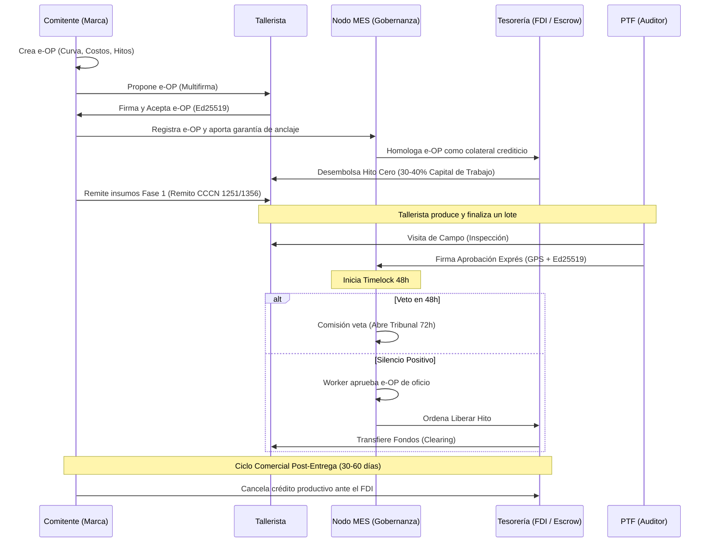
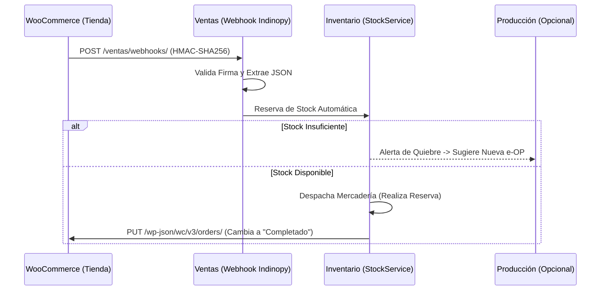
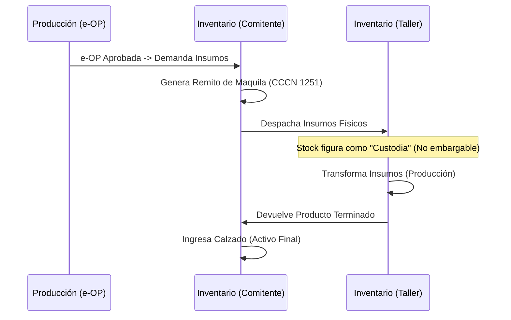

# Flujos Documentales en Indinopy ERP/MES

Este documento detalla la estructura administrativa, los módulos operativos y los flujos documentales del ecosistema **Indinopy**, basándose en el protocolo del **Canvas Industrial FIMCA 2026**. Se enfoca en la formalización productiva, la criptografía federada y la gobernanza territorial.

## 1. Módulos Operativos (Nodos del Ecosistema)

*   **Ventas (`apps.ventas`):** Integración multitienda vía WooCommerce (Webhooks + API REST). Gestiona pedidos B2C/B2B y el feedback loop de despachos.
*   **Producción (`apps.produccion`):** Controla el ciclo de vida de la **e-OP (Orden de Producción Electrónica)**, las recetas técnicas (Merkle BOM) y el tracking de hitos físicos (PoPW).
*   **Inventario (`apps.inventario`):** Gestión de stock por partida doble. Administra los traslados bajo régimen de Maquila, disociando la propiedad (Comitente) de la custodia (Tallerista).
*   **Tesorería (`apps.tesoreria`):** Motor del **Escrow Digital**. Administra la partición factorial de fondos (FDI) y la liberación de hitos contra validación en campo.
*   **Gobernanza (`apps.mes`):** Módulo de la Mesa de Enlace Sectorial. Controla el registro canónico de e-OPs, los Timelocks (48h), la identidad de los PTFs y el Tribunal de Arbitraje.

## 2. Documentos Centrales del Protocolo

El eje del sistema abandona el esquema tradicional para adoptar instrumentos legales-criptográficos:

*   **e-OP (Orden de Producción Electrónica):** No es un simple papel de trabajo; es un **Título de Crédito** inmutable (SHA-256) firmado digitalmente por las partes (Ed25519). Activa automáticamente contratos de Escrow y traslados de inventario.
*   **Certificado Digital PTF:** Credencial JSON firmada por la MES que acredita la identidad y zona de cobertura GPS de un Promotor Territorial de Formalización, verificable offline.
*   **Remito de Maquila (Arts. 1251/1356 CCCN):** Documento que formaliza el traslado de insumos al taller, estableciendo su estricta **inembargabilidad**.
*   **Factura Electrónica AFIP:** Comprobante fiscal (FacturadorAFIP) generado automáticamente con el clearing del FDI (Cuenta de IVA diferida).

### Modalidades Operativas de Producción: OP de Gestión Interna vs e-OP Federada
Para diferenciar la coordinación fabril de planta del circuito de fomento fiduciario, Indinopy opera bajo dos modalidades:
1. **OP de Gestión Interna (Modo Fabril Directo):** Hoja de ruta técnica y operativa entre la oficina de producción y la línea de corte/aparado/armado. No requiere bloqueo de fondos en Escrow, no pasa por la Comisión de la MES ni requiere fiscalización de auditores (PTF), operando como directiva interna de fabricación de derecho privado. En el plano contable (`DocumentoDeuda`), puede generar comprobantes de control interno provisorios (Clase "X" conforme a RG AFIP 1415) para reflejar el devengado operativo de fábrica antes de la facturación electrónica definitiva.
2. **e-OP Federada (Protocolo FIMCA):** Se activa marcando la opción `es_eop_federada = True`. Engancha automáticamente el ecosistema institucional: colateral en el FDI, custodia en Escrow, Timelock de 48h con silencio positivo, auditoría PoPW por el PTF y beneficios fiscales del régimen promocional con facturación electrónica AFIP vinculada al clearing.

---

## 3. Esquemas y Flujos Documentales

### A. Circuito de Producción y Gobernanza (El Ciclo de la e-OP)

**Descripción:**
El Comitente no financia a 90 días ni el Tallerista trabaja "a ciegas". La e-OP colateraliza la producción y la MES garantiza el cobro mediante el Silencio Administrativo Positivo.

### B. Circuito de Ventas (Integración WooCommerce)

**Descripción:**
El ERP no reemplaza a las plataformas de e-commerce de las marcas, sino que las integra bidireccionalmente garantizando que la demanda traccione la producción.

### C. Circuito de Inventario (Traslados de Maquila)

**Descripción:**
La materia prima (ej. cuero) viaja al taller sin transferir su dominio comercial, protegiendo a ambas partes de embargos o juicios de terceros.

---

## 4. Conclusiones Arquitectónicas para Indinopy

1. **Separación de Responsabilidades (Service Layer):** La complejidad transaccional (ej. liberar el Escrow mientras se actualiza el estado de la e-OP) reside estrictamente en los *Services* (`ProduccionService`, `EscrowService`), nunca en las Signals o Vistas.
2. **Topología Federada (`NODE_ROLE`):** El mismo código fuente (repositorio) se comporta distinto según el `.env`. Si el nodo es `COMITENTE`, expone ventas e inventario. Si es `MES`, expone el Tribunal y desactiva WooCommerce.
3. **Erradicación de Documentos Informales:** Quedan obsoletos los conceptos de "subfacturación" o comprobantes no válidos. El IVA diferido y el puente SAS permiten que el 100% de la cadena transaccione en blanco desde la primera e-OP.
