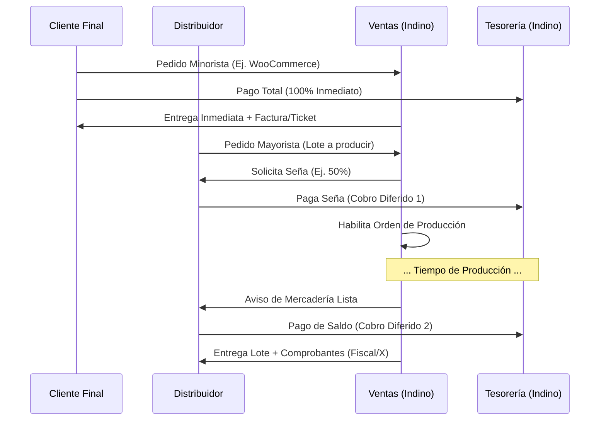
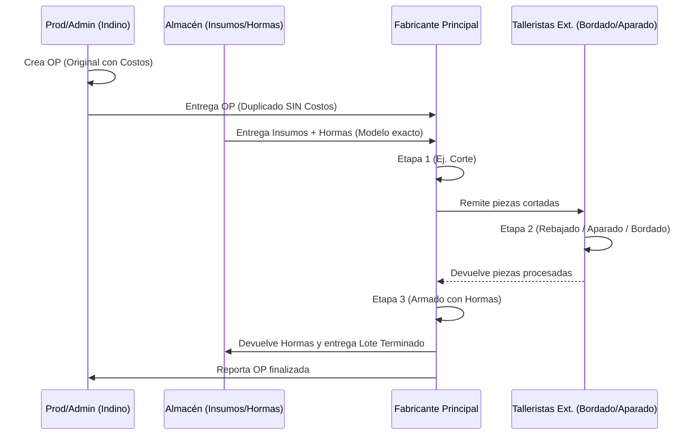
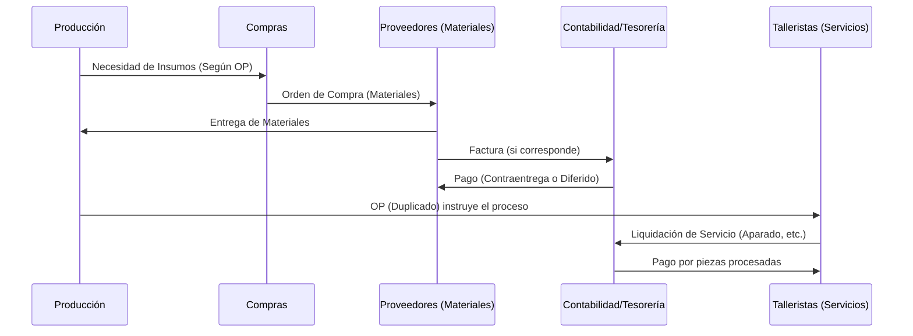

# Teoría Administrativa y Flujos Documentales en "Indino"

Este documento detalla la estructura administrativa, los módulos operativos y los flujos documentales de la empresa **Indino**, basándose en la teoría administrativa y contable argentina, adaptada a una realidad omnicanal, dual (formal/informal) y con una fuerte impronta de producción manufacturera (ej. calzado/marroquinería/indumentaria) a través de talleres propios y externos.

## 1. Departamentos (Módulos de la App "Indino")

*   **Módulo de Ventas (Comercial):** Gestiona pedidos multicanal. Aplica políticas de precios y pagos distintas según el tipo de cliente (Final vs. Distribuidor).
*   **Módulo de Compras (Abastecimiento):** Gestiona la adquisición de insumos basándose en los presupuestos de las Órdenes de Producción.
*   **Módulo de Producción (Manufactura):** Controla el ciclo de vida del Lote, las herramientas (hormas), y el tracking por múltiples etapas y talleristas externos (aparado, rebajado, etc.).
*   **Módulo de Almacén/Depósito (Stock):** Controla inventarios de insumos, herramientas, semielaborados y productos terminados.
*   **Módulo de Tesorería y Contabilidad:** Manejo de cajas (oficiales/extraoficiales), cobros diferidos a distribuidores y pagos de servicios a talleristas.

## 2. Documentos Comerciales y Operativos (Enfoque Industrial)

El eje central del sistema recae en los documentos que combinan la necesidad financiera con la técnica:

*   **Orden de Producción (OP):** Es el documento rector de la fabricación del Lote. **Se confecciona por duplicado**:
    *   **Original (Para Administración):** Documento clasificado. Contiene el presupuesto desglosado por insumo y los costos detallados de cada proceso (costo de corte, costo de aparado, etc.).
    *   **Duplicado (Para el Fabricante/Taller):** Viaja con la mercadería. Omite cualquier dato de costos (información clasificada). Detalla estrictamente: cantidad de piezas a confeccionar, variaciones (curva de talles/colores), herramientas exactas a utilizar (número de modelo de hormas) y el tracking de etapas (qué procesos externos debe cumplir, ej. bordado, aparado, rebajado).
*   **Comprobantes Fiscales y No Fiscales:** Factura (AFIP), Remito (R), Comprobante X (interno/subfacturación), Remito de Traslado (para mover piezas entre talleristas).

---

## 3. Esquemas y Flujos Documentales por Etapa

### A. Circuito de Ventas y Cobros (Diferenciado por Tipo de Cliente)

**Descripción de la etapa:**
La política financiera de Indino varía diametralmente si se vende al por menor o al por mayor.
*   **Cliente Final:** Paga el último precio de lista completo, al momento de la compra, en un solo pago (sin diferido).
*   **Distribuidor:** Entra en un esquema de cobro diferido. Se exige una Seña para dar inicio al lote/pedido, y el saldo restante se cobra contraentrega.

### B. Circuito de Producción (Etapas, Herramientas y Talleristas Externos)

**Descripción de la etapa:**
La fabricación implica el paso del lote por múltiples "manos". Un fabricante central puede apoyarse en talleristas individuales.

**Flujo paso a paso:**
1.  **Emisión de la OP:** Producción genera la Orden de Producción (OP). Archiva el Original (con costos) y envía el Duplicado (ciego de costos) a planta o al Fabricante principal.
2.  **Provisión:** Almacén entrega los insumos (cuero, pegamento, suelas) y las herramientas precisas (Hormas modelo N° X) según lo dictado por la OP.
3.  **Tracking de Etapas Externas:** El fabricante realiza procesos y deriva piezas a talleristas satélites (Rebajador, Aparador, Bordador) acompañadas de Remitos internos.
4.  **Cierre:** El fabricante ensambla todo, devuelve las hormas a Almacén, e ingresa el Producto Terminado.
5.  **Liquidación:** Cada tallerista cobra únicamente por su servicio brindado en la etapa específica.

### C. Circuito de Compras (Basado en OP) y Pagos

**Descripción de la etapa:**
Las compras no se hacen a ciegas; responden al presupuesto desglosado de las Órdenes de Producción o al punto de pedido del Almacén.

**Flujo paso a paso:**
1.  Al analizar las OP pendientes, **Compras** determina el requerimiento exacto de insumos.
2.  Se emite una **Orden de Compra** a los proveedores.
3.  Ingresa la mercadería (con Factura o en "Negro" sin comprobante válido). Almacén controla cantidades; Contabilidad cruza con los costos presupuestados en la OP original.
4.  **Pagos a Proveedores y Talleristas:** 
    *   Talleristas: Tesorería liquida los servicios según el tracking de la OP (cuántos pares aparó, cuánto cobró por par).
    *   Proveedores de materiales: Se paga según plazo (Contraentrega, Diferido, Cuenta Corriente).

## 4. Conclusiones Arquitectónicas para la App "Indino"

1.  **Doble Vista de la Orden de Producción (OP):** El sistema debe contar con robustos permisos de usuario (ACL). Un usuario "Taller" o "Fabricante" que inicie sesión para ver su OP (duplicado digital) o escanear un QR, **jamás** debe tener acceso al endpoint de la API que expone el presupuesto y los costos de los insumos (exclusivo para Administración/Dueños).
2.  **Tracking Granular por Etapas:** La entidad `OP` en la base de datos debe tener relaciones uno-a-muchos con un modelo de `Etapas` o `Tracking` (ej. Corte, Rebajado, Aparado, Bordado, Armado). Cada etapa debe poder registrar qué Tallerista la completó para luego automatizar la liquidación de sus pagos.
3.  **Gestión de Herramientas (Hormas):** El inventario no solo descuenta materiales fungibles (cuero, suelas). Debe manejar un concepto de "Préstamo o Asignación temporal de Activos" para las Hormas. Cuando una OP está en proceso, la Horma Modelo "X" pasa a estado *En Uso*, bloqueando su disponibilidad para otros lotes hasta que finalice el armado.
4.  **Bifurcación del Flujo de Venta:** El carrito o módulo de creación de pedidos debe verificar el rol del usuario: si es `Rol: Distribuidor`, dispara la lógica de "Esperando Seña"; si es `Rol: Final`, exige el pago vía pasarela/caja del 100% para generar la orden.
