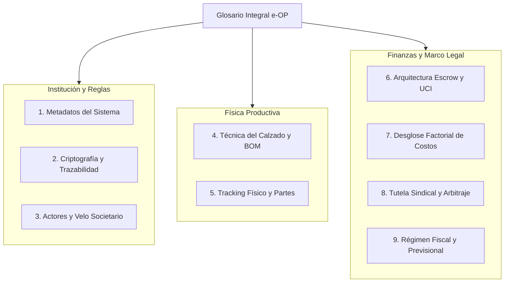

📖 Glosario
# Glosario Integral de Conceptos: Mockup e-OP y Gobernanza Industrial
### *Guía Taxonómica de Términos Legales, Criptográficos, Técnicos, Financieros y de Trinchera*

**Sistema de Gestión Indinopy ERP/MES · Mesa de Enlace Sectorial (MES Federal / Nodo Conurbano)**

---

Este glosario documenta y define en profundidad cada uno de los conceptos, siglas, fórmulas, procedimientos e instituciones presentes en el título de crédito industrial de ejemplo (**`mockup_orden_produccion.html`**) y en la arquitectura de gobernanza de la **Orden de Producción Electrónica (e-OP)**.

---

## 1. Identificación del Sistema y Metadatos Institucionales

### **Indinopy ERP/MES**
Plataforma de software libre (bajo licencia abierta) diseñada específicamente para la planificación de recursos empresariales (**ERP - Enterprise Resource Planning**) y la ejecución de manufactura en planta (**MES - Manufacturing Execution System**) en cadenas de valor de calzado, confección y marroquinería. **No es una empresa fabricante ni una marca comercial**, sino la infraestructura técnica digital que procesa las órdenes, audita los stocks por partida doble y gestiona la interacción con la Mesa de Enlace Sectorial.

### **Orden de Producción Electrónica (e-OP)**
Primitiva digital que transforma la orden de fabricación tradicional en un **título de afectación productiva, colateral crediticio fiduciario e instrumento de pago en custodia (*Escrow*)**. No es un simple comprobante interno; al ser convalidada por la MES, adquiere fuerza ejecutiva crediticia ante el Fondo Fiduciario (FDI) y valor probatorio de gasto computable ante las autoridades fiscales.

### **Mesa de Enlace Sectorial (MES Federal y Local)**
Órgano colegiado de gobernanza policéntrica paritaria integrado por 7 sillas representativas de la cadena: (1) Cámaras de Marcas Comitentes; (2) Cámaras de Fabricantes Integrados; (3) Talleres Consolidados (SAS/Cooperativas); (4) Talleres Individuales (Monotributo Productivo); (5) Estado Municipal/Provincial (Árbitro de Crédito); (6) Sindicato de Rama (UTICRA/SETIA); y (7) Organismo Tecnológico Neutral (INTI). Articula a nivel macro (**MES Federal**) y en la trinchera operativa (**MES Municipal / Nodos Regionales**).

### **Fideicomiso de Desarrollo Industrial (FDI)**
Fondo fiduciario de segundo piso administrado con la participación del **Banco de la Provincia de Buenos Aires (BAPRO)** y cajas de crédito cooperativo. Desintermedia el crédito bancario comercial operando con un ratio de apalancamiento prudencial ($K=3$), financiando el capital de trabajo de los talleres contra el colateral de las e-OPs activas.

### **Contrato Timelock (Bloqueo Temporal de 48 Horas)**
Algoritmo de control temporal programado en el sistema informático. Establece una ventana máxima e improrrogable de **48 horas hábiles** desde la carga de una e-OP para que la Comisión de Crédito de la MES emita un dictamen fundado de objeción técnica. Si la comisión no se pronuncia en ese lapso, el sistema desbloquea automáticamente el anticipo.

### **Silencio Administrativo Positivo**
Principio rector de ingeniería procesal: ante la inacción u omisión burocrática del cuerpo colegiado dentro del plazo perentorio de 48 horas, **el sistema informático da por aprobada la orden de pleno derecho por vía de silencio positivo**. Impide que disputas partidarias o desidia administrativa congelen el trabajo del tallerista.

---

## 2. Primitivas Criptográficas y de Trazabilidad Inmutable

### **UUID (Universally Unique Identifier)**
Identificador universal único pseudoaleatorio de 128 bits (ej. `e8b7c934-8fa4-4e1a-ad35-c02cd6ac65d1`). Garantiza la unicidad matemática global de cada e-OP emitida en el sistema, vinculando en una sola clave todas las transacciones físicas, remitos, movimientos de inventario y transferencias bancarias asociadas.

### **Merkle Root BOM ($\mathcal{M}_{BOM}$)**
Raíz criptográfica de un **Árbol de Merkle** generado a partir de las hojas que contienen cada insumo, consumo unitario y tolerancia de merma de la receta técnica. Permite verificar matemáticamente que la lista de materiales no fue adulterada a posteriori sin necesidad de exponer en público la totalidad de la fórmula industrial protegida de la marca.

### **Claves Criptográficas Ed25519**
Esquema de firma digital de curvas elípticas de última generación (EdDSA). Ofrece alta velocidad de cálculo y resistencia contra ataques de canal lateral, utilizado para firmar digitalmente las autorizaciones de la marca comitente, del tallerista y del árbitro institucional de la MES.

### **Esquema Multifirma 2 de 3 (Multisig 2-of-3)**
Mecanismo de seguridad transaccional donde los fondos bloqueados en Escrow solo pueden liberarse si confluyen al menos dos firmas criptográficas autorizadas: (a) Marca Comitente; (b) Tallerista Ejecutor; (c) Árbitro de la MES. Evita que cualquiera de las partes bloquee unilateralmente el dinero de manera abusiva.

### **Sello QR de Trazabilidad Socioproductiva**
Código bidimensional impreso en la etiqueta de packaging de cada par de calzado. Al ser escaneado por el consumidor final en góndola o comercio electrónico, redirige a una URL pública (`https://indino.ar/t/{UUID}`) que desglosa de manera transparente la descomposición factorial de costos: mano de obra territorial, materias primas nacionales, carga impositiva neta y margen comercial.

---

## 3. Actores de Gobernanza y Velo Societario

### **Marca Comitente**
Empresa que encarga la producción, aporta el diseño, provee las materias primas bajo régimen de custodia, comercializa el producto terminado e integra el fondeo de la mano de obra en la bóveda de Escrow del FDI.

### **Beneficiario Final Real (UBO - Ultimate Beneficial Owner)**
Persona física titular, socio gerente o director real de la marca comitente, identificado fehacientemente mediante su DNI y constatación biométrica ante RENAPER. 
* **Doctrina contra Quiebras Fraudulentas:** Si la marca quiebra una razón social ("Calzados Fantasma S.R.L.") dejando pasivos salariales, la penalización (*Slashing*) y la pérdida de score no quedan en la persona jurídica vaciada, sino que **se heredan en el DNI del titular real**, exigiéndole 100% de fianza líquida si intenta operar con una nueva sociedad.

### **Tallerista Ejecutor / Unidad Productiva Territorial**
Microempresa, taller familiar o consorcio barrial (cortadores, aparadores, armadores) que aporta la capacidad de trabajo físico y la maquinaria de trinchera. Opera adherido a la Bolsa de Trabajo bajo la figura de Monotributo Productivo o Sociedad por Acciones Simplificada (SAS).

### **Promotor Territorial de Formalización (PTF)**
Trabajador de base del oficio con antigüedad mínima comprobable de 12 meses y aval de 5 talleres vecinos, designado por la MES local y rentado con honorario de 2 Salarios Mínimos, Vitales y Móviles financiados por el FDI. Actúa como **agente fiduciario de proximidad**: inspecciona talleres, constata avances de lote, ayuda a cargar partes por WhatsApp y da fe ante la MES para la liberación de los hitos del Escrow digital.

### **Score Solidario de la Bolsa de Trabajo**
Algoritmo de reputación cooperativa que reemplaza al *scoring* bancario tradicional. Califica a marcas y talleres sobre una escala de 0 a 100 puntos en base a variables reales: índice de cumplimiento de plazos, calidad de entrega, bajo nivel de desperdicio de cuero y cumplimiento de pisos salariales.

---

## 4. Técnica del Calzado, BOM y Mermas

### **BOM (Bill of Materials / Lista de Materiales)**
Receta técnica formal y exhaustiva que detalla todos los insumos necesarios para fabricar una unidad de producto (un par de calzado): superficie de cuero, metros de cordura, pares de suelas, kilogramos de adhesivo, pares de punteras y avíos.

### **Curva de Talles**
Matriz de distribución cuantitativa de pares que compone un lote de producción, desglosada por número de calzado (en Argentina, habitualmente del talle 38 al 45 para calzado masculino de trabajo). Responde a la distribución de tallas antropométrica del mercado consumidor.

### **Horma Normalizada (ej. INTI-CALZ-H34)**
Matriz física de madera o polietileno de alta densidad que reproduce la anatomía del pie humano y determina el volumen interno, ancho, calce y silueta estética del calzado. El código `INTI-CALZ` indica que la horma fue auditada por los centros tecnológicos estatales para garantizar estándares ortopédicos y ergonómicos de trabajo.

### **Sello Buen Diseño (SBD)**
Distinción oficial otorgada por la Secretaría de Industria de la Nación a productos que destacan por su innovación, agregación de valor local y calidad de materiales. En el protocolo e-OP, contar con certificación SBD autoriza al taller y a la marca a solicitar un **anticipo preferencial de arranque (Hito Cero) de hasta el 40% o 50%**.

### **Merma Técnica Aprobada por el INTI**
Porcentaje de desperdicio admisible e inevitable que se produce durante el proceso de corte de materiales heterogéneos (como el cuero vacuno, cuyas formas irregulares y cicatrices impiden un aprovechamiento del 100%). La homologación de mermas por el INTI (ej. 8% en cuero flor, 5% en forro textil) impide que la marca comitente acuse arbitrariamente al tallerista de robo de material ante el descarte natural de la chapa de cuero.

### **Cuero Vacuno Box Flor Hidrofugado**
Cuero curtido al cromo de espesor 1.8 a 2.0 mm obtenido de la capa exterior del animal (la "flor"), tratado con aceites hidrófugos durante el proceso de recurtido para repeler la penetración del agua sin perder transpirabilidad.

### **Cordura Rip-Stop 1000D**
Tejido técnico de poliamida de alta tenacidad con hilado de 1000 deniers y trama antidesgarro en cuadrícula (*Rip-Stop*). Utilizado en laterales y cañas del calzado táctico para alivianar peso manteniendo resistencia a la abrasión.

### **Puntera Normalizada IRAM 3610**
Casquillo protector anatómico colocado en la puntera del borcego, ensayado bajo la Norma IRAM 3610 para resistir una energía de impacto de 200 Joules y una carga de compresión de 15 kN sin aplastamiento de los dedos del operario.

### **Adhesivo Poliuretánico sin Tolueno + Halogenante**
Pegamento de base poliéster-poliuretano libre de toluol (solvente aromático altamente nocivo para las vías respiratorias del zapatero). Requiere la aplicación previa de un líquido halogenante sobre la suela de caucho para modificar químicamente la polaridad superficial y garantizar una adherencia indeleble tras reactivación térmica.

---

## 5. Tracking Físico y Partes de Producción

### **Parte de Producción Físico (`OPParteProduccion` - PART-N°)**
Comprobante operativo digital y en papel mediante el cual el tallerista declara la culminación de un tramo del trabajo, especificando: pares conformes de primera calidad, pares de segunda y porcentaje de scrap resultante. Es el disparador probatorio que gatilla la auditoría del PTF.

### **Liquidación Desacoplada por Etapa**
Principio arquitectónico del sistema donde cada etapa productiva es tratada como un nodo financiero independiente. Si el taller de corte completó su trabajo, **su pago se liquida de inmediato**; no queda congelado si el taller de aparado posterior sufre demoras operativas.

### **Etapa 1: Corte y Rebajado**
Operación donde se trazan y cortan las piezas de cuero y forro según la moldería, procediendo luego al rebajado (desbaste perimetral del espesor del cuero con cuchilla circular) para que las uniones cosidas no queden toscas ni lastimen el pie.

### **Etapa 2: Aparado y Costura**
Proceso artesanal y de máquina mediante el cual las piezas planas de cuero y cordura son ensambladas, cementadas y cosidas con pespuntes simples, dobles y atraques reforzados, conformando la estructura tridimensional superior del calzado (la "capellada").

### **Etapa 3: Armado, Centrado y Montaje**
Operación pesada en la cual la capellada aparada se monta sobre la horma plástica, se coloca el contrafuerte y la puntera de acero, se estira el cuero mediante pinzas de montar, y se une la suela de caucho con cemento reactivado en prensa neumática vulcanizadora.

### **Etapa 4: Acabado, Emplantillado, Lustre y Empaque**
Etapa final de deshormado, colocación de plantillas de confort en goma EVA, limpieza de hilachas y restos de adhesivo, lustre protector del cuero, colocación de cordones y estibado en cajas individuales de cartón con etiqueta QR.

---

## 6. Arquitectura Financiera, Escrow Digital y Moneda

### **Escrow Digital Atomizado**
Dispositivo fiduciario programable en el sistema informático. Los fondos correspondientes a la retribución de la mano de obra son depositados por la marca comitente en una subcuenta fiduciaria cerrada del FDI en el momento en que se emite la orden. La marca **pierde la libre disponibilidad del dinero**, el cual se va liberando automáticamente hacia la cuenta del tallerista conforme se verifican los hitos pactados.

### **Hito Cero (Anticipo de Arranque Territorial)**
Primer desembolso financiero liberado a favor del tallerista (habitualmente entre el **35% y el 40%**, o hasta el **50% con Sello Buen Diseño**). Se acredita inmediatamente tras la convalidación de la orden por la MES (o al cumplirse las 48 horas de silencio positivo). Su fin es fondear el capital de trabajo inicial: compra de hilos, agujas, solventes, energía eléctrica y adelantos salariales para el sustento diario de los costureros.

### **Hitos de Avance (Hito 1 y 2)**
Desembolsos intermedios que se liberan de forma escalonada contra la constatación física de entrega de etapas parciales (ej. 20% al finalizar el corte de los 500 pares, 25% al entregar el aparado cosido).

### **Hito Final (Saldo de Cierre de Lote)**
Último tramo del pago (habitualmente el **15% al 20%**) retenido en Escrow hasta la recepción definitiva del lote terminado en depósito y el control de calidad final. Permanece protegido durante una ventana de 48 horas para la eventual interposición de la tutela sindical ex-post.

### **UCI (Unidad de Cuenta Industrial)**
Unidad de indexación fiduciaria del sistema (1 UCI $\approx$ valor canasta base de mano de obra manufacturera). Todo contrato de e-OP pacta su valor en UCIs, las cuales se liquidan en pesos al momento efectivo de cobro según la variación del **Índice de Precios Internos al Por Mayor (IPIM Manufacturero INDEC)**:
$$\mathcal{P}_{\text{ARS}}(t) = \mathcal{P}_{\text{UCI}} \times \left( \frac{\text{IPIM}(t)}{\text{IPIM}_0} \right)$$
Protege al tallerista del descalce inflacionario entre el día que presupuestó el lote y el día que lo terminó de coser.

### **Micro-canon de Red MES (Take-rate del 1.0%)**
Alícuota fija descontada automáticamente del clearing de cada e-OP liquidada exitosamente. Se divide en: sostenimiento de los honorarios mensuales de los Promotores Territoriales (PTF), equipamiento de centros tecnológicos CIFO y mantenimiento de los servidores del sistema Indinopy. Garantiza el autofinanciamiento del régimen sin depender de subsidios del Estado.

### **Fondo de Riesgo y Contingencias del FDI (0.5%)**
Fondo fiduciario de reserva colectiva alimentado con una alícuota de medio punto sobre las órdenes. Se utiliza para absorber pérdidas fortuitas por rotura de maquinaria pesada, incendios o siniestros en talleres vulnerables, evitando que una contingencia individual hunda a la microempresa o paralice la cadena.

---

## 7. Matriz Factorial de Costos Ítem por Ítem

### **Costo Industrial Fabril**
Costo técnico directo consolidado de fabricación en planta, compuesto por la suma matemática de:
$$\text{Costo Industrial} = \text{Insumos BOM} + \text{Mano de Obra Neta} + \text{Cargas Previsionales} + \text{Canon MES} + \text{Impuestos Directos}$$

### **Mano de Obra Directa Territorial**
Suma de los valores percibidos por los diferentes talleres y operarios especializados que intervinieron en la transformación física del calzado (corte, rebajado, aparado, armado y empaque). Representa el valor agregado del trabajo vivo en el distrito.

### **Margen Comercial y Distribución de la Marca**
Diferencia bruta entre el Costo Industrial Fabril y el Precio de Venta al Público (sin IVA). Retribuye los costos de desarrollo de moldería, diseño, marketing comercial, logística federal, estructura administrativa y rentabilidad del comitente.

### **P.V.P. Sugerido (Precio de Venta al Público con IVA)**
Precio final proyectado para la venta del calzado en el mostrador del comercio minorista o plataforma de e-commerce, incluyendo el Impuesto al Valor Agregado del 21% aplicable al consumidor final.

---

## 8. Tutela Laboral, Veto Ex-Post y Arbitraje

### **Veto Ex-Post Sindical**
Potestad de policía de trabajo ejercida por el sindicato con personería gremial (UTICRA o SETIA). A diferencia del modelo burocrático tradicional, el gremio **no frena el inicio de la orden con sellos preventivos**, sino que audita la realidad física en el taller durante la confección o al momento de la entrega.

### **Alerta de Escrow**
Gatillo informático activado por el sindicato si detecta precios de mano de obra por debajo del piso de convenio colectivo o condiciones insalubres de explotación. Produce el **bloqueo preventivo automático del Hito Final (15%) en el FDI por un plazo máximo de 48 horas hábiles**, sin suspender el trabajo de las máquinas ni privar al tallerista del cobro de lo ya realizado.

### **Fianza Líquida de Continuidad Operativa**
Mecanismo de resguardo que impide que la mercadería quede secuestrada y la marca pierda la temporada comercial. La empresa comitente puede depositar en garantía el **100% del monto salarial en litigio en la cuenta del FDI**; una vez acreditada la fianza, retira los bultos para su venta mientras el diferendo continúa sustanciándose por la vía arbitral.

### **Tribunal de Arbitraje de Trinchera**
Tribunal arbitral perentorio constituido en la MES local, integrado por: (a) El perito técnico neutral del INTI (que ejerce la presidencia); (b) Dos vocales sorteados de la Bolsa de Trabajo (un tallerista y una marca ajenos al litigio). Dicta laudo inapelable en un plazo duro de **72 horas hábiles**, ordenando la readecuación retroactiva de tarifas o desestimando la queja.

### **Mecanismo de Slashing (Penalización Algorítmica)**
Castigo informático automático ante faltas graves o reincidencia en prácticas predatorias:
* **Para Marcas Defectoras:** Quita inmediata de Unidades de Crédito Productivo (UCP), pérdida del beneficio de arancel cero y, a la tercera condena firme, **exclusión total del FIMCA**.
* **Para Talleres Defectores:** Retención del 30% en liquidaciones de e-OPs futuras para resarcir cuero dañado y degradación de la insignia en la Bolsa de Trabajo.

---

## 9. Régimen Impositivo, Fiscal y Previsional

### **Locación de Obra vs. Compraventa**
Diferenciación legal de fondo regulada por el Código Civil y Comercial de la Nación (Art. 1251):
* En la **compraventa**, el taller compraría cuero y vendería zapatos, quedando atrapado en el débito de IVA y presunciones de Ganancias de un comerciante.
* En la **locación de obra con insumos provistos**, el tallerista vende únicamente un *servicio de transformación de trabajo humano*. No adquiere la propiedad del cuero ni vende el calzado terminado, tributando solo sobre su honorario de confección.

### **Cláusula de Inembargabilidad Territorial de Insumos**
Blindaje legal explícito conforme a los artículos 1251 y 1356 del CCCN. Las materias primas y semielaborados en taller constituyen **activos intangibles de afectación productiva territorial**. No forman parte del patrimonio ejecutable del tallerista ni pueden ser embargados por deudas comerciales o bancarias de la marca comitente.

### **Monotributo Productivo con Micro-retención en Clearing (1.5%)**
Régimen tributario simplificado adaptado a la economía popular manufacturera:
* Se elimina la cuota fija mensual mensualizada que acumulaba deudas en épocas de parálisis o caída de ventas.
* El impuesto se recauda mediante una **micro-retención del 1.5% aplicada automáticamente en la cuenta bancaria de clearing** en el instante exacto en que el tallerista cobra cada hito.

### **Suspensión Activa de Oficio**
Garantía que ampara al Monotributista Productivo: si el taller pasa meses sin emitir partes ni registrar e-OPs activas, el sistema de ARCA/MES **suspende de oficio el devengamiento de cargas, multas, intereses o bajas de oficio**. El taller puede reactivarse en cualquier momento sin pagar deudas acumuladas.

### **Deducción al 100% en Impuesto a las Ganancias**
Impacto decisivo para la marca comitente: la e-OP certificada por la MES opera como comprobante fiscal habilitante que le permite a la PyME comitente formal **deducir el 100% del gasto de confección pagado a los talleres tercerizados**. Termina con la perversión de tributar Ganancias sobre "utilidades ficticias" causadas por la falta de facturación formal de los talleres clandestinos.

### **Subvención del 100% de Contribuciones Patronales (FDI Previsional)**
Mecanismo de choque para la formalización del empleo asalariado en talleres de base: el FDI financia el **100% de los aportes patronales (27% del salario bruto) de los primeros dos trabajadores regularizados por taller durante un período de 24 meses**, eliminando el costo previsional de arranque para la incorporación de mano de obra joven o no registrada.

### **Pacto Fiscal Productivo y Exención de Tasas Locales**
Acuerdo institucional suscripto entre la Nación, la Provincia de Buenos Aires (ARBA) y los Municipios del Conurbano: los talleres y fábricas adheridos gozan de **exención total por 10 años de la Tasa de Seguridad e Higiene municipal y alícuota cero en Ingresos Brutos** sobre la porción de mano de obra de confección, compensado a los municipios con transferencias directas de infraestructura industrial.

---

## 10. Tabla Rápida de Siglas y Acrónimos

| Sigla | Significado Completo | Ámbito de Aplicación |
| :--- | :--- | :--- |
| **BAPRO** | Banco de la Provincia de Buenos Aires | Entidad fiduciaria y agente de clearing bancario |
| **BOM** | *Bill of Materials* (Lista / Receta de Materiales) | Especificación técnica de ingeniería fabril |
| **CCCN** | Código Civil y Comercial de la Nación (Ley 26.994) | Marco legal contractual (Arts. 1251 y 1356) |
| **CCT** | Convenio Colectivo de Trabajo de Rama | Normativa salarial paritaria de base (UTICRA/SETIA) |
| **CIFO** | Centro de Integración y Formación de Oficios | Banco comunitario de maquinaria pesada y capacitación |
| **Ed25519** | Edwards-curve Digital Signature Algorithm | Criptografía asimétrica de firma digital rápida |
| **e-OP** | Orden de Producción Electrónica | Primitiva digital y título de crédito fiduciario |
| **ERP** | *Enterprise Resource Planning* | Módulo de compras, tesorería y contabilidad |
| **FDI** | Fideicomiso de Desarrollo Industrial | Bóveda fiduciaria de segundo piso y liquidez |
| **INTI** | Instituto Nacional de Tecnología Industrial | Organismo técnico neutral, certificador de mermas y normas |
| **IPIM** | Índice de Precios Internos al Por Mayor (INDEC) | Referencia de indexación de la Unidad de Cuenta Industrial |
| **MES** | Mesa de Enlace Sectorial (Federal / Local) | Órgano paritario de gobierno de la cadena (7 sillas) |
| **MES** | *Manufacturing Execution System* (en Indinopy) | Sistema de tracking de planta y partes de producción |
| **PTF** | Promotor Territorial de Formalización | Representante territorial par y veedor del Escrow |
| **RIGI** | Régimen de Incentivo a las Grandes Inversiones | Marco de contraste que fundamenta el régimen PyME |
| **SAS** | Sociedad por Acciones Simplificada | Figura societaria ágil para talleres de hasta 30 operarios |
| **SBD** | Sello Buen Diseño | Distinción oficial que premia la calidad e innovación local |
| **UBO** | *Ultimate Beneficial Owner* (Beneficiario Final) | DNI de la persona física detrás de la persona jurídica |
| **UCI** | Unidad de Cuenta Industrial | Moneda de indexación fiduciaria de la mano de obra |
| **UCP** | Unidad de Crédito Productivo | Score y puntaje de prioridad aduanera para comitentes |
| **UTICRA** | Unión Trabajadores de la Industria del Calzado | Gremio de rama con tutela territorial (Silla 6 MES) |
| **UUID** | *Universally Unique Identifier* | Identificador universal único de la e-OP |
