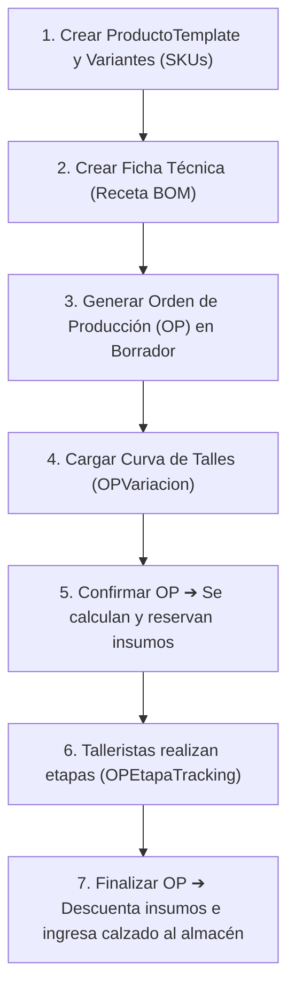

# Guía Rápida Operativa (Manual de Usuario y Operaciones)
## Paso a Paso del Flujo Industrial en Indinopy ERP

> 🧭 **Navegación**: [Índice General](../README.md) ➔ [Glosario](../glosario.md) ➔ **Guía Rápida Operativa** ➔ [Recopilación del Sistema](../recopilacion_sistema.md)

Esta guía describe cómo opera el sistema desde la creación de un artículo hasta la entrega del producto terminado.

---

## Flujo General del Sistema

---

## 1. Cómo crear un Producto y sus Variantes

1. **Crear la Plantilla (`ProductoTemplate`)**:
   - Ingresar a *Inventario ➔ Productos*.
   - Definir el nombre base: ej. `Zapato Oxford Clásico`.
   - Asignar la `UnidadMedida` (ej: *Pares*).
   - Indicar si es `almacenable` y definir el precio y costo de referencia.
2. **Generar los Atributos**:
   - En la sección de variantes, seleccionar los atributos:
     - **Talle:** `39`, `40`, `41`, `42`.
     - **Color:** `Negro`, `Marrón`.
3. **Guardar los SKUs (`Producto`)**:
   - El sistema crea los artículos físicos individuales (ej: `Zapato Oxford - Negro - 40`).

---

## 2. Cómo armar la Ficha Técnica (`Receta`)

La receta le enseña al ERP cómo se fabrica el modelo:

1. **Crear la Receta**:
   - Asignarla al `ProductoTemplate` (ej: *Zapato Oxford Clásico*).
   - Asignar nombre de versión: ej. *Colección Otoño-Invierno*.
2. **Cargar los Insumos (`RecetaInsumo`)**:
   - *Insumos generales:* 
     - Seleccionar `Pegamento de Contacto` ➔ Cantidad: `0.05 litros` ➔ Dejar `variantes_destino` vacío (aplica a todos).
     - Seleccionar `Etiqueta de Marca` ➔ Cantidad: `1 unidad` ➔ Dejar `variantes_destino` vacío.
   - *Insumos condicionados por color:*
     - Seleccionar `Cuero Vacuno Flor Negro (SKU)` ➔ Cantidad: `0.28 m²` ➔ En `variantes_destino` elegir: `[Color: Negro]`.
     - Seleccionar `Cuero Vacuno Flor Marrón (SKU)` ➔ Cantidad: `0.28 m²` ➔ En `variantes_destino` elegir: `[Color: Marrón]`.
3. **Cargar la Hoja de Ruta (`RecetaEtapa`)**:
   - Orden 1: `Corte de Cuero` (Instrucciones: *Cortar siguiendo la fibra*).
   - Orden 2: `Aparado` (Instrucciones: *Costura reforzada al tono*).
   - Orden 3: `Armado y Ensuelado`.

---

## 3. Cómo lanzar una Orden de Producción (`OP`)

1. **Crear la OP en estado Borrador**:
   - Seleccionar la `Receta` base.
   - Indicar la `cantidad_total` a fabricar (ej: `100 pares`).
   - Indicar si la producción es `interna` o a `fason`.
   - Si es bajo encargo de un mayorista, vincular el `cliente` (`Contacto`).
2. **Cargar la Curva de Talles (`OPVariacion`)**:
   - Indicar cuántos pares de cada SKU se van a producir:
     - 20 pares de *Zapato Oxford Negro 39*
     - 30 pares de *Zapato Oxford Negro 40*
     - 50 pares de *Zapato Oxford Marrón 41*
3. **Confirmar la Orden (`estado = 'confirmado'`)**:
   - **¡Magia automática del sistema!** 
     - El sistema calcula cuánta tela/cuero negro y marrón se necesita exactamente según la curva.
     - Genera un `MovimientoStock` de reserva (`RES-OP-XXX`).
     - Descuenta esa cantidad del stock disponible en `StockQuant` (queda en `cantidad_reservada`).

---

## 4. Seguimiento de Fabricación y Talleristas (`Tracking`)

1. **Asignación de Talleristas**:
   - En la pestaña de Etapas, asignar a cada proceso el `tallerista_real` correspondiente (`Contacto`).
2. **Cambio de Estado y Bitácora**:
   - Cuando el tallerista comienza: pasar a `en_curso`.
   - Si hay una demora: pasar a `pausada` y cargar la observación (*"Falta hilo"*).
   - Cada cambio queda registrado automáticamente en `OPEtapaLog` con usuario, fecha y hora.
3. **Finalización de la Etapa**:
   - Pasar a `finalizada` e indicar el `costo_servicio_total` para la posterior liquidación en Tesorería.

---

## 5. Finalización e Ingreso al Almacén

1. **Completar la OP**:
   - Cuando todos los procesos terminan y el calzado pasa el control de calidad, el responsable cambia el estado de la OP a **`finalizado`**.
2. **Impacto automático en Inventario**:
   - Las reservas de insumos pasan a `realizado` (descuentan físicamente el cuero y pegamento del almacén).
   - Se crea automáticamente un remito de ingreso (`ING-OP-XXX`) que suma los 100 pares terminados al stock físico del almacén.
   - Los pares quedan disponibles de inmediato para su venta minorista o despacho mayorista.
