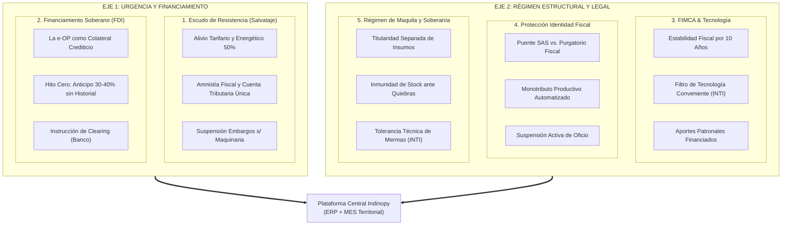
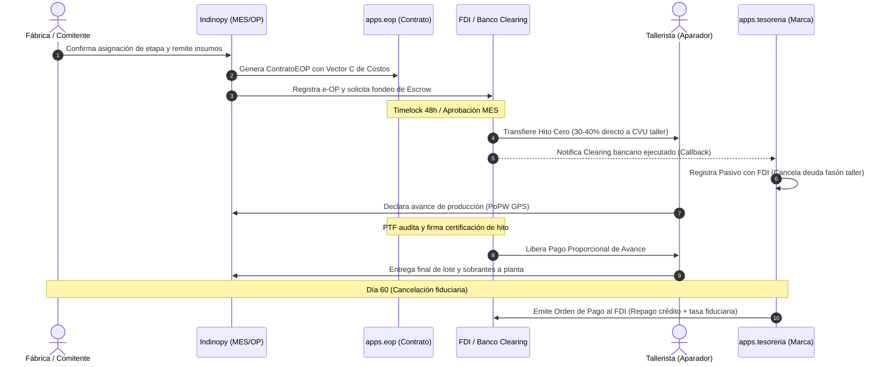
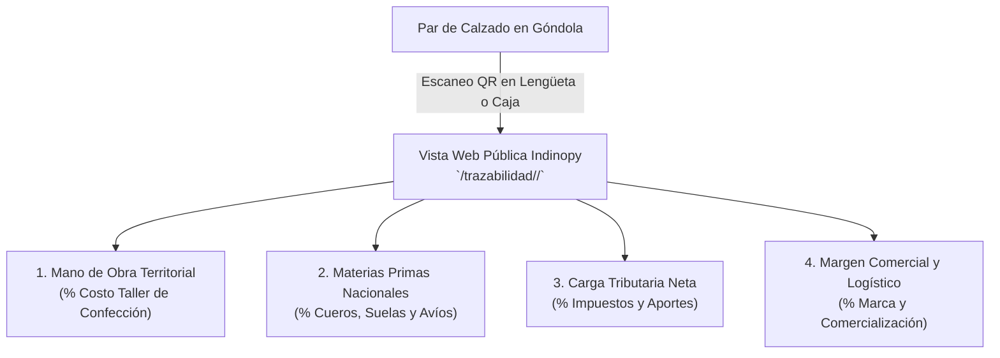

<span class="doc-header-badge">⚙️ Especificación Técnica</span>
# Análisis del Dossier Proyecto FIMCA e Integración Arquitectónica en Indinopy

> **Referencia base:** [Dossier Proyecto FIMCA](dossier_proyecto_fimca_2026.html)  
> **Sistema destino:** **Indinopy** — ERP & MES Industrial para Manufactura de Calzado, Cuero e Indumentaria  
> **Fecha:** Septiembre de 2026  
> **Estado:** Especificación Técnica y Plan de Integración Arquitectónica  

---

## ¿De qué estamos hablando? (Resumen Ejecutivo de Contexto)

1. **El Problema Real:** En Argentina, la manufactura de calzado e indumentaria opera con un alto grado de tercerización en talleres periféricos familiares (aparadores, costureros, armadores a destajo). Históricamente, estos talleres viven en la informalidad o en el "purgatorio fiscal" (cobran en efectivo o usan CUITs prestados de familiares para no ahogarse en impuestos y ejecuciones bancarias). Al no haber facturas, la empresa formal (Indino) no puede deducir sus costos reales de mano de obra en Ganancias ni computar el crédito fiscal de IVA, tributando sobre utilidades ficticias.
2. **El Documento Fuente (`Dossier Proyecto FIMCA`):** Es el Proyecto de Formalización e Incentivo a la Manufactura del Calzado Argentino (FIMCA), el cual extiende el proyecto existente de Ley de Salvataje Nacional, adaptándolo para micro y pequeñas fábricas (hasta 30 operarios). Plantea que en lugar de ahogar al taller con inspecciones o dejarlo a merced de la usura bancaria tradicional, se cree un **ecosistema de soberanía productiva**:
3. **Mesa de Enlace Sectorial (MES):** Órgano tripartito (Estado/INTI, Sindicatos, Cámaras, Talleristas) que gobierna la cadena.
4. **Fideicomiso de Desarrollo Industrial (FDI):** Fondo de ahorro comunitario que reemplaza a los bancos comerciales.
5. **La Orden de Producción como Título de Crédito (e-OP):** El banco o billetera no pide balances pasados al tallerista; financia el trabajo en curso tomando la OP registrada como garantía real de producción.
6. **Hito Cero & Financiamiento FDI:** La orden de producción física (`OrdenProduccion` en `apps.produccion`) se desacopla del contrato de crédito fiduciario (`ContratoEOP` en `apps.eop`). En la e-OP Federada, el FDI aprueba el financiamiento y el Banco (agente de clearing) transfiere el Hito Cero (30-40%) de forma automática al entregar los insumos. Los pagos posteriores se liberan contra la certificación de hitos físicos cumplidos por el PTF (`EOPHitoEscrow` y `ComprobanteTesoreria`).
7. **Régimen de Maquila y Façón (Propuesta de Reforma Ley 25.113 vs. CCCN Actual):** Actualmente en Argentina la **Ley 25.113 rige con exclusividad para el sector agroindustrial** (productores agropecuarios entregando materia prima con pago en especie y no sujeción tributaria). En el sector del calzado y la indumentaria rige la figura del **façón** (servicio de confección remunerado en dinero), la cual carece de ley propia y se apoya en la *Locación de Obra* (Arts. 1251 y ss. del CCCN) y *Depósito* (Arts. 1356 y ss. CCCN), lo que genera vulnerabilidad laboral (Art. 30 LCT) y riesgo de embargo sobre los insumos ante problemas del tallerista. El Proyecto FIMCA propone **reformar la Ley 25.113 para extender la figura a la "Maquila Industrial"**. Indinopy blinda documentalmente la propiedad inembargable de los insumos bajo el CCCN actual en sus remitos de traslado (`TRA-...`) y deja la arquitectura preparada para la eventual ampliación de la Ley 25.113.
8. **Monotributo Productivo Automatizado:** Alta simplificada con la primera e-OP, retención de 1-2% por cobro efectivo, y "Suspensión Activa de Oficio" (carga fiscal cero pesos si no hay órdenes activas, sin acumular deudas cíclicas).
9. **Sello QR de Trazabilidad Socioproductiva:** Código escaneable en el calzado para que el consumidor final vea el desglose ético real: cuánto va al tallerista, cuánto a materiales, cuánto a impuestos y cuánto a la marca.
10. **El Rol de Indinopy:** Indinopy es el ERP/MES de calzado de este repositorio. Cuenta con inventario por partida doble física (`apps.inventario`), fichas técnicas dinámicas BOM (`apps.produccion`), seguimiento de etapas a fasón (`OPEtapaTracking`), desacople del título de crédito fiduciario en `apps.eop`, contabilidad por partida doble con motor tributario (`apps.contabilidad`) y tesorería con órdenes de pago por hitos (`apps.tesoreria`). Este documento detalla la correspondencia arquitectónica e integración del Dossier en el software.

---

## 1. Introducción y Encuadre Doctrinario-Técnico

El **Proyecto de Formalización e Incentivo a la Manufactura del Calzado Argentino (FIMCA)** —como extensión del proyecto de **Ley de Salvataje Nacional**— sintetiza la realidad de un entramado productivo bajo severo estrés macroeconómico. Frente a la apertura importadora, la caída del consumo interno y la asfixia por costos fijos y presión fiscal, el documento propone una salida basada en la **Comunidad Organizada**: articular al Estado, los sindicatos, las marcas comitentes, los diseñadores y los talleristas periféricos bajo una gobernanza común (la **Mesa de Enlace Sectorial - MES**) y un fondo financiero desintermediado (el **Fideicomiso de Desarrollo Industrial - FDI**).

**Indinopy** no es un ERP administrativo abstracto; fue concebido para resolver la operación real, física y heterogénea de las fábricas de calzado en Argentina. Su motor de inventario por partida doble, su desglose de fichas técnicas dinámicas (BOM) y su módulo de tracking de etapas a fasón lo posicionan como la **plataforma tecnológica natural** para digitalizar, transparentar e implementar los principios del FIMCA.

El presente documento analiza cada eje del Dossier y define las especificaciones de ingeniería de software requeridas para transformar las directivas de política industrial en **modelos de datos, servicios, validaciones y flujos operativos concretos** dentro de Indinopy.

---

## 2. Los 5 Pilares del Dossier: Diagnóstico e Impacto en Sistemas



### 2.1. El Nudo de la Informalidad y el "Purgatorio Fiscal"

- **Diagnóstico:** El aparador o costurero cobra en efectivo porque el salto al régimen general o las cuotas fijas de monotributo devengan deudas impositivas incluso en períodos de parálisis fabril. Al no facturar, la pyme o diseñador formal pierde la deducción de mano de obra en el Impuesto a las Ganancias (30% a 50% del costo) y no puede computar crédito fiscal de IVA, tributando sobre utilidades ficticias.
- **Respuesta en el Sistema:** Indinopy debe admitir la convivencia entre proveedores formales y en proceso de regularización, calcular la **Brecha Fiscal de Costos** y preparar las estructuras para el Crédito Fiscal Presunto (25% sobre la e-OP) previsto en el proyecto de ley (Addenda II).

### 2.2. La Orden de Producción como Activo Financiero y Colateral

- **Diagnóstico:** Los bancos comerciales rechazan a los talleristas por falta de balances o garantías propietarias. La solución del FDI es tomar la **Orden de Producción (e-OP)** como colateral ejecutable por flujo.
- **Respuesta en el Sistema:** La OP de Indinopy debe transicionar de una entidad interna a un **instrumento legal y financiero interoperable**, con hash criptográfico, hitos de avance verificables y liquidación desacoplada en custodia (*Escrow*).

### 2.3. Contrato de Maquila e Inembargabilidad de Activos (Situación Legal y Estrategia)

- **El Marco Legal Vigente (Ley 25.113 - Ámbito Agropecuario):**
  - La **Ley 25.113 de Maquila rige actualmente de forma exclusiva para insumos y productos agroindustriales** (caña de azúcar, vitivinicultura, leche, granos, carne, etc.). Su estructura está diseñada para que un productor agropecuario entregue materia prima y cobre en especie (con una parte del producto elaborado), estableciendo por ley que el productor mantiene la propiedad en todo momento, que el traspaso no constituye hecho imponible y que el stock no puede ser embargado ante quiebra del industrial.
- **El Vacío Legal en la Manufactura (Calzado e Indumentaria - El "Façón"):**
  - La tercerización de etapas fabriles en calzado (corte, rebajado, aparado, armado) se conoce operativamente como **façón**, pero **carece de una ley específica propia**.
  - En la práctica jurídica argentina actual, se encuadra genéricamente en el Código Civil y Comercial de la Nación (CCCN) como **Locación de Obra con provisión de materiales por el comitente (Arts. 1251 y 1262 inc. b CCCN)** y **Depósito Regular en Custodia (Arts. 1356 y ss. CCCN)**.
  - A diferencia de la maquila agropecuaria, el façón se remunera en dinero (tarifa por par/servicio) y está plenamente gravado por IVA e Ingresos Brutos. Esto expone a las empresas a dos contingencias críticas:
    1. *Solidaridad Laboral (Art. 30 LCT):* Riesgo de que la justicia laboral presuma relación de dependencia o fraude laboral si el tallerista es informal.
    2. *Embargos Judiciales sobre Materia Prima:* Si el tallerista es embargado por deudas particulares o fiscales, los oficiales de justicia suelen secuestrar el cuero, suelas y cortes hallados en el taller bajo la presunción de que pertenecen a quien tiene la tenencia física.
- **La Propuesta del Proyecto FIMCA:**
  - Plantea la **reforma de la Ley 25.113** para extender su alcance a la manufactura no agropecuaria ("Maquila Industrial"), otorgándole rango de ley a la inembargabilidad de los insumos y desarticulando la presunción de dependencia laboral cuando medie una e-OP registrada ante la MES.
- **Respuesta en el Sistema (Cómo opera Indinopy hoy):**
  - Mientras dicha reforma legislativa sea un proyecto, Indinopy debe blindar a la empresa bajo las herramientas más sólidas del CCCN actual:
    - Toda orden y remito de traslado emitido por Indinopy (`TRA-...`) debe instrumentar documentalmente la **Locación de Obra (Art. 1251 CCCN)** junto con el **Depósito en Custodia (Art. 1356 CCCN)**, dejando constancia de que la propiedad de los insumos permanece inalterable en el comitente.
    - El modelo de datos de `OrdenProduccion` queda parametrizado para admitir el régimen de façón bajo CCCN actual y la eventual adopción de la figura de Maquila Industrial ampliada.

### 2.4. Contexto Político 2024-2026: Pragmatismo, Lobby Corporativo y Universidades

- **Diagnóstico del Modelo (2024-2026):** El proyecto se inserta en un escenario de profunda recesión del mercado interno, caracterizado por un sesgo gubernamental anti-industrial (apertura importadora, tarifazos) y la negativa rotunda del oficialismo libertario a tratar proyectos de desendeudamiento para familias y PyMEs. Bajo la premisa de que la asfixia es un "contrato entre privados" y para no alterar el equilibrio fiscal, el Estado central retira todas las herramientas de fomento y crédito productivo, agravando las trabas burocráticas y tributarias municipales y provinciales.
- **La Respuesta Doctrinaria (OLP y Pragmatismo Productivo Territorial):** Frente al bloqueo legislativo e institucional, Indinopy asume el pragmatismo de la doctrina de las **Organizaciones Libres del Pueblo (OLP)**. En lugar de esperar que el Estado central baje la tasa de interés o decrete rescates, el ecosistema transfiere la gobernanza a la *Mesa de Enlace Sectorial* (Municipios, Sindicatos, Talleristas) y desintermedia el crédito creando su propio instrumento de confianza: la e-OP. Es la comunidad organizada supliendo el vacío del Estado y defendiendo sus fuerzas productivas.
- **El Rol de las Universidades Públicas:** Ante la desregulación extrema, el Dossier exhorta a las Universidades Públicas Nacionales (UNSAM, UNLaM, UNDAV, etc.) a asumir el rol de homologadores técnicos. Ellas deben auditar los algoritmos de precios justos, la criptografía de la red y el scoring de la Bolsa de Trabajo, aportando legitimidad y transparencia científica al régimen.
- **Hipótesis de Resistencia y Lobby (Big Tech y Fintech):** Un protocolo ERP/MES abierto, descentralizado y gratuito que permite legalizar la economía informal y desintermediar el crédito sin comisiones usureras, representa una amenaza directa a los monopolios del software de gestión (ej. SAP, Tango/Bejerman) y corporaciones Fintech (ej. Mercado Pago, Ualá, bancos tradicionales). 
  - *Lobby Regulatorio:* Es previsible que estos actores presionen a ARCA/AFIP y al Banco Central para declarar al protocolo "inseguro" e intentar proscribirlo, exigiendo que solo plataformas pagas y homologadas (cerradas) puedan interactuar con el fisco.
  - *Boicot de Interoperabilidad:* Las fintechs podrían cortar APIs o negar el procesamiento de transacciones que provengan de la red federada para cercar financieramente al ecosistema.
  - *Cooptación:* Las corporaciones lanzarán versiones "gratuitas" limitadas con subsidios cruzados para intentar extinguir la adopción temprana de Indinopy.

---

## 3. Matriz de Correspondencia: Proyecto FIMCA vs. Módulos Indinopy

| Eje del Proyecto FIMCA | Concepto Operativo | Aplicación / Módulo Indinopy | Estado Actual | Requerimiento de Desarrollo |
| :--- | :--- | :--- | :--- | :--- |
| **Sección II / Anexo II** | Orden de Producción como activo (e-OP) | `apps.eop` (`ContratoEOP`) / `apps.produccion` | Implementado (Desacoplado) | Sellado de hash determinista, Merkle Root y ciclo de vida de Timelock 48h. |
| **Sección II.B / Anexo II.C** | Hito Cero (Anticipo) y Escrow Digital | `apps.eop` (`EOPHitoEscrow`) / `apps.tesoreria` | Implementado en backend | Generador de lotes bancarios batch BAPRO y endpoint de retorno/clearing. |
| **Sección VIII.B** | Bolsa Sectorial y Perfil de Capacidades | `apps.contactos` | En desarrollo (`PerfilTallerista`) | Métricas de capacidad nominal semanal (pares/sem), especialidades y scoring UCP. |
| **Sección V / Plazos Aduana** | Tolerancia de Mermas (INTI) e Importación | `apps.produccion` / `apps.inventario` | En desarrollo | Parámetros de tolerancia porcentual en `RecetaInsumo` y tracking de permanencia aduanera. |
| **Sección VIII.M** | Sello QR de Trazabilidad Socioproductiva | `apps.ventas` / `apps.produccion` | Pendiente (Fase Frontend) | Endpoint público `/trazabilidad/<lote>/` con desglose ético de costos y visualización QR. |
| **Sección VIII.K** | IA Algorética y Pisos de Precios Justos | `apps.mes` / `apps.produccion` | En desarrollo | Nomenclador universal de tarifas (`TarifaConvenio`) y advertencias de subpago. |
| **Integración PyME** | Arquitectura Headless (SAP/Tango) | `apps.produccion` / `apps.eop` | Implementado en modelo | Endpoints DRF para recibir OPs crudas y salteo de `StockService`. |
| **Topología Red** | Despliegue SaaS vs On-Premise y DNS | `Infraestructura` / `apps.federacion` | Especificado | Enrutamiento jerárquico `{marca}.{nodo-mes}.indinopy.ar`. |
| **Tributación** | Impuestos, Retenciones y DDJJ (ARCA) | `apps.contabilidad` | Implementado | Partida Doble, `FacturaImpuesto`, `CertificadoRetencion` y libro de IVA digital. |

---

## 4. Especificación Técnica y Modelado de Datos

A continuación se detalla la ingeniería de software a implementar en cada módulo.

### 4.1. Módulo Producción y Protocolo e-OP: Desacople Arquitectónico

La arquitectura de Indinopy desacopla estrictamente la gestión de **manufactura física de planta** de la dimensión de **título de crédito y contrato fiduciario**:

* **Manufactura Física (`apps.produccion`):** `OrdenProduccion` administra la receta técnica (BOM), las variaciones de talles (`OPVariacion`), los insumos comprometidos (`OPInsumoRequerido`) y el seguimiento por etapas (`OPEtapaTracking`), amparando traslados y recepciones físicas.
* **Título de Crédito y Escrow (`apps.eop`):** `ContratoEOP` actúa como activo fiduciario negociable en la Red Federada FIMCA, conteniendo el Vector C de costos indexados en UCI (`costo_mod`, `costo_cs`, `costo_bom`, `costo_fdi`, `costo_tax`, `costo_mg`), el Merkle Root del BOM inmutable y los hitos de liberación en custodia (`EOPHitoEscrow`).

#### 4.1.1. Protocolo de Resguardo Jurídico en Remitos de Traslado

En los remitos generados mediante `OPEtapaTracking.generar_remito_traslado_taller()`:
* Se inyecta automáticamente en las observaciones del movimiento de stock el blindaje documental exigido por el CCCN vigente y preparado para la Maquila Industrial:

> *"Mercadería remitida bajo contrato de Locación de Obra (Arts. 1251 y ss. CCCN) y Depósito Regular en Custodia (Arts. 1356 y ss. CCCN). Las materias primas y semielaborados son propiedad inembargable y exclusiva del comitente emisor. El receptor actúa únicamente como custodio y transformador del material, sin adquirir titularidad ni derecho de disposición sobre el stock."*

#### 4.1.2. Esquema de e-OP Multitaller (Consorcio Productivo)

Para lotes de gran escala que requieran fraccionar tareas:
* Cada etapa en `OPEtapaTracking` opera de forma **desacoplada**.
* El cumplimiento de la etapa de corte (Taller A) gatilla su propia certificación y genera de inmediato el remito de traslado del semielaborado hacia el aparador (Taller B), sin bloquear los fondos ni la gestión del Taller A si el Taller B presenta demoras.

---

### 4.2. Módulo Tesorería y Escrow Digital: Hitos Productivos y Clearing FDI

En el protocolo e-OP, la Tesorería de la Marca **no le transfiere dinero propio al tallerista durante el ciclo productivo** (lo que resolvería la falta estructural de capital de trabajo). Los desembolsos reales de dinero en cuenta (CVU/CBU) los ejecuta el **FDI (Fideicomiso de Desarrollo Industrial)** a través de su banco agente de clearing (ej. BAPRO / Interbanking):

1. **Anticipos y Liberaciones por Hitos:** El FDI transfiere el dinero directamente al tallerista contra la certificación del Hito Cero o el aval de campo del PTF.
2. **Impacto en la Marca (ERP Local):** La Tesorería y Contabilidad de la Marca registran el callback de clearing del FDI: se extingue la deuda comercial con el tallerista y se reconoce un **pasivo financiero exigible frente al FDI** a cancelar en 30-60 días.
3. **Repago de la Marca:** Al vencimiento del plazo fiduciario (lote terminado y facturado), la Marca emite la `Orden de Pago` desde `apps.tesoreria` para cancelar el capital anticipado al FDI.



#### 4.2.1. Modelos Clave del Circuito Financiero

* **`ContratoEOP` (`apps.eop`):** Título de crédito ejecutivo vinculado opcionalmente a la OP local (`orden_produccion_local`). Si la orden es Headless (SAP/Tango), opera autónomamente con su propio hash de Merkle.
* **`EOPHitoEscrow` (`apps.eop`):** Tramos individuales de liberación de fondos (`anticipo_arranque`, `avance_parcial`, `cierre_final`). Requiere firma criptográfica del PTF auditor (`requiere_auditoria_ptf=True`) y validación de facturación ARCA para el cierre.
* **`ComprobanteTesoreria` (`apps.tesoreria`):** 
  * Para la Marca: gestiona el repago al FDI (`escrow_asociado = ForeignKey(ContratoEOP)`) y concilia contra lotes bancarios y VEPs fiscales (`referencia_bancaria_vep`).
  * Para el Tallerista (en su propio nodo): registra la cobranza acreditada en su cuenta de clearing.
```

---

### 4.3. Módulo Contactos: Perfil Productivo y Bolsa Sectorial

Enriquecer `apps/contactos/models.py` para transformar la libreta de direcciones en un **directorio de capacidades productivas auditables** mediante el modelo satélite `PerfilTallerista`:

* **Encuadre Jurídico y Tributario FIMCA:**
  * `figura_tributaria`: Clasificación del prestador (*Monotributo Productivo Automatizado*, *Puente SAS*, *Responsable Inscripto Humano*, *Cooperativa de Trabajo*).
  * `estado_fiscal_dinamico`: Monitoreo del ciclo (*Activo en Producción*, *Suspensión Activa de Oficio con carga fiscal cero*, *Irregular bajo tutoría PTF*).
* **Capacidad Operativa y Especialidades:**
  * `capacidad_semanal_pares`: Capacidad nominal declarada para prevención de cuellos de botella.
  * `especialidades`: Relación M:M con servicios del catálogo (Corte, Rebajado, Aparado, Armado).
* **Métricas Comunitarias y Reputación:**
  * `score_cumplimiento`: Calificación comunitaria histórica (1 a 5).
  * `total_ops_cumplidas` y `dias_promedio_desvio`: Trazabilidad de cumplimiento en entregas.
* **Tutoría y Control Territorial:**
  * `municipio` y `promotor_territorial_asignado`: Enlace con el PTF del distrito.
  * Propiedades calculadas: `carga_activa_pares` (volumen en curso según etapas abiertas) y `porcentaje_ocupacion` (carga activa vs. capacidad semanal).

---

### 4.4. Módulo Inventario: Mermas INTI y Control Aduanero

#### 4.4.1. Tolerancia de Mermas en Ficha Técnica (`RecetaInsumo`)

En `apps.produccion.models.RecetaInsumo`:
* **Campo `porcentaje_merma_tolerada`:** Estándar INTI de descarte técnico tolerable en corte y matricería (default 10.00% sin penalización fiduciaria).
* **Regla de Validación:** Al registrar consumos reales en `OPInsumoRequerido.cantidad_consumida_real` o descartes en `OPParteProduccionLinea.cantidad_descarte`, si la merma real excede el límite estequiométrico `cantidad_teorica * (1 + tolerancia / 100)`, el sistema emite automáticamente una **Alerta de Desvío de Materia Prima** auditada para descartar apropiación indebida o fallas de moldería.

#### 4.4.2. Control de Permanencia para Importación Temporaria

En `apps.inventario.models.Lote`:
* **Campos de Control:** `es_importacion_temporaria`, `despacho_aduanero`, `fecha_ingreso_pais` y `fecha_vencimiento_permanencia` (plazo duro de 360 días corridos para transformación y re-expedición).
* **Alerta Temprana Celery:** Tarea periódica programada que notifica a Compras y Producción con 60 y 30 días de anticipación ante lotes de cuero o avíos con riesgo de vencimiento aduanero.

---

### 4.5. Módulo Ventas y Consumo: Sello QR de Trazabilidad Socioproductiva

El Dossier (Sección VIII.M) establece que la dignidad de la cadena no se defiende mediante controles de precios en góndola, sino informando con **transparencia radical** al consumidor sobre quién se queda con el dinero.



#### 4.5.1. Cálculo de la Matriz de Transparencia

En la clase `OrdenProduccion`, se agrega un método que calcula la descomposición porcentual sobre el precio sugerido de venta:

$$ \% \text{Mano de Obra} = \frac{\text{Costo Total Fasón}}{\text{Precio Venta Total}} \times 100 $$
$$ \% \text{Materiales} = \frac{\text{Costo Total Insumos}}{\text{Precio Venta Total}} \times 100 $$
$$ \% \text{Impuestos} = \frac{\text{Carga Impositiva Estimada}}{\text{Precio Venta Total}} \times 100 $$
$$ \% \text{Marca y Comercialización} = 100\% - (\% \text{MO} + \% \text{Mat} + \% \text{Imp}) $$

#### 4.5.2. Interfaz Pública de Consulta

Se creará una vista pública optimizada para dispositivos móviles (HTML limpio, sin login requerido):
* Muestra el modelo del calzado, fecha de fabricación y municipio donde fue producido.
* Gráfico de barras visual con la participación del trabajo territorial.
* Certificaciones de calidad y sello de la Mesa de Enlace Sectorial.

---

### 4.6. Módulo de Reglas de Negocio: Auditoría Algorética y Pisos Éticos

En `apps/produccion/services.py`, se incorporan los algoritmos de validación preventiva:

1. **Alerta de Subpago / Dumping Laboral:**
   - Al presupuestar una etapa de aparado o corte en `OPEtapaTracking`, el sistema consulta la tabla de tarifas mínimas de convenio.
   - Si `costo_servicio_total / cantidad_piezas < tarifa_minima_vigente`:
     * Se marca la etapa con la advertencia: `Tarifa inferior al piso ético de convenio ($X). Riesgo de conflicto o precarización laboral.`
2. **Alerta de Capacidad y Cuello de Botella:**
   - Si al asignar una nueva OP a un tallerista, su `porcentaje_ocupacion` supera el 100% de su capacidad semanal para la fecha de entrega comprometida, el sistema sugiere reasignar o fragmentar el lote en un taller secundario registrado en la Bolsa.

### 4.7. Topología de Red y Arquitectura Headless (ERP Gateway)

Para garantizar la adopción masiva en PyMEs que ya poseen sistemas legacy (SAP, Tango, Odoo), Indinopy integra:
1. **Gateway Criptográfico (API Headless):** Se habilitó el endpoint `POST /api/v1/headless/e-op/` en `apps.produccion`. Permite inyectar un JSON con la orden y un `bom_headless` (BOM externo), salteando la reserva de inventario local pero ejecutando el sellado de Merkle y el bloqueo de Escrow.
2. **Delegación DNS Jerárquica:** El despliegue SaaS institucional se rutea vía `indinopy.ar` -> `{municipio}-mes.indinopy.ar` -> `{marca}.{municipio}-mes.indinopy.ar`.
3. **Despliegue On-Premise con Polling:** Para fábricas con restricciones de NAT/Firewall, se utiliza un Celery worker que consulta asincrónicamente a la MES (Pulling), evitando exponer puertos locales.

### 4.8. Módulo de Contabilidad y Cumplimiento ARCA (Ex-AFIP)

La aplicación `apps.contabilidad` se reestructuró para operar bajo **Partida Doble Estricta** (Libro Diario, Mayor) integrando la mecánica tributaria argentina:
*   **Percepciones vs. Retenciones:** Separación temporal exacta. Las Percepciones (IVA, IIBB) se atan a la `Factura` (`FacturaImpuesto`), mientras que las Retenciones (Ganancias, SUSS) se disparan en el `Pago` (`CertificadoRetencion`).
*   **Liquidaciones y SICORE/SIFERE:** Entidad `LiquidacionImpuesto` para agrupar saldos mensuales y generar la deuda exigible (VEP) hacia el fisco.
*   **Automatización sin Signals:** Toda generación de asientos desde facturas o e-OPs se delega al `ContabilidadService` mediante enlaces genéricos (`GenericForeignKey`).

---

## 5. Plan de Implementación por Fases (Roadmap Armonizado)

El plan de trabajo del proyecto se estructura en 5 fases secuenciales de backend y cierre de experiencia de usuario:

### Fase 1 — Red Federada (Módulo MES)
* **Objetivo:** Establecer la gobernanza sectorial, el oráculo de precios y el clearing fiduciario.
* **Entregables:**
  * Modelo `TarifaConvenio` en el nodo central con nomenclatura universal (`MES-SRV-...`).
  * Sincronización descentralizada de matriz de costos vía webhooks criptográficos.
  * Emisión, distribución y lista de revocación (CRL) de credenciales PTF.
  * Worker Celery para Timelock de 48h (Silencio Positivo) en red.
  * Portal Fiduciario en `/mes/fiduciaria/` para emisión de lotes batch BAPRO/Interbanking y callbacks de clearing.

### Fase 2 — Integración Headless (API Gateway e-OP)
* **Objetivo:** Permitir que marcas y PyMEs que operan con ERPs consolidados (SAP, Tango, Odoo) colateralicen producción sin migrar su inventario.
* **Entregables:**
  * Flag `MODO_HEADLESS` en configuración.
  * Ingesta de e-OPs crudas (`POST /api/v1/interna/e-op/`) con `bom_headless`.
  * Desacople en `ProduccionService`: omisión de `StockService` cuando la orden no administra inventario local.
  * Webhooks de retorno al ERP corporativo para notificar liberación de hitos del Escrow.

### Fase 3 — Consolidación de Producción Industrial, MRP y Portales de Taller (`apps.produccion`)
* **Objetivo:** Perfeccionar la manufactura física de calzado y la auditoría de campo.
* **Entregables:**
  * Reportes industriales (`apps/produccion/reports/`): Hoja de Ruta de Planta (A4 con QR y curva de talles), Explosión de Insumos (BOM), Matriz de Rendimiento y Mermas INTI (>10%), Liquidación de Fasón.
  * Motor MRP: Reabastecimiento automático a partir de pedidos confirmados o quants críticos.
  * Backend PoPW en `DeclararParteActionView`: comprobación Point-in-Polygon entre la coordenada GPS y el catastro del taller.

### Fase 4 — Consolidación de Nómina, Régimen Previsional y Libro de Sueldos Digital (`apps.nomina`)
* **Objetivo:** Cumplir con la legislación laboral argentina y la aprobación dual de Tesorería.
* **Entregables:**
  * Reportes oficiales: Recibo de Sueldo A4 doble vía (`ReciboSueldoPDFReport`), archivo de exportación de 4 registros fijos para el Libro de Sueldos Digital (LSD ARCA/AFIP), planilla mensual consolidada Excel y archivo plano de acreditación bancaria masiva.
  * Motor de liquidación: Topes previsionales periódicos SIPA/OS, retención de Ganancias de 4ta Categoría y módulo dinámico de horas extras y premios.
  * Servicio de liquidación masiva de período y pase agrupado a Tesorería.

### Fase 5 — Frontend, UX y Portales (Fase Final de Cierre)
* **Objetivo:** Construcción de interfaces tras estabilizar el 100% de la lógica de negocio y fiduciaria.
* **Entregables:**
  * Formularios dinámicos y dashboards de OP, Escrow y Tallerista.
  * Vista pública de trazabilidad socioproductiva (`/trazabilidad/<lote>/`) con desglose ético por QR.
  * Portal web del PTF con WebCrypto API para validación de firmas en navegador.

---

## 6. Conclusión y Valor Estratégico

La incorporación de estos módulos transforma a **Indinopy** de un sistema ERP/MES tradicional en un **instrumento de política industrial aplicada**. 

Al dotar a la Orden de Producción de valor contractual y crediticio, automatizar los anticipos de arranque (Hito Cero), proteger los insumos mediante el régimen de Maquila y transparentar los costos ante el consumidor, Indinopy demuestra que la tecnología de software libre no debe estar al servicio de la especulación o la exclusión, sino de la **organización comunitaria del trabajo y la defensa de la industria nacional**.
