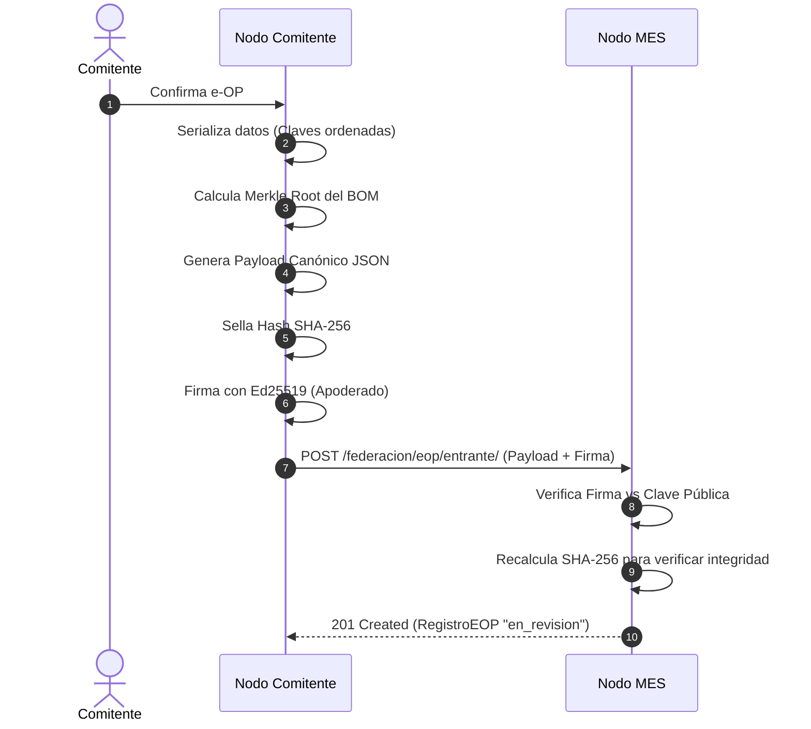
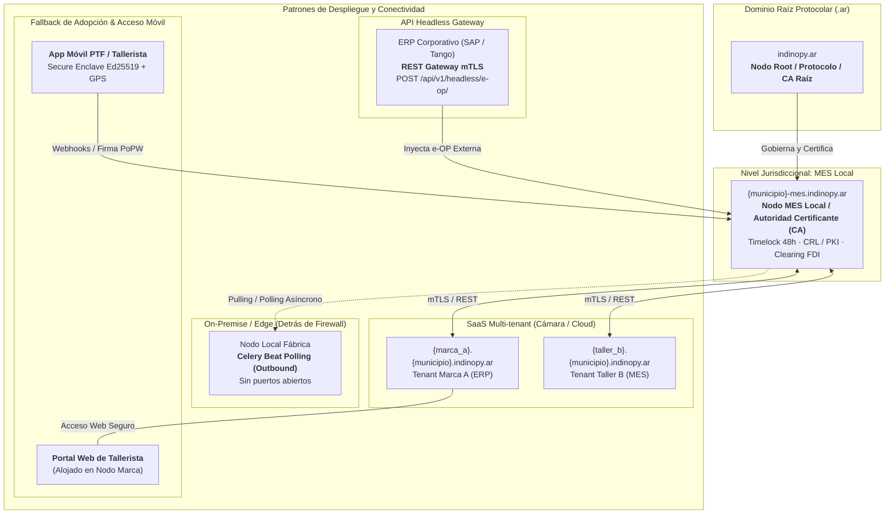
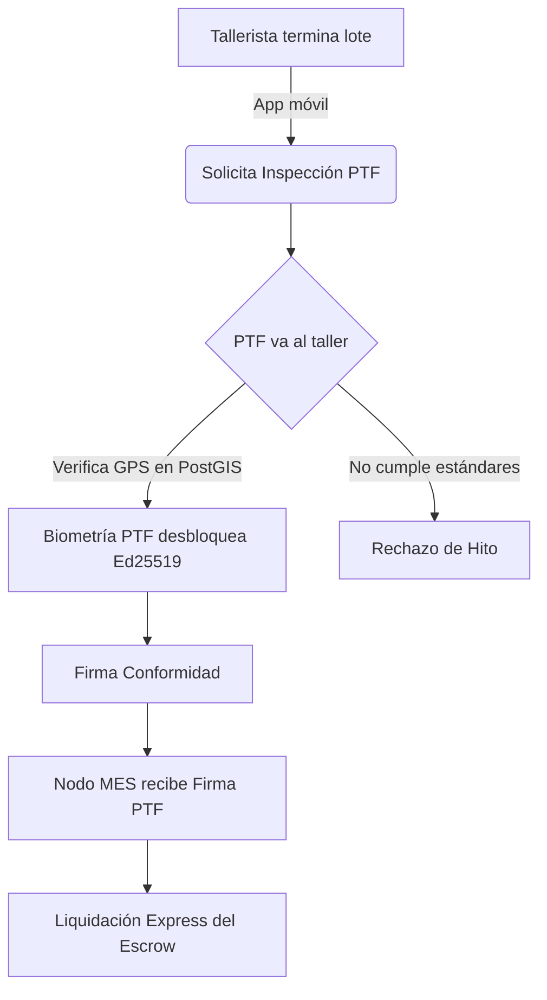
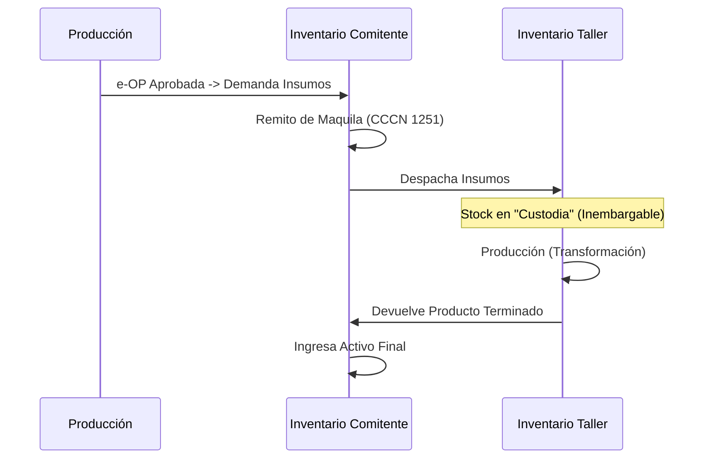
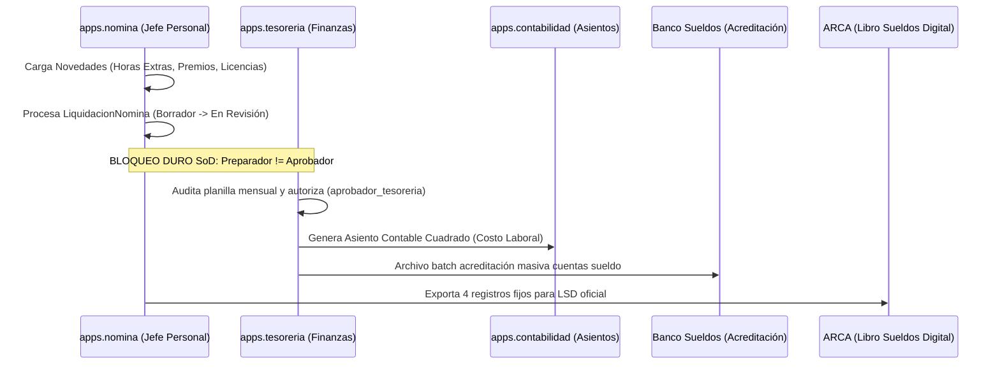
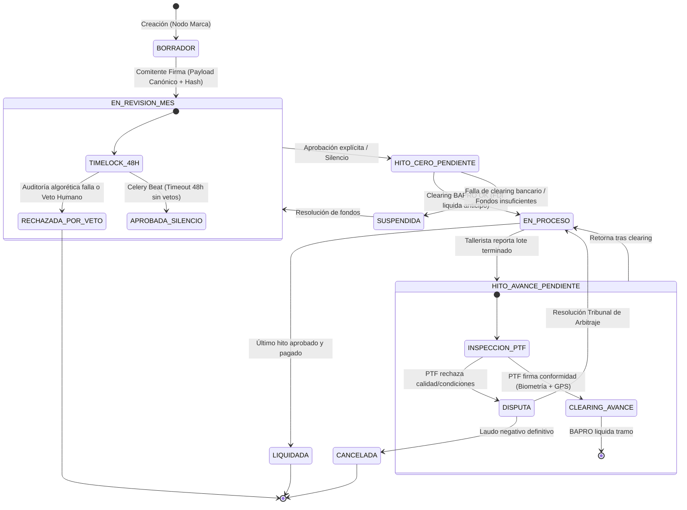
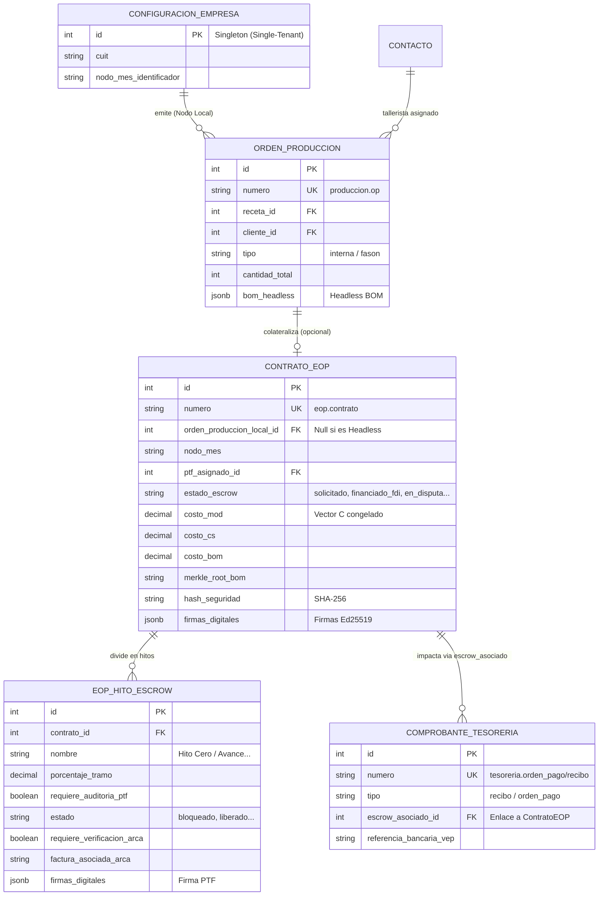

# Arquitectura Funcional — Indinopy ERP/MES

**Estado:** Documento de Especificación Consolidado

Este documento consolida la arquitectura funcional de **Indinopy**, integrando los principios operativos, la topología de red, la criptografía de confianza y los actores del sistema. Su objetivo es entender cómo las reglas del negocio industrial (Protocolo FIMCA, gobernanza MES) se traducen en componentes de software estructurados.

---

## Documentos Relacionados
- 📖 [Explicación Técnica del Proyecto](explicacion_tecnica_proyecto.html)
- 🔐 [Matriz de Roles y Permisos](roles.html)
- ⚙️ [Análisis de Implementación FIMCA](analisis_fimca_implementacion.html)
- 🏛️ [Arquitectura MES y Gobernanza](arquitectura_mes_gobernanza.html)
- 📚 [Glosario de Conceptos del Proyecto](glosario_conceptos_proyecto.html)

---

## 1. Visión Funcional: ¿Qué problema resuelve el software?

Indinopy no es solo un ERP administrativo, sino una plataforma de **gobernanza comunitaria y financiera** para la manufactura de calzado e indumentaria. Su arquitectura está diseñada para resolver tres problemas estructurales:
1. **Falta de crédito:** Transforma la Orden de Producción (e-OP) en un activo financiero (título de crédito) auditable y ejecutable.
2. **Burocracia y Discrecionalidad:** Reemplaza el expediente analógico y la discrecionalidad burocrática por **auditoría criptográfica institucional y contratos automatizados de ejecución estanca (Escrow y Timelocks en Celery/PostgreSQL)** tutelados por la gobernanza paritaria de la MES.
3. **Purgatorio Fiscal:** Conecta APIs de forma invisible para automatizar el alta tributaria (Monotributo Productivo) y retener impuestos solo al momento de la liquidación bancaria, evitando la acumulación de pasivos.

### 1.1. Encuadre Operativo: La Marca como Núcleo Integral (Producción Mixta, Nómina y Finanzas)

El sistema está concebido para **dar soporte en primera instancia a la Marca manufacturera** en toda su complejidad operativa, y en **segunda instancia al Tallerista satélite**:

1. **La Marca como Núcleo Operativo (con planta propia o 100% fasón):** No es un simple intermediario de software; centraliza el diseño, los recetarios BOM, el pañol de insumos y el capital comercial. Puede operar con planta física propia (corte, embalaje y operarios directos bajo UTICRA/SOIVA) o bien bajo un modelo deslocalizado donde delega la totalidad de la transformación física en talleres a fasón. En ambos casos, administra inventario por partida doble, nómina (personal directo o administrativo) y tesorería comercial (ventas B2C WooCommerce y mayoristas).
2. **Producción Mixta (Planta Propia + Fasón):** Las Órdenes de Producción gestionan etapas combinadas: corte y armado internos en planta comitente, y etapas tercerizadas (ej. aparado a fasón) remitidas en custodia bajo CCCN 1251/1356 y colateralizadas ante el FDI.
3. **Impermeabilidad Laboral (Blindaje Art. 30 LCT):** La nómina de la marca (`apps.nomina`) es estrictamente hermética e inaccesible para los talleres. Los operarios y destajistas de los talleres externos jamás figuran en los libros de sueldos de la marca comitente.
4. **Desdoblamiento Financiero:** La tesorería de la marca no le anticipa liquidez de su bolsillo al tallerista durante la fabricación; el FDI asume el fondeo del Hito Cero y de avance, y la marca programa únicamente el repago fiduciario a 60 días una vez finalizado el lote.
5. **Integración Gradual del Taller:** El tallerista opera en segunda instancia mediante una interfaz ligera (Portal web PWA móvil con ficha técnica ciega de costos y firma Ed25519) sin necesidad de infraestructura propia, o mediante un nodo federado autónomo si se trata de un taller consolidado o cooperativa.

---

## 2. Mapa de Actores y Roles del Sistema

La arquitectura segrega los permisos de forma estricta según el actor que interactúa en la **Red Federada**:

### Actores Externos (Nodos en la Red)
*   **Comitente (Marca):** Nodo emisor. Diseña el producto, genera la e-OP y envía la materia prima. Tras finalizar la producción, cancela el crédito al FDI en un plazo de 30 a 60 días.
*   **Tallerista (Fasón/Maquila):** Nodo receptor. Ejecuta la producción. Firma criptográficamente el inicio (aceptación) y los fines de lote (hitos).
*   **PTF (Promotor Territorial):** Auditor físico en el terreno. Posee una App Móvil con enclave seguro. Firma validando que las condiciones laborales y productivas son éticas.
*   **MES (Mesa de Enlace Sectorial):** El Nodo Root/CA (Autoridad Certificante). Homologa tarifas, gobierna las reglas y ejecuta los *Timelocks* de 48h.
*   **Fiduciaria (FDI / Banco):** Fondo de desarrollo que **anticipa y financia** el dinero al tallerista (Hito Cero e hitos de avance) tomando la e-OP como garantía. Luego recauda el pago del Comitente a plazo.

### Gobernanza de la MES (Mesa de Enlace Sectorial)
La arquitectura institucional neutraliza la atomización del sector mediante un equilibrio de poderes en el Nodo Local estructurado en **7 sillas representativas**:
*   **Silla 1 (Talleristas de Base):** Representante del sub-padrón de Monotributo Productivo.
*   **Silla 2 (Talleres Consolidados):** Representante de unidades productivas estructuradas (SAS).
*   **Sillas 3 y 4 (Marcas Comitentes):** Representantes del capital comercial y volumen de demanda.
*   **Silla 5 (INTI):** Soberanía Técnica. Audita mermas y homologa tecnología conveniente.
*   **Silla 6 (Sindicato):** Tutela Laboral. Ejerce la auditoría ex-post en territorio.
*   **Silla 7 (Municipio):** Árbitro Jurisdiccional. Preside la Mesa y la Comisión de Crédito, ejerciendo el voto de desempate.

A nivel operativo, la MES delega la ejecución en dos comisiones con funciones incompatibles entre sí: la **Comisión de Homologación Técnica** (INTI + Sindicato) y la **Comisión de Crédito y Riesgo** (Talleres + Marcas + Municipio).

---

## 3. Primitivas Criptográficas y Seguridad Legal

El sistema no confía en un campo `estado = 'aprobado'`. Utiliza primitivas para asegurar la inmutabilidad:

1. **SHA-256 (Payload Canónico):** Toda e-OP genera un JSON determinista que se hashea. Si alguien altera un precio a posteriori, el hash cambia y la OP se invalida.
2. **Árboles de Merkle (BOM):** La receta técnica (insumos) se hashea en un Merkle Tree, permitiendo auditar mermas sin revelar secretos industriales completos.
3. **Ed25519 (Firmas Digitales):** Cada actor tiene una clave en el Secure Enclave de su dispositivo. Firman el hash de la e-OP para aprobar avances.
4. **Resguardo Legal Automático:** La arquitectura inyecta en los remitos de traslado las cláusulas de Locación de Obra (Art. 1251 CCCN) y Depósito en Custodia (Art. 1356 CCCN) (y eventualmente Maquila Industrial), blindando la **inembargabilidad de los insumos** ante quiebras.

### Generación de Payload Canónico y Recepción en el Nodo MES


*Figura 1: Secuencia criptográfica determinista. Garantiza que la e-OP sea inmutable desde su concepción. Cualquier alteración de un precio o cantidad post-firma romperá la integridad del Hash SHA-256 en la MES.*

---

## 4. Topología de Red y Despliegue (DNS Federado)

Para resolver la barrera técnica en fábricas, Indinopy opera bajo un modelo jerárquico DNS (`.ar`):


*Figura 2: Topología de red federada y patrones de despliegue jerárquico DNS (`.ar`). Permite convivir esquemas SaaS Cloud, nodos On-Premise detrás de firewall mediante polling saliente, gateways headless para ERPs heredados y terminales móviles en territorio.*

**Patrones de Comunicación:**
*   **SaaS Multi-tenant:** Las fábricas sin infraestructura utilizan subdominios alojados por la cámara local. Escalable y preparado para picos (Celery + Redis).
*   **On-Premise + Polling:** Para fábricas con sus propios servidores físicos detrás de firewalls. Utilizan procesos asincrónicos (Pulling/Polling vía Celery) para preguntar al nodo MES por novedades sin abrir puertos locales.
*   **API Headless (Gateway):** Empresas grandes con SAP/Tango pueden apagar los módulos internos de Indinopy y usarlo solo como un Gateway Criptográfico (`POST /api/v1/headless/e-op/`) para inyectar OPs externas y aprovechar el financiamiento FDI y los beneficios del Protocolo FIMCA.
*   **Portal de Talleristas (Fallback de Adopción):** Si un tallerista no tiene implementado el sistema o no desea operar un nodo propio, la gestión de la e-OP (aceptación, firma y reporte de avance) se realiza de forma centralizada a través de un portal web seguro alojado dentro del nodo ERP de la Marca Comitente.

---

## 5. Flujos Core de Negocio (Core Business Flows)

### A. Modalidades de Producción: OP de Gestión Interna vs e-OP Federada
Para no burocratizar la planta ni forzar fricciones administrativas en los procesos habituales de fabricación, Indinopy distingue dos modalidades operativas:
1. **OP de Gestión Interna (Modo Fabril Directo):** Hoja de ruta técnica de planta para la coordinación física de la manufactura (curvas de talles, consumos BOM, ruteo de etapas de corte/aparado/armado y partes de producción). Al constituir una directiva operativa de ingeniería fabril interna y no una enajenación comercial entre terceros, no genera hecho imponible tributario ni requiere validación electrónica ante AFIP/ARCA (sin CAE). En el plano administrativo-contable (`DocumentoDeuda`), permite la registración de comprobantes de control interno clase "X" (RG AFIP 1415) para reflejar el devengado operativo de fábrica antes de la facturación comercial definitiva.
2. **e-OP Federada (Protocolo Institucional FIMCA):** Eleva la orden técnica a título de afectación productiva y colateral financiero ante el Fideicomiso FDI, activando el ecosistema institucional (Escrow bancario, anticipo Hito Cero, Timelock 48h con silencio positivo, auditoría territorial PTF y beneficios promocionales de IVA diferido y crédito fiscal presunto del 25%).

### B. Ciclo de Vida de una e-OP Federada: Hito Cero y Financiamiento FDI

```mermaid
sequenceDiagram
    autonumber
    participant Marca as Nodo Marca (ERP)
    participant MES as Nodo MES (Celery)
    participant Taller as Nodo Tallerista
    participant FDI as Fideicomiso (FDI)
    participant Banco as Banco (Clearing)
    
    Marca->>MES: e-OP Firmada con Ed25519 (Solicita Crédito)
    MES->>FDI: Evalúa y Aprueba Colateral (Vector C en UCI)
    
    rect rgb(50, 20, 20)
        Note right of Marca: TIMELOCK Y SILENCIO POSITIVO (Homologación)
        MES->>MES: Inicia Celery Beat (Timelock 48h)
        opt Veto de la MES (Auditoría)
            MES->>MES: Detecta anomalía/subpago de tarifas
            MES->>Marca: e-OP Rechazada
        end
        Note over MES: Si pasan 48h sin veto...
        MES->>MES: Auto-aprueba e-OP (Silencio Administrativo)
    end

    MES->>Taller: PUSH Notificación e-OP Entrante
    Taller->>MES: Firma Aceptación (Alta ARCA de oficio si aplica)
    
    rect rgb(20, 50, 20)
        Note right of Marca: HITO CERO (Financiado por FDI)
        Marca->>Taller: Despacha Insumos Fase 1 - Corte (Remito Custodia)
        Marca->>MES: Confirma Entrega de Insumos
        FDI->>Banco: Instrucción de Anticipo (30-40%)
        Banco-->>Taller: Transfiere directo a CVU/CBU Taller
        Banco-->>Marca: Callback Clearing Ejecutado
        Note over Marca: Tesorería reconoce Pasivo con FDI (Cancela deuda Taller)
    end
    
    rect rgb(20, 50, 50)
        Note right of Marca: HITOS DE AVANCE (Fast Track PTF y Despacho Escalonado)
        Taller->>MES: Finaliza Lote Corte (Solicita Inspección)
        MES->>Taller: Despacha Promotor Territorial (PTF)
        Taller->>MES: PTF Firma Conformidad en Campo (GPS/Biometría PoPW)
        Marca->>Taller: Despacha Insumos Fase 2 (Aparado/Armado)
        FDI->>Banco: Instrucción de Liquidación (Clearing Parcial)
        Banco-->>Taller: Transfiere Hito de Avance
    end

    rect rgb(50, 40, 20)
        Note right of Marca: CIERRE FISCAL (Estado FISCAL_PENDING)
        Taller->>MES: Entrega Producto Terminado en Planta
        MES->>ARCA: Verifica Emisión de Factura Electrónica Oficial (CAE)
        ARCA-->>MES: Comprobante CAE Válido
        FDI->>Banco: Liquidación Final (Saldo Escrow al Taller)
        Banco-->>Taller: Acredita Saldo Final + Puntos UCP
    end
    
    rect rgb(20, 40, 60)
        Note right of Marca: REINTEGRO Y CANCELACIÓN (Día 60)
        Marca->>FDI: apps.tesoreria emite Orden de Pago al FDI
        FDI->>Banco: Instrucción de Cierre de Posición
        Banco->>MES: Confirma Liquidación Final y Cierre de ContratoEOP
    end
```


*Figura 3: Ciclo de financiamiento productivo con despacho escalonado Just-in-Time y cierre fiscal condicionado. El FDI asume el fondeo del capital de trabajo tomando la e-OP como colateral y transfiriendo los fondos bancarios directamente al taller. La Marca comitente no desembolsa liquidez operativa durante la fabricación: reconoce un pasivo financiero frente al FDI y emite su Orden de Pago de repago a 60 días en apps.tesoreria.*

### C. Fast Track de Aprobación en Campo (El rol del PTF)

En lugar de esperar auditorías centralizadas lentas, el sistema usa **Fast Track** mediante la figura del Promotor Territorial, que actúa como **puente humano y tutor técnico** en el territorio:


*Figura 4: Auditoría PoPW (Proof of Productive Work) descentralizada. El puente humano (PTF) valida las condiciones en el taller y su firma criptográfica destraba el flujo financiero instantáneamente.*

### D. El Puente de Formalización (Integración ARCA/AFIP)
El trabajador periférico entra al sistema de forma invisible:
*   Al aceptar su primera e-OP (vía App), el sistema llama a **RENAPER (Biometría)** y a **ARCA** para darle el *Alta de Oficio* en el Monotributo Productivo.
*   **Binding Biométrico Anti-Sybil:** El cotejo facial en RENAPER vincula la persona física del artesano a su historial en el sistema. Si una unidad incurre en desvío doloso de insumos, la inhabilitación se asocia al vector biométrico de la persona, impidiendo el "reciclaje de reputación" mediante CUITs prestados de terceros o familiares.
*   En paralelo, abre una **cuenta inembargable BAPRO** de <i>Clearing</i>.
*   **Suspensión Activa:** Si el taller no recibe e-OPs por 15 días, el sistema notifica la inactividad, frenando el devengo de impuestos fijos.

### E. Trazabilidad Pública y Transparencia
Toda e-OP genera un endpoint público (`/trazabilidad/<uuid>`). Al escanear el QR del calzado en góndola, el consumidor visualiza un gráfico determinista con el desglose del costo: *% Mano de Obra, % Insumos, % Impuestos y % Marca*.

### F. Circuito de Ventas Omnicanal y Desacople de Integraciones
El ERP no reemplaza al e-commerce; opera bajo una **arquitectura hexagonal desacoplada**: la app `apps.integraciones.woocommerce` actúa como conector periférico (validando HMAC de webhooks, absorbiendo picos mediante Celery y normalizando a DTOs canónicos), interactuando con el dominio de ventas de forma agnóstica (`apps.ventas.models.OrdenVenta` vía `CanalVenta`).

```mermaid
sequenceDiagram
    participant W as WooCommerce (Tienda Web)
    participant I_WC as apps.integraciones.woocommerce
    participant V as apps.ventas (Core ERP)
    participant Inv as apps.inventario (Stock)
    
    W->>I_WC: POST /integraciones/woocommerce/{id}/webhook/ (HMAC)
    I_WC->>I_WC: Valida HMAC-SHA256 y encola tarea Celery
    I_WC-->>W: HTTP 200 OK (< 150ms)
    I_WC->>V: VentasService.ingestar_orden_canal(dto_orden)
    V->>V: get_or_create Contacto (DNI/CUIL) y OrdenVenta
    V->>Inv: Genera Remito Salida y reserva stock (StockQuant)
    
    alt Stock Insuficiente
        Inv-->>V: Alerta de Quiebre de Stock -> Sugiere OrdenProduccion
    else Stock Disponible
        Inv->>Inv: Despacha Mercadería (REM-OV-...)
        I_WC->>W: PUT /wp-json/wc/v3/products/batch (Actualiza Stock)
    end
```


*Figura 5: Orquestación desacoplada Omnicanal. La capa adaptadora normaliza eventos y aísla al Core de Ventas de dependencias externas, asegurando reservas atómicas en el inventario y retorno de sincronización.*

### G. Circuito de Inventario (Traslados de Maquila)
La materia prima viaja al taller sin transferir su dominio comercial, protegiendo a ambas partes de embargos.


*Figura 6: Trazabilidad de activos y blindaje legal. El stock enviado al taller se rige bajo contrato de Locación de Obra/Maquila, protegiendo a los insumos físicos de cualquier medida cautelar o embargo sobre el tallerista.*

### H. Circuito de Nómina y Liquidación de Sueldos (Segregación SoD)
La Marca administra su personal directo (corte, diseño, matricería, supervisión y administración) bajo un circuito estricto de **aprobación dual**:


*Figura 7: Circuito de nómina con segregación SoD. Impide que quien confecciona la liquidación autorice el desembolso bancario, integrando de forma atómica el costo laboral en la contabilidad y generando los archivos oficiales del Libro de Sueldos Digital.*

### I. Circuito de Tesorería Comercial y Contabilidad por Partida Doble
Centraliza el flujo monetario ordinario de la fábrica y su convergencia fiscal:
1. **Cobranzas y Facturación Electrónica:** Al confirmar un pedido mayorista o venta web WooCommerce, `apps.contabilidad` emite la Factura Electrónica (con CAE vía WebService ARCA), devengando el débito fiscal de IVA y la cuenta por cobrar en `DocumentoDeuda`.
2. **Medios de Pago y Cobranzas:** `apps.tesoreria` recibe pagos (efectivo, transferencias, Mercado Pago, cheques físicos y e-cheqs), aplicando los importes al saldo del cliente y conciliando retenciones de IIBB/Ganancias (`CertificadoRetencion`).
3. **Pagos a Proveedores y Repago FDI:** Emite Órdenes de Pago para saldar facturas de compra de cuero/avíos o cancelar el repago del crédito fiduciario al FDI (`escrow_asociado = ForeignKey(ContratoEOP)`).
4. **Partida Doble Inmutable:** Toda operación de tesorería y compras dispara en tiempo real un `Asiento` con sus `Apuntes` cuadrados (Debe = Haber), alimentando el Libro Diario, el Mayor y las declaraciones juradas de IVA Digital y SICORE/SIFERE.

---

## 6. Arquitectura de Software Interna (Django Service Layer)

A nivel de código (MVT avanzado), el sistema protege sus transacciones forzando un **Service Layer Pattern**:
*   `views.py`: Exclusivo para ruteo HTTP, validación de permisos y serialización. Cero lógica de negocio.
*   `models.py`: Exclusivo para estructura de base de datos relacional/espacial (PostGIS) y validaciones de campo.
*   `services.py`: **Core Transaccional.** Todo cambio de estado (ej: `ProduccionService.confirmar_op()`) se envuelve en `transaction.atomic()`, dispara los cálculos de Merkle, genera el documento contable, sella el hash, emite los *Signals* y programa las tareas asincrónicas en Celery.

---

## 7. Modelo de Datos y Máquina de Estados (e-OP)

### A. Máquina de Estados de la e-OP (State Machine)
El ciclo de vida financiero y productivo de la e-OP es estricto y unidireccional. Se maneja a través de un motor de estados para evitar inconsistencias y ataques de doble gasto/pago.



*Figura 8: Máquina de estados unidireccional de la e-OP. Garantiza la consistencia del ciclo de vida financiero y productivo, previniendo inconsistencias como doble gasto, estados huérfanos o retrocesos no autorizados.*

### B. Payload Canónico de la e-OP (Contrato API)
El intercambio de información entre nodos no transfiere tablas SQL, sino un **Payload Canónico JSON** determinista. 
*   **Perímetro de Ingreso:** `POST /federacion/eop/entrante/` (Nodo MES)
*   **Estructura Base:**
```json
{
  "uuid": "550e8400-e29b-41d4-a716-446655440000",
  "version": "1.1",
  "comitente": {"cuit": "30-12345678-9", "clave_publica": "ed25519_abc123..."},
  "taller": {"cuit": "20-87654321-0", "clave_publica": "ed25519_xyz789..."},
  "financial_terms": {
    "moneda": "ARS",
    "monto_total": 1500000.00,
    "cronograma_hitos": [
      {"id": "H0", "porcentaje": 35.0, "tipo": "anticipo"},
      {"id": "H1", "porcentaje": 65.0, "tipo": "cierre_lote"}
    ]
  },
  "merkle_root_bom": "e3b0c442...",
  "firmas": {
    "comitente": "firma_hex_generada_con_ed25519_privada"
  }
}
```
*   **Validación en MES:** Al ingresar, el API Gateway de la MES reordena las llaves alfabéticamente (canonicalización), recalcula el SHA-256 y verifica la firma `Ed25519` contra el padrón PKI. Si falla, retorna `400 Bad Request` y no impacta la base.

---

## 8. Casos Límite, Manejo de Errores y NFRs

### A. Resiliencia, Fallas y Dead-Letter Queues (DLQ)
En una arquitectura distribuida donde fluye crédito fiduciario, el "camino feliz" no es suficiente:
1. **Falla de Celery Beat (Timelock):** Si el worker que monitorea el Silencio Positivo (48h) se cae, cuando Celery reinicia busca transacciones `EN_REVISION_MES` cuyo `timestamp_creacion + 48h < NOW()`, procesándolas en bloque retroactivamente (estrategia *catch-up*).
2. **Idempotencia de Webhooks:** Todo endpoint receptor (ej: callbacks del Banco) exige el UUID y una `X-Idempotency-Key`. Si el Banco envía el callback de liquidación dos veces por timeout de su lado, Indinopy devuelve `200 OK` en el segundo intento pero omite modificar el saldo o disparar la AFIP nuevamente.
3. **Dead-Letter Queue (DLQ):** Los webhooks salientes (ej: notificación al Taller) se encolan en Redis con reintentos exponenciales. Si tras 24h falla (ej: taller offline), el mensaje cae a una DLQ para análisis manual y alerta por email.

### B. Ciclo de Vida Criptográfico y Recuperación de Identidad
1. **Pérdida de Dispositivo (PTF / Titular):** La clave privada Ed25519 reside en el *Secure Enclave* del celular y no es extraíble. Ante robo/pérdida, el PTF lo reporta presencialmente a la MES. Un administrador local ejecuta la revocación añadiendo la clave pública a la CRL (Certificate Revocation List). Las firmas futuras con esa llave se rechazan en todo el ecosistema.
2. **Rotación de Llaves de Nodos:** Automática cada 12 meses.

### C. Consistencia en Topología Offline-First
En Nodos Talleristas On-Premise que operan con conectividad intermitente (Polling):
*   Si el Tallerista firma la aceptación offline, la firma criptográfica se almacena en caché local con el *timestamp* real.
*   Al reconectar, el worker transmite el payload.
*   **Resolución de Conflictos:** Si la marca intentó cancelar la e-OP simultáneamente, el Nodo MES prioriza el vector de tiempo de las firmas descentralizadas. Si el tallerista firmó en su dispositivo *antes* de que la marca enviara la cancelación a la MES, el contrato es vinculante.

### D. Seguridad y Privacidad de Datos Biométricos
*   **Zero-Retention (Ley 25.326):** Los datos biométricos (huella o biometría facial) utilizados en el Alta de Oficio (integración RENAPER) no se almacenan en los discos de Indinopy. El Nodo MES actúa como passthrough, envía el vector a la API de RENAPER, recibe un `match_score`, lo sella en el registro de auditoría, y descarta el vector biométrico de la memoria RAM inmediatamente.

### E. Observabilidad Distribuida
*   **Traceability (OpenTelemetry):** El Payload Canónico transporta un `trace_id`. Esto permite correlacionar transacciones distribuidas (Nodo Marca → Nodo MES → Portal Fiduciario → API BAPRO), centralizando los logs en herramientas como Grafana/Loki.
*   **Alertas (SLAs):** Si la tasa de timeout de los webhooks bancarios supera el umbral crítico, o si la validación del Timelock se atrasa >30 min, se disparan incidentes automatizados al equipo de infraestructura MES.

### F. Edge Cases de Negocio
1. **Default del Comitente (Crédito Impago):** Si a los 60 días la marca no le devuelve la plata al FDI, la e-OP entra en `DEFAULT`. El FDI asume la pérdida contable, pero el motor de gobernanza aplica un **Hard Ban** institucional y criptográfico a la clave y CUIT de la marca en toda la Red Federada hasta saldar la deuda. El Tallerista conserva el 100% de la plata porque ya le fue liquidada.
2. **Cancelación Parcial (Fuerza Mayor):** Si se incendia el taller o hay faltantes a mitad del lote, el sistema emite una enmienda ("Addenda e-OP"). Recalcula los hitos (ej: paga el 50% de los pares salvados) y devuelve la garantía sobrante retenida en custodia a la cuenta del FDI.

---

## 9. Modelo de Datos Relacional (Django ERD)

A diferencia del *Payload Canónico JSON* que opera como contrato de red para interoperabilidad, la persistencia interna en los nodos está gobernada por el ORM de Django. La arquitectura desacopla estrictamente la **manufactura física de planta** (`apps.produccion`), el **título de crédito fiduciario** (`apps.eop`) y la **ejecución financiera** (`apps.tesoreria`):



* **DocumentoFirmableMixin:** Tanto `ContratoEOP` como `EOPHitoEscrow` y `ComprobanteTesoreria` heredan de este mixin. Almacenan su propio `hash_seguridad` y un JSON de `firmas_digitales`. Esto asegura que cuando se audita la base de datos, el registro histórico contiene la "foto" exacta de la operación en el milisegundo en que el PTF, el Comitente o el Tallerista inyectaron su firma criptográfica.

---

## 10. Especificación de API, Seguridad y Topología de Red

### A. Aislamiento Físico y Despliegue (Topología Single-Tenant)
En lugar de centralizar los datos comerciales en un clúster SaaS monolítico con riesgos de fuga, la red utiliza una **topología federada On-Premise/Cloud Privada (Single-Tenant)**. 
* Cada Marca Comitente despliega su propio ERP/Nodo, gobernado por el modelo `ConfiguracionEmpresa` (Singleton). 
* El aislamiento de datos de negocio (qué vende la marca, a quién, sus recetarios secretos) es total y físico. Solo los hashes SHA-256 y el payload de la e-OP federada viajan al Nodo MES para gestionar el Clearing Financiero.

### B. Contrato OpenAPI y Autenticación
La API Gateway expone una especificación **OpenAPI 3.1 (Swagger)** completa, versionada en la URI (`/api/v1/...`).
* **Node-to-Node (Federación):** El Nodo de la Marca y el Nodo MES se comunican mediante **mTLS (Mutual TLS)**. El Nodo MES solo acepta payloads de IPs o nodos con certificados x509 emitidos por la CA Raíz de la red.
* **Clientes de Usuario (App Móvil PTF / Web Tallerista):** Utilizan **JWT (JSON Web Tokens)** con corto tiempo de vida (15 min) y Refresh Tokens almacenados en cookies `HttpOnly` `Secure` para evitar ataques XSS.
* **Compatibilidad hacia atrás:** Si un nodo *legacy* envía un payload v1.0 a una MES que opera en v2.0, un *Adapter Layer* transforma el payload antes de la validación canónica.

---

## 11. Riesgo, AML/KYC y Acuerdos de Nivel de Servicio (SLAs)

### A. Prevención de Lavado de Activos (AML) y KYC
Dado que el FDI inyecta liquidez y el Banco ejecuta *clearing*, Indinopy incorpora controles fiduciarios estrictos:
* **KYC (Know Your Customer):** Integración biográfica y biométrica con RENAPER y ARCA. Ningún CUIT opera sin padrón validado.
* **AML (Anti-Money Laundering):** El sistema escanea volúmenes inusuales. Si un tallerista de Categoría A recibe Hitos que superan el umbral establecido por la Unidad de Información Financiera (UIF), se bloquea el clearing bancario transitoriamente y se genera un ROS (Reporte de Operación Sospechosa) interno para el oficial de cumplimiento del FDI.

### B. Algoritmos de Riesgo y Anti-Colusión
Para evitar operaciones fraudulentas, el protocolo ejecuta dos motores paralelos:
1. **Scoring de Capacidad (Load Balancing):** Si el taller tiene asignadas OPs que superan el 90% de su capacidad nominal declarada (Pares/Semana), el sistema exige revisión manual o derivación para evitar ahogos financieros.
2. **Geo-Fencing Anti-Colusión (PostGIS):** El sistema previene el "fraude de escritorio" (donde un PTF firma aprobaciones remotamente sin ir al taller). Al momento de firmar un hito, la App captura la latitud/longitud del celular. La capa de servicios (`services.py`) utiliza funciones espaciales de PostGIS (`ST_Distance`) para verificar que el PTF esté dentro de un radio de **150 metros** del domicilio productivo homologado del tallerista. Discrepancias mayores disparan un **Alerta de Colusión**, bloquean la firma Ed25519 e inician una auditoría al PTF.

### C. SLAs Operativos (Tiempos de Respuesta)
Para evitar la burocratización, el código impone SLAs duros (*Hard Deadlines*):
* **Timelock de Homologación MES:** 48 horas hábiles. Superado este plazo → *Silencio Positivo Automático*.
* **Inspección PTF:** 24 horas hábiles desde que el Tallerista marca el lote como "Terminado".
* **Tribunal de Arbitraje (Disputas):** 72 horas hábiles para emitir el laudo de arbitraje técnico.

---

## 12. Infraestructura, Disaster Recovery y CI/CD

### A. Disaster Recovery (DR) y Alta Disponibilidad
* **Topología:** El Nodo MES (Autoridad Certificante) corre en un clúster Kubernetes (K8s) con auto-scaling.
* **Base de Datos:** PostgreSQL con replicación *Streaming* síncrona (Multi-AZ).
* **Backup de Infraestructura de Claves (PKI):** Las Listas de Revocación de Certificados (CRL) y las claves públicas raíz se respaldan cada 6 horas en *Cold Storage* geográficamente separado (fuera del país o en data centers secundarios) para garantizar que ante un desastre físico total, el ecosistema no pierda el ancla criptográfica de las e-OPs.

### B. Estrategia de Testing y CI/CD
El ciclo de desarrollo en Indinopy obliga a pasar por un pipeline estricto (ej. GitHub Actions / GitLab CI):
* **Unit Testing (Pytest):** 100% de cobertura obligatoria en la capa `services.py` (límites transaccionales y máquinas de estado).
* **Contract Testing:** Tests que simulan el intercambio de payloads JSON entre versiones distintas de nodos para garantizar que el `hash SHA-256` se calcule de forma idéntica en cualquier plataforma (Windows, Linux, ARM).
* **Integración y Despliegue (CI/CD):** Builds de contenedores Docker inmutables, escaneo de vulnerabilidades (Trivy) y despliegue automatizado sin downtime (Blue/Green Deployment) en los nodos SaaS.

---

## 13. Workflows de Denuncias, Vetos y Resolución Arbitral

La red federada asume que los conflictos son inevitables. Para evitar la parálisis judicial tradicional, Indinopy implementa contratos de ejecución automatizada y resolución arbitral directamente sobre el Escrow.

### A. Canal de Denuncias y Tribunal de Arbitraje
Cuando ocurre un diferendo de calidad o faltante de materiales entre el Comitente y el Tallerista, el sistema ejecuta esta máquina de estados:
1. **Trigger de Alerta:** El afectado pulsa "Reportar Incumplimiento" en la plataforma. El `ContratoEOP` cambia automáticamente de su estado actual a `en_disputa`. Los pagos futuros se congelan de inmediato en la red.
2. **Aportación de Pruebas (24hs):** Se habilita un canal de subida donde ambas partes adjuntan evidencia (fotos de cuero marcado, PDF de ficha técnica). Los archivos son hasheados (SHA-256) para garantizar que la prueba es inmutable y no fue alterada a posteriori.
3. **Conformación del Panel (Matchmaking):** El sistema asigna acceso de lectura al perito del INTI y sortea algorítmicamente a dos vocales de la Bolsa de Trabajo (un Taller y una Marca, ajenos al conflicto) para que auditen el caso en el Dashboard MES.
4. **Laudo y Ejecución Criptográfica (72hs SLA):** El Tribunal emite su fallo. Al ingresar 2 de las 3 firmas Ed25519 requeridas, el contrato ejecuta automáticamente el laudo: liquida forzosamente al tallerista o reintegra los fondos al FDI, aplicando simultáneamente el *Slashing* (descuento de reputación UCP) a la parte declarada culpable.

### B. Veto de Auditoría Ex-Post (Tutela Sindical)
A diferencia de los regímenes burocráticos donde el Sindicato sella permisos antes de empezar (frenando la agilidad), en FIMCA la auditoría gremial ocurre *durante o después* del proceso productivo, garantizando que no se bloquee el Hito Cero.
1. **Inspección In-Situ o Algorítmica:** Si el Sindicato (Silla 6) detecta operarios no registrados o una tarifa base inferior al Convenio Colectivo, dispara el Veto Ex-Post desde su nodo.
2. **Bloqueo del Hito Final:** El sistema no frena las máquinas. Lo que hace es interceptar y congelar exclusivamente el **Hito de Cierre (15% final)** y suspender la autorización de remito de salida de los zapatos.
3. **Fianza Líquida de Continuidad:** Para evitar que la Marca pierda la temporada comercial y los zapatos queden de rehenes, el sistema le permite transferir al FDI una "Fianza Líquida" por el valor en litigio. Al impactar la transferencia, el sistema libera inmediatamente la mercadería.
4. **Resolución:** El conflicto se eleva automáticamente al Tribunal de Arbitraje para que decida el destino de la fianza depositada.
