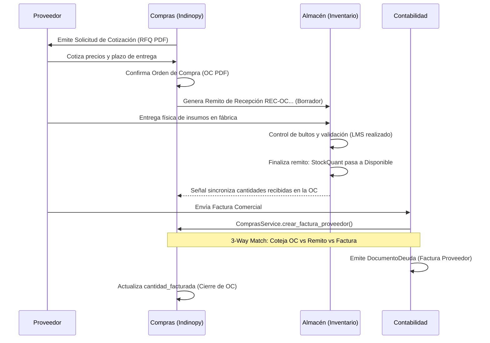
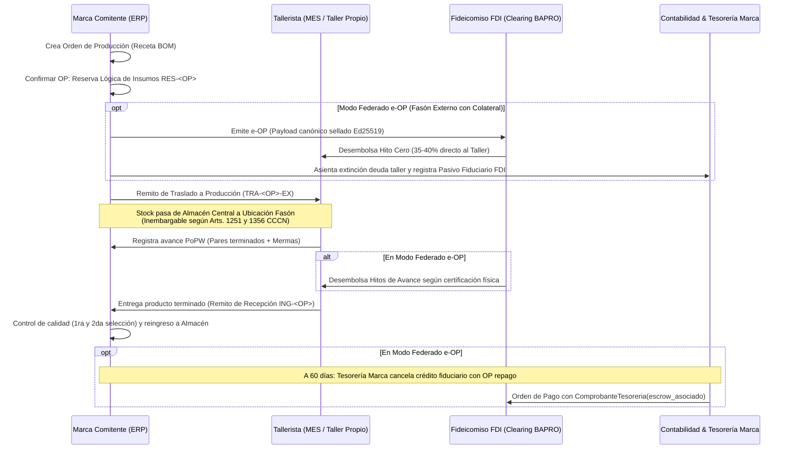
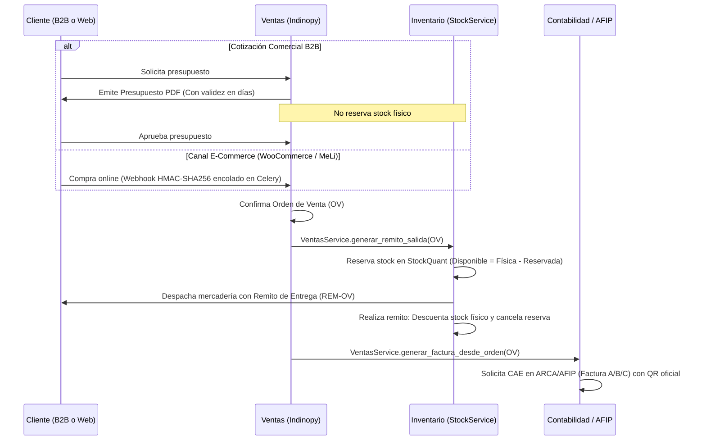
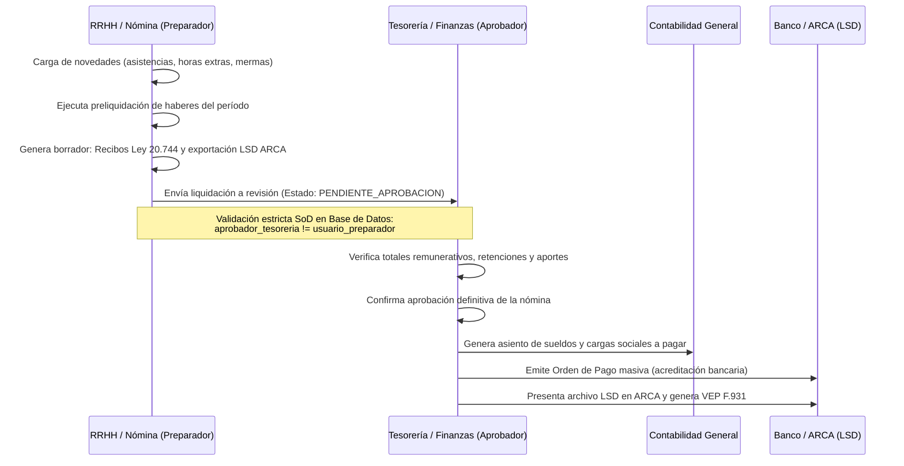
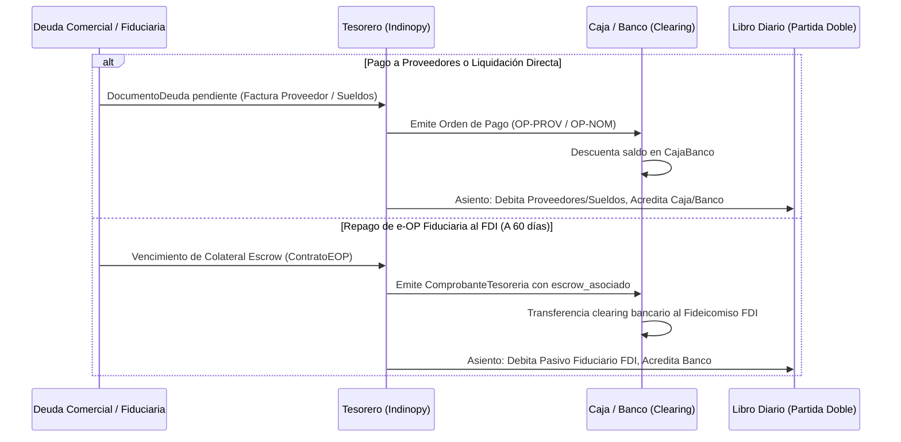

# Flujos Documentales en Indinopy ERP/MES

Este documento detalla la estructura administrativa, los módulos operativos y los circuitos documentales del sistema **Indinopy ERP/MES**, garantizando la trazabilidad entre el abastecimiento de materias primas, la fabricación, la logística comercial y el devengamiento fiscal.

---

## 1. Módulos Operativos del Sistema

* **Compras (`apps.compras`):** Solicitudes de Cotización (RFQ), Órdenes de Compra a proveedores, seguimiento de tarifas y conciliación *3-Way Matching*.
* **Producción (`apps.produccion` y `apps.eop`):** Ciclo de vida de la Orden de Producción (gestión interna de planta o e-OP fiduciaria federada con la MES), recetas técnicas (BOM) y partes de avance físico (PoPW).
* **Inventario (`apps.inventario`):** Gestión de existencias por partida doble (`StockQuant`). Administra Remitos de Recepción, Remitos de Traslado a Producción (custodia en talleres/fasón) y Remitos de Entrega comercial.
* **Ventas (`apps.ventas` e `apps.integraciones`):** Presupuestos comerciales, Notas de Pedido, Órdenes de Venta mayoristas B2B y canal omnicanal desacoplado (WooCommerce, MercadoLibre).
* **Contabilidad y Fiscal (`apps.contabilidad` y `apps.afip`):** Libro Diario por partida doble, facturación electrónica A/B/C/X con QR oficial ARCA, cuentas corrientes y reportes de Convenio Multilateral (CM05/CM03).
* **Tesorería y Custodia (`apps.tesoreria`):** Gestión de cajas, clearing bancario, administración fiduciaria de Escrow y Títulos de Crédito FCE (Ley 27.440).
* **Nómina y RRHH (`apps.nomina`):** Legajos de personal, novedades mensuales, liquidación de haberes, recibos de sueldo (Ley 20.744), exportación a Libro de Sueldos Digital (LSD ARCA) y segregación estricta SoD (`usuario_preparador != aprobador_tesoreria`).

---

## 2. Documentos Centrales del Circuito

| Documento | Módulo Emisor | Función Operativa / Legal | Efecto en Inventario / Caja |
| :--- | :--- | :--- | :--- |
| **Solicitud de Cotización (RFQ)** | `compras` | Consulta de precios, plazos de entrega y validez a proveedores. | No vinculante. Sin efecto en stock ni deuda. |
| **Orden de Compra (PO)** | `compras` | Compromiso formal de compra de insumos/servicios. | Al confirmarse, genera remito de recepción en Almacén. |
| **Presupuesto / Cotización** | `ventas` | Propuesta económica estimada a prospectos o clientes. | No vinculante. **No reserva stock físico**. |
| **Nota de Pedido / OV** | `ventas` | Pedido formal de venta (B2B mayorista o e-commerce). | Al confirmarse, genera remito y **reserva stock en `StockQuant`**. |
| **Remito Traslado a Producción** | `inventario` | Envío de materias primas y semielaborados a taller/fasón. | Mueve stock a ubicación `fason` bajo custodia (Arts. 1251/1356 CCCN). |
| **Remito de Recepción** | `inventario` | Ingreso físico de materias primas o productos terminados. | Incrementa stock disponible y actualiza cantidades en OC/OP. |
| **Remito de Entrega** | `inventario` | Despacho logístico de mercadería al cliente final. | Descuenta existencias físicas y cancela reservas. |
| **e-OP (Orden Producción Electrónica)** | `produccion` / `eop` | Título de colateral fiduciario inmutable sellado (SHA-256 / Ed25519). | Compromete insumos y activa el contrato Escrow / Timelock 48h. |
| **Factura A / B / C / X** | `contabilidad` | Comprobante de devengamiento comercial y fiscal (CAE AFIP). | Registra derecho a cobro / deuda y crédito/débito fiscal IVA. |
| **Recibo de Sueldo (Ley 20.744)** | `nomina` | Comprobante legal de liquidación de haberes y aportes retenidos. | Sin efecto directo en stock. Devenga pasivo laboral y cargas sociales. |
| **Declaración F.931 / LSD** | `nomina` | Archivo de importación oficial ARCA (Libro de Sueldos Digital). | Genera la base de cálculo consolidada de aportes y contribuciones patronales. |
| **Orden de Pago (OP Tesorería)** | `tesoreria` | Mandato de egreso bancario/efectivo (proveedores, nómina, repago FDI). | Descuenta saldo en `CajaBanco` y cancela pasivos en `DocumentoDeuda`. |

---

## 3. Diagramas Secuenciales de Flujo

### A. Circuito de Compras y Abastecimiento (3-Way Matching)

---

### B. Circuito de Producción y Custodia de Materiales (Planta Propia o Fasón)

---

### C. Circuito de Ventas y Omnicanalidad

---

### D. Circuito de Nómina y Segregación de Funciones (SoD)

---

### E. Circuito de Tesorería Comercial y Cancelación Fiduciaria

---

## 4. Reglas de Integridad del Sistema

1. **Partida Doble Estricta:**
   - En **Inventario**, ningún insumo o producto se crea o destruye: todo movimiento exige una ubicación origen y una ubicación destino.
   - En **Contabilidad**, ningún comprobante se asienta si la suma del Debe no es idéntica a la suma del Haber.
2. **Reserva vs Consumo:**
   - La confirmación de una orden (OV u OP) **reserva** existencias para evitar la sobreventa o el desabastecimiento; la baja física real solo ocurre al validar el remito correspondiente.
3. **Segregación de Funciones (SoD):**
   - El operador que liquida haberes o confecciona facturas/órdenes de pago no puede autoaprobar el desembolso financiero (`usuario_preparador != aprobador_tesoreria`).
4. **Desacople Arquitectónico (Service Layer):**
   - Las transacciones documentales complejas se ejecutan exclusivamente en la capa de servicios (`ComprasService`, `ProduccionService`, `VentasService`, `StockService`, `NominaService`, `TesoreriaService`), garantizando atomicidad transaccional (`@transaction.atomic`).
