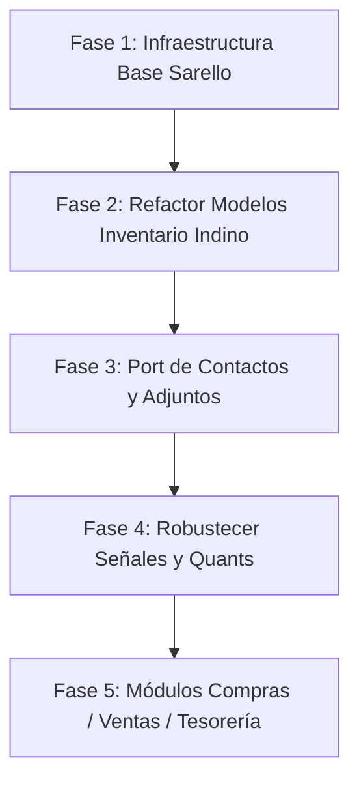

# Comparación, Análisis y Plan de Migración: Sarello ➔ Indinopy
## Enfoque: Módulos de Producto e Inventario (Stock)

Este documento realiza un análisis comparativo exhaustivo entre la arquitectura desarrollada en **Sarello** y la implementada en **Indinopy**, enfocándose prioritariamente en los modelos, la lógica operativa y las señales de los módulos de **Producto** e **Inventario**, estableciendo una hoja de ruta para transferir los mejores componentes y estándares de Sarello a Indinopy.

---

## 1. Estado Actual y Filosofía de Ambos Proyectos

| Dimensión | Sarello ERP | Indinopy |
| :--- | :--- | :--- |
| **Enfoque Principal** | ERP administrativo/financiero integral, contable (NIIF / RT 41 argentina) con estricto control fiscal. | ERP/MES industrial omnicanal orientado a manufactura (calzado/indumentaria), talleres externos (fasón), fichas técnicas (BOM) y WooCommerce. |
| **Estado de `inventario`** | **Planificado / Especificación teórica completa**: `apps/inventario/models.py` estaba vacío (esqueleto), pero su integración contable (asientos por compras, CMV, ajustes de stock y maquila) estaba minuciosamente diseñada en su plan de cuentas y documentación. | **Implementado funcionalmente**: Motor Odoo-style con `ProductoTemplate`, `Producto` (variante), `Ubicacion`, `Lote`, `StockQuant` (balance en tiempo real) y remitos (`MovimientoStock` / `LineaMovimientoStock`). |
| **Arquitectura Base** | `TimeStampedModel`, `DocumentoBase`, `ParametroSistema`, `DatosEmpresa` (Singleton), `DocumentoAdjunto` (GenericForeignKey), `Contacto` (unificado fiscal CUIT/IVA). | Modelos directos `models.Model`, sin clases abstractas compartidas aún, con foco en producción (`OrdenProduccion`, `Receta`, `OPEtapaTracking`). |
| **Manejo de Transiciones** | Lógica de estados explícita dentro del método `save()` de los modelos (`_construir_asiento`, validación de transiciones `borrador -> confirmado -> anulado`). | Desacoplado mediante **Django Signals** (`pre_save` y `post_save` en `signals.py`). |

---

## 2. Comparación Detallada: Modelos de Producto e Inventario

### A. Catálogo y Productos

*   **En Sarello**:
    *   No llegó a codificarse en `models.py`, pero en su documentación (`docs/estructura.md`, `plan_de_cuentas.md`) se proyectaba un modelo de producto con variantes, costos de reposición y cuentas contables asociadas para la determinación automática del Costo de Mercaderías Vendidas (CMV).
*   **En Indinopy**:
    *   **`ProductoTemplate`**: Define el producto base, tipo (`almacenable`, `consumible`, `servicio`), unidad de medida y estrategia de tracking (`none`, `lote`, `serie`).
    *   **`Atributo` y `AtributoValor`**: Sistema flexible de variantes (Talle, Color, etc.).
    *   **`Producto`**: Variante física final con SKU propio, código de barras y recargo (`precio_extra`).
*   **Brecha / Oportunidad de Migración**:
    1.  **Convenciones de Sarello**: Falta aplicar `TimeStampedModel` (`creado_en`, `modificado_en`), `verbose_name` en español para todos los campos, y el estándar monetario `DecimalField(max_digits=15, decimal_places=2)`.
    2.  **Cuentas contables / Imputación**: En Sarello, cada producto o categoría prevé asociar cuentas contables para ventas, compras e inventario (Activo 1.1.6.XX).

### B. Inventario, Stock y Partida Doble

*   **En Sarello**:
    *   Concebido bajo la norma contable argentina (NIC 2 / RT 17 y RT 41). Define tres cuentas clave para bienes de cambio:
        *   `1.1.6.01` Mercaderías — Productos terminados.
        *   `1.1.6.02` Materias primas e insumos (incluso cuando están físicamente en un taller tercero bajo maquila/fasón, siguen siendo activo propio).
        *   `1.1.6.03` Producción en proceso (maquila/fasón).
*   **En Indinopy**:
    *   Implementa el motor de **Partida Doble de Odoo**:
        *   **`Ubicacion`**: Físicas (Almacén Central) y Virtuales (Proveedores, Clientes, Producción, Ajustes/Pérdidas).
        *   **`StockQuant`**: Snapshot agrupado por `(producto, ubicacion, lote)` con `cantidad_fisica` y `cantidad_reservada`.
        *   **`MovimientoStock` / `LineaMovimientoStock`**: Cabecera (Remito físico, fiscal o X) y Líneas con herencia automática de ubicaciones.
*   **Compatibilidad directa**:
    *   El modelo de ubicaciones virtuales de Indino encaja de forma perfecta con el plan contable de Sarello:
        *   Ubicación Física ➔ `1.1.6.01` o `1.1.6.02`.
        *   Ubicación Virtual "Producción / Fasón" ➔ `1.1.6.03` (Producción en proceso).
        *   Ubicación Virtual "Ajuste" ➔ `5.7.1.03` (Pérdida por ajuste de inventario) o `4.3.1.XX` (Ajuste positivo).

---

## 3. Comparación de Lógica y Señales

### A. Ejecución de Lógica: ¿`signals.py` o método `save()`?

| Criterio | Enfoque Sarello (`save()` + métodos en modelo) | Enfoque Indinopy (`signals.py`) | Recomendación Integrada |
| :--- | :--- | :--- | :--- |
| **Trazabilidad** | Muy alta. Al leer el modelo se ve explícitamente qué método se dispara al cambiar de estado. | Requiere inspeccionar los receivers en `signals.py`. | **Híbrido Odoo**: El documento (`MovimientoStock`) maneja su ciclo de vida y validación en métodos de modelo (`accion_confirmar()`, `accion_realizar()`, `accion_cancelar()`). |
| **Operaciones Masivas** | No se disparan en `bulk_create` o `update()`. | Tampoco se disparan en `bulk_create` o `QuerySet.update()`. | Mantener validaciones en métodos de servicio / modelo y usar señales solo para sincronizaciones desacopladas entre distintas apps. |
| **Estado Actual en Indinopy** | — | `pre_save` captura `_old_estado` y `post_save` actualiza `StockQuant` (reservas, altas físicas, bajas físicas, cancelaciones). | **Excelente diseño técnico**. Debe preservarse y blindarse con transacciones atómicas (`transaction.atomic`). |

### B. Señales Faltantes Proyectadas en Sarello para Incorporar

1.  **Recepción de Compra ➔ Stock + Contabilidad**:
    *   Cuando un `MovimientoStock` de tipo `recepcion` pasa a `realizado`:
        *   (Almacén): Se incrementa el Quant físico.
        *   (Finanzas / Sarello): Genera devengamiento o provisión de compra en el pasivo contra ingreso a bienes de cambio.
2.  **Ajuste de Inventario ➔ Asiento de Diferencia**:
    *   Cuando se realiza un movimiento de ajuste:
        *   (Almacén): Corrige el Quant físico.
        *   (Finanzas / Sarello): Genera asiento automático a la cuenta `5.1.1.03 Variación de inventario`.
3.  **Remito de Entrega / Venta ➔ Descuento + Costo de Venta (CMV)**:
    *   Al salir la mercadería hacia el cliente:
        *   (Almacén): Baja el Quant físico.
        *   (Finanzas / Sarello): Registra el costo de la mercadería vendida debitando `5.1.1.01 CMV` y acreditando `1.1.6.01`.

---

## 4. Tesoros Arquitectónicos de Sarello para Migrar a Indinopy

Sarello cuenta con varios componentes de infraestructura de software ya probados y maduros que enriquecerán enormemente a Indinopy:

### 1. `apps.base.models` (`TimeStampedModel` y `DocumentoBase`)
*   **Qué aporta**: Estandariza campos de auditoría (`creado_en`, `modificado_en`), numeración única (`numero`), fecha por defecto y máquina de estados base (`borrador`, `confirmado`, `cancelado`, `anulado`).
*   **Aplicación en Indinopy**:
    *   `MovimientoStock` debe heredar de `DocumentoBase`.
    *   `OrdenProduccion` debe heredar de `DocumentoBase`.
    *   `ProductoTemplate`, `Categoria`, `Lote` deben heredar de `TimeStampedModel`.

### 2. `apps.documentos` (`DocumentoAdjunto` con `GenericForeignKey`)
*   **Qué aporta**: Permite adjuntar cualquier archivo (PDFs, imágenes, hojas de cálculo) a **cualquier modelo** de cualquier app sin crear campos `FileField` por todos lados. Cuenta con:
    *   Validación estricta de tamaño (máx 25 MB).
    *   Validación de tipos MIME permitidos.
    *   Directorio estructurado en `media/adjuntos/{app}/{id}/`.
    *   Eliminación física del archivo al borrar el registro.
*   **Aplicación en Indinopy**:
    *   Adjuntar remitos firmados por talleristas a `MovimientoStock`.
    *   Adjuntar fichas de diseño, muestras o fotos del zapato a `ProductoTemplate` y `Receta`.
    *   Adjuntar facturas de talleristas a `OPEtapaTracking`.

### 3. `apps.configuracion` (`ParametroSistema` y `DatosEmpresa`)
*   **Qué aporta**:
    *   `ParametroSistema`: Clave/valor tipado accesible desde cualquier parte del código con `ParametroSistema.get('clave', default)`.
    *   `DatosEmpresa`: Singleton con CUIT, Razón Social, Condición IVA, IIBB y Logo.
*   **Aplicación en Indinopy**:
    *   Definir parámetros como: depósito por defecto, margen de tolerancia de merma en cuero, cuenta de correo para alertas de stock.
    *   Membrete oficial para imprimir la Orden de Producción (`orden_produccion.html`) y los Remitos.

### 4. `apps.contactos` (`Contacto`)
*   **Qué aporta**: Unificación de Clientes, Proveedores y Talleristas/Fasón en una sola entidad con CUIT, condición frente al IVA (RI, Monotributista, etc.) y límite de crédito.
*   **Aplicación en Indinopy**:
    *   Conectar el remitente o destinatario de `MovimientoStock` a un `Contacto`.
    *   Conectar el `tallerista_real` de `OPEtapaTracking` a un `Contacto` de tipo `proveedor`.

---

## 5. Plan de Acción y Hoja de Ruta de Migración

### Paso 1: Migrar `apps/base` a Indinopy [COMPLETADO]
*   Creado `apps/base/models.py` con `TimeStampedModel` (con `HistoricalRecords(inherit=True)` vía `simple_history`) y `DocumentoBase` (máquina de estados `borrador` ➔ `confirmado` ➔ `finalizado` ➔ `cancelado` / `anulado` y relación genérica `adjuntos`).
*   Registrado `apps.base` en `settings.py`.

### Paso 2: Migrar `apps/documentos` [COMPLETADO]
*   Implementado `DocumentoAdjunto` (`GenericForeignKey`, validación MIME, cuota de 25 MB y limpieza física de huérfanos).
*   Configurado `MEDIA_URL` y `MEDIA_ROOT` en `settings.py` y `.gitignore`.
*   Registrado `apps.documentos` en `settings.py`.

### Paso 3: Migrar `apps/contactos` [COMPLETADO]
*   Implementado `Contacto` unificado (Cliente, Proveedor, Tallerista) con soporte fiscal argentino (CUIT/CUIL, Condición IVA, límite de crédito), `CategoriaContacto` y `Tag` con color hexadecimal para badges.

### Paso 4: Refactorizar `apps/inventario` [COMPLETADO]
1.  Modelo propio `UnidadMedida` dinámico con sembrado automático vía señal `post_migrate`.
2.  `ProductoTemplate`, `Categoria`, `Atributo`, `AtributoValor`, `Producto`, `Ubicacion`, `Lote` y `StockQuant` heredan de `TimeStampedModel`.
3.  `MovimientoStock` hereda de `DocumentoBase` y se vincula con `contacto` (`ForeignKey('contactos.Contacto')`).
4.  Normalizados campos monetarios a `DecimalField(max_digits=15, decimal_places=2)`.

### Paso 5: Proteger Señales con Atomicidad y Conectar Producción [COMPLETADO]
*   Envuelto `procesar_movimiento_stock` en `transaction.atomic()` dentro de `inventario/signals.py`.
*   Implementado cálculo dinámico por variante en `produccion/signals.py` (`calcular_insumos_requeridos_op`), reserva automática (`reservar_insumos_op`) y finalización (`ejecutar_produccion_op`).

---

## Conclusión

Indinopy ya tiene construido el núcleo más difícil e innovador del ERP: **el motor de inventario por partida doble con Quants y Lotes, y el motor de manufactura con Recetas y Fasón**. 

Al integrar los cimientos de Sarello (`base`, `documentos`, `configuracion`, `contactos` y sus convenciones contables de moneda y CUIT), Indinopy alcanzará un estándar de calidad profesional, listo para conectarse con WooCommerce y escalar de forma sólida.
