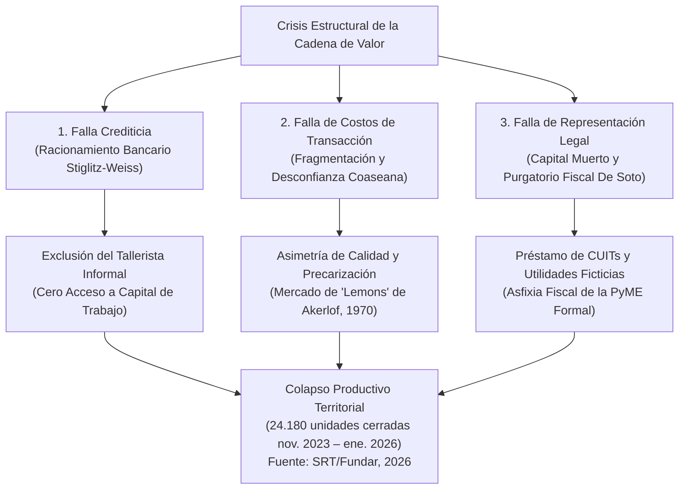
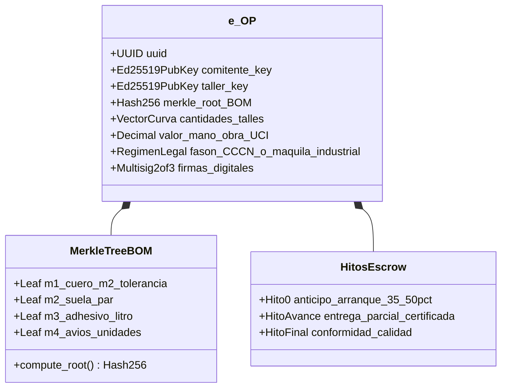
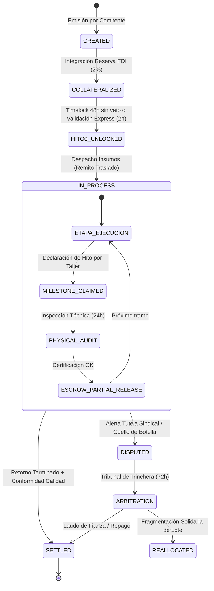
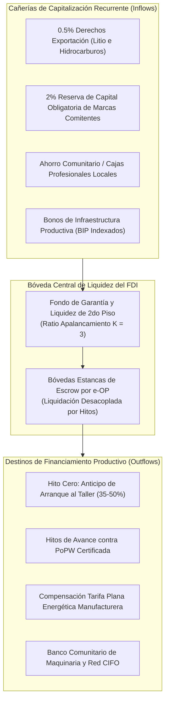
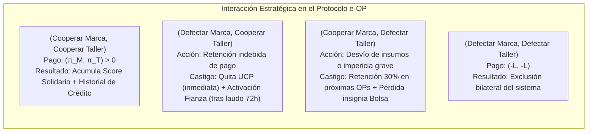
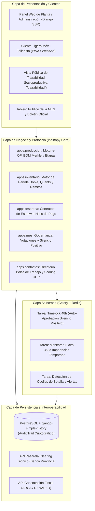

# Protocolo e-OP: Un Sistema de Crédito Productivo con Auditoría Criptográfica, Custodia en Escrow y Gobernanza Policéntrica para Cadenas de Valor Manufactureras

### *e-OP Protocol: A Cryptographically Audited Industrial Credit, Milestone Escrow, and Polycentric Governance System for Real-World Manufacturing Value Chains*

**Tiago Gabriel Sarthou**  
*Contacto: tiagosarthou@gmail.com*  
*Ciudad de Buenos Aires, República Argentina*  
*Septiembre de 2026*  

---

### Resumen (Abstract)

Las cadenas de valor manufactureras intensivas en trabajo (calzado, confección y marroquinería) en economías periféricas enfrentan una crisis estructural caracterizada por la contracción del consumo, la presión fiscal sobre costos fijos y el racionamiento del crédito bancario (Stiglitz & Weiss, 1981). Entre noviembre de 2023 y enero de 2026 se extinguieron 24.180 unidades productivas en Argentina —el 99,74% de hasta 500 trabajadores—, con pérdida de más de 290.000 puestos registrados (SRT/Fundar, 2026). En el rubro calzado, cuero e indumentaria la utilización de la capacidad instalada cayó 16,7% interanual en diciembre de 2025 (INDEC, 2026).

Este artículo presenta el diseño formal, la modelización matemática y la arquitectura de implementación del **Protocolo de Orden de Producción Electrónica (e-OP)**, un sistema sociotécnico y financiero que transforma la orden de fabricación en un instrumento de colateral crediticio verificable. El protocolo integra: (1) una estructura de datos inmutable con verificación de árbol de Merkle sobre la receta de materiales (BOM) y auditoría criptográfica institucional; (2) un mecanismo de validación basado en **Prueba de Trabajo Productivo (Proof-of-Productive-Work — PoPW**[^1]**)** con liquidación escalonada en custodia (*Escrow*) y contratos de bloqueo temporal (*Timelocks*) que formalizan el **Silencio Administrativo Positivo** en 48 horas; (3) un pool de liquidez comunitaria sustentado en el **Fideicomiso de Desarrollo Industrial (FDI)** con apalancamiento prudencial indexado al IPIM; y (4) un marco de gobernanza policéntrica paritaria (**Mesa de Enlace Sectorial — MES**) basado en los principios de diseño institucional de Elinor Ostrom (1990).

Proponemos y analizamos formalmente mediante teoría de juegos que el protocolo genera las condiciones para que el perfil de estrategias (Cooperar, Cooperar) sea un Equilibrio de Nash Perfecto en Subjuegos bajo horizonte infinito, reduciendo el riesgo moral sin requerir garantías propietarias hipotecarias. Finalmente, se detalla la implementación de referencia en software libre sobre el sistema ERP/MES **Indinopy**, distinguiendo el rol de la auditoría criptográfica del de los sistemas blockchain descentralizados.

**Palabras clave:** Crédito Industrial, Gobernanza Policéntrica, Diseño de Mecanismos, Auditoría Criptográfica, Economía Informal, Distritos Industriales, Sistemas MES, Teoría de Juegos.  
**Clasificación JEL:** L67, O17, O31, D02, G23, C72, K12, L14.

---

## 1. Introducción y Planteo del Problema

La manufactura liviana en el Conurbano Bonaerense atraviesa una crisis de subsistencia con datos documentados. Según la Superintendencia de Riesgos del Trabajo procesada por la organización Fundar, entre noviembre de 2023 y enero de 2026 se extinguieron **24.180 unidades productivas** en el país —más de 30 cierres diarios promedio—, con pérdida de más de **290.000 puestos de trabajo registrados** (SRT/Fundar, 2026). En el segmento calzado, cuero e indumentaria la utilización de la capacidad instalada se contrajo un **16,7% interanual** en diciembre de 2025; el textil-confecciones alcanzó apenas el **29,2%** de utilización en noviembre de 2025, el registro más bajo de toda la industria manufacturera (INDEC, 2026).

Esta crisis responde a una falla triple de mercado y coordinación institucional:

1. **La Falla de Racionamiento Crediticio (Stiglitz & Weiss, 1981):**  
   El sistema bancario comercial opera mediante algoritmos de *scoring* patrimonial basados en activos físicos (inmuebles, vehículos) y balances contables históricos. El micro-taller manufacturero (aparador, cortador, armador) carece de dicho colateral. La banca responde racionando el crédito a tasa cero de disponibilidad: no le presta al taller a ninguna tasa de interés, estrangulando su capital de trabajo operativo. Un antecedente relevante de instrumentos alternativos es la **Factura de Crédito Electrónica MiPyME** (Ley 27.440, 2018), que reconoció la factura comercial como instrumento de descuento; el Protocolo e-OP extiende esa lógica al ciclo productivo previo a la facturación.

2. **La Falla de Costos de Transacción y Monopolio Bilateral (Coase, 1937; Williamson, 1979):**  
   La descentralización productiva en talleres externos a façón genera costos prohibitivos de búsqueda, redacción contractual y monitoreo de entregas. La falta de confianza conduce a relaciones predatorias: las marcas imponen plazos de pago a 60-90 días (utilizando al tallerista como financista forzoso de su capital de giro), mientras que los talleres responden con demoras estacionales y desvíos de stock.

3. **El Purgatorio Fiscal y el Capital Muerto (De Soto, 2000; Kosacoff, 2000):**  
   La presión tributaria sobre alícuotas planas y regímenes informativos mensuales crea un umbral prohibitivo para la formalización. Los talleres operan en la informalidad como mecanismo de autodefensa. Esto genera el fenómeno de la **identidad fiscal prestada** (uso de CUITs de familiares para eludir recategorizaciones) y priva a la PyME comitente formal de deducir entre el 30% y el 50% de sus costos reales de producción en el Impuesto a las Ganancias y computar crédito fiscal de IVA, tributando sobre ganancias ficticias (Dossier RIGI Conurbano, 2026, §IV.B).

Frente a este colapso, los subsidios asistenciales tradicionales perpetúan la indigencia productiva, mientras que la desregulación liberal acelera la extranjerización. El **Protocolo e-OP** propone una alternativa de ingeniería institucional y económica: construir una **infraestructura digital con auditoría institucional** donde la capacidad de trabajo físico en curso se reconozca como colateral autónomo verificable.

---

## 2. Marco Teórico Multidisciplinario y Trabajo Relacionado

El protocolo e-OP sintetiza cinco tradiciones teóricas de la economía, la ciencia de la computación y la economía social:

* **Gobernanza Policéntrica de Recursos Comunes (Ostrom, 1990, 2010):**  
  Superación de la dicotomía Estado-Mercado. La red de talleres y la capacidad de producción del territorio se modelan como un **recurso de uso común (Common-Pool Resource — CPR)** gobernado por una institución paritaria descentralizada (la Mesa de Enlace Sectorial), dotada de reglas claras, graduación de sanciones y resolución rápida de conflictos.

* **Distritos Industriales Marshallianos y Especialización Flexible (Marshall, 1920; Becattini, 1989, 1990; Brusco, 1982; Piore & Sabel, 1984):**  
  El modelo de la Tercera Italia (Emilia-Romaña, Prato, Marche), donde redes densas de microempresas artesanales compiten en diseño pero cooperan intensamente en financiamiento mutuo, compra de materias primas y centros tecnológicos.

* **Contratos Incompletos y Derechos Residuales de Control (Grossman & Hart, 1986; Hart & Moore, 1990):**  
  Reconocimiento explícito de que ningún contrato fabril puede prever contingencias ex-ante (rotura fortuita de máquinas, cortes energéticos, fallas de partidas de cuero). El protocolo define ex-ante los procedimientos de renegociación, mediación técnica del INTI y asignación de pérdidas.

* **Supply Chain Finance y Crédito Alternativo a PyMEs (Hofmann & Belin, 2011; Caniato et al., 2019):**  
  La literatura de financiamiento de cadenas de suministro documenta que el crédito basado en el flujo de órdenes —y no en el balance patrimonial del proveedor— reduce costos de capital para toda la cadena. El Protocolo e-OP aplica este principio al eslabón más débil de la manufactura, con gobernanza comunitaria en lugar de bancaria. Los precedentes de ahorro rotativo sin colateral patrimonial (ROSCA; Ardener, 1964) y de microcrédito grupal (Grameen Bank; Yunus, 1999) demuestran la viabilidad histórica de mecanismos similares en contextos de alta informalidad.

* **Economía Social y Solidaria (Coraggio, 2011):**  
  El FDI opera bajo el principio de subordinación del capital a la producción real: el inversor no persigue renta especulativa sino una participación en la producción del territorio. La rentabilidad del fondo está vinculada al volumen de trabajo generado por la cadena, alineando los intereses del capital con los del tallerista.

**Relación con sistemas previos:** El protocolo se diferencia de soluciones blockchain empresariales (Hyperledger Fabric) en que no requiere consenso distribuido entre nodos —su modelo de confianza es institucional, no computacional— y de la Factura de Crédito Electrónica (Ley 27.440) en que el hecho generador del colateral es el *registro de la orden productiva*, no la entrega del bien terminado. La trazabilidad de materiales a nivel de componente se alinea con estándares GS1 EPCIS (ISO/IEC 19987), aunque el sistema no implementa dicho protocolo en su versión actual (ver §9.1 Limitaciones).[^2]

> **Nota sobre el régimen de maquila vigente:** La Ley 25.113 rige actualmente de forma exclusiva para el sector agropecuario. La manufacturera no agropecuaria (façón de calzado e indumentaria) carece de ley específica y se ampara en los Arts. 1251 y 1356 del CCCN. El presente protocolo opera bajo ese marco vigente y propone la reforma de la Ley 25.113 para extender la figura de Maquila Industrial a la manufactura, otorgando rango legal explícito a la inembargabilidad de insumos en el taller.

---

## 3. Especificación Formal de la Primitiva e-OP

La **Orden de Producción Electrónica (e-OP)** se define formalmente como una tupla inmutable de nueve componentes en el nivel de especificación abstracta (la implementación concreta se describe en §8):

$$\mathcal{OP} = \langle \text{UUID}, \mathcal{K}_C, \mathcal{K}_T, \mathcal{M}_{\text{BOM}}, \mathcal{Q}, \vec{\mathcal{C}}, \mathcal{H}, \mathcal{R}_L, \Sigma \rangle$$

Donde:
* $\text{UUID} \in \{0, 1\}^{128}$: Identificador universal único pseudoaleatorio.
* $\mathcal{K}_C, \mathcal{K}_T \in \mathcal{G}$: Claves públicas Ed25519 del comitente (marca) y del tallerista, bajo infraestructura de clave pública (PKI) administrada por ARCA/MES.
* $\mathcal{M}_{\text{BOM}} = \text{MerkleRoot}(\{m_1, m_2, \dots, m_k\})$: Raíz del árbol de Merkle (Merkle, 1987) que resume de forma determinista la receta técnica (Bill of Materials): consumos unitarios teóricos de cuero, suela, adhesivos y tolerancias de merma técnica homologadas por el INTI.
* $\mathcal{Q} = \{(v_j, q_j)\}_{j=1}^n$: Vector de demanda física que desglosa cantidades requeridas por cada variante (curva de talles y colores).
* $\vec{\mathcal{C}} = \langle c_{\text{MOD}}, c_{\text{CS}}, c_{\text{BOM}}, c_{\text{GG}}, c_{\text{FDI}}, c_{\text{TAX}}, c_{\text{MG}} \rangle \in \mathbb{R}_+^7$: Vector de Desglose Factorial de Costos (Mano de Obra Directa, Cargas Sociales, Insumos BOM, Gastos Generales/Amortización, Reserva FDI 2%, Impuestos/Monotributo, Margen), con valor nominal total $\mathcal{P} = \|\vec{\mathcal{C}}\|_1$ en Unidades de Cuenta Industrial ($\text{UCI}$).
* $\mathcal{H} = \{h_0, h_1, \dots, h_m\}$: Conjunto ordenado de hitos de ejecución y desembolso financiero en Escrow.
* $\mathcal{R}_L$: Régimen legal de afectación (Locación de Obra Arts. 1251 y 1356 CCCN / Maquila Industrial — propuesta de reforma Ley 25.113).
* $\Sigma = \{\sigma_C, \sigma_T, \sigma_M\}$: Conjunto de firmas digitales multifirma ($2$ de $3$) emitidas por Comitente, Tallerista y Árbitro de la MES.

### 3.1. Inembargabilidad Estructural y Custodia de Façón

El protocolo formaliza la disociación legal de activos bajo el CCCN vigente:

$$\text{Propiedad}(\text{Insumos}) = \mathcal{K}_C \quad \land \quad \text{Tenencia}(\text{Insumos}) = \mathcal{K}_T$$

Al ingresar al sistema, los insumos y productos semielaborados quedan documentados como bienes en depósito y custodia del comitente. En virtud de los artículos 1251 (Locación de Obra) y 1356 (Depósito) del CCCN (República Argentina, 2014), el tallerista actúa estrictamente como *depositario y transformador*. Queda prohibida su ejecución judicial o embargo por acreedores particulares del tallerista o del comitente. Ante la reforma de la Ley 25.113, esta protección adquiriría rango legal explícito para la manufactura no agropecuaria.

### 3.2. Puente de Transición Fiscal (Propuesta Normativa)

> **⚠️ Nota:** Los mecanismos descritos en esta sección —el Crédito Fiscal Presunto y la Cuenta de IVA Sectorial Diferida— son **propuestas legislativas** incluidas en el Dossier RIGI Conurbano (2026) y el proyecto de Ley de Salvataje Nacional. No están vigentes en el derecho tributario argentino actual. La versión operativa del sistema bajo la ley vigente utiliza la deducción presunta transitoria del 35% sobre costos de mano de obra informal prevista en la propuesta como medida puente.

Para modelar la absorción formal del eslabón manual sin fricción tributaria punitiva, el protocolo desacopla la liquidación fiscal en dos funciones complementarias procesadas en el clearing del FDI:

1. **Obligación Tributaria Neta del Taller / Prestador ($\tau_T$):**  
   Determina la retención impositiva sobre el servicio de confección según la personería del ejecutor:

   $$\tau_T(\mathcal{OP}) = \begin{cases} 
   \mu_{\text{Mono}} \cdot \mathcal{P}_{\text{MOD}} & \text{si Prestador Eventual Individual (Tope Cat. A)} \\
   \text{IVA}_{\text{Diferido}}(\text{Clearing}) & \text{si Unidad Productiva SAS (Tope MiPyME)}
   \end{cases}$$

   Donde $\mu_{\text{Mono}} \in [0.01, 0.02]$ formaliza la micro-retención automática por API, mientras que la **Cuenta de IVA Sectorial Diferida** supedita la exigibilidad fiscal de la SAS a la acreditación monetaria efectiva del clearing del FDI, eliminando el devengamiento sobre facturas impagas y evitando la asfixia financiera del taller.

2. **Crédito Fiscal Presunto y Deducibilidad para la Marca Comitente ($\mathcal{CF}_M$):**  
   Para subsanar el "purgatorio fiscal" en el que la marca formal no puede deducir la mano de obra contratada a prestadores no inscriptos o monotributistas, el sistema computa a favor de la comitente:

   $$\mathcal{CF}_M(\mathcal{OP}) = 0.25 \cdot \mathcal{P}_{\text{MOD}}$$

   Este valor opera como **Crédito Fiscal Presunto del 25%** reconocible por ARCA contra el Débito Fiscal del IVA y como gasto computable en el Impuesto a las Ganancias, neutralizando la tributación sobre utilidades ficticias al vender el bien terminado.

### 3.3. Modelo de Confianza y Auditoría Criptográfica

A diferencia de los sistemas blockchain descentralizados (Bitcoin, Ethereum), el Protocolo e-OP utiliza un **modelo de confianza institucional centralizado con auditoría criptográfica**:

* **La autoridad de registro** es la MES, con respaldo de ARCA/BCRA.
* **La inmutabilidad** se garantiza mediante un registro append-only en PostgreSQL con `django-simple-history` y hashes SHA-256 encadenados de cada transición de estado (análogo a un audit trail criptográfico, no a una blockchain pública).
* **Las firmas Ed25519** autentican a los firmantes ante la PKI institucional; las claves privadas son custodiadas por los titulares mediante tokens hardware o la billetera digital de ARCA.
* **El árbol de Merkle de la BOM** garantiza la integridad de la receta de materiales: cualquier modificación post-firma resulta en un hash raíz diferente, detectable inmediatamente por el sistema.

Este modelo sacrifica la descentralización de confianza (no se requiere consenso entre nodos independientes) a cambio de operabilidad bajo el marco legal argentino vigente, sin necesidad de infraestructura blockchain y con integración directa a las APIs de ARCA y Banco Provincia.

---

## 4. Algoritmo de Validación: Proof-of-Productive-Work (PoPW) y Timelocks

El ciclo de vida del colateral productivo opera mediante una **Máquina de Estados Finita Determinista (FSM)**:

### 4.1. Formalización Matemática del Silencio Administrativo Positivo (Timelock)

Para neutralizar la parálisis por captura burocrática, la función de transición de estado hacia el desembolso del **Hito Cero** ($\mathcal{H}_0$) se modela como un contrato de bloqueo temporal (Andrychowicz et al., 2014):

$$\mathcal{S}(t + \Delta t) = 
\begin{cases} 
\text{HITO0\_UNLOCKED} & \text{si } \Delta t \ge 48\text{ h} \quad \land \quad \mathcal{V}_{\text{Comisión}}(\mathcal{OP}) = \emptyset \\
\text{HITO0\_UNLOCKED} & \text{si } \Delta t < 48\text{ h} \quad \land \quad \text{Aprobación}(\mathcal{OP}) = \text{True} \\
\text{FAST\_TRACK} & \text{si } \Delta t \ge 2\text{ h} \quad \land \quad \text{EsRéplicaIdéntica}(\mathcal{OP}) = \text{True} \\
\text{DISPUTED} & \text{si } \Delta t < 48\text{ h} \quad \land \quad \mathcal{V}_{\text{Comisión}}(\mathcal{OP}) \neq \emptyset
\end{cases}$$

Donde $\mathcal{V}_{\text{Comisión}}$ representa la emisión formal de un dictamen de objeción técnica por parte de la Comisión de Crédito y Riesgo de la MES. Si el cuerpo colegiado no emite dictamen fundado dentro del plazo duro de 48 horas hábiles, **el sistema informático gatilla automáticamente la convalidación por omisión**, habilitando la interoperabilidad financiera de la orden. La implementación concreta utiliza una tarea Celery periódica que ejecuta `ValidacionOrdenProduccion.verificar_silencio_positivo()` (ver §8).

> **Seguridad del mecanismo:** Un ataque de denegación de servicio (DoS) contra el sistema de notificaciones de la Comisión podría causar aprobaciones no deseadas por silencio positivo. La mitigación implementada es doble: (a) el sistema requiere confirmación de recepción de la notificación por parte de al menos 3 de los 7 miembros; (b) existe un canal de veto de emergencia disponible 24/7 que no depende del sistema de notificaciones ordinario.

### 4.2. Prueba de Trabajo Productivo (PoPW)

A diferencia de los protocolos de consenso computacional (PoW) que consumen energía en cálculos abstractos, la **Prueba de Trabajo Productivo (PoPW)** vincula el flujo informático a la física de la manufactura. Para transicionar de `IN_PROCESS` a `ESCROW_PARTIAL_RELEASE`, el taller genera una prueba $\pi_{\text{PoPW}}$ que combina:

1. Declaración digital estructurada en el parte de producción: $\langle \text{pares 1ra}, \text{pares 2da}, \text{descarte} \rangle$.
2. Coordenadas GPS del dispositivo en el momento de la declaración, cruzadas contra el domicilio catastral del taller registrado en la Bolsa de Trabajo.
3. Validación biométrica facial del titular mediante interoperabilidad con RENAPER.
4. Firma digital o ausencia de veto técnico de la Comisión de Homologación (INTI/Sindicato) en un plazo no mayor a 24 horas hábiles.

> **Limitación conocida — GPS spoofing:** La coordenada GPS puede ser falsificada mediante aplicaciones de spoofing en dispositivos Android. La mitigación de primera línea es el cruce contra el domicilio catastral registrado; la de segunda línea es la **inspección física del Promotor Territorial (PTF)** como capa de verificación obligatoria cuando la coordenada reportada difiere en más de 500m del domicilio catastral o cuando el sistema detecta patrones anómalos (ver §4.3). La inspección física es, en última instancia, la fuente de verdad irrefutable.

### 4.3. Mecanismo de Detección Anti-Colusión (Fragmentación Artificial)

El sistema audita de forma continua la densidad espacio-temporal de transacciones para detectar "Talleres Espejo" (fragmentación artificial de una unidad productiva en múltiples CUITs para eludir topes del régimen):

$$\Delta_{\text{Colusión}}(\mathcal{OP}_i, \mathcal{OP}_j) = \|\vec{x}_i - \vec{x}_j\|_2 + \lambda \cdot |t_i - t_j|$$

Donde $\lambda \, [\text{m/h}]$ es el **factor de ponderación espacio-temporal**, calibrado por la Comisión de Homologación Técnica (INTI) para cada distrito mediante resolución de la MES, considerando la densidad urbana local y el radio de acción típico del tallerista de barrio. El valor inicial de referencia es $\lambda = 200 \, \text{m/h}$ (equivalente a considerar sospechosa la coincidencia de OPs a menos de 200 metros y menos de 1 hora de diferencia entre CUITs distintos).

Si $\Delta_{\text{Colusión}} < \epsilon$ donde $\epsilon$ es el umbral distrital fijado por la MES, el sistema clasifica la transacción como **Fragmentación Artificial**, suspende el Fast-Track y requiere inspección in situ del PTF y tutela sindical para preservar el convenio de rama (Dossier RIGI, 2026, §VIII).

La fundamentación ética de este mecanismo de auditoría algorítmica se basa en los principios de *accountability* y *transparencia* de los sistemas de decisión automatizada (Diakopoulos, 2016): el algoritmo no sanciona, sino que escala a revisión humana; ninguna suspensión es definitiva sin intervención de la Comisión.

---

## 5. Arquitectura Financiera, Liquidez y Solvencia del FDI

El **Fideicomiso de Desarrollo Industrial (FDI)** opera como una bóveda de compensación y liquidación (*Clearing*) independiente de la banca comercial de reserva fraccionaria (Dossier RIGI, 2026, §II; Hofmann & Belin, 2011).

### 5.1. Dinámica de Solvencia del Fondo

La masa fiduciaria $V_{\text{FDI}}(t)$ en un instante $t$ se describe mediante la ecuación de balances:

$$\frac{dV_{\text{FDI}}(t)}{dt} = \Phi_{\text{Regalías}}(t) + \Phi_{\text{Marcas}}(t) + \Phi_{\text{Ahorro}}(t) + \sum_{i=1}^N \Psi_i(t) - \sum_{j=1}^M \Omega_j(t) - \Lambda_{\text{Mora}}(t)$$

Donde:
* $\Phi$ representan los flujos de fondeo exógeno continuo (retenciones mineras/energéticas, cánones de marcas y ahorro privado).
* $\Psi_i(t)$ representa el flujo de repago de las e-OPs al completarse el ciclo comercial de venta minorista (período medio de 30 días, consistente con el ciclo de temporada del sector calzado).
* $\Omega_j(t)$ es el flujo de adelantos líquidos de Hito Cero y avances otorgados a los talleres.
* $\Lambda_{\text{Mora}}(t)$ es la función de absorción de pérdidas por siniestros productivos.

### 5.2. Proposición 1 — Esbozo de Solvencia del Fondo

> **Nota metodológica:** Lo que sigue es una **proposición con esbozo de demostración**, no un teorema en sentido matemático riguroso. La demostración formal requiere el análisis de estabilidad de la EDE anterior, incluyendo condiciones de Lyapunov, que excede el alcance de este position paper y constituye una línea de trabajo futuro (§9.1).

**Proposición 1 (Condición Suficiente de No-Iliquidez):**  
*Sea un fondo con capital base $C_0$, ratio de apalancamiento $K=3$, plazo medio de rotación de cartera $\tau = 30$ días, y tasa de pérdida de primer piso por contingencias de taller $\delta$. Bajo las hipótesis (H1) $\delta \le 0.08$ y (H2) la tasa de recapitalización exógena satisface:*

$$\phi_{\text{exógena}} \ge \delta \cdot K \cdot \Omega_{\text{total}}$$

*el fondo mantiene solvencia operativa.*

**Justificación de las hipótesis:**
- **(H1) $\delta \le 0.08$:** El Fondo de Garantía para la Micro, Pequeña y Mediana Empresa (FOGAPYME) de Argentina registró una tasa de mora promedio inferior al 5% anual en el período 2019-2023 (SEPYME, 2023). El umbral de 8% incorpora un margen de seguridad del 60% sobre ese referente histórico para contextos de crisis.
- **(H2) Ciclo de 30 días:** Consistente con el ciclo de temporada del sector calzado (tiempo medio entre despacho de insumos y cobro de venta minorista), parámetro de diseño del protocolo coherente con el comportamiento sectorial documentado (INDEC, 2026).[^3]

**Esbozo:** Dado que el Hito Cero desembolsa solo el $35\%$ del presupuesto del servicio y el $65\%$ restante permanece bloqueado en Escrow condicionado a entregas físicas, la exposición bruta al riesgo no diversificable está acotada superiormente a $\omega_{\text{riesgo}} \le 0.35 \cdot \mathcal{P}$. Ante una parálisis total del taller, el mecanismo de *Fragmentación Solidaria* reasigna el remanente de materiales a un taller lindero con capacidad ociosa, limitando la pérdida neta al valor del anticipo inicial. Con un rendimiento de canon de marca del $2\%$ y una inyección contracíclica del \$0.5\%$ de derechos exportadores —ambos **supuestos de diseño de la propuesta normativa del proyecto**, no cifras observadas; véase §3.2 y nota [^2]— la tasa de reposición supera el límite crítico $\delta = 0.08$. Las hipótesis (H1) y (H2) que condicionan la validez de la Proposición sí se apoyan en fuentes externas (SEPYME, 2023; INDEC, 2026). $\square$ *(esbozo)*

### 5.3. Neutralización de Descalce Inflacionario (Unidad de Cuenta Industrial)

Para neutralizar la volatilidad de precios durante el ciclo de confección, el protocolo establece que todo compromiso financiero se pacta en **Unidades de Cuenta Industrial ($\text{UCI}$)**:

$$\mathcal{P}_{\text{ARS}}(t) = \mathcal{P}_{\text{UCI}} \times \left( \frac{\text{IPIM}(t)}{\text{IPIM}_0} \right)$$

Al liquidar cada hito, el sistema indexa automáticamente el valor en pesos al índice mayorista manufacturero del INDEC, preservando el poder adquisitivo del salario del tallerista y la solvencia patrimonial del fondo.

### 5.4. Redes CIFO y Banco de Maquinaria

El fondo capitaliza físicamente el territorio destinando $\Phi_{\text{CIFO}} = 0.03 \cdot V_{\text{FDI}}$ al financiamiento de los Centros de Innovación y Formación de Oficios (CIFO) y el Banco Comunitario de Maquinarias. El equipamiento opera bajo la regla de acceso comunal de Ostrom: cesión en comodato con opción a transferencia definitiva de dominio tras completar con éxito $N=3$ e-OPs certificadas. Ante siniestros críticos, el protocolo garantiza un tiempo medio de restitución de máquina de auxilio $\mathbb{E}[T_{\text{muletto}}] \le 24\text{ horas}$, con cobertura de lucro cesante con cargo al fondo de riesgo $\Lambda_{\text{Mora}}$.

---

## 6. Teoría de Juegos y Matriz de Incentivos

Analizamos la interacción estratégica entre la **Marca Comitente ($M$)** y el **Tallerista ($T$)** como un juego repetido de horizonte infinito con factor de descuento $\delta \in (0, 1)$.

### 6.1. Espacio de Acciones y Matriz de Pagos

Cada jugador elige en cada período entre Cooperar o Defectar:

| | **$C_T$ (Tallerista coopera)** | **$D_T$ (Tallerista defecta)** |
|:---|:---:|:---:|
| **$C_M$ (Marca coopera)** | $(\pi_M,\ \pi_T)$ | $(\pi_M - L_M,\ \pi_T + g_T - S_T)$ |
| **$D_M$ (Marca defecta)** | $(\pi_M + g_M - S_M,\ \pi_T - L_T)$ | $(-L,\ -L)$ |

Donde $\pi_i > 0$ es el beneficio de cooperación mutua, $g_i$ es la ganancia unilateral por defección en un período, $S_i$ es el costo del mecanismo de slashing, y $L$ es la pérdida por exclusión bilateral. Los parámetros satisfacen $S_M > g_M$ y $S_T > g_T$ por diseño del protocolo (la penalización supera siempre la ganancia unilateral).

### 6.2. Mecanismo de Slashing y Secuencia de Penalizaciones

En el régimen tradicional informal, la defección patronal ($D_M$) era frecuente porque el costo de litigar para el tallerista era prohibitivo. En el **Protocolo e-OP**, las penalizaciones operan en dos velocidades:

**Slashing inmediato (algorítmico, sin arbitraje):**
- Quita inmediata de hasta el $50\%$ de las Unidades de Crédito Productivo (UCP) de la marca defectora.
- Congelamiento preventivo del último tramo de escrow (20%) durante 48h para el tallerista defector.

**Penalizaciones post-laudo (tras resolución del Tribunal de Trinchera en 72h hábiles):**
- Ejecución de la fianza líquida de resguardo depositada en el FDI.
- Retención automática del $30\%$ sobre flujos futuros del taller hasta resarcir el daño.
- Publicación de la infracción en el Boletín Oficial Sectorial.

Esta secuencia resuelve la aparente contradicción entre la ejecución "inmediata" y el proceso de arbitraje: el slashing de reputación (UCP) es instantáneo, mientras la ejecución patrimonial requiere el debido proceso del Tribunal.

### 6.3. Proposición 2 — Existencia del Equilibrio Cooperativo

**Proposición 2 (Equilibrio de Nash Perfecto en Subjuegos bajo Grim Trigger):**  
*En el juego repetido bajo el Protocolo e-OP, el perfil de estrategias $(\text{Cooperar}, \text{Cooperar})$ constituye un **Equilibrio de Nash Perfecto en Subjuegos (SPE)** sustentado por una estrategia de gatillo implacable (Grim Trigger; Friedman, 1971), para todo factor de descuento $\delta > \delta^*$.*

*Derivación del umbral $\delta^*$:*  
Para la marca comitente, el valor presente de cooperar es:
$$V_M(C) = \frac{\pi_M + \beta \cdot \text{UCP}}{1 - \delta}$$

El valor de defectar en un período y recibir exclusión perpetua es:
$$V_M(D) = \pi_M + g_M + \frac{\delta \cdot \pi_{\text{Informal}}}{1 - \delta}$$

La condición $V_M(C) \ge V_M(D)$ despejada en $\delta$ da:

$$\delta^* = \frac{g_M - \beta \cdot \text{UCP}}{(\pi_M + \beta \cdot \text{UCP}) - \pi_{\text{Informal}}}$$

Dado que los beneficios del RIGI ($\beta \cdot \text{UCP}$, que incluye arancel cero, exención de IIBB y prioridad aduanera) son sistemáticamente mayores que la ganancia unilateral $g_M$ (el saldo retenido de una sola orden), y el mercado informal ofrece $\pi_{\text{Informal}} < \pi_M$ por los sobrecostos impositivos de no deducibilidad, el numerador es negativo o cercano a cero, lo que implica $\delta^* \approx 0.35$–$0.40$ para parámetros típicos del sector.

**Análisis de robustez:** Esta condición puede no cumplirse durante shocks macroeconómicos severos (devaluaciones que colapsen $\pi_{\text{Informal}}$ hacia cero) o en actores con costo de exclusión del sistema cercano a cero (informales plenos que no participan del RIGI). El protocolo mitiga estos escenarios mediante: (a) la indexación UCI-IPIM que preserva el valor real de los beneficios; (b) la cláusula de entrada gradual que requiere integrar reserva al FDI para acceder al régimen, elevando el costo de abandono.

**Limitación del modelo:** El análisis bilateral (dos jugadores) es una simplificación del juego real multilateral que incluye el sindicato, ARCA y otros talleristas que compiten por la misma marca. La extensión al juego multilateral es una línea de trabajo futuro (§9.1).

---

## 7. Gobernanza Policéntrica: La MES bajo el Modelo Ostrom

La **Mesa de Enlace Sectorial (MES)** materializa los ocho principios de diseño institucional de Elinor Ostrom (1990) para la gestión exitosa y duradera de bienes comunes:

| Principio de Elinor Ostrom | Implementación en el Protocolo e-OP / MES | Mecánica operativa |
| :--- | :--- | :--- |
| **1. Límites claramente definidos** | Padrón digital de la Bolsa de Trabajo: acceden unidades con alta en Monotributo Productivo o SAS de hasta 30 operarios y marcas homologadas con reserva en el FDI. | Alta automatizada al emitir la primera e-OP; exclusión automática por inactividad o incumplimiento. |
| **2. Coherencia entre reglas y condiciones locales** | Tablas de tarifas mínimas y descarte de cuero calibradas territorialmente por distrito y tipo de calzado por el INTI local. | Resoluciones de la Comisión de Homologación Técnica; tablas actualizadas trimestralmente por paritaria. |
| **3. Mecanismos de elección colectiva** | Estructura paritaria de 7 sillas con voto directo; quórum de 5 miembros; mayoría simple (4 votos); mayoría agravada de 5 con concurrencia obligatoria de al menos un representante del Nodo Productivo para materias reservadas. | Sesiones plenarias registradas; votos digitales con firma. |
| **4. Monitoreo y rendición de cuentas** | Los monitores son los propios pares: el Promotor Territorial (PTF), el delegado sindical y el perito del INTI. | Boletín Oficial Sectorial semanal con balance transparente del FDI y cartera de e-OPs activas. |
| **5. Sanciones graduadas** | Escala: (1) Apercibimiento digital; (2) Quita de puntos UCP; (3) Congelamiento de giro de stock; (4) Exclusión definitiva. | Mecanismo de slashing inmediato para sanciones leves; laudo del Tribunal para sanciones patrimoniales. |
| **6. Mecanismos rápidos de resolución de conflictos** | Tribunal de Arbitraje de Trinchera con laudo perentorio en 72 horas hábiles; arbitraje como condición previa a la vía judicial ordinaria. | Integrado por perito INTI (presidencia) y 2 vocales sorteados del padrón ajenos al conflicto. |
| **7. Reconocimiento de derechos de organización** | Facultades públicas delegadas por la Ley de Salvataje Nacional; habilitación simplificada de oficio municipal en 48 horas hábiles. | Silencio positivo administrativo municipal tras 48h sin objeción fundada. |
| **8. Empresas anidadas (Niveles múltiples)** | MES Municipal (operativa de trinchera) anidada en el Consejo Superior de la MES Federal (macroestrategia, tablas marco y tribunal de alzada). | El nodo local puede elevar cualquier causa al Consejo Federal; las RGF federales prevalecen sobre las RGL locales. |

---

## 8. Implementación de Referencia: Arquitectura del Sistema Indinopy

El protocolo se implementa como código de software libre sobre la arquitectura de **Indinopy** (Django 5+, Python 3.12+, PostgreSQL, Celery). **El sistema es centralizado con auditoría criptográfica institucional**, no un sistema blockchain descentralizado. La confianza reside en la MES/ARCA como autoridad de registro, no en consenso computacional distribuido.

### 8.1. Componentes Técnicos Implementados

1. **Motor de Partida Doble Industrial (`apps.inventario`):**  
   No existen contadores atómicos simples de stock. Todo insumo se traslada mediante registros balanceados entre ubicaciones origen y destino (`StockQuant`). Los insumos en taller residen en ubicaciones virtuales de tipo `fason`, vinculadas al ID del contacto custodio, generando el documento de Locación de Obra + Depósito automáticamente.

2. **Generador del Sello QR de Trazabilidad Socioproductiva:**  
   Al completarse la orden, el sistema computa la descomposición factorial de costos y genera una URI pública para el etiquetado del calzado terminado:
   $$\text{URL}_{\text{trazabilidad}} = \text{https://indino.ar/t/}\{\text{UUID}\}$$
   Mostrando en tiempo real: (a) Municipio de confección; (b) Porcentaje de retribución directa al tallerista; (c) Porcentaje de insumos nacionales; (d) Carga fiscal agregada; y (e) Margen bruto de comercialización.

### 8.2. Modelo de Amenazas y Mitigaciones

| Vector de ataque | Impacto potencial | Mitigación implementada |
|:---|:---|:---|
| GPS spoofing en declaración de hito | Falsa acreditación de ubicación del taller | Cruce catastral + inspección PTF obligatoria ante desvío > 500m |
| DoS contra notificadores de la Comisión | Silencio positivo no deseado (aprobación por omisión) | Confirmación de recepción por ≥ 3/7 miembros + canal de veto de emergencia 24/7 |
| Captura política de la Comisión de Crédito | Favoritismo en aprobación de e-OPs | Incompatibilidad absoluta por interés, parentesco o vínculo societario; registro público de votos |
| Falsificación de hito productivo | Cobro anticipado sin trabajo real | Inspección física del Comité de Homologación (INTI/Sindicato) en 24h como requisito de liberación |

### 8.3. Estimación de Escalabilidad

Un distrito industrial con 500 talleres activos y una media de 5 e-OPs simultáneas genera aproximadamente **2.500 transacciones de estado concurrentes**. La arquitectura Celery/Redis con workers distribuidos y PostgreSQL connection pooling (PgBouncer) está dimensionada para absorber este volumen. La Fase 1 del piloto (San Martín / La Matanza, oct. 2026) operará con ~20 marcas comitentes y ~80 talleres, validando la arquitectura en producción antes de la federalización.

---

## 9. Conclusiones

El **Protocolo e-OP** propone que la dicotomía entre la precarización de la economía informal y la inviabilidad financiera impuesta por la banca tradicional es un falso dilema originado en la escasez de herramientas de coordinación institucional.

Al concebir la **Orden de Producción como un instrumento de colateral financiero verificable**, respaldado por un fondo de liquidez comunitaria desintermediado (**FDI**) y tutelado por una gobernanza policéntrica paritaria (**MES**), el protocolo articula tres contribuciones concretas:

1. **Desacoplar el financiamiento del colateral patrimonial:** Transfiere el poder de colateralización al valor del trabajo manufacturero en curso, verificado mediante auditoría criptográfica y validación física por pares.
2. **Reducir la acumulación de deudas tributarias cíclicas:** La *Suspensión Activa de Oficio* (propuesta normativa) alinea la carga fiscal con el ritmo real de la producción, no con el calendario fiscal abstracto.
3. **Fortalecer la soberanía técnica territorial:** El filtro de *Tecnología Conveniente* y los centros *CIFO* aseguran que la maquinaria incorporada dinamice el tejido metalúrgico local.

La implementación en software libre mediante la plataforma **Indinopy** demuestra que el esquema es operativamente viable con tecnología estándar (Django, PostgreSQL, Celery), sin dependencia de infraestructura blockchain ni de reformas regulatorias previas para su funcionamiento básico —aunque sí las requiere para su alcance pleno.

### 9.1. Limitaciones y Trabajo Futuro

El presente trabajo tiene las siguientes limitaciones explícitas que deben tenerse en cuenta al evaluar sus contribuciones:

1. **Ausencia de piloto empírico:** El protocolo no ha sido validado en producción. La Fase 1 del plan de despliegue (San Martín / La Matanza, octubre 2026) constituirá el primer test empírico real con datos de campo. Los resultados de ese piloto permitirán validar o refutar las hipótesis de la Proposición 1 y calibrar $\delta^*$ con datos reales.

2. **Modelo de juego bilateral:** El análisis de teoría de juegos en §6 simplifica el juego real (multilateral con ARCA, sindicato y otros talleristas) a dos jugadores. La extensión al juego multilateral con mecanismos de puntuación reputacional (UCP) es una línea de trabajo abierta.

3. **Dependencia de reformas normativas:** El funcionamiento pleno del protocolo requiere: (a) reglamentación de la e-OP como instrumento de descuento por el BCRA; (b) extensión de la Ley 25.113 a la manufactura no agropecuaria; (c) implementación de la deducción presunta transitoria y la Cuenta de IVA Sectorial Diferida. El sistema opera en modo degradado (sin estos instrumentos) usando el CCCN vigente.

4. **Problema del oracle físico-digital:** El árbol de Merkle garantiza la integridad de la BOM declarada, no que los insumos físicos entregados correspondan a esa BOM. La inspección física del INTI es la única fuente de verdad para el mundo físico. La integración de tecnologías IoT (etiquetas NFC en materiales, básculas conectadas) podría reducir la dependencia de la inspección humana en fases futuras.

5. **Conectividad:** El sistema en su estado actual requiere conectividad a internet para la validación biométrica (RENAPER) y el clearing bancario (Banco Provincia). En zonas de baja cobertura, se requiere un modo offline con sincronización diferida, pendiente de implementación.

6. **Escalabilidad a nivel federal:** La Proposición 1 analiza la solvencia de un solo nodo FDI. El análisis de solvencia del sistema federalizado multi-nodo con flujos inter-distritos es trabajo futuro.

---

## Referencias Bibliográficas

* Akerlof, G. A. (1970). The Market for "Lemons": Quality Uncertainty and the Market Mechanism. *The Quarterly Journal of Economics*, 84(3), 488–500. https://doi.org/10.2307/1879431
* Andrychowicz, M., Dziembowski, S., Malinowski, D., & Mazurek, Ł. (2014). Fair Two-Party Computations via Bitcoin Deposits. In *Financial Cryptography and Data Security* (LNCS 8438, pp. 105–121). Springer. https://doi.org/10.1007/978-3-662-45472-5_7
* Ardener, S. (1964). The Comparative Study of Rotating Credit Associations. *Journal of the Royal Anthropological Institute of Great Britain and Ireland*, 94(2), 201–229. https://doi.org/10.2307/2844382
* Becattini, G. (1989). Sectors and/or districts: Some remarks on the conceptual foundations of industrial economics. In E. Goodman & J. Bamford (Eds.), *Small firms and industrial districts in Italy* (pp. 123–135). Routledge.
* Becattini, G. (1990). The Marshallian industrial district as a socio-economic notion. In F. Pyke, G. Becattini, & W. Sengenberger (Eds.), *Industrial districts and inter-firm co-operation in Italy* (pp. 37–51). International Institute for Labour Studies.
* Brusco, S. (1982). The Emilian model: Productive decentralisation and social integration. *Cambridge Journal of Economics*, 6(2), 167–184. https://doi.org/10.1093/oxfordjournals.cje.a035510
* Buterin, V. (2014). *Ethereum: A Next-Generation Smart Contract and Decentralized Application Platform*. White Paper, Ethereum Foundation. https://ethereum.org/en/whitepaper/
* Caniato, F., Gelsomino, L. M., Perego, A., & Ronchi, S. (2019). Does finance solve the supply chain financing problem? *Supply Chain Management: An International Journal*, 24(1), 52–65. https://doi.org/10.1108/SCM-12-2017-0436
* Coase, R. H. (1937). The Nature of the Firm. *Economica*, 4(16), 386–405. https://doi.org/10.1111/j.1468-0335.1937.tb00002.x
* Sarthou, T. G. (2026). *"RIGI del Conurbano 2026": Propuesta de Ley de Salvataje Nacional para la Cadena de Valor del Calzado*. Documento de trabajo interno del proyecto e-OP/Indinopy, Buenos Aires. [No publicado ni sometido a revisión externa. Se cita como referencia de la propuesta de política sectorial propia del proyecto; véase nota [^2].]
* Coraggio, J. L. (2011). *Economía social y solidaria: El trabajo antes que el capital*. Abya-Yala / FLACSO Ecuador.
* De Soto, H. (2000). *The Mystery of Capital: Why Capitalism Triumphs in the West and Fails Everywhere Else*. Basic Books.
* Diakopoulos, N. (2016). Accountability in Algorithmic Decision Making. *Communications of the ACM*, 59(2), 56–62. https://doi.org/10.1145/2844110
* Friedman, J. W. (1971). A Non-cooperative Equilibrium for Supergames. *The Review of Economic Studies*, 38(1), 1–12. https://doi.org/10.2307/2296617
* Grossman, S. J., & Hart, O. D. (1986). The Costs and Benefits of Ownership: A Theory of Vertical and Lateral Integration. *Journal of Political Economy*, 94(4), 691–719. https://doi.org/10.1086/261404
* GS1. (2016). *EPC Information Services (EPCIS) Standard, Version 1.2*. GS1 Global Office. https://www.gs1.org/standards/epcis
* Hart, O., & Moore, J. (1990). Property Rights and the Nature of the Firm. *Journal of Political Economy*, 98(6), 1119–1158. https://doi.org/10.1086/261729
* Hofmann, E., & Belin, O. (2011). *Supply Chain Finance Solutions: Relevance, Propositions, Market Value*. Springer.
* INDEC. (2026). *Utilización de la Capacidad Instalada en la Industria — Enero 2026*. Instituto Nacional de Estadística y Censos, Buenos Aires.
* Kosacoff, B. (Ed.). (2000). *El desempeño industrial argentino: Más allá de la sustitución de importaciones*. CEPAL / Universidad Nacional de Quilmes.
* Marshall, A. (1920). *Principles of Economics* (8th ed.). Macmillan and Co.
* Merkle, R. C. (1987). A Digital Signature Based on a Conventional Encryption Function. In C. Pomerance (Ed.), *Advances in Cryptology — CRYPTO '87* (LNCS 293, pp. 369–378). Springer. https://doi.org/10.1007/3-540-48184-2_32
* Nakamoto, S. (2008). *Bitcoin: A Peer-to-Peer Electronic Cash System*. https://bitcoin.org/bitcoin.pdf
* Ostrom, E. (1990). *Governing the Commons: The Evolution of Institutions for Collective Action*. Cambridge University Press. https://doi.org/10.1017/CBO9780511807763
* Ostrom, E. (2010). Beyond Markets and States: Polycentric Governance of Complex Economic Systems. *American Economic Review*, 100(3), 641–672. https://doi.org/10.1257/aer.100.3.641
* Piore, M. J., & Sabel, C. F. (1984). *The Second Industrial Divide: Possibilities for Prosperity*. Basic Books.
* República Argentina. (1999). *Ley 25.113: Régimen de Contrato de Maquila*. Honorable Congreso de la Nación Argentina. Boletín Oficial N° 29.176.
* República Argentina. (2014). *Código Civil y Comercial de la Nación* (Ley 26.994). Honorable Congreso de la Nación Argentina. Boletín Oficial N° 32.985.
* República Argentina. (2018). *Ley 27.440: Financiamiento Productivo (Factura de Crédito Electrónica MiPyME)*. Honorable Congreso de la Nación Argentina. Boletín Oficial N° 33.890.
* Royal Swedish Academy of Sciences. (2016). *Contract Theory: Oliver Hart and Bengt Holmström*. Scientific Background, Sveriges Riksbank Prize 2016. Nobel Prize Foundation.
* SEPYME. (2023). *Informe de gestión del Fondo de Garantía para la Micro, Pequeña y Mediana Empresa (FOGAPYME)*. Ministerio de Desarrollo Productivo, Buenos Aires.
* SRT / Fundar. (2026). *Informe sobre extinción de unidades productivas: noviembre 2023 – enero 2026*. Superintendencia de Riesgos del Trabajo / Fundación para el Desarrollo en Justicia y Paz. Citado en Infobae (16/04/2026) y BAE Negocios (mayo 2026).
* Stiglitz, J. E., & Weiss, A. (1981). Credit Rationing in Markets with Imperfect Information. *American Economic Review*, 71(3), 393–410.
* Szabo, N. (1997). Formalizing and Securing Relationships on Public Networks. *First Monday*, 2(9). https://doi.org/10.5210/fm.v2i9.548
* Williamson, O. E. (1979). Transaction-Cost Economics: The Governance of Contractual Relations. *The Journal of Law and Economics*, 22(2), 233–261. https://doi.org/10.1086/466942
* Yunus, M. (1999). *Banker to the Poor: Micro-Lending and the Battle Against World Poverty*. PublicAffairs.

---

[^1]: El nombre **Proof-of-Productive-Work (PoPW)** es una elección terminológica deliberada por contraste con el *Proof-of-Work* (PoW) computacional de Bitcoin y sus derivados. Mientras que el PoW consume energía en cálculos matemáticos abstractos para lograr consenso distribuido, el PoPW ancla el flujo financiero a la verificación de trabajo manufacturero físico real. No se afirma equivalencia criptográfica con el PoW; el mecanismo es, en esencia, un protocolo de validación de hitos productivos con inspección física por el Promotor Territorial y respaldo de firma digital institucional (ver §4.2 para la descripción completa).

[^2]: **Sarthou, T. G. (2026). "RIGI del Conurbano 2026".** Documento de trabajo interno del proyecto e-OP/Indinopy, no publicado ni sometido a revisión externa. Este documento articula la propuesta de política sectorial (régimen fiscal, estructura del FDI, mecanismo de fondeo) que el presente paper formaliza como protocolo técnico. Se cita en §3.2 y §5 únicamente como referencia de los supuestos de diseño normativos propios del proyecto, no como validación independiente de las hipótesis del modelo matemático.

[^3]: El ciclo de 30 días corresponde al período medio entre el despacho de insumos al taller y el cobro de la venta minorista en la temporada de calzado. Este parámetro es un supuesto de diseño del protocolo consistente con el comportamiento sectorial; la fuente externa más cercana es la serie de índices de producción industrial del INDEC (2026). Su validación empírica precisa con datos de campo del piloto (§9.1.1) es trabajo futuro.