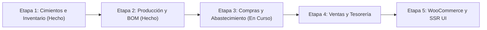

# Planificación del Proyecto (Fases de Desarrollo)

Dado el tamaño y complejidad del sistema "Indino", el desarrollo se dividirá en etapas iterativas. Cada etapa entregará un módulo funcional que aportará valor inmediato al negocio.

## Estado de Fases y Hoja de Ruta

## Etapa 1: Cimientos, Documentos, Contactos e Inventario Base (Completada)
**Objetivo:** Establecer la infraestructura transversal y el motor de inventario por partida doble.

1. Creación de `apps/base`: `TimeStampedModel` con trazabilidad completa de cambios (`simple_history`) y `DocumentoBase` (máquina de estados `borrador` ➔ `confirmado` ➔ `finalizado` ➔ `cancelado` / `anulado`).
2. Creación de `apps/documentos`: `DocumentoAdjunto` polimórfico (`GenericForeignKey`), validación MIME, cuota de 25MB y limpieza física de huérfanos.
3. Creación de `apps/contactos`: `Contacto` unificado (Cliente, Proveedor, Tallerista) con identificación fiscal (CUIT/CUIL, Condición IVA, Límite de crédito) y tags con color.
4. Creación de `apps/inventario`:
   - Modelo dinámico `UnidadMedida` con sembrado automático vía señal `post_migrate`.
   - `ProductoTemplate` y variantes `Producto` (SKU real con atributos de talle y color).
   - Motor de partida doble: `Ubicacion` (físicas y virtuales), `StockQuant` (balance en tiempo real) y remitos (`MovimientoStock` y `LineaMovimientoStock`) con control atómico de reservas y consumos.

## Etapa 2: Fichas Técnicas (BOM) y Motor de Producción (Completada)
**Objetivo:** Digitalizar el Know-How industrial y ejecutar lotes con curva de talles.

1. Creación de `apps/produccion`:
   - Modelado de Fichas Técnicas: `Receta`, `RecetaInsumo` y `RecetaEtapa`.
   - Soporte para reglas de insumos condicionales por variante (`variantes_destino` ManyToMany a `AtributoValor`).
   - `OrdenProduccion` (hereda de `DocumentoBase`), `OPVariacion` (curva de talles del lote), `OPInsumoRequerido` y `OPEtapa`.
2. Señales de automatización en `produccion/signals.py`:
   - `calcular_insumos_requeridos_op`: Cálculo dinámico de insumos requeridos según la curva de variantes de la OP.
   - `reservar_insumos_op`: Creación y confirmación automática de `MovimientoStock` de insumos.
   - `ejecutar_produccion_op`: Descuento de insumos e ingreso de productos terminados en stock al finalizar.

## Etapa 3: Módulo de Compras y Abastecimiento (En Curso)
**Objetivo:** Asegurar el reabastecimiento de insumos y registrar la recepción física y comprobantes.

1. Modelado de `apps/compras`:
   - `OrdenCompra` (hereda de `DocumentoBase`) vinculada a `contactos.Contacto` (proveedor).
   - `LineaOrdenCompra` vinculada a `inventario.Producto` (SKU).
2. Automatización:
   - Señal que genera remito de recepción (`MovimientoStock` tipo `recepcion`) al confirmar la OC.
   - Validación de ingreso físico en depósito y cotejo contra factura del proveedor.

## Etapa 4: Ventas B2B/B2C y Tesorería
**Objetivo:** Captura comercial, cobros diferidos (señas) y liquidación de servicios a talleristas.

1. `apps/ventas`: `PedidoVenta` minorista y mayorista (Make to Order disparando OP).
2. `apps/tesoreria`: `Caja` (oficial / interna), `MovimientoCaja` y `LiquidacionTallerista` por etapas completadas.

## Etapa 5: Vistas SSR, Integración WooCommerce y Tareas Asíncronas
**Objetivo:** Interfaz operativa completa y sincronización omnicanal.

1. Vistas CBV con control de acceso estricto (ocultamiento de costos para talleristas).
2. Plantilla imprimible `orden_produccion.html` (Original / Duplicado ciego).
3. Celery + Redis: Sincronización de stock con WooCommerce y generación asíncrona de reportes.

