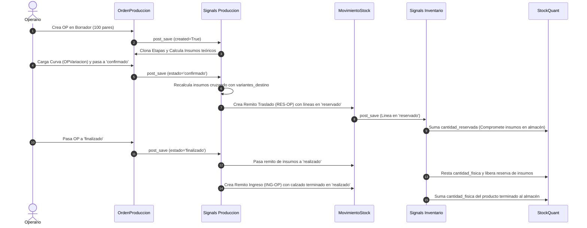

# Recopilación Integral del Sistema: Indinopy ERP
## Estado del Arte, Arquitectura, Modelos y Señales

Este documento compila de forma exhaustiva el estado actual del proyecto **Indinopy**, integrando la arquitectura base traída de **Sarello**, los modelos industriales de **Producción**, el motor de **Inventario por partida doble** y el módulo de **Contactos**.

---

## 1. Arquitectura de Apps del Proyecto

```
indinopy/
├── core/                   # Configuración del proyecto (settings, urls, wsgi)
├── docs/                   # Documentación técnica, glosarios y manuales
└── apps/
    ├── base/               # Clases abstractas y auditoría base (TimeStampedModel, DocumentoBase)
    ├── contactos/          # Clientes, Proveedores, Talleristas/Fasón, Categorías y Tags
    ├── inventario/         # Catálogo (Templates/SKUs), UdM, Ubicaciones, Lotes, Quants y Remitos
    ├── produccion/         # Fichas Técnicas (BOM), OPs, Curvas, Insumos por Variante y Tracking
    ├── compras/            # (Próxima) Órdenes de compra y recepción de insumos
    ├── ventas/             # (Próxima) Pedidos mayoristas B2B y minoristas WooCommerce
    └── tesoreria/          # (Próxima) Cuentas corrientes, liquidaciones y cajas
```

---

## 2. Mapa de Modelos por App

### A. `apps.base`
* **`TimeStampedModel` (Abstracto)**:
  * `creado_en` (`DateTimeField auto_now_add=True`)
  * `modificado_en` (`DateTimeField auto_now=True`)
  * `history = HistoricalRecords(inherit=True)`: Auditoría forense automática (`simple-history`).
* **`DocumentoBase` (Abstracto, hereda `TimeStampedModel`)**:
  * `numero` (`CharField unique=True`)
  * `fecha` (`DateField default=timezone.now`)
  * `estado` (`borrador`, `confirmado`, `finalizado`, `cancelado`, `anulado`)
  * `observaciones` (`TextField blank=True`)

---

### B. `apps.contactos`
* **`CategoriaContacto`**: Jerarquía de contactos (`nombre`, `parent`, `descripcion`).
* **`Tag`**: Etiquetas visuales con código hexadecimal para interfaz (`nombre`, `color`).
* **`Contacto`**: Entidad unificada:
  * Tipo: `cliente`, `proveedor`, `tallerista`, `cliente_proveedor`.
  * Fiscal: `cuil` (CUIT/CUIL), `condicion_iva` (RI, Monotributista, etc.).
  * Comercial: `limite_credito`, `categoria`, `tags`, teléfono, email, dirección.

---

### C. `apps.inventario`
* **`UnidadMedida`**: Unidades de medida dinámicas (`nombre`, `simbolo`, `tipo`: unidad, longitud, peso, volumen, tiempo). Se pueblan por defecto al migrar (`u`, `par`, `m`, `kg`, `l`, `hs`).
* **`Categoria`**: Categorías de productos con soporte de árbol (`parent`).
* **`ProductoTemplate`**: Modelo base (`nombre`, `categoria`, `tipo_producto`: almacenable, consumible, servicio; `unidad_medida`, `precio`, `costo`, `tracking`).
* **`Atributo` y `AtributoValor`**: Talles, Colores, Materiales.
* **`Producto` (SKU)**: La variante física real (`template`, `valores_atributo`, `sku`, `codigo_barras`, `precio_extra`).
* **`Ubicacion`**: Almacenes físicos (`interna`) y virtuales (`proveedor`, `cliente`, `produccion`, `ajuste`).
* **`Lote`**: Seguimiento de partidas de producción o compra.
* **`StockQuant`**: Balance instantáneo único por `(producto, ubicacion, lote)` con `cantidad_fisica` y `cantidad_reservada`.
* **`MovimientoStock` (Hereda `DocumentoBase`)**: Remito/Picking agrupador con `contacto`, `tipo` (recepcion, entrega, traslado), `es_fiscal`, origen y destino.
* **`LineaMovimientoStock`**: Movimiento atómico de un SKU con partida doble.

---

### D. `apps.produccion`
* **`Receta` (Ficha Técnica / BOM)**: Atada a un `ProductoTemplate` (`nombre_version`, `activa`).
* **`RecetaInsumo`**: Insumos requeridos. Apunta al `Producto` SKU específico, define la `cantidad` y cuenta con **`variantes_destino`** (`ManyToManyField(AtributoValor)`):
  * *Sin filtro:* Aplica a todos los pares (ej. etiquetas).
  * *Con filtro:* Aplica solo a las variantes coincidentes (ej. cuero rojo para zapatos rojos, metraje extra para talle 44).
* **`RecetaEtapa`**: Hoja de ruta secuencial (`orden_ejecucion`, `servicio`, `observaciones_proceso`).
* **`OrdenProduccion` (Hereda `DocumentoBase`)**: Lote de fabricación real:
  * `receta`, `cantidad_total`, `cliente` (`Contacto`), `fecha_entrega`.
  * `tipo` (`interna` vs `fason`), `subestado` (`espera`, `cortado`, `rebajado`, `aparado`, `armado`).
  * Permisos personalizados: `view_costos_op` (Original) y `aprobar_op`.
* **`OPVariacion`**: Curva de talles/colores a fabricar (`producto`, `cantidad`).
* **`OPInsumoRequerido`**: Insumos calculados para la orden (`insumo` SKU, `origen` empresa vs fábrica, `cantidad_teorica`, `cantidad_consumida_real`, `costo_facturado_fason`).
* **`OPEtapaTracking`**: Control de procesos (`etapa_origen`, `tallerista_real` FK `Contacto`, `responsable_interno` User, `estado`, `costo_servicio_total`).
* **`OPEtapaLog`**: Bitácora inmutable de cambios de estado en etapas con usuario y fecha.

---

## 3. Matriz de Señales (Automatizaciones Activas)



---

## 4. Estado de Preparación para Migraciones

Todos los modelos y señales de:
1. `apps.base`
2. `apps.contactos`
3. `apps.inventario` (incluyendo `UnidadMedida`)
4. `apps.produccion`

Se encuentran **completamente sincronizados, con ForeignKeys cruzadas validadas y sin dependencias circulares**.

### Próximo comando a ejecutar cuando estés listo:
```bash
python manage.py makemigrations
python manage.py migrate
```
*(Al ejecutarse `migrate`, la señal `post_migrate` creará automáticamente las 9 unidades de medida industriales base).*
