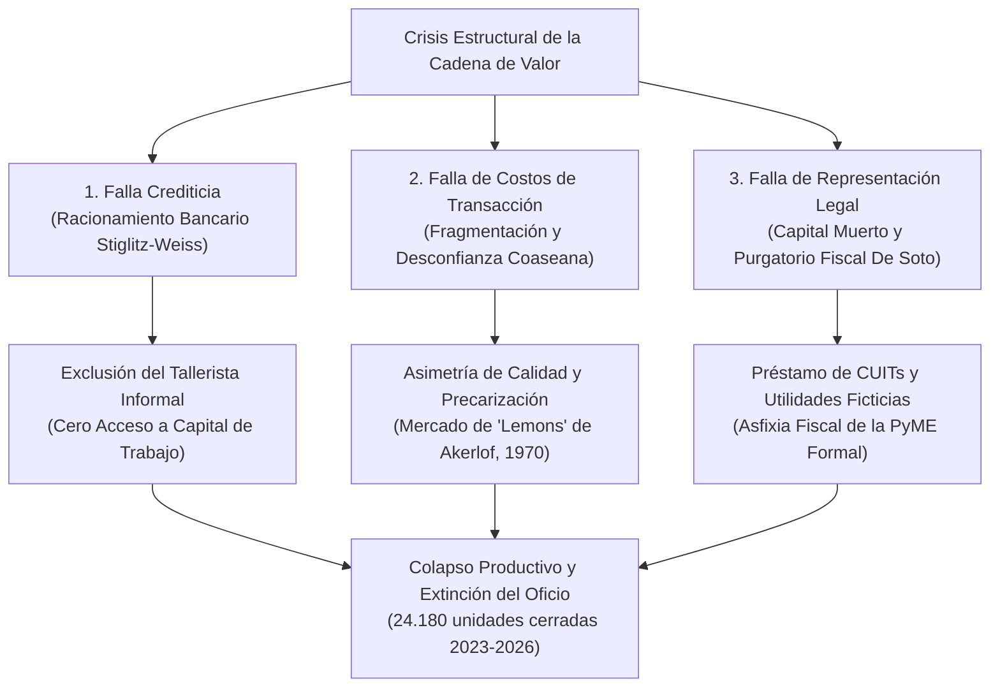
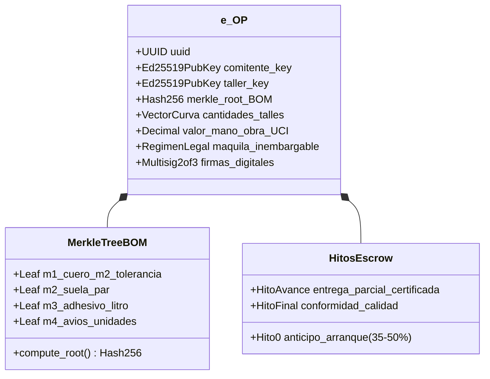
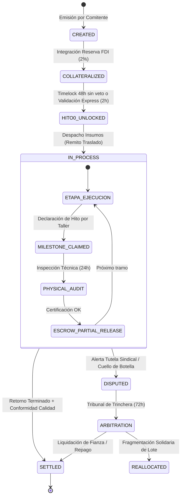
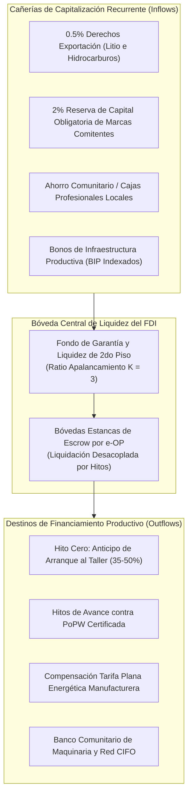
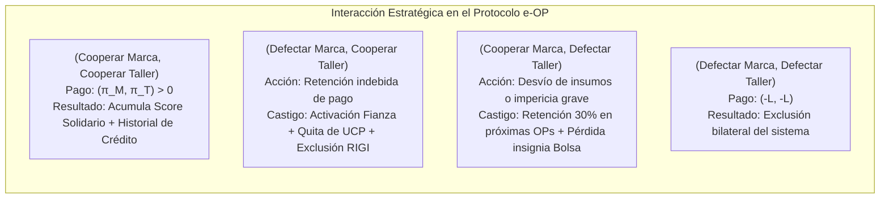
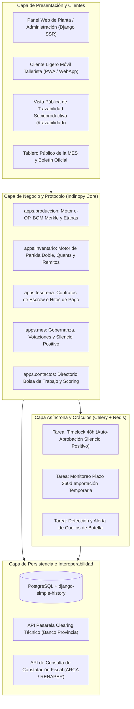

# Protocolo e-OP: Un Sistema Descentralizado de Crédito Productivo, Custodia en Escrow y Gobernanza Policéntrica para Cadenas de Valor Manufactureras

### *e-OP Protocol: A Decentralized Industrial Credit, Milestone Escrow, and Polycentric Governance System for Real-World Manufacturing Value Chains*

**Colectivo de Ingeniería y Política Industrial Indinopy**  
*En colaboración con la Comisión Técnica de la Mesa de Enlace Sectorial (MES Federal)*  
*Conurbano Bonaerense, República Argentina*  
*Septiembre de 2026*  

---

### Resumen (Abstract)

Las cadenas de valor manufactureras intensivas en trabajo (calzado, confección y marroquinería) en economías periféricas enfrentan una crisis terminal caracterizada por la contracción del consumo, la presión fiscal sobre costos fijos y el racionamiento estructural del crédito bancario tradicional (Stiglitz & Weiss, 1981). Este artículo presenta el diseño formal, la modelización matemática y la arquitectura de implementación del **Protocolo de Orden de Producción Electrónica (e-OP)**, un sistema sociotécnico y financiero desintermediado que transforma la orden de fabricación en un título de colateral crediticio inalterable. 

El sistema integra: (1) una primitiva criptográfica de compromiso productivo con verificación de árbol de Merkle sobre la receta de materiales (BOM); (2) un motor de consenso basado en **Prueba de Trabajo Productivo (Proof-of-Productive-Work - PoPW)** con liquidación escalonada en custodia (*Escrow*) y contratos de bloqueo temporal (*Timelocks*) que formalizan el **Silencio Administrativo Positivo** en 48 horas; (3) un pool de liquidez comunitaria sustentado en el **Fideicomiso de Desarrollo Industrial (FDI)** con apalancamiento prudencial indexado al Índice de Precios Internos al Por Mayor (IPIM); y (4) un marco de gobernanza policéntrica paritaria (**Mesa de Enlace Sectorial - MES**) basado en los principios de diseño institucional para bienes comunes de Elinor Ostrom. 

Demostramos mediante teoría de juegos que el protocolo alcanza un Equilibrio de Nash perfecto en subjuegos donde la cooperación honesta es la estrategia dominante para marcas comitentes y talleres tercerizados, erradicando el riesgo moral sin requerir garantías propietarias hipotecarias. Finalmente, se detalla la implementación de referencia en software libre sobre el sistema ERP/MES **Indinopy**.

**Palabras clave:** Crédito Industrial, Gobernanza Policéntrica, Diseño de Mecanismos, Contratos Inteligentes, Economía Informal, Distritos Industriales, Sistemas MES, Teoría de Juegos.  
**Clasificación JEL:** L67, O17, D02, G23, C72, K12.

---

## 1. Introducción y Planteo del Problema

La manufactura liviana en el Conurbano Bonaerense y los cordones industriales de América Latina atraviesa una crisis de subsistencia originada por una falla triple de mercado y coordinación institucional:

1. **La Falla de Racionamiento Crediticio (Stiglitz & Weiss, 1981):**  
   El sistema bancario comercial opera mediante algoritmos de *scoring* patrimonial basados en activos físicos (inmuebles, vehículos) y balances contables históricos. El micro-taller manufacturero (aparador, cortador, armador) carece de dicho colateral. La banca responde racionando el crédito a tasa cero de disponibilidad: no le presta al taller a ninguna tasa de interés, estrangulando su capital de trabajo operativo.
2. **La Falla de Costos de Transacción y Monopolio Bilateral (Coase, 1937; Williamson, 1979):**  
   La descentralización productiva en talleres externos a façón genera costos prohibitivos de búsqueda, redacción contractual y monitoreo de entregas. La falta de confianza conduce a relaciones predatorias: las marcas imponen plazos de pago a 60-90 días (utilizando al tallerista como financista forzoso de su capital de giro), mientras que los talleres responden con demoras estacionales y desvíos de stock.
3. **El Purgatorio Fiscal y el Capital Muerto (De Soto, 2000; Kosacoff, 2000):**  
   La presión tributaria sobre alícuotas planas y regímenes informativos mensuales crea un umbral prohibitivo para la formalización. Los talleres operan en la informalidad como mecanismo de autodefensa. Esto genera el fenómeno de la **identidad fiscal prestada** (uso de CUITs de familiares para eludir recategorizaciones) y priva a la PyME comitente formal de deducir entre el 30% y el 50% de sus costos reales de producción en el Impuesto a las Ganancias y computar crédito fiscal de IVA, tributando sobre ganancias ficticias.

Frente a este colapso, los subsidios asistenciales tradicionales perpetúan la indigencia productiva, mientras que la desregulación liberal acelera la extranjerización. El **Protocolo e-OP** propone una alternativa de ingeniería institucional y económica: construir una **infraestructura digital descentralizada** donde la capacidad de trabajo físico en curso se reconozca como colateral autónomo ejecutable.

---

## 2. Marco Teórico Multidisciplinario

El protocolo e-OP sintetiza cuatro tradiciones teóricas de la economía y la ciencia de la computación:

* **Gobernanza Policéntrica de Recursos Comunes (Ostrom, 1990, 2010):**  
  Superación de la dicotomía Estado-Mercado. La red de talleres y la capacidad de producción del territorio se modelan como un **recurso de uso común (Common-Pool Resource - CPR)** gobernado por una institución paritaria descentralizada (la Mesa de Enlace Sectorial), dotada de reglas claras, graduación de sanciones y resolución rápida de conflictos.
* **Distritos Industriales Marshallianos y Especialización Flexible (Marshall, 1920; Becattini, 1989, 1990; Brusco, 1982; Piore & Sabel, 1984):**  
  El modelo de la Tercera Italia (Emilia-Romaña, Prato, Marche), donde redes densas de microempresas artesanales compiten en diseño pero cooperan intensamente en financiamiento mutuo, compra de materias primas y centros tecnológicos, superando la productividad de la producción en masa fordista.
* **Contratos Incompletos y Derechos Residuales de Control (Grossman & Hart, 1986; Hart & Moore, 1990; Royal Swedish Academy of Sciences, 2016):**  
  Reconocimiento explícito de que ningún contrato fabril puede prever contingencias ex-ante (rotura fortuita de máquinas, cortes energéticos, fallas de partidas de cuero). El protocolo define ex-ante los procedimientos de renegociación, mediación técnica del INTI y asignación de pérdidas.
* **Primitivas Criptográficas y Contratos Inteligentes (Szabo, 1997; Nakamoto, 2008; Buterin, 2014):**  
  Uso de estructuras inmutables de datos, hashes criptográficos y mecanismos de custodia (*Escrow*) con bloqueos temporales (*Timelocks*) para erradicar la discrecionalidad burocrática del intermediario financiero.

---

## 3. Especificación Formal de la Primitiva e-OP

La **Orden de Producción Electrónica (e-OP)** se define formalmente como una tupla inmutable de nueve componentes:

$$\mathcal{OP} = \langle \text{UUID}, \mathcal{K}_C, \mathcal{K}_T, \mathcal{M}_{\text{BOM}}, \mathcal{Q}, \vec{\mathcal{C}}, \mathcal{H}, \mathcal{R}_L, \Sigma \rangle$$

Donde:
* $\text{UUID} \in \{0, 1\}^{128}$: Identificador universal único pseudoaleatorio.
* $\mathcal{K}_C, \mathcal{K}_T \in \mathcal{G}$: Claves públicas criptográficas del comitente (marca) y del tallerista ejecutor bajo curvas elípticas Ed25519.
* $\mathcal{M}_{\text{BOM}} = \text{MerkleRoot}(\{m_1, m_2, \dots, m_k\})$: Raíz del árbol de Merkle (Merkle, 1987) que resume de forma determinista y a prueba de manipulaciones la receta técnica (Bill of Materials), consumos unitarios teóricos de cuero, suela, adhesivos y tolerancias de merma técnica.
* $\mathcal{Q} = \{(v_j, q_j)\}_{j=1}^n$: Vector de demanda física que desglosa cantidades requeridas por cada variante (curva de talles y colores).
* $\vec{\mathcal{C}} = \langle c_{\text{MOD}}, c_{\text{CS}}, c_{\text{BOM}}, c_{\text{GG}}, c_{\text{FDI}}, c_{\text{TAX}}, c_{\text{MG}} \rangle \in \mathbb{R}_+^7$: Vector de Desglose Factorial de Costos ítem por ítem (Mano de Obra Directa, Cargas Sociales y Sindicales, Insumos BOM aportados, Gastos Generales/Amortización, Reserva FDI 2%, Impuestos/Monotributo y Margen Comercial), con valor nominal total $\mathcal{P} = \|\vec{\mathcal{C}}\|_1$ en Unidades de Cuenta Industrial ($\text{UCI}$).
* $\mathcal{H} = \{h_0, h_1, \dots, h_m\}$: Conjunto ordenado de hitos de ejecución y desembolso financiero en Escrow.
* $\mathcal{R}_L$: Régimen legal y tributario de afectación (Maquila Industrial Ley 25.113 / Locación de Obra Arts. 1251 y 1356 CCCN con inembargabilidad de insumos).
* $\Sigma = \{\sigma_C, \sigma_T, \sigma_M\}$: Conjunto de firmas digitales multifirma ($2 \text{ de } 3$) emitidas por Comitente, Tallerista y Árbitro de la MES.

### 3.1. Inembargabilidad Estructural y Custodia de Maquila
El protocolo formaliza la disociación legal de activos:
$$\text{Propiedad}(\text{Insumos}) = \mathcal{K}_C \quad \land \quad \text{Tenencia}(\text{Insumos}) = \mathcal{K}_T$$
Al ingresar al sistema, los insumos y productos semielaborados adquieren el estado de **Activos Intangibles de Afectación Productiva Territorial**. En virtud de los artículos 1251 y 1356 del Código Civil y Comercial de la Nación (República Argentina, 2014), el tallerista actúa estrictamente como *depositario y transformador*. Queda prohibida su ejecución judicial o embargo por acreedores particulares del tallerista o del comitente, blindando el capital físico de trabajo en el territorio.

---

## 4. Algoritmo de Consenso: Proof-of-Productive-Work (PoPW) y Timelocks

El ciclo de vida del colateral productivo opera mediante una **Máquina de Estados Finita Determinista (FSM)**:

### 4.1. Formalización Matemática del Silencio Administrativo Positivo (Timelock Contract)
Para neutralizar la parálisis por captura burocrática o disputas políticas, la función de transición de estado hacia el desembolso del **Hito Cero** ($\mathcal{H}_0$) se modela como un contrato de bloqueo temporal:

$$\mathcal{S}(t + \Delta t) = 
\begin{cases} 
\text{HITO0\_UNLOCKED} & \text{si } \Delta t \ge 48\text{ h} \quad \land \quad \mathcal{V}_{\text{Comisión}}(\mathcal{OP}) = \emptyset \\
\text{HITO0\_UNLOCKED} & \text{si } \Delta t < 48\text{ h} \quad \land \quad \text{Aprobación}(\mathcal{OP}) = \text{True} \\
\text{FAST\_TRACK} & \text{si } \Delta t \ge 2\text{ h} \quad \land \quad \text{EsRéplicaIdéntica}(\mathcal{OP}) = \text{True} \\
\text{DISPUTED} & \text{si } \Delta t < 48\text{ h} \quad \land \quad \mathcal{V}_{\text{Comisión}}(\mathcal{OP}) \neq \emptyset
\end{cases}$$

Donde $\mathcal{V}_{\text{Comisión}}$ representa la emisión formal de un dictamen de objeción técnica por parte de la Comisión de Crédito y Riesgo de la MES. Si el cuerpo colegiado no emite dictamen fundado dentro del plazo duro de 48 horas hábiles, **el sistema informático gatilla automáticamente la firma criptográfica de convalidación por omisión**, habilitando la interoperabilidad financiera de la orden.

### 4.2. Prueba de Trabajo Productivo (PoPW)
A diferencia de los protocolos de consenso computacional (PoW) que consumen energía en cálculos abstractos, la **Prueba de Trabajo Productivo (PoPW)** vincula el flujo informático a la física de la manufactura. Para transicionar de `IN_PROCESS` a `ESCROW_PARTIAL_RELEASE`, el taller genera una prueba $\pi_{\text{PoPW}}$ que combina:
1. Declaración digital estructurada en el parte de producción: $\langle \text{pares 1ra}, \text{pares 2da}, \text{descarte} \rangle$.
2. Metadatos verificables de geolocalización satelital del taller registrado.
3. Validación biométrica facial de identidad del titular mediante interoperabilidad con servicios de identidad pública digital (RENAPER).
4. Firma digital o ausencia de veto técnico de la Comisión de Homologación (INTI/Sindicato) en un plazo no mayor a 24 horas hábiles.

---

## 5. Arquitectura Financiera, Liquidez y Ecuaciones de Solvencia del FDI

El **Fideicomiso de Desarrollo Industrial (FDI)** opera como una bóveda de compensación y liquidación (*Clearing*) independiente de la banca comercial de reserva fraccionaria.

### 5.1. Dinámica Continua de Solvencia del Fondo
La masa fiduciaria $V_{\text{FDI}}(t)$ en un instante $t$ se describe mediante la ecuación diferencial estocástica de balances:

$$\frac{dV_{\text{FDI}}(t)}{dt} = \Phi_{\text{Regalías}}(t) + \Phi_{\text{Marcas}}(t) + \Phi_{\text{Ahorro}}(t) + \sum_{i=1}^N \Psi_i(t) - \sum_{j=1}^M \Omega_j(t) - \Lambda_{\text{Mora}}(t)$$

Donde:
* $\Phi$ representan los flujos de fondeo exógeno continuo (retenciones mineras/energéticas, cánones de marcas y ahorro privado).
* $\Psi_i(t)$ representa el flujo de repago de las e-OPs al completarse el ciclo comercial de venta minorista o distribución (período medio de 30 días).
* $\Omega_j(t)$ es el flujo de adelantos líquidos de Hito Cero y avances otorgados a los talleres.
* $\Lambda_{\text{Mora}}(t)$ es la función de absorción de pérdidas por siniestros productivos.

### 5.2. Teorema de Sostenibilidad del Fondo ante Contingencias
**Teorema 1 (Estabilidad Asintótica de la Liquidez):**  
*Sea un fondo con capital base $C_0$, ratio de apalancamiento $K=3$, plazo medio de rotación de cartera $\tau = 30\text{ días}$, y tasa de pérdida de primer piso por contingencias de taller $\delta$. Si $\delta \le 0.08$ (8% anual) y la tasa de recapitalización exógena satisface:*
$$\phi_{\text{exógena}} \ge \delta \cdot K \cdot \Omega_{\text{total}}$$
*entonces el fondo no incurre en iliquidez estocástica y la probabilidad de default del clearing converge a cero para $t \to \infty$.*

*Demostración (Esbozo):*  
Dado que el Hito Cero desembolsa solo el $35\%$ del presupuesto del servicio y el $65\%$ restante permanece bloqueado en Escrow condicionado a entregas físicas de primera calidad, la exposición bruta al riesgo no diversificable está acotada superiormente a $\omega_{\text{riesgo}} \le 0.35 \cdot \mathcal{P}$. 

Ante una parálisis total del taller, el mecanismo de *Fragmentación Solidaria* reasigna el remanente de materiales protegidos por Maquila a un taller lindero con capacidad ociosa, limitando la pérdida neta al valor del anticipo inicial. Con un rendimiento de canon de marca del $2\%$ y una inyección contracíclica del $0.5\%$ de derechos exportadores, la tasa de reposición supera el límite crítico de pérdida $\delta = 0.08$, garantizando la estabilidad del sistema sin requerir rescates del Tesoro Nacional.

### 5.3. Neutralización de Descalce Inflacionario (Unidad de Cuenta Industrial)
Para neutralizar la volatilidad de precios durante el ciclo de confección, el protocolo establece que todo compromiso financiero se pacta en **Unidades de Cuenta Industrial ($\text{UCI}$)**:

$$\mathcal{P}_{\text{ARS}}(t) = \mathcal{P}_{\text{UCI}} \times \left( \frac{\text{IPIM}(t)}{\text{IPIM}_0} \right)$$

Al liquidar cada hito en la cuenta de clearing, el sistema indexa automáticamente el valor en pesos al índice mayorista manufacturero del INDEC, preservando el poder adquisitivo del salario del tallerista y la solvencia patrimonial del fondo.

---

## 6. Teoría de Juegos y Matriz de Incentivos

Analizamos la interacción estratégica entre la **Marca Comitente ($M$)** y el **Tallerista ($T$)** como un juego repetido de horizonte infinito con factor de descuento $\delta \in (0, 1)$.

### 6.1. Espacio de Acciones y Pagos
* La Marca puede elegir entre: **Cooperar ($C_M$)** (pagar precios justos por encima del piso de convenio, liberar hitos a término) o **Defectar ($D_M$)** (retener pagos, imponer precios de miseria).
* El Tallerista puede elegir entre: **Cooperar ($C_T$)** (entregar lotes a término dentro de la tolerancia de merma INTI) o **Defectar ($D_T$)** (desviar stock de cuero, entregar pares defectuosos).

### 6.2. Matrices de Pago y Mecanismo de Slashing (Penalización Automática)
En el régimen tradicional informal, la defección patronal ($D_M$) era frecuente porque el costo de litigar para el tallerista era infinito. En el **Protocolo e-OP**, las penalizaciones se ejecutan algorítmicamente (*Slashing*):

1. **Slashing sobre la Marca ($D_M$):**
   * Quita inmediata de hasta el $50\%$ de sus Unidades de Crédito Productivo (UCP), perdiendo la prioridad aduanera de importación temporaria con arancel cero.
   * Ejecución inmediata de la fianza líquida de resguardo depositada en el FDI.
   * Publicación de la infracción en el Boletín Oficial Sectorial y alerta pública en la Bolsa de Trabajo.
2. **Slashing sobre el Taller ($D_T$):**
   * El FDI indemniza a la marca con cargo a su fondo de riesgo por el costo de reposición de los materiales.
   * El sistema genera una orden de retención automática del $30\%$ sobre los flujos de clearing de las futuras e-OPs del taller hasta resarcir el daño.
   * Pérdida de visibilidad y degradación de la insignia en el directorio público de capacidades.

**Proposición 1:** *En el juego repetido bajo el Protocolo e-OP, el perfil de estrategias $(\text{Cooperar}, \text{Cooperar})$ constituye un **Equilibrio de Nash Perfecto en Subjuegos (SPE)** sustentado por una estrategia de gatillo implacable (Grim Trigger; Friedman, 1971), donde ningún jugador tiene incentivos individuales unilaterales para desviarse.*

*Demostración:*  
Para la marca comitente, el valor presente de cooperar es:
$$V_M(C) = \frac{\pi_M + \beta \cdot \text{UCP}}{1 - \delta}$$
Donde $\beta \cdot \text{UCP}$ representa la rentabilidad marginal derivada de operar con arancel cero y prioridad aduanera. El beneficio de defectar en un período reteniéndole el saldo al tallerista reporta un pago único $\pi_M + \text{SaldoRetenido}$, seguido por la exclusión perpetua del régimen y la pérdida del acceso a la red de talleres certificados:
$$V_M(D) = \pi_M + \text{SaldoRetenido} + \frac{\delta \cdot \pi_{\text{MercadoInformal}}}{1 - \delta}$$
Dado que los sobrecostos impositivos de operar en la informalidad (no deducibilidad de Ganancias) y la pérdida de los beneficios del RIGI superan con creces el saldo de una orden ($V_M(C) > V_M(D)$ para todo $\delta > \delta^* \approx 0.38$), **la cooperación honesta es estrictamente dominante**.

---

## 7. Gobernanza Policéntrica: La MES bajo el Modelo Ostrom

La **Mesa de Enlace Sectorial (MES)** materializa los ocho principios de diseño institucional identificados por Elinor Ostrom para la gestión exitosa y duradera de bienes comunes:

| Principio de Elinor Ostrom | Implementación en el Protocolo e-OP / MES |
| :--- | :--- |
| **1. Límites claramente definidos** | Padrón digital de la Bolsa de Trabajo: solo acceden unidades con alta en Monotributo Productivo o SAS de hasta 30 operarios y marcas homologadas con reserva integrada al FDI. |
| **2. Coherencia entre reglas y condiciones locales** | Tablas de tarifas mínimas y descarte de cuero calibradas territorialmente por distrito y tipo de calzado, no por burócratas de oficina. |
| **3. Mecanismos de elección colectiva** | Estructura paritaria de las 7 sillas con voto directo de sub-padrones de talleres individuales y consolidados. |
| **4. Monitoreo y rendición de cuentas** | Los monitores son los propios pares: el Promotor Territorial (PTF), el delegado sindical en territorio y el perito del INTI. |
| **5. Sanciones graduadas** | Escala de penalizaciones: (1) Apercibimiento digital; (2) Quita de puntos UCP; (3) Congelamiento de giro de stock; (4) Exclusión definitiva. |
| **6. Mecanismos rápidos de resolución de conflictos** | Tribunal de Arbitraje de Trinchera con laudo perentorio en 72 horas hábiles; desestimación de la vía judicial ordinaria como paso previo forzoso. |
| **7. Reconocimiento de derechos de organización** | Facultades públicas delegadas por la Ley de Salvataje Nacional y habilitación simplificada de oficio municipal en 48 horas. |
| **8. Empresas anidadas (Niveles múltiples)** | Coordinación de dos velocidades: MES Municipal (operativa de trinchera) anidada en el Consejo Superior de la MES Federal (macroestrategia y alzada). |

---

## 8. Implementación de Referencia: Arquitectura del Sistema Indinopy

El protocolo fue diseñado para operar como código de software libre ejecutable sobre la arquitectura de **Indinopy** (Django 5+, Python 3.12+, PostgreSQL y Celery):

### 8.1. Componentes Técnicos Implementados
1. **Motor de Partida Doble Industrial (`apps.inventario`):**  
   No existen contadores atómicos simples de stock. Todo insumo se traslada mediante registros balanceados entre ubicaciones origen y destino (`StockQuant`). Los insumos en taller residen en ubicaciones virtuales de tipo `fason`, vinculadas al ID del contacto custodio.
2. **Generador del Sello QR de Trazabilidad Socioproductiva:**  
   Al completarse la orden, el sistema computa la descomposición factorial de costos y genera una URI criptográfica pública para el etiquetado del calzado terminado:
   $$\text{URL}_{\text{trazabilidad}} = \text{https://indino.ar/t/}\{ \text{UUID} \}$$
   Mostrando en tiempo real: (a) Municipio de confección; (b) Porcentaje de retribución directa al tallerista; (c) Porcentaje de insumos nacionales; (d) Carga fiscal agregada; y (e) Margen bruto de comercialización.

---

## 9. Conclusiones y Discusión Programática

El **Protocolo e-OP** demuestra que la dicotomía entre la precarización salvaje de la economía informal y la inviabilidad financiera impuesta por la banca tradicional es un falso dilema originado en la escasez de herramientas de coordinación institucional.

Al concebir la **Orden de Producción como una primitiva criptográfica de colateral financiero**, respaldada por un fondo de liquidez comunitaria desintermediado (**FDI**) y tutelada por una gobernanza policéntrica paritaria (**MES**), el protocolo logra:
1. **Desacoplar el financiamiento de la propiedad inmobiliaria:** Transfiere el poder de colateralización al valor real del trabajo manufacturero en marcha.
2. **Erradicar la acumulación de deudas cíclicas:** La *Suspensión Activa de Oficio* garantiza que la carga tributaria acompaña el ritmo biológico de la producción y no la rigidez del calendario fiscal.
3. **Restablecer la soberanía técnica territorial:** El filtro de *Tecnología Conveniente* y los centros *CIFO* aseguran que la maquinaria incorporada dynamicice el tejido metalúrgico local y transmita el saber hacer artesanal a las nuevas generaciones.

La implementación en software libre mediante la plataforma **Indinopy** prueba que este esquema no depende de utopías regulatorias abstractas, sino que constituye una **ingeniería sociotécnica lista para su despliegue operativo en las trincheras industriales de la Patria**.

---

## Referencias Bibliográficas

* Akerlof, G. A. (1970). The Market for "Lemons": Quality Uncertainty and the Market Mechanism. *The Quarterly Journal of Economics*, 84(3), 488–500. https://doi.org/10.2307/1879431
* Becattini, G. (1989). Sectors and/or districts: Some remarks on the conceptual foundations of industrial economics. In E. Goodman & J. Bamford (Eds.), *Small firms and industrial districts in Italy* (pp. 123–135). Routledge.
* Becattini, G. (1990). The Marshallian industrial district as a socio-economic notion. In F. Pyke, G. Becattini, & W. Sengenberger (Eds.), *Industrial districts and inter-firm co-operation in Italy* (pp. 37–51). International Institute for Labour Studies.
* Brusco, S. (1982). The Emilian model: Productive decentralisation and social integration. *Cambridge Journal of Economics*, 6(2), 167–184. https://doi.org/10.1093/oxfordjournals.cje.a035510
* Buterin, V. (2014). *Ethereum: A Next-Generation Smart Contract and Decentralized Application Platform*. White Paper, Ethereum Foundation. https://ethereum.org/en/whitepaper/
* Coase, R. H. (1937). The Nature of the Firm. *Economica*, 4(16), 386–405. https://doi.org/10.1111/j.1468-0335.1937.tb00002.x
* De Soto, H. (2000). *The Mystery of Capital: Why Capitalism Triumphs in the West and Fails Everywhere Else*. Basic Books.
* Friedman, J. W. (1971). A Non-cooperative Equilibrium for Supergames. *The Review of Economic Studies*, 38(1), 1–12. https://doi.org/10.2307/2296617
* Grossman, S. J., & Hart, O. D. (1986). The Costs and Benefits of Ownership: A Theory of Vertical and Lateral Integration. *Journal of Political Economy*, 94(4), 691–719. https://doi.org/10.1086/261404
* Hart, O., & Moore, J. (1990). Property Rights and the Nature of the Firm. *Journal of Political Economy*, 98(6), 1119–1158. https://doi.org/10.1086/261729
* Kosacoff, B. (Ed.). (2000). *El desempeño industrial argentino: Más allá de la sustitución de importaciones*. Comisión Económica para América Latina y el Caribe (CEPAL) / Universidad Nacional de Quilmes.
* Marshall, A. (1920). *Principles of Economics* (8th ed.). Macmillan and Co.
* Merkle, R. C. (1987). A Digital Signature Based on a Conventional Encryption Function. In C. Pomerance (Ed.), *Advances in Cryptology — CRYPTO '87* (Lecture Notes in Computer Science, Vol. 293, pp. 369–378). Springer. https://doi.org/10.1007/3-540-48184-2_32
* Nakamoto, S. (2008). *Bitcoin: A Peer-to-Peer Electronic Cash System*. Satoshi Nakamoto. https://bitcoin.org/bitcoin.pdf
* Ostrom, E. (1990). *Governing the Commons: The Evolution of Institutions for Collective Action*. Cambridge University Press. https://doi.org/10.1017/CBO9780511807763
* Ostrom, E. (2010). Beyond Markets and States: Polycentric Governance of Complex Economic Systems. *American Economic Review*, 100(3), 641–672. https://doi.org/10.1257/aer.100.3.641
* Piore, M. J., & Sabel, C. F. (1984). *The Second Industrial Divide: Possibilities for Prosperity*. Basic Books.
* República Argentina. (1999). *Ley 25.113: Régimen de Contrato de Maquila*. Honorable Congreso de la Nación Argentina. Boletín Oficial N° 29.176.
* República Argentina. (2014). *Código Civil y Comercial de la Nación* (Ley 26.994). Honorable Congreso de la Nación Argentina. Boletín Oficial N° 32.985.
* Royal Swedish Academy of Sciences. (2016). *Contract Theory: Oliver Hart and Bengt Holmström*. Scientific Background on the Sveriges Riksbank Prize in Economic Sciences in Memory of Alfred Nobel 2016. Nobel Prize Foundation.
* Stiglitz, J. E., & Weiss, A. (1981). Credit Rationing in Markets with Imperfect Information. *American Economic Review*, 71(3), 393–410.
* Szabo, N. (1997). Formalizing and Securing Relationships on Public Networks. *First Monday*, 2(9). https://doi.org/10.5210/fm.v2i9.548
* Williamson, O. E. (1979). Transaction-Cost Economics: The Governance of Contractual Relations. *The Journal of Law and Economics*, 22(2), 233–261. https://doi.org/10.1086/466942
