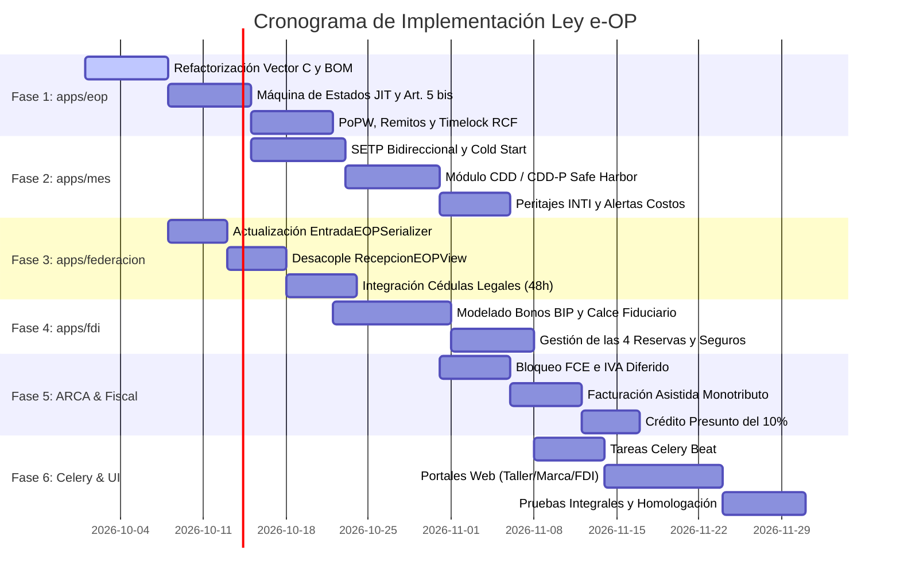

# Plan de Implementación Integral: Adecuación de Indinopy al Régimen Legal de la e-OP

**Documento Técnico de Ingeniería de Software y Arquitectura Legal**  
**Marco Normativo de Referencia:** [Anteproyecto de Ley e-OP (Septiembre 2026)](../docs/md/proyecto_ley_eop.md)  
**Ubicación:** `utils/plan_implementacion_ley_eop.md`  
**Autor:** Antigravity (en colaboración con Tiago Gabriel Sarthou)  
**Fecha:** Septiembre de 2026  
**Estado:** Aprobado para Ejecución Técnica  

---

## Índice General

1. [Resumen Ejecutivo y Objetivos](#1-resumen-ejecutivo-y-objetivos)
2. [Matriz de Diagnóstico y Brechas Arquitectónicas (Gap Analysis)](#2-matriz-de-diagnóstico-y-brechas-arquitectónicas-gap-analysis)
3. [Fase 1: Refactorización del Núcleo Contractual y Escrow (`apps/eop`)](#3-fase-1-refactorización-del-núcleo-contractual-y-escrow-appseop)
   - 3.1. Reestructuración del Vector C y Desacople de $c_{\text{BOM}}$
   - 3.2. Desglose del Canon Fiduciario ($c_{\text{FDI}}$ y $c_{\text{STK}}$)
   - 3.3. Máquina de Estados para Logística Justo a Tiempo (JIT) (Art. 5° bis)
   - 3.4. Confesión de Deuda Líquida de Hito Cero (Art. 6°)
   - 3.5. Acreditación de Hitos: Remito Oficial, PoPW y Timelock RCF (Art. 12°)
   - 3.6. Nuevo Payload Canónico Determinista
4. [Fase 2: Gobernanza Productiva, SETP y Diligencia Laboral (`apps/mes`)](#4-fase-2-gobernanza-productiva-setp-y-diligencia-laboral-appsmes)
   - 4.1. Reubicación del Registro Oficial (ARCA vs. Nodo MES)
   - 4.2. Sistema de Evaluación de Trayectoria Productiva (SETP) (Art. 2° inc. 12)
   - 4.3. Certificado de Diligencia Debida Laboral (CDD / CDD-P) (Art. 22°)
   - 4.4. Defensas de Calidad y Peritaje Técnico Prejudicial INTI (Arts. 11.2 y 13°)
   - 4.5. Alerta Temprana de Inconsistencia de Costos (Art. 27°)
   - 4.6. Módulo de Libreta Digital de Trabajo a Domicilio (Ley N° 12.713)
5. [Fase 3: Orquestación, Serializadores y Tareas en `apps/federacion`](#5-fase-3-orquestación-serializadores-y-tareas-en-appsfederacion)
   - 5.1. Corrección de `EntradaEOPSerializer` y Validación de Alícuotas Desglosadas
   - 5.2. Desacople y Eliminación de Duplicación en `RecepcionEOPView`
   - 5.3. Validación Copulativa en `liberar_hito_escrow_async` (Hito Cero)
   - 5.4. Trazabilidad de Remitos Oficiales en `EOPWebhookReceiverAPIView`
   - 5.5. Reutilización de `ComunicacionOficialFederada` para Notificaciones Legales
6. [Fase 4: Infraestructura Fiduciaria y Mercado de Capitales (`apps/fdi`)](#6-fase-4-infraestructura-fiduciaria-y-mercado-de-capitales-appsfdi)
   - 6.1. Titulización Bursátil y Emisión de Bonos BIP (Arts. 17° y Anexo II)
   - 6.2. Gestión de Fondos de Cobertura y Amortiguadores de Riesgo (Art. 16°)
   - 6.3. Póliza Colectiva de Stock en Custodia (Art. 20 bis)
   - 6.4. Cuentas Especiales de Compensación y Liquidación Manufacturera (Art. 14° y Anexo I)
7. [Fase 5: Adaptador Fiscal y Regímenes Tributarios (`apps/afip` -> `apps/arca`)](#7-fase-5-adaptador-fiscal-y-regímenes-tributarios-appsafip---appsarca)
   - 7.1. Bloqueo Sistémico de la Factura de Crédito Electrónica (FCE) (Art. 9°)
   - 7.2. Facturación Asistida para Monotributo Productivo (Art. 24.5 y Anexo III)
   - 7.3. Diferimiento del Hecho Imponible del IVA (Art. 23.2)
   - 7.4. Cómputo del Crédito Fiscal Presunto del 10% (Art. 23.1)
8. [Fase 6: Automatización Asíncrona (Celery Beat) y Portales Web](#8-fase-6-automatización-asíncrona-celery-beat-y-portales-web)
   - 8.1. Tareas Asíncronas Periódicas
   - 8.2. Interfaz PWA del Tallerista
   - 8.3. Portal de la Marca Comitente
   - 8.4. Panel Fiduciario y de Supervisión MES/INTI
9. [Estrategia de Migración de Base de Datos y Testing](#9-estrategia-de-migración-de-base-de-datos-y-testing)
10. [Cronograma y Secuencia de Despliegue](#10-cronograma-y-secuencia-de-despliegue)

---

## 1. Resumen Ejecutivo y Objetivos

El presente plan establece la hoja de ruta de ingeniería de software para transformar las aplicaciones `apps/eop`, `apps/mes`, `apps/federacion`, `apps/afip`, `apps/tesoreria` y `apps/contabilidad` del ecosistema **Indinopy**, adecuándolas al marco normativo instituido por el **Anteproyecto de Ley de Régimen de la Orden de Producción Electrónica (e-OP) como Título Valor Causal y su Titulización en el Mercado de Capitales**.

### Objetivos Clave:
1. **Validez Cambiaria y Ejecutividad:** Garantizar que cada e-OP emitida sea autosuficiente como título de crédito ejecutivo conforme a los Arts. 1815 y concordantes del CCyC y el Art. 521 inc. 7 del CPCCN.
2. **Corrección Financiera Estricta:** Reclasificar el valor de los insumos en custodia ($c_{\text{BOM}}$) para evitar que infle artificialmente la obligación exigible contra la comitente.
3. **Calce Financiero Bursátil:** Alinear los plazos comerciales de la e-OP con la emisión de **Bonos de Inversión Productiva (BIP)** bajo normativa CNV (RG 917/2021).
4. **Blindaje Laboral (Safe Harbor):** Automatizar el control de Diligencia Debida (CDD/CDD-P) para conferir certeza jurídica a las marcas bajo el Art. 30 LCT y el Art. 23 LCT (modificado por Ley 27.742).
5. **Consistencia en el Bus Federado:** Asegurar que los serializers, vistas y tareas de `apps/federacion` no arrojen errores de validación criptográfica ni financiera ante el nuevo esquema de costos y hitos.
6. **Interoperabilidad Tributaria y Bancaria:** Sincronizar el sistema con los webservices de ARCA (bloqueo FCE, facturación asistida, IVA diferido y micro-retenciones previsional del 2%) y BCRA (Cuentas Especiales exentas de Ley 25.413).

---

## 2. Matriz de Diagnóstico y Brechas Arquitectónicas (Gap Analysis)

| Dimensión | Estado Actual en Indinopy | Requisito Ley e-OP | Severidad / Impacto |
| :--- | :--- | :--- | :---: |
| **Colateral Financiero** | `monto_total_uci` suma $c_{\text{MOD}} + c_{\text{BOM}} + c_{\text{FDI}}$. | $c_{\text{BOM}}$ **no integra la deuda exigible**. Solo colateraliza $c_{\text{MOD}} + c_{\text{FDI}} + \text{intereses}$. | **CRÍTICO** |
| **Validación Federada** | `EntradaEOPSerializer` exige estrictamente $fdi = mod \times 0.015$. | Desdobla canon en operativo ($\le 1,5\%$ s/MOD) y stock ($\le 0,5\%$ s/BOM). Falla con HTTP 400. | **CRÍTICO** |
| **Instanciación en MES** | `RecepcionEOPView` clona contratos e hitos con lógica ORM duplicada. | Debe delegar en `EOPService.ingresar_contrato_desde_federacion()` para no generar hitos inconsistentes. | **ALTO** |
| **Registro Oficial** | Centralizado en el nodo MES (`RegistroEOP`). | El registro público oficial funciona en **ARCA** con datos abiertos no sensibles. | **ALTO** |
| **Logística Justo a Tiempo** | Inexistente. El plazo es estático. | Régimen Art. 5° bis: prórrogas automáticas (tope 30d), compensación standby (0,5 SMVM/día) y rescisión (15d). | **MEDIO-ALTO** |
| **Hito Cero** | Liberación por simple firma o aprobación. | Exige copulativamente: firma bilateral N3, remito oficial A/B/C/R con UUID (o Lote Crítico >=20%) y seguro activo. | **ALTO** |
| **Hito Final (RCF)** | Estado `fiscal_pending` sin plazos perentorios. | Plazo de 10 días hábiles para factura fiscal; 5 días de gracia; luego mora a tasa BADLAR privada. | **MEDIO** |
| **Titulización Bursátil** | Escrow local / Clearing informal. | Emisión de **Bonos BIP** (60-180 días), etiqueta SVS con Revisor Externo CNV y 4 fondos de reserva. | **ALTO** |
| **Diligencia Laboral** | Control informal de PTF. | Módulo formal de **CDD y CDD-P** (F.931, ART, SIPA bancario) que otorga *Safe Harbor* Art. 30 LCT. | **ALTO** |
| **Interoperabilidad Fiscal** | Facturación estándar AFIP (WSFE). | Bloqueo expreso de derivación a FCE (Ley 27.440 Art. 7 bis), facturación asistida y retención previsional del 2%. | **ALTO** |

---

## 3. Fase 1: Refactorización del Núcleo Contractual y Escrow (`apps/eop`)

### 3.1. Reestructuración del Vector C y Desacople de $c_{\text{BOM}}$

En `apps/eop/models.py`, el modelo `ContratoEOP` debe modificar sus propiedades y campos económicos:

```python
# Modificaciones en apps/eop/models.py -> ContratoEOP

class ContratoEOP(DocumentoFirmableMixin, DocumentoBase):
    # Vector C: Desglose canónico conforme a Art. 4° inc. 4
    costo_mod = models.DecimalField(
        max_digits=15, decimal_places=2, default=Decimal("0.00"),
        verbose_name=_("Mano de Obra Directa (MOD)")
    )
    costo_bom = models.DecimalField(
        max_digits=15, decimal_places=2, default=Decimal("0.00"),
        verbose_name=_("Valor Insumos en Custodia de Transformación (BOM)"),
        help_text=_("No constituye obligación exigible al comitente; base para seguros y privilegios concursales.")
    )
    costo_fdi_operativo = models.DecimalField(
        max_digits=15, decimal_places=2, default=Decimal("0.00"),
        verbose_name=_("Canon FDI Operativo (1.5% max sobre MOD)")
    )
    costo_fdi_stock = models.DecimalField(
        max_digits=15, decimal_places=2, default=Decimal("0.00"),
        verbose_name=_("Alícuota Cobertura de Stock (0.5% max sobre BOM)")
    )

    # Denominación y cláusulas de indexación (Art. 18°)
    MONEDA_CHOICES = [
        ("uci", _("Unidad de Cuenta Industrial (UCI - IPIM/Paritaria)")),
        ("uva", _("Unidad de Valor Adquisitivo (UVA)")),
        ("ars", _("Pesos Argentinos (ARS)")),
        ("usd", _("Dólares Estadounidenses (USD - Art. 765 CCyC)")),
    ]
    moneda_denominacion = models.CharField(
        max_length=10, choices=MONEDA_CHOICES, default="uci",
        verbose_name=_("Moneda / Unidad de Cuenta")
    )

    # Plazo comercial y vencimiento (Art. 4° inc. 6)
    plazo_comercial_dias = models.PositiveIntegerField(
        default=60, choices=[(60, "60 días"), (90, "90 días"), (120, "120 días")],
        verbose_name=_("Plazo Comercial de Repago")
    )
    fecha_vencimiento_comercial = models.DateField(
        null=True, blank=True, verbose_name=_("Vencimiento Comercial Original")
    )
    fecha_vencimiento_recalculada = models.DateField(
        null=True, blank=True, verbose_name=_("Vencimiento Comercial Recalculado (JIT/Prórrogas)")
    )

    @property
    def costo_fdi(self):
        """Canon total fiduciario a cargo de la comitente."""
        return self.costo_fdi_operativo + self.costo_fdi_stock

    @property
    def monto_total_uci(self):
        """
        Monto exigible del título valor causal:
        Capital de trabajo (MOD) + Canon fiduciario estructurado.
        Excluye expresamente el valor de los insumos provistos (BOM).
        """
        return self.costo_mod + self.costo_fdi

    @property
    def valor_declarado_custodia_bom(self):
        """Refleja los bienes de dominio de la marca entregados en custodia."""
        return self.costo_bom
```

### 3.2. Desglose del Canon Fiduciario ($c_{\text{FDI}}$ y $c_{\text{STK}}$)

En `apps/eop/services.py`, modificar `ParametrosFDIService` para calcular de forma independiente:
1. **Alícuota Operativa General:** $\alpha_{\text{MOD}} \le 1,5\%$:
   - $0,5\%$ Fondo FAEL + caución laboral.
   - $0,2\%$ INTI y asistencia PFET.
   - $0,8\%$ Administración fiduciaria y Reserva por Mora Operativa.
2. **Alícuota de Stock:** $\alpha_{\text{STK}} \le 0,5\%$ sobre $c_{\text{BOM}}$ para la prima colectiva de seguros.

### 3.3. Máquina de Estados para Logística Justo a Tiempo (JIT) (Art. 5° bis)

Crear el modelo `IncidenciaLogisticaJIT` en `apps/eop/models.py`:

```python
class IncidenciaLogisticaJIT(TimeStampedModel):
    contrato = models.ForeignKey(ContratoEOP, on_delete=models.CASCADE, related_name="incidencias_jit")
    etapa_afectada = models.CharField(max_length=100)
    fecha_entrega_esperada = models.DateField()
    fecha_entrega_real = models.DateField(null=True, blank=True)
    dias_demora = models.PositiveIntegerField(default=0)
    
    # Efectos económicos
    compensacion_standby_devengada = models.DecimalField(
        max_digits=12, decimal_places=2, default=Decimal("0.00"),
        help_text=_("0.5 SMVM por día hábil a partir del 6° día de mora.")
    )
    resolucion_ejercida_por_taller = models.BooleanField(default=False)
```

**Reglas de Servicio en `LogisticaJITService`:**
* **Día 1 a 30:** Prórroga automática día a día de la fecha de entrega física del taller sin penalidad en SETP.
* **Tope de postergación:** Máximo 30 días corridos de diferimiento del vencimiento comercial de la marca (límite absoluto: 180 días desde la emisión).
* **Día 6 hábil:** Se gatilla el cálculo automático de standby: $\text{Días mora hábil} \times (0,5 \times \text{SMVM})$.
* **Día 16 hábil (15 días continuos de mora):** La plataforma habilita en el panel del taller el botón de **"Declarar Resolución Contractual de Pleno Derecho"**, reconociendo el cobro del 100% de la mano de obra iniciada y emitiendo certificado para el derecho de retención (Art. 2587 CCyC).

### 3.4. Confesión de Deuda Líquida de Hito Cero (Art. 6°)

Agregar en `ContratoEOP`:
* Campo `declaracion_confesion_deuda_hito_cero = models.BooleanField(default=False)`.
* Al estampar la firma del tallerista en el contrato mediante Clave Fiscal o Ed25519, se inyecta en el payload la cláusula resolutoria:
  > *"La suscripción de la presente e-OP constituye reconocimiento expreso, voluntario e incondicional de deuda líquida y exigible por los fondos percibidos en concepto de Anticipo de Arranque (Hito Cero), habilitando la vía ejecutiva directa del FDI ante abandono culpable o falta injustificada de inicio del proceso productivo."*

### 3.5. Acreditación de Hitos: Remito Oficial, PoPW y Timelock RCF (Art. 12°)

En `apps/eop/models.py -> EOPHitoEscrow`:

```python
class EOPHitoEscrow(DocumentoFirmableMixin, TimeStampedModel):
    # Campos para acreditación PoPW (Hitos de Avance)
    ddjj_avance_datos = models.JSONField(default=dict, blank=True)
    georreferenciacion_satelital = models.CharField(max_length=255, blank=True, null=True)
    remito_oficial_uuid = models.CharField(max_length=64, blank=True, null=True)

    # Campos para Retención de Cierre Fiscal (RCF - Hito Final)
    fecha_entrega_lote_conforme = models.DateTimeField(null=True, blank=True)
    fecha_limite_facturacion = models.DateTimeField(null=True, blank=True)
    cargo_mora_badlar_devengado = models.DecimalField(max_digits=12, decimal_places=2, default=Decimal("0.00"))
```

**Condiciones de Validación en `EOPService.liberar_hito()`:**
1. **Hito Cero (35% o 50% con Sello Buen Diseño):**
   * Verificar concurrencia de: firma bilateral + remito electrónico oficial (A, B, C) o físico oficial (R) con UUID (o comprobante "X" únicamente si el traslado fue intrafirma bajo el mismo CUIT) + constancia de vigencia del seguro colectivo de stock.
   * Si es JIT: validar ingreso del **Lote Inicial Crítico** ($\ge 20\%$ del $c_{\text{BOM}}$ o insumos base de corte).
2. **Hitos de Avance (45% o 30% con SBD):**
   * Verificación de la terna PoPW: DDJJ + georreferenciación satelital en cuadrante + remito de entrega parcial.
   * Ventana de silencio positivo de 48 horas hábiles: si la comitente no deduce objeción técnica fundada, el hito se libera automáticamente.
3. **Hito Final / RCF (20%):**
   * Al recibir mercadería con remito conforme, se inicia timelock de **10 días hábiles**.
   * Si el taller es Monotributista Productivo: la plataforma genera el borrador de Factura C asistida.
   * Si es Responsable Inscripto: transcurridos los 10 días + 5 días hábiles de gracia sin carga de CAE, la cuenta fiduciaria retiene los fondos y comienza a devengar intereses a tasa BADLAR privada a favor del FDI.

### 3.6. Nuevo Payload Canónico Determinista

Modificar `ContratoEOP.generar_payload_canonico()`:
* Protocolo versión: `"3.0-ley"`.
* Incorporar: `moneda_denominacion`, `plazo_comercial_dias`, `fecha_vencimiento_comercial`, `desglose_canon_fdi`, `remitos_insumos_ingresados`, `clausula_confesion_deuda_h0: True`.
* Excluir $c_{\text{BOM}}$ del total financiado de la orden.

---

## 4. Fase 2: Gobernanza Productiva, SETP y Diligencia Laboral (`apps/mes`)

### 4.1. Reubicación del Registro Oficial (ARCA vs. Nodo MES)

* **ARCA:** Administra la base de datos registral de e-OPs mediante APIs seguras.
* **Nodo MES:** Actúa como centro de gobernanza y auditoría:
  * Procesa los eventos emitidos por ARCA.
  * Administra el historial de cumplimiento y calificaciones.
  * Conduce las instancias de arbitraje y peritaje con el INTI.

### 4.2. Sistema de Evaluación de Trayectoria Productiva (SETP) (Art. 2° inc. 12)

Crear el modelo `EvaluacionTrayectoriaSETP` en `apps/mes/models.py`:

```python
class EvaluacionTrayectoriaSETP(TimeStampedModel):
    cuit_evaluado = models.CharField(max_length=20, db_index=True)
    tipo_actor = models.CharField(max_length=20, choices=[("taller", "Tallerista"), ("comitente", "Comitente")])
    
    # Métricas de Taller
    indice_cumplimiento_plazos = models.DecimalField(max_digits=5, decimal_places=2, default=Decimal("100.00"))
    indice_calidad_tecnica = models.DecimalField(max_digits=5, decimal_places=2, default=Decimal("100.00"))
    ops_cumplidas_exitosas = models.PositiveIntegerField(default=0)
    
    # Métricas de Marca Comitente
    indice_puntualidad_jit = models.DecimalField(max_digits=5, decimal_places=2, default=Decimal("100.00"))
    indice_pago_vencimientos = models.DecimalField(max_digits=5, decimal_places=2, default=Decimal("100.00"))
    dias_mora_historicos_acumulados = models.PositiveIntegerField(default=0)
    
    # Scoring y Régimen de Arranque en Frío
    score_setp = models.DecimalField(max_digits=5, decimal_places=2, default=Decimal("70.00"))
    es_arranque_en_frio = models.BooleanField(default=True)
    cupo_operativo_uci = models.DecimalField(max_digits=15, decimal_places=2, default=Decimal("5000.00"))
```

**Reglas de Negocio:**
* Cada día de demora no justificada de la comitente en abastecimiento JIT aplica una reducción automática de 1,5 puntos en su `indice_puntualidad_jit`.
* **Arranque en Frío:** Otorga a empresas nuevas sin historial un cupo garantizado equivalente al valor de 2 e-OPs estándar o hasta 15 trabajadores declarados.
* **Habeas Data:** Endpoints `/mes/api/v1/setp/mi-calificacion/` para visualización, rectificación y descargo fundado de calificaciones.

### 4.3. Certificado de Diligencia Debida Laboral (CDD / CDD-P) (Art. 22°)

Crear el modelo `CertificadoDiligenciaDebida` en `apps/mes/models.py`:

```python
class CertificadoDiligenciaDebida(TimeStampedModel):
    tallerista = models.ForeignKey("contactos.Contacto", on_delete=models.CASCADE, related_name="certificados_cdd")
    comitente = models.ForeignKey("contactos.Contacto", on_delete=models.CASCADE, related_name="certificados_cdd_comitente")
    eop_asociada = models.ForeignKey("eop.ContratoEOP", on_delete=models.CASCADE)
    
    TIPO_CHOICES = [
        ("cdd_provisorio", "CDD Provisorio (CDD-P - Meses 1 a 12)"),
        ("cdd_definitivo", "CDD Definitivo (Mes 13 en adelante)"),
    ]
    tipo = models.CharField(max_length=20, choices=TIPO_CHOICES, default="cdd_provisorio")
    
    periodo_mes_anio = models.CharField(max_length=7) # YYYY-MM
    f931_presentado = models.BooleanField(default=False)
    dotacion_declarada = models.PositiveIntegerField(default=0)
    poliza_art_vigente = models.BooleanField(default=False)
    bancarizacion_salarios_verificada = models.BooleanField(default=False)
    situacion_fiscal_arca_regular = models.BooleanField(default=False)
    
    estado_puerto_seguro = models.CharField(
        max_length=20,
        choices=[("vigente", "Vigente (Puerto Seguro Activo)"), ("suspendido", "Suspendido"), ("revocado", "Revocado")],
        default="vigente"
    )
    hash_verificacion_cdd = models.CharField(max_length=64, blank=True)
```

**Flujo Operativo del Safe Harbor:**
1. **Verificación Mensual:** Cruza F.931, constancia de ART y SIPA (dispensa de secreto fiscal Art. 23.4).
2. **CDD-P (Rampa de Formalización):** El FDI retiene hasta un 15% del valor bruto de cada hito para cancelar aportes y contribuciones patronales a ARCA y ART directamente.
3. **Protección a la Marca (Art. 22.3):** La posesión del CDD vigente constituye presunción legal *iuris tantum* del deber de control del Art. 30 LCT.
4. **Subsidiaridad y FAEL:** Reclamos laborales firmes se cobran del FAEL. Si se agota, responde la marca comitente en forma subsidiaria directa, proporcional a su $c_{\text{MOD}}$ si el taller es multimarca (Art. 22.8), sin beneficio de excusión.

### 4.4. Defensas de Calidad y Peritaje Técnico Prejudicial INTI (Arts. 11.2 y 13°)

* **Ventana de Objeción (Art. 11.2):** La comitente dispone de **5 días hábiles** desde la entrega física para objetar calidad, mermas o discordancias sustantivas con la receta técnica (BOM).
* **Efecto de la Objeción:** Suspende exclusivamente la liberación de la Retención de Cierre Fiscal (RCF), manteniendo ejecutables los tramos previamente certificados.
* **Instancia Prejudicial INTI (Art. 13°):** Emisión obligatoria del **Dictamen Técnico Pericial en 5 días hábiles**. Arancel: 2 Salarios Mínimos Vitales y Móviles distribuido por mitades (con exención a monotributistas productivos).

### 4.5. Alerta Temprana de Inconsistencia de Costos (Art. 27°)

Servicio `AuditoriaCostosINTIService`:
* Cruza el valor horario o tarifa por unidad de la e-OP contra las matrices semestrales de costos del INTI y convenios paritarios de rama (UTICRA, SOIVA, UOM).
* Si la tarifa pactada perfora el piso de convenio:
  * Emite **Alerta Temprana de Inconsistencia**.
  * Consecuencia exclusiva para la marca: pérdida automática del beneficio de Puerto Seguro Laboral y caducidad del Crédito Fiscal Presunto del 10%.
  * **Los desembolsos hacia el tallerista no se frenan**.

### 4.6. Módulo de Libreta Digital de Trabajo a Domicilio (Ley N° 12.713)

* Habilitar un sub-régimen en `apps/mes` para costureros/as y artesanos domiciliarios sin estructura de taller:
  * Sustitución digital de la libreta física de la Ley 12.713.
  * Tarifa garantizada según comisiones paritarias de salarios de trabajo a domicilio.
  * Retención de cargas sociales e integración previsional operada al 100% por el FDI.
  * Responsabilidad solidaria directa irrenunciable de la marca (Art. 4° Ley 12.713).

---

## 5. Fase 3: Orquestación, Serializadores y Tareas en `apps/federacion`

Esta fase es crítica para resolver los acoplamientos del bus inter-nodo identificados en `apps/federacion`.

### 5.1. Corrección de `EntradaEOPSerializer` y Validación de Alícuotas Desglosadas

En `apps/federacion/serializers.py`, refactorizar `EntradaEOPSerializer.validate()`:
1. **Desacoplar la validación de `monto_total_uci`:** Asegurar que verifique:
   $$\text{monto\_total\_uci} == c_{\text{MOD}} + c_{\text{FDI\_operativo}} + c_{\text{FDI\_stock}}$$
   y que **no sume** $c_{\text{BOM}}$.
2. **Validar las dos alícuotas del canon fiduciario:**
   * Alícuota operativa: $c_{\text{FDI\_operativo}} \le c_{\text{MOD}} \times 0.015$ (tolerancia: $\$0.05$).
   * Alícuota de stock: $c_{\text{FDI\_stock}} \le c_{\text{BOM}} \times 0.005$ (tolerancia: $\$0.05$).
3. **Validar cláusula de confesión de deuda Hito Cero:** Exigir `clausula_confesion_deuda_h0: True` en el payload firmado por el tallerista.

### 5.2. Desacople y Eliminación de Duplicación en `RecepcionEOPView`

En `apps/federacion/views.py`:
* Eliminar las líneas 183 a 281 que duplican la instanciación de `ContratoEOP` e hitos dentro de `RecepcionEOPView.post()`.
* Reemplazar por una invocación al servicio centralizado:
  ```python
  contrato_escrow = EOPService.ingresar_contrato_desde_federacion(
      datos_validados=data,
      payload_canonico=payload_canonico,
      es_sbd=posee_sbd,
  )
  ```
* Esto garantiza que cualquier cambio en la estructura de hitos o campos JIT en `apps/eop` se propague automáticamente al receptor federado.

### 5.3. Validación Copulativa en `liberar_hito_escrow_async` (Hito Cero)

En `apps/federacion/tasks.py`:
* Modificar `liberar_hito_escrow_async` para que no ejecute la liberación ciega del primer hito.
* Delegar la validación copulativa en `EOPService.liberar_hito(hito.id)`:
  * Si es Hito Cero: verificar remito electrónico oficial (A/B/C/R con UUID) y vigencia del seguro de stock.
  * Si faltan requisitos, el hito permanece en `bloqueado` y se emite una excepción descriptiva que Celery registra en los logs de auditoría.

### 5.4. Trazabilidad de Remitos Oficiales en `EOPWebhookReceiverAPIView`

En `apps/federacion/views.py`:
* Al recibir el webhook en el nodo tallerista y generar la OP Espejo (`ESP-...`):
  * Extraer del sobre el UUID de la e-OP y el número de remito oficial ARCA.
  * Asignar estos datos al `MovimientoStock` de recepción en custodia (`CUST-...`).
  * Inyectar en el comprobante la leyenda obligatoria del Art. 20.2: *"Materias primas en custodia de transformación bajo régimen de e-OP Ley [——]. Dominio exclusivo de la comitente CUIT [——]. Inembargable s/Art. 138 Ley 24.522"*.

### 5.5. Reutilización de `ComunicacionOficialFederada` para Notificaciones Legales

Aprovechar el subsistema de `ComunicacionOficialFederada` y `CedulaDestinatario` (que ya cuenta con firma Ed25519 y cómputo de 48h tácitas en Celery Beat) como canal formal para:
1. **Notificación de Objeción de Calidad (Art. 11.2):** Despacha cédula formal de la marca hacia la MES y el tallerista dentro del plazo perentorio de 5 días hábiles.
2. **Notificación de Silencio Positivo / Aprobación Tácita (Art. 12.2):** Emisión de la constancia digital tras 48h hábiles sin objeción técnica.
3. **Intimación Prejudicial de Mora (Art. 6°):** Cédula de intimación de 10 días hábiles previa a la ejecución de deuda del tallerista por el FDI.
4. **Declaración de Rescisión Contractual JIT (Art. 5° bis inc. 6):** Cédula fehaciente del tallerista resolviendo el contrato tras 15 días hábiles de mora en insumos.

---

## 6. Fase 4: Infraestructura Fiduciaria y Mercado de Capitales (`apps/fdi`)

Crear la aplicación especializada `apps/fdi` para la operatoria del Fideicomiso de Desarrollo Industrial.

### 6.1. Titulización Bursátil y Emisión de Bonos BIP (Arts. 17° y Anexo II)

* **Modelos:** `CarteraTitulizableBIP` y `SerieBonoBIP`:
  * Series de corto plazo: 60 a 180 días corridos, con amortización calzada con las e-OPs subyacentes.
  * Denominación: UCI, UVA o ARS.
  * Dictamen de **Revisor Externo Independiente** registrado ante CNV para etiquetado de Bonos Sociales, Verdes y Sustentables (SVS) conforme a RG CNV N° 917/2021.
  * Módulo de integración para colocación de tramos minoristas en ALyC.

### 6.2. Gestión de Fondos de Cobertura y Amortiguadores de Riesgo (Art. 16°)

Modelar las subcuentas fiduciarias de liquidez y garantía:
1. `ReservaGarantiaComitente`: Retención y registro del 5% del valor nominal de las e-OPs activas de cada marca comitente (cubre riesgo de impago comercial de la marca).
2. `ReservaMoraOperativa`: Subcuenta financiada con el 0,8% del canon $c_{\text{FDI}}$ para absorber siniestros o moras imputables a los talleres.
3. `FondoLaboralFAEL`: Subcuenta financiada con el 0,5% del canon $c_{\text{FDI}}$ + póliza de caución laboral para cancelar créditos laborales líquidos homologados (Art. 22.6).
4. `FacilidadLiquidezContingente`: Línea revolvente de tesorería de hasta el 5% del programa para absorber descalces transitorios derivados de prórrogas JIT, peritajes o demoras en la validación fiscal de la RCF.

### 6.3. Póliza Colectiva de Stock en Custodia (Art. 20 bis)

* Modelo `PolizaColectivaStock`: Administrada centralizadamente por el FDI con entidades aseguradoras autorizadas por la SSN.
* Ampara el valor declarado ($c_{\text{BOM}}$) contra incendio, robo y destrucción en tránsito o taller.
* Se activa automáticamente con el ingreso del canon $c_{\text{STK}}$ (0,5% sobre $c_{\text{BOM}}$).

### 6.4. Cuentas Especiales de Compensación y Liquidación Manufacturera (Art. 14° y Anexo I)

* Vinculación de CBU/CVU de cuentas abiertas en entidades financieras bajo la Circular del BCRA.
* Exención automática del Impuesto sobre Créditos y Débitos Bancarios (Ley N° 25.413).
* Inembargabilidad operativa frente a deudas bancarias preexistentes.

---

## 7. Fase 5: Adaptador Fiscal y Regímenes Tributarios (`apps/afip` -> `apps/arca`)

Evolucionar `apps/afip` hacia un módulo interoperable con los nuevos servicios de ARCA.

### 7.1. Bloqueo Sistémico de la Factura de Crédito Electrónica (FCE) (Art. 9°)

* Implementar validador pre-emisión: si el comprobante fiscal corresponde a una liquidación de e-OP registrada:
  * Forzar la emisión como **Factura Ordinaria Cancelatoria**.
  * Bloquear la asignación del código de derivación hacia el Registro de FCE de la Ley N° 27.440 (nuevo Art. 7° bis).

### 7.2. Facturación Asistida para Monotributo Productivo (Art. 24.5 y Anexo III)

* **Servicio `FacturacionAsistidaService`:**
  * Al confirmarse la entrega del lote, ARCA pone a disposición el borrador precargado de Factura C.
  * La plataforma solicita únicamente la confirmación digital del prestador.
  * Al validarse el CAE, el FDI aplica la **micro-retención del 2%** para el SIPA y libera instantáneamente el saldo de la custodia.

### 7.3. Diferimiento del Hecho Imponible del IVA (Art. 23.2)

* Ajustar el motor contable en `apps/contabilidad/contabilizacion.py`:
  * Los anticipos del Hito Cero y avances físicos **no perfeccionan el hecho imponible del IVA** (excepción expresa al Art. 5° inc. b de la Ley de IVA).
  * El débito fiscal se devenga únicamente contra la entrega definitiva del lote y la liberación de la Retención de Cierre Fiscal (RCF).

### 7.4. Cómputo del Crédito Fiscal Presunto del 10% (Art. 23.1)

* Registrar automáticamente en el libro IVA Compras de la empresa comitente un **Crédito Fiscal Presunto del 10%** calculado sobre el $c_{\text{MOD}}$ neto de las e-OPs cumplidas con monotributistas productivos o talleres en transición (CDD-P).
* Controlar la imputación contra el cupo presupuestario anual fijado por el Congreso.

---

## 8. Fase 6: Automatización Asíncrona (Celery Beat) y Portales Web

### 8.1. Tareas Asíncronas Periódicas

Configurar en `core/celery.py` y los archivos `tasks.py` correspondientes:

```python
# Programación de tareas en Celery Beat

CELERY_BEAT_SCHEDULE = {
    "verificar-timelocks-rcf-cada-hora": {
        "task": "apps.eop.tasks.procesar_timelocks_rcf",
        "schedule": crontab(minute=0),  # Cada hora
    },
    "monitorear-logistica-jit-diario": {
        "task": "apps.eop.tasks.procesar_incidencias_jit_y_standby",
        "schedule": crontab(hour=6, minute=0),  # Diario al inicio de jornada
    },
    "auditoria-mensual-cdd": {
        "task": "apps.mes.tasks.auditar_renovacion_cdd_mensual",
        "schedule": crontab(day_of_month=1, hour=3, minute=0),  # 1° de cada mes
    },
    "alertas-costos-inti-semanal": {
        "task": "apps.mes.tasks.auditar_costos_vs_matrices_inti",
        "schedule": crontab(day_of_week="monday", hour=4, minute=0),
    },
    "procesar-cedulas-tacitas-48h": {
        "task": "apps.federacion.tasks.procesar_notificaciones_tacitas_async",
        "schedule": crontab(minute="*/30"), # Cada 30 minutos
    },
}
```

### 8.2. Interfaz PWA del Tallerista
* Aceptación rápida de órdenes con visualización transparente de $c_{\text{MOD}}$ y cronograma de pagos.
* Firma de aceptación con cláusula explícita de confesión de deuda Hito Cero.
* Carga ágil de PoPW mediante cámara del dispositivo (declaración de curva) y captura de coordenadas GPS.
* Confirmación en un click del borrador de Factura C asistida.

### 8.3. Portal de la Marca Comitente
* Gestión de e-OPs activas y simulación del cronograma de provisión JIT.
* Seguimiento en tiempo real de la vigencia del Safe Harbor (CDD) de sus talleres proveedores.
* Módulo de cómputo y auditoría de Crédito Fiscal Presunto del 10% de IVA.
* Gestión de la Reserva Líquida de Garantía (5%).

### 8.4. Panel Fiduciario y de Supervisión MES/INTI
* Emisión y empaquetado de Bonos BIP, balances de series y calce financiero.
* Monitoreo de las 4 reservas de cobertura patrimonial.
* Tablero del perito INTI para emitir dictámenes prejudiciales en el plazo de 5 días.

---

## 9. Estrategia de Migración de Base de Datos y Testing

### Migraciones Seguras (Zero-Downtime)
1. **Paso 1:** Agregar nuevos campos en `ContratoEOP` permitiendo valores nulos o por defecto (`costo_fdi_operativo`, `costo_fdi_stock`, `plazo_comercial_dias`).
2. **Paso 2:** Data-migration: recalcular en contratos históricos el desglose fiduciario y actualizar `monto_total_uci` para que no compute $c_{\text{BOM}}$.
3. **Paso 3:** Aplicar restricciones `NOT NULL` en nuevas columnas y crear índices sobre CUITs y estados de hitos.

### Batería de Pruebas Unitarias y de Integración (`apps/*/tests.py`)
1. **`test_calculo_vector_costos_sin_bom`:** Verificar que el capital financiado sea estrictamente $c_{\text{MOD}} + c_{\text{FDI}}$ y que $c_{\text{BOM}}$ se registre de modo informativo sin generar acreencia contra la marca.
2. **`test_serializer_federacion_alicuota_desglosada`:** Verificar que `EntradaEOPSerializer` acepte el desglose de cánones ($c_{\text{FDI\_operativo}}$ y $c_{\text{STK}}$) y rechace firmas con alícuotas arbitrarias.
3. **`test_recepcion_eop_delegacion_servicio`:** Verificar que `RecepcionEOPView` delegue la creación en `EOPService` sin duplicar la lógica de hitos.
4. **`test_logistica_jit_prorroga_y_standby`:** Simular atraso de entrega de insumos de 8 días hábiles por la comitente; verificar prórroga de entrega del taller, recalificación en SETP a la marca y devengamiento de 3 días de standby (1,5 SMVM).
5. **`test_rescisión_taller_15_dias_jit`:** Constatar que al día 15 hábil de mora de insumos, el tallerista pueda resolver el contrato, liquidar el 100% de la mano de obra iniciada y emitir certificado de retención.
6. **`test_liberacion_hito_cero_concurrencia`:** Asegurar que el Hito Cero arroje excepción si falta el remito oficial con UUID, si el comprobante tipo "X" proviene de un CUIT externo o si la póliza de stock no está activa.
7. **`test_rcf_timelock_badlar`:** Verificar que vencidos los 10 días hábiles + 5 de gracia sin CAE, el Hito Final comience a liquidar mora BADLAR privada.
8. **`test_cdd_safe_harbor_revocacion`:** Simular falta de presentación de F.931 y constatar suspensión automática del CDD y de la presunción del Art. 30 LCT.
9. **`test_bloqueo_fce`:** Verificar que el generador de comprobantes rechace la emisión de Facturas de Crédito Electrónicas asociadas a contratos de e-OP.

---

## 10. Cronograma y Secuencia de Despliegue



---

*Documento consolidado en `utils/plan_implementacion_ley_eop.md`.*
